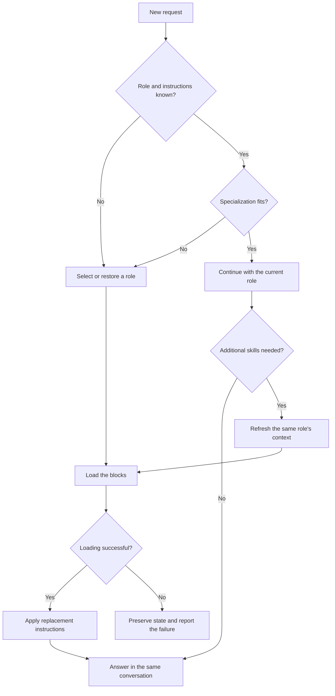

# Plan: switch personas while preserving context

Status: implementation complete; client validation results and limitations are
[in the report](persona-switch-eval-results.md). Version 2 requires explicit opt-in.
Branch: `codex/persona-switch-gate`.

## 1. Goal and behavior

Before answering each user request, the model checks whether its current persona
fits the task in the context of the conversation. The model performs this check
itself, without calling MCP, consulting the agent catalog, or invoking a separate
classifier model.

If the persona fits, the model continues with its answer immediately. If another
specialization is needed, it routes the request and replaces the role instructions.
History, facts, goals, constraints, user permissions, and tool results remain in
the current conversation.

| Situation | Action |
|---|---|
| Clarification, confirmation, request to continue, or format change | `keep`: continue without routing/enrichment calls |
| New task within the current persona's competence | `keep`; do not compare it with other agents |
| Explicit request to use another role | `switch`; load a known role directly |
| Task requires another specialization | `switch`; call routing |
| No persona has been set and its name is unknown | Initial routing |
| The persona's name is known, but its instructions were lost during compaction | Reload that role without selecting another agent |
| The role fits, but the task needs additional skills/implants | Explicitly `refresh` that role's context without routing |

Keep `universal_agent` for general coordination, conversation, and tasks without
a suitable specialist. Its broad description is not a reason to retain it for
legal, medical, engineering, or other clearly specialized tasks.

When uncertain, the model compares the request with the active role's stated
competence. If the task falls outside that scope, route it. If the user's task
itself is unclear, ask a meaningful clarifying question. There is no separate
server-side `check` on every turn.

## 2. MCP contract

Introduce protocol version 2. Keep existing tool names and place the new version's
logic in separate handlers so it is not mixed with sticky routing and sampling.
Define shared descriptor and response types in `src/schemas/protocol.py`; separate
block assembly in the enrichment pipeline.

### Tools

| Interface | Purpose |
|---|---|
| `route_and_load(query, ..., protocol_version=1, current_persona=None)` | In version 2, selects a role only for initial loading or a necessary switch; does not use the previous sticky binding to prevent a switch |
| `get_agent_context(agent_name, query, ..., protocol_version=1, current_persona=None, force_reload=False)` | In version 2, loads an explicitly selected role; `force_reload=True` restores lost instructions |
| `refresh_persona_context(query, current_persona)` | New version 2 tool: refreshes skills/implants for the same agent and returns a consistent bundle of blocks |
| `log_interaction(..., persona=None, persona_action=None)` | Accepts a descriptor and a `keep`, `switch`, `refresh`, or `restore` action for attribution |

New parameters on existing tools are optional. Without `protocol_version=2`,
retain compatible signatures, statuses, and response formats. The new mode
returns context to the current model and does not invoke sampling.

For implicit switches, use the existing semantic cache with keyword validation.
If there is no confident result, return `ROUTE_REQUIRED` with candidates; the
model selects an agent and calls `get_agent_context` with version 2. For a short
request referring to an earlier task, pass a relevant excerpt through the
existing `chat_history` parameter. Sending the entire history to the server is
not required.

### Descriptor and response

The active persona descriptor contains:

- `agent`: the canonical agent name;
- `activation_id`: the identifier of a specific activation;
- `bundle_revision`: SHA-256 of the blocks actually assembled, loaded component lists, agent name, and its scope;
- `scope`: a concise description of competence from the agent's metadata;
- `skills_loaded`, `implants_loaded`, `rules_loaded`: the canonical IDs delivered.

A successful version 2 response contains `protocol_version`, `request_id`,
`persona`, `replaces_activation_id`, a ready-to-use `footer` string, a short
application instruction, and separate `persona_block`, `rules_block`,
`skills_block`, and `implants_block` fields.

Use the statuses `SUCCESS`, `NO_CHANGE`, `ROUTE_REQUIRED`, and `ERROR`.
`SUCCESS_SAMPLED` belongs only to the compatible version 1 mode.

If the selected agent is already active and neither restore nor refresh was
requested, return `NO_CHANGE` with the same descriptor, without repeating
enrichment or returning a prompt. This means retaining the role already loaded,
not checking whether its source files are current. On refresh, rebuild the
bundle: an identical `bundle_revision` yields `NO_CHANGE`; a changed revision
yields `SUCCESS` with the complete bundle and a new activation.

The revision describes the delivered content, including resolved imports and
the actual text of skills/implants/rules. It does not replace the agent's identity
or serve as a conversation identifier. Component order is part of the delivered
text; a revision change alone does not imply a change of specialization.

## 3. Applying a persona and preserving context

The client protocol permits persona blocks to be applied as scoped role
instructions within the existing system and user instructions. Use this wording:

> On each successful activation, replace all four persona, rules, skills, and
> implants blocks with the returned blocks, including empty blocks. Preserve
> higher-priority instructions, conversation history, facts, goals, constraints,
> and user permissions.

General rules are in a separate versioned block. Switch, restore, and refresh
replace changed or removed rules; old rules do not remain active alongside the
new block. Delivering rules again does not revoke user requirements. Text order
is not presented as a way to elevate instruction priority. Do not instruct the
model to forget the conversation, ignore everything before it, or treat a tool
result as a system message.

Assemble and validate the entire bundle before activating it. An unavailable
agent, a mandatory component failure, or an invalid result yields `ERROR`;
partial activation is not allowed. The previous state remains available, but
the model must not claim that the new role loaded successfully.

`replaces_activation_id` must match the current activation. A repeated successful
result is not applied twice; a late result for another activation is ignored.
This is a client protocol rule, not a promise that the MCP server controls a
third-party application's history.

Active state belongs to a specific conversation. Do not introduce a shared
"current agent" variable on the server. Switching roles does not clear
`SESSION_CACHE`, `CONTEXT_HASH_CACHE`, the router cache, history, or long-term
memory. Server cache expiry does not revoke the active persona known to the
client.

If the role name survives compaction but its instructions do not, call
`get_agent_context(..., force_reload=True)`. If the name is lost, make an initial
selection based on the current task and retained context. Do not guess lost
facts. Preserve the role name and descriptor in summaries available to the
client; this does not replace reloading a missing instruction block.

In version 2, load additional skills through `refresh_persona_context`: retain
the agent and apply its core/preferred/capable restrictions and implant policy.
Ordinary confirmations and continuations do not trigger refresh. Update component
lists and the footer only after a successful tool response.

`log_interaction` checks that `agent_name` agrees with the supplied descriptor.
The log records the reported active role and its revision; it is not proof that
the model actually followed the instructions. On `keep`, reuse the last returned
footer rather than guessing skill lists.

Physically removing old prompts from the context window is beyond this MCP
server's capabilities. The function provides a logical replacement of active
instructions while preserving the conversation. The absence of influence from
a revoked role must be checked through the target models' behavior, not just
JSON validity.

## 4. Client instructions and compatibility

Update MCP instructions and tool descriptions, the repository's CLAUDE.md,
`scripts/templates/routing-protocol-core.md`, README, and routing and architecture
documentation consistently. Specify `protocol_version=2`, block application
rules, and the action rubric in the managed instruction section.

Explicit slash commands load the named agent without routing. `/ask` remains
an explicit request to select an agent. Add an optional `current_persona`
argument to both paths and use it to construct the same version 2 bundle.
If it is absent, the issued command sets the role for the current conversation;
commands are applied sequentially, without background switching. Restore and
refresh do not require selecting an agent again.

Update the sh/bat installers. Replace managed sections by their markers and
preserve all other text. Replace installer-generated memory reminders only when
their content matches a known version, and create a backup before replacement.
If a file contains user edits, preserve it and show its exact path and the manual
change required. On Windows, do not create a memory file for migration if the
installer did not previously create it.

Do not automatically rewrite arbitrary client project memory. The installer and
release note must explain how to find conflicting mandatory-routing requirements
in instructions available to the user. The server does not scan remote clients'
home directories or attempt to revoke their rules through tool-result text.

| Combination | Behavior |
|---|---|
| Client protocol 1 + server supporting 2 | The compatible version 1 path works |
| Client protocol 2 + server supporting 2 | Conditional routing and version 2 context responses |
| Client protocol 2 + server without support for 2 | Report the incompatibility once and use protocol 1 until the server is updated; do not repeat unsupported calls |

Sampling remains in version 1 and is invoked only when the client advertises
support for it. Version 2 does not depend on sampling.

Also fix meta-query handling in the compatible path: do not classify a message
solely by its length or a greeting prefix. A standalone confirmation preserves
a known role; substantive text after a greeting is treated as a task. "Taxes?"
and "SQL?" are not confirmations. Do not return `NO_CHANGE` without a known role.

## 5. Validation and acceptance criteria

Create a dedicated multi-turn runner that manages a real model conversation and
MCP tool loop. Do not substitute a precomputed `keep/switch` decision for the
model's own decision. Save messages, tool results, the selected role, and call
counts for every turn. Do not remove routing instructions from these runs.

Validate client behavior first in Codex and Claude Code. Record results for a
specific model and client version; do not automatically generalize them to other
applications. Server contract tests remain independent of the client. Preserve
the separate purpose of the single-turn benchmark; change instruction stripping
only when its actual input prompt changes.

Required scenarios in Russian and English:

- Confirmation, continuation, clarification, and format changes: zero routing,
  agent selection, and refresh calls; the role is retained.
- A new task within the role's competence: the role is retained. A missing
  specific skill triggers only a justified refresh of the same agent.
- Initial request, explicit role change, and new specialization: the required
  role is loaded; universal_agent does not retain a clearly specialized task.
- Engineer → lawyer → engineer: the supplied facts and user constraints are
  preserved; revoked role formats and methods are not imposed on the next answer.
- Short substantive requests, greetings followed by tasks, and ambiguous
  continuations are interpreted by meaning, not length.
- Compaction with a known role name triggers restore; without a name, it triggers
  selection. Cache expiry alone does not require an MCP call on `keep`.
- Loading failures, missing or deleted agents, repeated responses, and late
  responses do not cause partial activation or a return to a revoked persona.
- Two descriptors in the same server process do not switch each other's roles;
  cache clearing/eviction and the shared router cache are checked separately.
- Changes to imports, skills/implants, and rules appear in the revision on the
  next load or refresh. Reordering skills is not considered an agent switch.
- The footer and log match the delivered bundle; explicit commands and every
  combination of protocol versions pass compatibility checks.
- Migration replaces known managed text, preserves user edits, and works correctly
  with absent memory files and repeated installer runs.

First capture a baseline on the same scenarios. Run three independent repetitions
of the fixed suite for each model. Required scenarios must have zero unnecessary
calls on continuations, every explicitly requested switch, and no loss of supplied
facts. Do not average failures into an overall passing result: fix the
scenario/protocol or do not declare that client/model combination supported.

Also publish switch precision/recall, unjustified refreshes, actual tool-result
sizes, token counts where tokenization is available, and latency. Assess role
behavior against a predefined rubric, with manual review of ambiguous cases.
Do not cap the number of switches per session: tasks determine that number.
Estimate savings from measurements, separately from quality and context retention.

Deterministic contract tests, meta-query regressions, migration tests, and the
full existing suite must pass. Model behavior checks supplement these tests.

## 6. Implementation sequence

1. Prepare multi-turn scenarios and the runner; capture the baseline.
2. Implement the descriptor, separate blocks, version 2 handlers, refresh, and
   attribution; cover the contract and isolation with tests. Version 1 clients
   continue to work.
3. Fix meta-query handling and the sampling capability check; add regressions.
4. Connect protocol version 2 to instructions and explicit commands, implement
   installer migration, and update documentation.
5. Run compatibility suites and client scenarios, then publish the results.
   Enable version 2 through installed client instructions only for validated
   combinations. To roll back, restore the managed version 1 instruction from
   its backup; do not clear conversation history or memory.

Result: the model retains a suitable persona without selecting it again, switches
roles only when needed, and continues working with the accumulated conversation
context.
