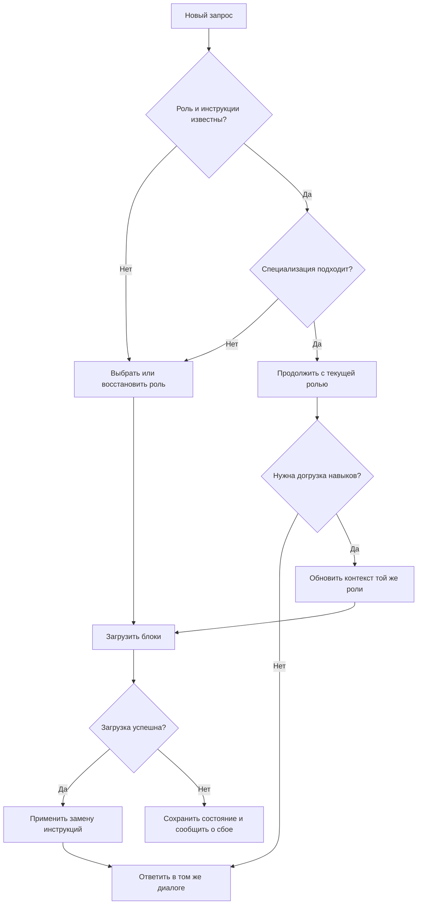

# План: смена персоны с сохранением контекста

Статус: реализация и проверка клиентского поведения.
Ветка: `codex/persona-switch-gate`.

## 1. Цель и поведение

Перед ответом на каждый пользовательский запрос модель проверяет, подходит ли
текущая персона для задачи с учётом беседы. Проверка выполняется самой моделью,
без обращения к MCP, каталогу агентов или отдельной модели-классификатору.

Если персона подходит, ответ продолжается сразу. Если требуется другая
специализация, выполняются маршрутизация и замена инструкций роли. История,
факты, цели, ограничения, разрешения пользователя и результаты инструментов
сохраняются в текущем диалоге.

| Ситуация | Действие |
|---|---|
| Уточнение, подтверждение, просьба продолжить или изменить формат | `keep`: продолжить без routing/enrichment-вызовов |
| Новая задача в компетенции текущей персоны | `keep`; не сравнивать её с другими агентами |
| Явная просьба использовать другую роль | `switch`; известную роль загрузить напрямую |
| Задача требует другой специализации | `switch`; вызвать маршрутизацию |
| Персона ещё не задана и её имя неизвестно | Первичная маршрутизация |
| Имя персоны известно, но её инструкции потеряны при компакции | Повторно загрузить эту роль без выбора нового агента |
| Роль подходит, но для задачи нужны дополнительные skills/implants | Явный `refresh` контекста этой роли без маршрутизации |

`universal_agent` удерживается для общей координации, общения и задач без
подходящего специалиста. Его широкое описание не является основанием удерживать
юридическую, медицинскую, инженерную или другую явно специализированную задачу.

При сомнении модель сопоставляет запрос с заявленной компетенцией активной роли.
Если задача выходит за её пределы, выполняется маршрутизация. Если неясна сама
задача пользователя, задаётся содержательный уточняющий вопрос. Отдельного
серверного `check` на каждом ходе нет.

## 2. Контракт MCP

Ввести протокол версии 2. Сохранить имена существующих инструментов и вынести
логику новой версии в отдельные обработчики, чтобы не смешивать её со sticky
routing и sampling. В `src/schemas/protocol.py` определить общие типы дескриптора
и ответа; сборку блоков разделить в enrichment-пайплайне.

### Инструменты

| Интерфейс | Назначение |
|---|---|
| `route_and_load(query, ..., protocol_version=1, current_persona=None)` | При версии 2 выбирает роль только для первичной загрузки или необходимой смены; не использует прежнюю sticky-привязку как запрет на смену |
| `get_agent_context(agent_name, query, ..., protocol_version=1, current_persona=None, force_reload=False)` | При версии 2 загружает явно выбранную роль; `force_reload=True` восстанавливает потерянные инструкции |
| `refresh_persona_context(query, current_persona)` | Новый инструмент версии 2: обновляет skills/implants для того же агента и возвращает согласованный комплект блоков |
| `log_interaction(..., persona=None, persona_action=None)` | Принимает дескриптор и действие `keep`, `switch`, `refresh` или `restore` для атрибуции |

Добавляемые параметры существующих инструментов — необязательные. При отсутствии
`protocol_version=2` сохраняются совместимые сигнатуры, статусы и формат ответа.
Новый режим возвращает контекст текущей модели и не запускает sampling.

Для неявной смены использовать имеющийся semantic cache с keyword-проверкой.
Если уверенного результата нет, вернуть `ROUTE_REQUIRED` с кандидатами; модель
выбирает агента и вызывает `get_agent_context` с версией 2. Для короткого запроса,
ссылающегося на предыдущую задачу, передавать релевантный фрагмент через существующий
`chat_history`. Отправка всей истории на сервер не требуется.

### Дескриптор и ответ

Дескриптор активной персоны содержит:

- `agent`: каноническое имя агента;
- `activation_id`: идентификатор конкретной активации;
- `bundle_revision`: SHA-256 фактически собранных блоков, списков загруженных компонентов, имени агента и его компетенции;
- `scope`: краткое описание компетенции из метаданных агента;
- `skills_loaded`, `implants_loaded`, `rules_loaded`: выданные канонические ID.

Успешный ответ версии 2 содержит `protocol_version`, `request_id`, `persona`,
`replaces_activation_id`, готовую строку `footer`, короткую инструкцию применения
и отдельные поля `persona_block`, `rules_block`, `skills_block`, `implants_block`.

Использовать статусы `SUCCESS`, `NO_CHANGE`, `ROUTE_REQUIRED`, `ERROR`.
`SUCCESS_SAMPLED` относится только к совместимому режиму версии 1.

Если выбран уже активный агент и не запрошены восстановление или refresh,
вернуть `NO_CHANGE` с тем же дескриптором без повторного enrichment и промпта.
Это означает сохранение уже загруженной роли, а не проверку актуальности файлов.
При refresh собрать комплект заново: одинаковая `bundle_revision` даёт
`NO_CHANGE`, изменившаяся — `SUCCESS` с полным комплектом и новой активацией.

Ревизия описывает выданное содержимое, включая разрешённые импорты и фактические
тексты skills/implants/rules. Она не подменяет идентичность агента и не служит
идентификатором беседы. Порядок компонентов учитывается как часть выданного текста;
изменение ревизии само по себе не означает смену специализации.

## 3. Применение персоны и сохранение контекста

Клиентский протокол разрешает применять блоки персоны как ограниченные инструкции
роли в рамках действующих системных и пользовательских указаний. Формулировка:

> Применяй новую персону вместо инструкций предыдущей роли и связанных с ней
> skills/implants. Сохрани историю разговора, факты, цели, ограничения и разрешения
> пользователя. Общие правила продолжают действовать.

Общие правила находятся в отдельном блоке. Их повторная выдача не отменяет
пользовательские требования. Порядок текста не объявляется механизмом повышения
приоритета инструкций. Не использовать требования забыть диалог, игнорировать
всё предыдущее или считать результат инструмента системным сообщением.

Сначала полностью собрать и проверить комплект, затем активировать его.
Недоступный агент, ошибка обязательного компонента или некорректный результат
дают `ERROR`; частичная активация не допускается. Старое состояние остаётся
доступным, но модель не сообщает, что новая роль успешно загружена.

`replaces_activation_id` должен совпадать с текущей активацией. Повтор того же
успешного результата не применяется второй раз; запоздалый результат для другой
активации игнорируется. Это правило клиентского протокола, а не обещание, что
MCP-сервер контролирует историю стороннего приложения.

Активное состояние принадлежит конкретному диалогу. На сервере не вводится
общая переменная «текущий агент». Смена роли не очищает `SESSION_CACHE`,
`CONTEXT_HASH_CACHE`, router cache, историю или долговременную память.
Истечение серверного кеша не отменяет известную клиенту активную персону.

Если после компакции сохранилось имя роли, но нет её инструкций, выполнить
`get_agent_context(..., force_reload=True)`. Если имя потеряно, сделать первичный
выбор по текущей задаче и сохранившемуся контексту. Не угадывать утраченные факты.
В доступных клиенту сводках сохранять имя и дескриптор роли; это не заменяет
повторную загрузку отсутствующего блока инструкций.

Для версии 2 догрузка навыков выполняется через `refresh_persona_context`:
сохраняется агент, применяются его core/preferred/capable-ограничения и политика
implants. Обычные подтверждения и продолжения не запускают refresh.
Списки компонентов и footer обновляются только по успешному ответу инструмента.

`log_interaction` проверяет согласованность `agent_name` и переданного дескриптора.
Журнал фиксирует заявленную активную роль и её ревизию; это не доказательство
фактического следования модели инструкциям. На `keep` использовать последний
полученный footer, не восстанавливать списки skills по догадке.

Физическое удаление старых промптов из контекстного окна не входит в возможности
этого MCP-сервера. Результат функции — логическая замена действующих инструкций
с сохранением диалога. Отсутствие влияния отменённой роли проверяется поведением
целевых моделей, а не только корректностью JSON.

## 4. Клиентские инструкции и совместимость

Согласованно обновить MCP instructions и описания инструментов, репозиторный
CLAUDE.md, шаблон `scripts/templates/routing-protocol-core.md`, README,
документацию маршрутизации и архитектуры. В управляемой секции инструкции указать
`protocol_version=2`, правила применения блоков и рубрику действий.

Явные slash-команды загружают указанного агента без маршрутизации. `/ask` остаётся
явной просьбой выполнить выбор. Для обоих путей добавить необязательный аргумент
`current_persona`, используемый при формировании того же комплекта версии 2.
Если он не передан, выданная команда задаёт роль для текущего диалога; применение
команды последовательно, без фонового переключения. Восстановление и refresh
не требуют повторного выбора агента.

Обновить установщики sh/bat. Управляемые секции менять по маркерам, остальной
текст сохранять. Сгенерированное установщиком memory-напоминание заменять только
при совпадении с известной версией содержимого; перед заменой создавать резервную
копию. При пользовательских правках сохранять файл и показывать конкретный путь
с требуемым ручным изменением. На Windows не создавать мигрируемый memory-файл,
если установка ранее его не создавала.

Произвольную project memory клиента автоматически не переписывать. Установщик
и релиз-заметка должны сообщать, как найти конфликтующее требование обязательного
роутинга в доступных пользователю инструкциях. Сервер не сканирует домашние
каталоги удалённого клиента и не пытается отменять его правила текстом tool-result.

| Сочетание | Поведение |
|---|---|
| Клиентский протокол 1 + сервер с поддержкой 2 | Работает совместимый путь версии 1 |
| Клиентский протокол 2 + сервер с поддержкой 2 | Условная маршрутизация и контекстные ответы версии 2 |
| Клиентский протокол 2 + сервер без поддержки 2 | Один раз сообщить о несовместимости и использовать протокол 1 до обновления сервера; не повторять неподдерживаемые вызовы |

Sampling сохраняется в версии 1 и вызывается только при объявленной клиентом
поддержке этой возможности. Версия 2 не зависит от sampling.

Исправить обработку meta-query также для совместимого пути: отказаться от
классификации по одной длине сообщения и приветственному префиксу. Самостоятельное
подтверждение при известной роли сохраняет её; содержательный текст после
приветствия обрабатывается как запрос. «Налоги?» и «SQL?» не считаются
подтверждениями. Без известной роли нельзя возвращать `NO_CHANGE`.

## 5. Проверки и критерии приёмки

Создать отдельный многоходовой runner, управляющий реальным диалогом модели и
MCP tool loop. Не подменять решение модели заранее вычисленным `keep/switch`.
Сохранять сообщения, результаты инструментов, выбранную роль и счётчики вызовов
на каждом ходе. Routing-инструкции в этих прогонах не удалять.

Первичная проверка клиентского поведения — Codex и Claude Code. Результаты
фиксировать для конкретной модели и версии клиента, не переносить автоматически
на остальные приложения. Тесты серверного контракта остаются независимыми от
клиента. Для однотурового бенча сохранить отдельное назначение; менять очистку
инструкций только при реальном изменении его входного промпта.

Обязательные сценарии на русском и английском:

- Подтверждение, продолжение, уточнение и смена формата: ноль вызовов маршрутизации,
  выбора агента и refresh; роль сохраняется.
- Новая задача внутри компетенции: роль сохраняется. Нехватка конкретного навыка
  вызывает только обоснованный refresh того же агента.
- Первый запрос, явная смена роли и новая специализация: нужная роль загружается;
  universal_agent не удерживает явно специализированную задачу.
- Инженер → юрист → инженер: сохраняются заданные факты и пользовательские
  ограничения; отменённые форматы и методы роли не навязываются следующему ответу.
- Короткие содержательные запросы, приветствие с задачей и неоднозначное продолжение
  обрабатываются по смыслу, а не по длине.
- Компакция с известным именем роли вызывает восстановление, без имени — выбор;
  истечение кеша само по себе не требует MCP-вызова на `keep`.
- Ошибка загрузки, отсутствующий или удалённый агент, повторный и запоздалый ответ
  не приводят к частичной активации или возврату к отменённой персоне.
- Два дескриптора в одном серверном процессе не переключают друг друга;
  очистка/вытеснение кеша и общий router cache проверяются отдельно.
- Изменения импортов, skills/implants и rules отражаются в ревизии при следующей
  загрузке или refresh. Изменение порядка skills не считается сменой агента.
- Footer и журнал соответствуют выданному комплекту, а явные команды и все
  сочетания версий протокола проходят проверки совместимости.
- Миграция заменяет известный управляемый текст, сохраняет пользовательские правки,
  корректно работает при отсутствии memory-файлов и при повторном запуске.

Сначала снять baseline на тех же сценариях. Для каждой модели выполнить три
независимых повтора фиксированного набора. В обязательных сценариях требуются
нулевые лишние вызовы на продолжениях, все явно запрошенные смены и отсутствие
потери заданных фактов. Сбои не усреднять в общий успешный результат: исправить
сценарий/протокол либо не объявлять эту комбинацию клиента и модели поддержанной.

Дополнительно публиковать precision/recall смен, необоснованные refresh, размеры
фактических tool-result, токены при доступной токенизации и задержки. Поведенческие
оценки роли проверять по заранее заданной рубрике с ручной проверкой спорных случаев.
Число допустимых смен на сессию не ограничивать: оно определяется задачами.
Экономию оценивать по измерениям, отдельно от качества и сохранения контекста.

Детерминированные тесты контрактов, регрессии meta-query, тесты миграции и полный
существующий набор должны проходить. Проверки поведения модели дополняют их.

## 6. Порядок выполнения

1. Подготовить многоходовые сценарии и runner, зафиксировать baseline.
2. Реализовать дескриптор, раздельные блоки, обработчики версии 2, refresh и атрибуцию;
   покрыть контракт и изоляцию тестами. Клиенты версии 1 продолжают работать.
3. Исправить meta-query и проверку sampling capability; добавить регрессии.
4. Подключить протокол версии 2 в инструкциях и явных командах, реализовать миграцию
   установщиков и обновить документацию.
5. Прогнать наборы совместимости и клиентские сценарии, опубликовать результаты.
   Включать версию 2 через установленные клиентские инструкции только для проверенных
   комбинаций. Для отката восстановить управляемую инструкцию версии 1 из резервной
   копии; историю и память диалога не очищать.

Результат: модель сохраняет подходящую персону без повторного выбора, меняет роль
только при необходимости и продолжает работу с накопленным контекстом диалога.
