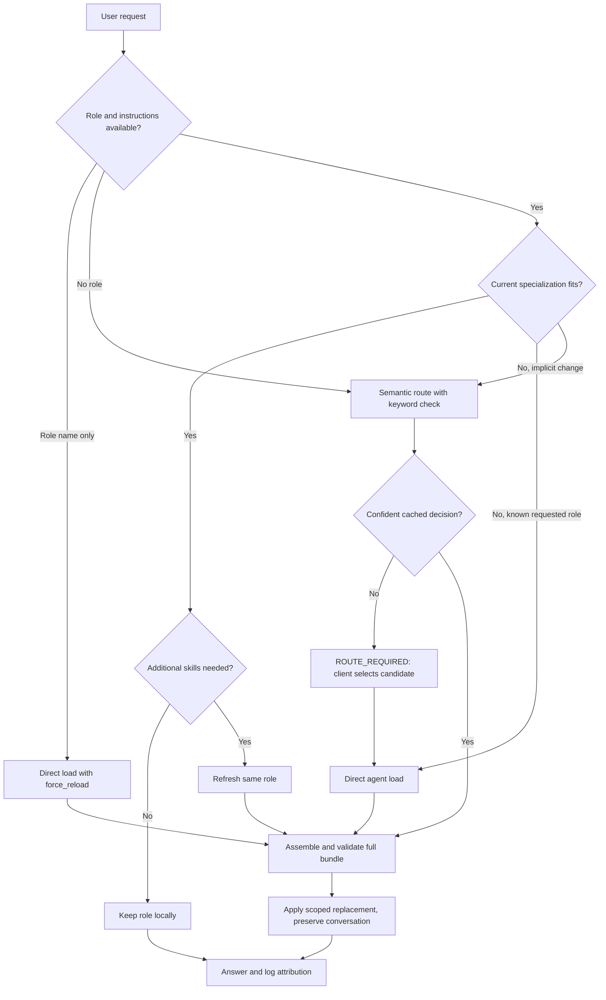

# Persona and request routing

Protocol 2 keeps the active persona in the client conversation. The model assesses
whether its current scope fits each new request. A fitting role continues without
routing, catalog lookup, enrichment, or a server-side suitability check.

## Client decisions

`keep` includes confirmations, continuations, formatting requests, and new tasks
within the current persona's scope. It does not compare candidates. A specialist
change triggers routing; an explicit known role loads directly. `universal_agent`
does not retain clearly specialized work merely because its description is broad.
A justified refresh acquires skills for the same role. Restore reloads lost
instructions for a known role without selecting another one. Cache expiry has no
bearing on the client's retained instructions.

See the complete [client protocol](../scripts/templates/routing-protocol-core.md).
The default installer still uses the [v1 compatibility template](../scripts/templates/routing-protocol-v1.md).
Version 2 is an explicit opt-in until the required dialogue evaluations pass for a
specific client and model; server contract tests alone do not establish support.
See the [measured results and remaining validation gaps](persona-switch-eval-results.md).

## Version 2 API

| Call | Behavior |
|---|---|
| `route_and_load(query, protocol_version=2, current_persona=...)` | Uses semantic cache and keyword validation; no v1 sticky binding or sampling |
| `get_agent_context(agent_name, query, protocol_version=2, current_persona=..., force_reload=False)` | Loads an explicit role; same-agent calls return `NO_CHANGE` before enrichment unless restoring |
| `refresh_persona_context(query, current_persona=...)` | Rebuilds the same role's bundle; identical revision returns `NO_CHANGE` |
| `log_interaction(..., persona=..., persona_action=...)` | Checks agent/descriptor consistency and records declared attribution |

Pass a relevant `chat_history` excerpt when a routed request depends on earlier
facts. The server does not need the whole conversation. Agent slash prompts load
explicit roles; `/ask` requests routing. Both accept an optional `current_persona`.

`SUCCESS` contains `protocol_version`, `request_id`, `persona`,
`replaces_activation_id`, `footer`, an application instruction, and separate
`persona_block`, `rules_block`, `skills_block`, `implants_block`. The descriptor
contains canonical `agent`, unique `activation_id`, full SHA-256 `bundle_revision`,
metadata `scope`, and canonical `skills_loaded`, `implants_loaded`, `rules_loaded`.
The revision reflects the issued texts, resolved imports, component IDs and order,
plus the agent identity and scope used by the local suitability assessment.
It is neither a conversation identifier nor an authentication token.

The client applies a response only if `replaces_activation_id` matches its active
activation (null for first load). Replayed activations are no-ops; stale responses
are ignored. Missing mandatory components produce `ERROR` with no partial
activation. A failed request leaves the previous state available. These application
rules belong to the client: the server cannot enforce the state of another app.

On every `SUCCESS`, replace `persona_block`, `rules_block`, `skills_block`, and
`implants_block`, including empty blocks. This replaces changed or removed rules
on switches, restores and refreshes instead of retaining stale instructions.
Preserve higher-priority instructions, facts, goals, constraints, permissions,
conversation history and tool results. This is logical revocation; MCP cannot erase earlier client
messages. No cache clearing, shared active-agent variable or conversation reset is
involved. Use the last successful footer on `keep`; logs record self-reported
activation and revision rather than proving behavioral compliance.

## Enrichment and storage

Agent metadata declares core, preferred and capable skills, plus preferred
implants. Tier inference selects lite, standard or deep depth; an inferred lite
request can be promoted for declared enrichment. Explicit lite remains lite.
Mandatory rules and core skills are distinct from extra retrieved components.
Standard and deep tiers select relevant extras under the agent's declared skill
constraints. Refresh reads current source content before calculating its revision.

The semantic router uses `NumpyVectorStore`, local FastEmbed embeddings and a
bounded persistent routing cache. The embedding model and thresholds come from
`src/engine/config.py`; no external model is called to decide `keep`. The existing
v1 enriched-prompt TTL cache remains separate from v2 client persona state.

## Compatibility

| Client | Server | Result |
|---|---|---|
| v1 | Supports v2 | Existing v1 signatures, prompt/hash results and sticky routing |
| v2 | Supports v2 | Conditional routing, structured bundles, no sampling |
| v2 | v1 only | One incompatibility notice, then v1 for that conversation until upgrade |

The API defaults to `protocol_version=1`. V1 sampling is attempted only when the
client advertises sampling capability; otherwise the server returns the prompt.
V1 meta detection recognizes standalone greetings/acknowledgements, not arbitrary
short strings or greeting prefixes. `SQL?`, `Taxes?`, and greetings followed by a
task remain substantive. A known role survives standalone acknowledgements;
without one, the server cannot return `NO_CHANGE`.

When MCP is unavailable, its footer and logging requirements have an explicit
fallback. A retained valid bundle keeps its descriptor and exact footer when
available; unavailable logging is skipped. A manually loaded prompt is attributed
as a manual role, without a fabricated v2 descriptor, footer or component list.
Once MCP returns, reload a manually loaded role or a retained role missing its
descriptor or exact footer through `get_agent_context` with version 2 and
`force_reload=True`, using the last real descriptor if retained or null if none
exists. Resume normal attribution after that successful activation. A retained
MCP bundle with its descriptor and exact footer needs no reactivation solely
because connectivity returns.

## Installation, migration and rollback

Use `AGENTS_PERSONA_PROTOCOL=2 ./scripts/init_repo.sh` to opt in. On Windows set
`AGENTS_PERSONA_PROTOCOL=2` before `scripts\init_repo.bat`. Omit the variable (or set
it to 1) to install v1. Use the same setting on subsequent installer runs.

The checked-in `CLAUDE.md` uses a managed v1 section. Global installation does not
modify this tracked file. To opt the checkout itself into v2, run
`.venv/bin/python scripts/_helpers/inject_claude_md.py CLAUDE.md scripts/templates/routing-protocol-core.md`
(or use `.venv\Scripts\python.exe` on Windows). Use
`scripts/templates/routing-protocol-v1.md` as the source to switch it back to v1.
Only the managed section is replaced; repository notes outside it remain intact.

Both installers replace only the marked routing section and back up changed
files. They migrate `~/.claude/memory/feedback_agents_core_routing.md` only when its
bytes exactly match a known generated v1/v2 template. A changed reminder or index
entry is preserved with a warning naming the file and manual correction. Windows
migrates an existing reminder but never creates one when absent. Other project
memory is untouched.

Before enabling v2, search the instructions and memory you maintain for
`always route_and_load`, `Before answering ANY user query`, and equivalent
unconditional routing rules. Replace those conflicts with local suitability
assessment. The server cannot scan a remote client's home directory or override
user instructions through tool output.

For rollback, restore the routing managed section and generated reminder from
installer backups (or reinstall with `AGENTS_PERSONA_PROTOCOL=1`). Preserve all
unrelated user content and conversation history. Restoring a whole backup over
subsequent user edits requires merging those edits first.

## Validation

Run deterministic contract and migration tests with `pytest tests/`. The dialogue
runner in `evals/runners/run_persona_dialogues.py` drives real Codex/Claude sessions,
retains protocol instructions and records actual MCP traces. Evaluate Russian and
English continuations, role switches, retained facts, recovery and failures with
three independent repeats for each claimed client/model combination. Report
unnecessary routing/refresh calls, missed switches, tool-result sizes and latency;
never infer successful behavior solely from the server returning valid JSON.
