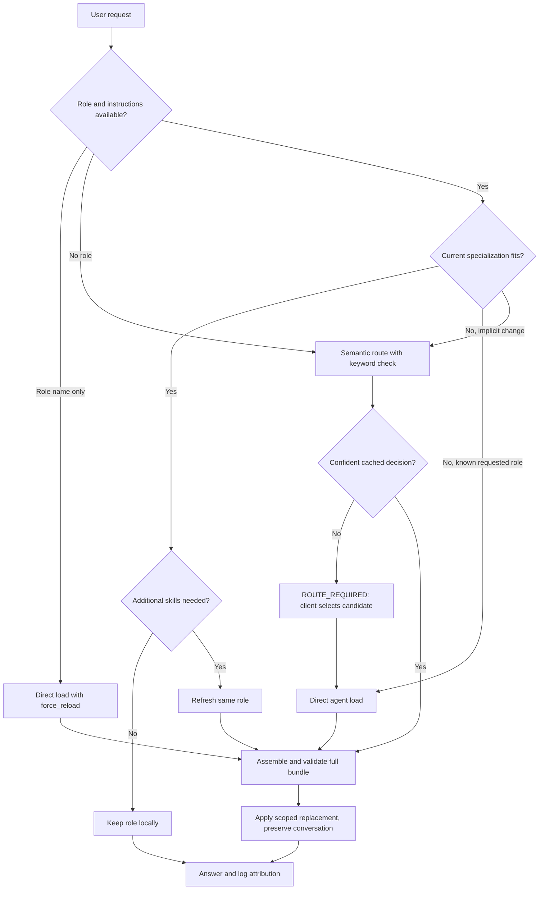

# Persona and request routing

This is the current routing contract. For setup and operations, start with the
[documentation map](README.md); for a repeatable update, use the
[documentation refresh process](../flows/documentation-refresh.md).

Protocol 2 keeps the active persona in the client conversation. The model assesses
whether its current scope fits each new request. A fitting role continues without
routing, catalog lookup, enrichment, or a server-side suitability check.


```mermaid
flowchart TD
    Q[User request] --> Known{Role and instructions available?}
    Known -->|Role name only| Restore[Direct load with force_reload]
    Known -->|No role| Route[Semantic route with keyword check]
    Known -->|Yes| Fit{Current specialization fits?}
    Fit -->|Yes| Skills{Additional skills needed?}
    Skills -->|No| Keep[Keep role locally]
    Skills -->|Yes| Refresh[Refresh same role]
    Fit -->|No, known requested role| Direct[Direct agent load]
    Fit -->|No, implicit change| Route
    Route --> Choice{Confident cached decision?}
    Choice -->|No| Pick[ROUTE_REQUIRED: client selects candidate]
    Choice -->|Yes| Bundle[Assemble and validate full bundle]
    Pick --> Direct
    Direct --> Bundle
    Restore --> Bundle
    Refresh --> Bundle
    Bundle --> Apply[Apply scoped replacement, preserve conversation]
    Keep --> Answer[Answer and log attribution]
    Apply --> Answer
```

The installer and committed client instructions use version 2. MCP tools and
slash prompts retain version 1 as their API default, so callers must explicitly
pass `protocol_version=2` to request the contract below. Choosing HTTP or stdio
does not select a persona protocol.

## Client decisions

`keep` includes confirmations, continuations, formatting requests, and new tasks
within the current persona's scope. It does not compare candidates. A specialist
change triggers routing; an explicit known role loads directly. `universal_agent`
does not retain clearly specialized work merely because its description is broad.
A justified refresh acquires skills for the same role. Restore reloads lost
instructions for a known role without selecting another one. Cache expiry has no
bearing on the client's retained instructions.

See the complete [client protocol](../scripts/templates/routing-protocol-core.md).
The installer uses version 2 by default since 2026-09-26; the
[v1 compatibility template](../scripts/templates/routing-protocol-v1.md) remains
available with `AGENTS_PERSONA_PROTOCOL=1`. The switch rests on two measurements:
in 30 days of telemetry under v1, 96% of routed turns returned ROUTE_REQUIRED and
continuing turns re-picked the active agent 73% of the time, re-sending its prompt
([telemetry analysis](../evals/telemetry/README.md)); in the dialogue evaluation,
v2 made no selection calls on continuing turns and switched roles correctly in
every completed case. Server contract tests alone do not establish support for a
client and model; see the [measured results and remaining validation gaps](persona-switch-eval-results.md).

## Version 2 API

| Call | Behavior |
|---|---|
| `route_and_load(query, protocol_version=2, current_persona=...)` | Uses semantic cache and keyword validation; no v1 sticky binding or sampling |
| `get_agent_context(agent_name, query, protocol_version=2, current_persona=..., force_reload=False)` | Loads an explicit role; same-agent calls return `NO_CHANGE` before enrichment unless restoring |
| `refresh_persona_context(query, current_persona=...)` | Rebuilds the same role's bundle; identical revision returns `NO_CHANGE` |
| `log_interaction(..., persona=..., persona_action=...)` | Checks agent/descriptor consistency and records declared attribution |

Pass a relevant `chat_history` excerpt when a routed request depends on earlier
facts. The server does not need the whole conversation. Agent slash prompts load
explicit roles; `/ask` requests routing. Both default to `protocol_version=1`,
preserving their legacy prompt format and selection behavior. To request a v2
bundle, pass `protocol_version=2` explicitly and optionally `current_persona` as
descriptor JSON. MCP prompt arguments are transported as strings, for example
`{"query": "Explain a dictionary", "protocol_version": "2"}`. Supplying only
`current_persona` does not opt into v2.

`SUCCESS` contains `protocol_version`, `request_id`, `persona`,
`replaces_activation_id`, `footer`, an application instruction, and separate
`persona_block`, `rules_block`, `skills_block`, `implants_block`. The descriptor
contains canonical `agent`, unique `activation_id`, full SHA-256 `bundle_revision`,
metadata `scope`, and canonical `skills_loaded`, `implants_loaded`, `rules_loaded`.
The revision reflects the issued texts, resolved imports, component IDs and order,
plus the agent identity and scope used by the local suitability assessment.
It is neither a conversation identifier nor an authentication token.

The client applies a response only if `replaces_activation_id` matches its active
activation (null for first load). Replayed activations are no-ops; stale responses
are ignored. Missing mandatory components produce `ERROR` with no partial
activation. A failed request leaves the previous state available. These application
rules belong to the client: the server cannot enforce the state of another app.

On every `SUCCESS`, replace `persona_block`, `rules_block`, `skills_block`, and
`implants_block`, including empty blocks. This replaces changed or removed rules
on switches, restores and refreshes instead of retaining stale instructions.
Preserve higher-priority instructions, facts, goals, constraints, permissions,
conversation history and tool results. This is logical revocation; MCP cannot erase earlier client
messages. No cache clearing, shared active-agent variable or conversation reset is
involved. Use the last successful footer on `keep`; logs record self-reported
activation and revision rather than proving behavioral compliance.

Keep the complete descriptor and exact footer in retained conversation context,
including summaries used during compaction. Losing a temporary tool variable
does not remove an activation that remains in the conversation. Before sending
the final answer, compose it with the saved footer and call `log_interaction`
with that exact text, the current user request verbatim, the descriptor, and the
action (`keep`, `switch`, `refresh`, or `restore`). Then deliver the answer.

## Enrichment and storage

Agent metadata declares core, preferred and capable skills, plus preferred
implants. Tier inference selects lite, standard or deep depth; an inferred lite
request is promoted to standard when the agent declares preferred implants.
Explicit lite remains lite.
Mandatory rules and core skills are distinct from extra retrieved components.
Standard and deep tiers select relevant extras under the agent's declared skill
constraints. Refresh reads current source content before calculating its revision.

`RULES_ENABLED=0` disables the shared rules layer. The optional intent classifier
is off by default (`INTENT_CLASSIFIER_ENABLED=0`). When enabled, it can contribute
the initial v2 tier; per-query skill/implant budgets and persona-format suppression
remain in the v1 path. `IMPLANT_NEED_GATE` is also v1-only because a v2 bundle
persists across later requests until a switch, restore, or refresh.

The semantic router uses `NumpyVectorStore`, local FastEmbed embeddings and a
bounded persistent routing cache. The embedding model and thresholds come from
`src/engine/config.py`; no external model is called to decide `keep`. The existing
v1 enriched-prompt TTL cache remains separate from v2 client persona state.

## Runtime and project boundaries

Both transports use the tools defined in `src/server.py`; HTTP excludes
`clear_session_cache`. Version 2 handlers live in
`src/engine/persona.py`; `src/engine/persona_bundle.py` assembles fresh blocks and
their revision. `src/schemas/protocol.py` defines the descriptors and responses.
Each client conversation owns its activation; the shared HTTP daemon does not
hold one global active persona for all clients.

The daemon keeps derived router and history indexes in private service state.
Standalone startup leases separate `data/stdio/` slots for concurrent processes
when process locking is available; without it, startup uses temporary derived
storage. Skill and implant indexes are installation data. The bounded v1 prompt
and context-hash caches are process-local. Over stdio, `clear_session_cache()`
clears those shared caches; for HTTP, use `.venv/bin/python -m src.daemon clear-cache`.
Cache clearing is an administrative action and is not required for persona changes.

HTTP repository memory requires `X-Agents-Workspace` with a registered workspace
UUID. Global connections can route and load personas without that header, but
`describe_repo`, `write_repo_summary`, `read_history`, and `log_interaction` need
a valid workspace. On `workspace_required` or `workspace_invalid`, keep routing
and report unavailable memory without retrying logging in a loop. For
`needs_summary`, preserve `workspace_id`, `repo_path`, and `repo_hash` in the
follow-up write. See [memory and errors](shared-mcp-daemon.md#memory-and-errors).

## Compatibility

| Client | Server | Result |
|---|---|---|
| v1 | Supports v2 | Existing v1 signatures, prompt/hash results and sticky routing |
| v2 | Supports v2 | Conditional routing, structured bundles, no sampling |
| v2 | v1 only | One incompatibility notice, then v1 for that conversation until upgrade |

The API defaults to `protocol_version=1`. V1 sampling is attempted only when the
client advertises sampling capability; otherwise the server returns the prompt.
V1 meta detection recognizes standalone greetings/acknowledgements, not arbitrary
short strings or greeting prefixes. `SQL?`, `Taxes?`, and greetings followed by a
task remain substantive. A known role survives standalone acknowledgements;
without one, the server cannot return `NO_CHANGE`.

When MCP is unavailable, its footer and logging requirements have an explicit
fallback. A retained valid bundle keeps its descriptor and exact footer when
available; unavailable logging is skipped. A manually loaded prompt is attributed
as a manual role, without a fabricated v2 descriptor, footer or component list.
Once MCP returns, reload a manually loaded role or a retained role missing its
descriptor or exact footer through `get_agent_context` with version 2 and
`force_reload=True`, using the last real descriptor if retained or null if none
exists. Resume normal attribution after that successful activation. A retained
MCP bundle with its descriptor and exact footer needs no reactivation solely
because connectivity returns.

## Installation, migration and rollback

`./scripts/init_repo.sh` installs v2. Use `AGENTS_PERSONA_PROTOCOL=1 ./scripts/init_repo.sh`
to install v1; on Windows set `AGENTS_PERSONA_PROTOCOL=1` before `scripts\init_repo.bat`.
Use the same setting on subsequent installer runs.

To update instructions without rerunning installation, use
`python3 scripts/install_instructions.py` (Windows:
`py -3 scripts\install_instructions.py`). This standalone command requires Python
3.11 or newer, uses only the standard library, and updates detected Codex and
Claude clients by default. Use `--clients codex` to restrict the update or
`--protocol 1` / `--protocol 2` to override `AGENTS_PERSONA_PROTOCOL` (default 2).
It updates global managed instructions and an existing exact generated Claude
routing reminder. It does not create an absent reminder or change dependencies,
`.env`, indexes, MCP registrations or the shared service.

Both installers automatically install the selected protocol in Codex's global
instructions during client setup, unless `--skip-mcp` is used. Detection accepts
`CODEX_HOME`, an existing default `~/.codex` directory, or an available `codex`
command. A non-empty `CODEX_HOME` selects the profile directory; otherwise
`~/.codex` is used. Within that directory the helper updates a non-empty
`AGENTS.override.md`, falling back to `AGENTS.md`. The file's unrelated content is
preserved. See [Codex instruction installation](../README.md#codex-instruction-installation)
for a targeted update command and the official instruction-discovery reference.

This installs persona instructions only. It does not register Codex's MCP
connection or restart the shared service. The existing daemon
`migrate --clients codex` command configures the macOS connection; see
[daemon installation and client migration](shared-mcp-daemon.md#installation-and-client-migration).
Start a fresh Codex session so updated instructions are loaded.

The checked-in `CLAUDE.md` uses a managed v2 section. Global installation does not
modify this tracked file. To switch the checkout itself to v1, run
`.venv/bin/python scripts/_helpers/inject_claude_md.py CLAUDE.md scripts/templates/routing-protocol-v1.md`
(or use `.venv\Scripts\python.exe` on Windows). Use
`scripts/templates/routing-protocol-core.md` as the source to switch it back to v2.
Only the managed section is replaced; repository notes outside it remain intact.

Both installers replace only the marked routing section and back up changed
files. The shared instruction writer retains the three newest backups per file
whose names end in `.backup.<timestamp>`, accepting both the legacy 10-digit
seconds and current 19-digit nanoseconds formats. It removes older matching
regular files after a successful write or an unchanged-content check. An
unchanged update creates no backup. Named manual backups, other filename formats
and symlink backups are preserved; MCP configuration backups use separate logic.
Malformed routing markers stop the update without rewriting the target.

The installers migrate `~/.claude/memory/feedback_agents_core_routing.md` only when its
bytes exactly match a known generated v1/v2 template. A changed reminder or index
entry is preserved with a warning naming the file and manual correction. Windows
migrates an existing reminder but never creates one when absent. Other project
memory is untouched.

Before enabling v2, search the instructions and memory you maintain for
`always route_and_load`, `Before answering ANY user query`, and equivalent
unconditional routing rules. Replace those conflicts with local suitability
assessment. The server cannot scan a remote client's home directory or override
user instructions through tool output.

For rollback, restore the routing managed section and generated reminder from
installer backups (or reinstall with `AGENTS_PERSONA_PROTOCOL=1`). Preserve all
unrelated user content and conversation history. Restoring a whole backup over
subsequent user edits requires merging those edits first.

## Validation

Run deterministic contract and migration tests from the checkout root:

```bash
LANGFUSE_TRACING_ENABLED=false .venv/bin/python -m pytest tests/test_persona_protocol.py tests/test_persona_bundle.py tests/test_install_instructions.py tests/test_codex_instructions.py tests/test_protocol_migration.py -q
```

See [tests/README.md](../tests/README.md) for the full suite, model prerequisites,
and optional integration tests. These checks validate server and migration
contracts; they do not by themselves validate a client's behavior. The dialogue
runner in `evals/runners/run_persona_dialogues.py` drives real Codex/Claude sessions,
retains protocol instructions and records actual MCP traces. Evaluate Russian and
English continuations, role switches, retained facts, recovery and failures with
three independent repeats for each claimed client/model combination. Report
unnecessary routing/refresh calls, missed switches, tool-result sizes and latency;
never infer successful behavior solely from the server returning valid JSON.
