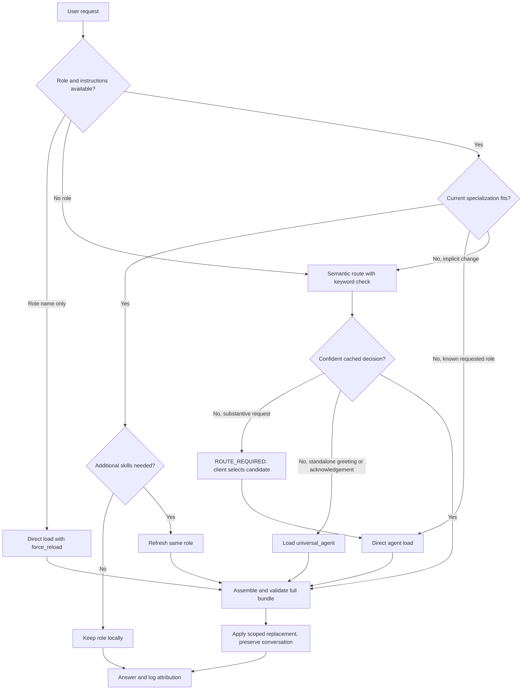

# Persona and request routing

This is the current routing contract. For setup and operations, start with the
[documentation map](README.md); for a repeatable update, use the
[documentation refresh process](../flows/documentation-refresh.md).

Protocol 2 keeps the active persona in the client conversation. The model assesses
whether its current scope fits each new request. A fitting role continues without
routing, catalog lookup, enrichment, or a server-side suitability check.


```mermaid
flowchart TD
    Q[User request] --> Known{Role and instructions available?}
    Known -->|Role name only| Restore[Direct load with force_reload]
    Known -->|No role| Route[Semantic route with keyword check]
    Known -->|Yes| Fit{Current specialization fits?}
    Fit -->|Yes| Skills{Additional skills needed?}
    Skills -->|No| Keep[Keep role locally]
    Skills -->|Yes| Refresh[Refresh same role]
    Fit -->|No, known requested role| Direct[Direct agent load]
    Fit -->|No, implicit change| Route
    Route --> Choice{Confident cached decision?}
    Choice -->|No, substantive request| Pick[ROUTE_REQUIRED: client selects candidate]
    Choice -->|No, standalone greeting or acknowledgement| Meta[Load universal_agent]
    Choice -->|Yes| Bundle[Assemble and validate full bundle]
    Meta --> Bundle
    Pick --> Direct
    Direct --> Bundle
    Restore --> Bundle
    Refresh --> Bundle
    Bundle --> Apply[Apply scoped replacement, preserve conversation]
    Keep --> Answer[Answer and log attribution]
    Apply --> Answer
```

Protocol 2 is the only protocol. `route_and_load` and `get_agent_context` default
to `protocol_version=2`, and clients pass it explicitly; any other value returns
`ERROR` without loading a persona. `refresh_persona_context` and `log_interaction`
take no `protocol_version`. Slash prompts always return protocol 2 bundles. Choosing HTTP or stdio
does not select a persona protocol.

## Client decisions

`keep` includes confirmations, continuations, formatting requests, and new tasks
within the current persona's scope. It does not compare candidates. A specialist
change triggers routing; an explicit known role loads directly. `universal_agent`
does not retain clearly specialized work merely because its description is broad.
A justified refresh acquires skills for the same role. Restore reloads lost
instructions for a known role without selecting another one. Cache expiry has no
bearing on the client's retained instructions.

See the complete [client protocol](../scripts/templates/routing-protocol-core.md).
The installers switched to version 2 on 2026-09-26, and protocol 1 was removed on
2026-09-29. The switch rests on two measurements:
in 30 days of telemetry under v1, 96% of routed turns returned ROUTE_REQUIRED and
73% of ROUTE_REQUIRED calls ended with the model re-picking the agent it already
had, re-sending its prompt ([telemetry analysis](../evals/telemetry/README.md));
in the dialogue evaluation, v2 made no selection calls on continuing turns and
switched roles correctly in every completed case. Server contract tests alone do
not establish support for a client and model; see the
[measured results and remaining validation gaps](persona-switch-eval-results.md).

## API

| Call | Behavior |
|---|---|
| `route_and_load(query, protocol_version=2, current_persona=...)` | Uses semantic cache and keyword validation; no sticky binding or sampling |
| `get_agent_context(agent_name, query, protocol_version=2, current_persona=..., force_reload=False)` | Loads an explicit role; same-agent calls return `NO_CHANGE` before enrichment unless restoring |
| `refresh_persona_context(query, current_persona=...)` | Rebuilds the same role's bundle; identical revision returns `NO_CHANGE` |
| `log_interaction(..., persona=..., persona_action=...)` | Checks agent/descriptor consistency, returns the server's local `timestamp` (`YYYY.MM.DD HH:MM:SS`) at once with `history` and `langfuse` statuses `queued`, and records declared attribution in the background (sink errors go to the server log; queued writes are drained on shutdown). Invalid attribution returns `ERROR` without `timestamp` |

When the semantic cache has no decision, `route_and_load` loads `universal_agent`
instead of returning `ROUTE_REQUIRED` for a standalone greeting,
acknowledgement or capability question, such as `hi`, `ok`, `thanks`, `continue`
or `what can you do`. Arbitrary short strings and greeting prefixes do not
qualify: `SQL?`, `Taxes?`, and greetings followed by a task remain substantive.
Such a request returns `NO_CHANGE` only when the supplied descriptor is already
`universal_agent`; with a specialist descriptor it switches to `universal_agent`.
A specialist survives acknowledgements because the client keeps it locally and
does not route them.

Pass a relevant `chat_history` excerpt when a routed request depends on earlier
facts. The server does not need the whole conversation. Agent slash prompts load
explicit roles; `/ask` requests routing. Both return the same bundles as the
tools; pass `current_persona` as descriptor JSON when available. MCP prompt
arguments are transported as strings, for example
`{"query": "Explain a dictionary", "current_persona": "{...}"}`. An optional
`protocol_version` argument accepts only `"2"`; other values return the unsupported
version message without loading a persona.

`SUCCESS` contains `protocol_version`, `request_id`, `persona`,
`replaces_activation_id`, `footer`, an application instruction, and separate
`persona_block`, `rules_block`, `skills_block`, `implants_block`. The descriptor
contains canonical `agent`, unique `activation_id`, full SHA-256 `bundle_revision`,
metadata `scope`, and the loaded component lists: `skills_loaded` (skill file IDs),
`implants_loaded` (each implant's `short_name`, or its file ID when none is
declared) and `rules_loaded` (rule names). The footer shows these lists, then a
plain Markdown segment `Agents-Core <version>`. The version is the UTC commit
time of the installation's `HEAD` as `YY.MM.DD.HHMM` (`-dirty` when tracked files
have uncommitted changes, `unknown` without git metadata), computed once per
process by `src/version.py`. Under the shared daemon the version text is a link,
`[Agents-Core <version>](http://127.0.0.1:<port>/ui)`, to the web UI; stdio servers
show the version as plain text. The footer contains no HTML.
The segment belongs to the installation, so it is not part of the descriptor or
the revision. A `NO_CHANGE` response rebuilds its footer in the current process,
but clients keep the footer saved with the active activation, so its segment
stays as issued until the next `SUCCESS`.
The revision reflects the issued texts, resolved imports, the component lists and
their order, plus the agent identity and scope used by the local suitability
assessment.
It is neither a conversation identifier nor an authentication token.

The client applies a response only if `replaces_activation_id` matches its active
activation (null for first load). Replayed activations are no-ops; stale responses
are ignored. Missing mandatory components produce `ERROR` with no partial
activation. A failed request leaves the previous state available. These application
rules belong to the client: the server cannot enforce the state of another app.

On every `SUCCESS`, replace `persona_block`, `rules_block`, `skills_block`, and
`implants_block`, including empty blocks. This replaces changed or removed rules
on switches, restores and refreshes instead of retaining stale instructions.
Preserve higher-priority instructions, facts, goals, constraints, permissions,
conversation history and tool results. This is logical revocation; MCP cannot erase earlier client
messages. No cache clearing, shared active-agent variable or conversation reset is
involved. Use the last successful footer on `keep`; logs record self-reported
activation and revision rather than proving behavioral compliance.

Keep the complete descriptor and exact footer in retained conversation context,
including summaries used during compaction. Losing a temporary tool variable
does not remove an activation that remains in the conversation. Before sending
the final answer, compose it with the saved footer and call `log_interaction`
with that exact text (without a time line), the current user request verbatim, the
descriptor, and the action (`keep`, `switch`, `refresh`, or `restore`). Then
deliver the answer with the returned `timestamp` as its first line, followed by
an empty line (the `answer-timestamp` rule); without a `timestamp`, add no line.

## Enrichment and storage

Agent metadata declares core, preferred and capable skills, plus preferred
implants. Tier inference selects lite, standard or deep depth; an inferred lite
request is promoted to standard when the agent declares preferred implants.
Clients cannot pass a tier, and no route forces one, so the
[meta route](#api) also yields a standard `universal_agent` bundle with its
preferred implants. A session-scoped bundle is kept through `NO_CHANGE`, so a
conversation that opens with a greeting does not stay on a lite bundle.
Mandatory rules and core skills are distinct from extra retrieved components.
Standard and deep tiers select relevant extras under the agent's declared skill
constraints. Refresh reads current source content before calculating its revision.

`RULES_ENABLED=0` disables the shared rules layer. The optional intent classifier
is off by default (`INTENT_CLASSIFIER_ENABLED=0`). When enabled, it can contribute
the initial bundle tier. Per-query skill/implant budgets, persona-format
suppression and `IMPLANT_NEED_GATE` apply only to the per-query enrichment path
(`server._load_and_enrich`) that the evaluation harnesses use, because a bundle
persists across later requests until a switch, restore, or refresh.

The semantic router uses `NumpyVectorStore`, local FastEmbed embeddings and a
bounded persistent routing cache. Every `SUCCESS` other than a restore or refresh
stores the query and the loaded agent: routed loads, `get_agent_context` calls
(including selections after `ROUTE_REQUIRED`), agent slash prompts and the meta
route to `universal_agent`. `route_and_load` then reuses a stored decision without
`ROUTE_REQUIRED` for a query within cosine distance `1 - ROUTER_SIMILARITY_THRESHOLD`
(0.05 by default), unless keyword validation overrides or rejects it. The cache
keeps its 500 newest entries; [Runtime and project boundaries](#runtime-and-project-boundaries)
says where it lives. The embedding model and thresholds come from
`src/engine/config.py`; no external model is called to decide `keep`. The
enriched-prompt TTL cache of the per-query path is separate from client persona state.

## Runtime and project boundaries

Both transports use the tools defined in `src/server.py`; HTTP excludes
`clear_session_cache`. Protocol handlers live in
`src/engine/persona.py`; `src/engine/persona_bundle.py` assembles fresh blocks and
their revision. `src/schemas/protocol.py` defines the descriptors and responses.
Each client conversation owns its activation; the shared HTTP daemon does not
hold one global active persona for all clients.

The daemon keeps derived router and history indexes in private service state;
its routing cache is shared by all HTTP clients and workspaces.
Standalone startup leases separate `data/stdio/` slots for concurrent processes
when process locking is available, each with its own routing cache; without it,
startup uses temporary derived storage. Skill and implant indexes are installation
data. The bounded enriched-prompt cache is process-local. Over stdio,
`clear_session_cache()` clears it; for HTTP, use
`.venv/bin/python -m src.daemon clear-cache`. Neither clears the routing cache.
Cache clearing is an administrative action and is not required for persona changes.

HTTP repository memory requires `X-Agents-Workspace` with a registered workspace
UUID. Global connections can route and load personas without that header, but
`describe_repo`, `write_repo_summary`, `read_history`, and `log_interaction` need
a valid workspace. Over stdio, the workspace is the client root from
`AGENTS_CLIENT_REPO_ROOT`, or one inferred from `CLAUDE_PROJECT_DIR` or the working
directory; an inferred filesystem root, or on Windows a directory inside the
Windows directory, is refused with `workspace_required` (resolution order:
[Repository Memory](../README.md#-repository-memory)). On `workspace_required`
or `workspace_invalid`, keep routing and report unavailable memory without
retrying logging in a loop. For `needs_summary`, preserve `workspace_id`,
`repo_path`, and `repo_hash` in the follow-up write. See
[memory and errors](shared-mcp-daemon.md#memory-and-errors).

Repository workflows use the same workspace identity. `list_flows()`,
`get_flow`, `save_flow` and `delete_flow` handle built-in and personal (`user:`)
flows without a workspace; repository (`repo:`) flows and `run_flow(...)` require
one over HTTP. Over stdio they use the resolved client root. Without a usable
workspace, `run_flow` fails with `workspace_required`, and `get_flow`,
`save_flow` or `delete_flow` on a `repo:` flow fail with
`repo_scope_unavailable`; neither falls back to the installation. `run_flow`
returns instructions bound to the caller's `repo_path`. The current model executes
the flow with its own tools and active persona.
Loading a flow does not route, replace a persona or complete the task. See the
[workflow contract](../flows/README.md#through-agents-core-mcp).

## Compatibility

| Client instructions | Server | Result |
|---|---|---|
| Protocol 1 | Current | Calls omit `protocol_version` and receive protocol 2 bundles the instructions do not describe (an unknown `context_hash` is ignored); reinstall the instructions |
| Protocol 2 | Current | Conditional routing, structured bundles, no sampling |
| Protocol 2 | Predates protocol 2 | One incompatibility notice, then answers without an activated persona until the server is updated |

When MCP is unavailable, its footer and logging requirements have an explicit
fallback. A retained valid bundle keeps its descriptor and exact footer when
available; unavailable logging is skipped. A manually loaded prompt is attributed
as a manual role, without a fabricated descriptor, footer or component list.
Once MCP returns, reload a manually loaded role or a retained role missing its
descriptor or exact footer through `get_agent_context` with `protocol_version=2` and
`force_reload=True`, using the last real descriptor if retained or null if none
exists. Resume normal attribution after that successful activation. A retained
MCP bundle with its descriptor and exact footer needs no reactivation solely
because connectivity returns.

## Installation, migration and rollback

`./scripts/init_repo.sh` (Windows: `scripts\init_repo.bat`) installs the protocol.
The [one-command `install.sh`](../README.md#one-command-install-macos-and-linux)
(macOS and Linux) clones or updates the checkout (default `~/.agents-core`) and
runs `scripts/init_repo.sh --yes`, which accepts the global instruction and
routing-reminder prompts without asking.

Instruction installation and refresh (`scripts/install_instructions.py`, Codex
detection and target files) are described in
[Codex instruction installation](../README.md#codex-instruction-installation);
they do not register MCP connections. On macOS, the shared daemon's
`migrate --clients codex` configures Codex's connection (see
[daemon installation and client migration](shared-mcp-daemon.md#installation-and-client-migration));
for standalone stdio, add the `[mcp_servers."Agents-Core"]` entry from
[Codex configuration](../README.md#codex-configtoml) manually.

The installers and `scripts/install_instructions.py` use the same Claude profile:
`$CLAUDE_CONFIG_DIR` when that variable is non-empty, otherwise `~/.claude`. It
holds `CLAUDE.md` and `memory/`. A non-empty `CLAUDE_CONFIG_DIR`, an existing
profile directory or `~/.claude.json`, or an available `claude` command counts as
a detected Claude client.

The checked-in `CLAUDE.md` uses the same managed section. Global installation does
not modify this tracked file. After editing the template, run
`.venv/bin/python scripts/_helpers/inject_claude_md.py CLAUDE.md scripts/templates/routing-protocol-core.md`
(or use `.venv\Scripts\python.exe` on Windows). Only the managed section is replaced; repository notes outside it remain intact.
When the section changes, the helper leaves an untracked
`CLAUDE.md.backup.<timestamp>` in the checkout; leave it out of the commit.

Both installers replace only the marked routing section and back up changed
files. The shared instruction writer retains the three newest backups per file
whose names end in `.backup.<timestamp>`, accepting both the legacy 10-digit
seconds and current 19-digit nanoseconds formats. It removes older matching
regular files after a successful write or an unchanged-content check. An
unchanged update creates no backup. Backup creation reserves a distinct name even
when the clock returns a timestamp already in use. Named manual backups, other
filename formats and symlink backups are preserved; MCP configuration backups use separate logic.
Malformed routing markers stop the update without rewriting the target. A
symlinked instruction, reminder or index file is refused unchanged; update its
target manually.

The installers migrate `feedback_agents_core_routing.md` in the Claude profile's
`memory/` directory only when its bytes exactly match the current template or a
previously generated one in
[`scripts/templates/legacy/`](../scripts/templates/legacy/README.md), including the
protocol 1 reminder; the old protocol 1 index line is replaced too. A changed reminder or index
entry is preserved with a warning naming the file and manual correction. Windows
migrates an existing reminder but never creates one when absent. Other project
memory is untouched.

When migrating from protocol 1, search the instructions and memory you maintain for
`always route_and_load`, `Before answering ANY user query`, and equivalent
unconditional routing rules. Replace those conflicts with local suitability
assessment. The server cannot scan a remote client's home directory or override
user instructions through tool output.

Protocol 1 cannot be rolled back to on a current server. Restoring older
instructions from backups requires checking out a server revision before
2026-09-29 as well. Preserve all unrelated user content and conversation history;
restoring a whole backup over subsequent user edits requires merging those edits
first.

## Validation

Run deterministic contract and migration tests from the checkout root:

```bash
LANGFUSE_TRACING_ENABLED=false .venv/bin/python -m pytest tests/test_persona_protocol.py tests/test_persona_bundle.py tests/test_install_instructions.py tests/test_installer_instructions.py tests/test_codex_instructions.py tests/test_protocol_migration.py -q
```

See [tests/README.md](../tests/README.md) for the full suite, model prerequisites,
and optional integration tests. These checks validate server and migration
contracts; they do not by themselves validate a client's behavior. The dialogue
runner in `evals/runners/run_persona_dialogues.py` drives real Codex/Claude sessions,
retains protocol instructions and records actual MCP traces. Evaluate Russian and
English continuations, role switches, retained facts, recovery and failures with
three independent repeats for each claimed client/model combination. Report
unnecessary routing/refresh calls, missed switches, tool-result sizes and latency;
never infer successful behavior solely from the server returning valid JSON.
