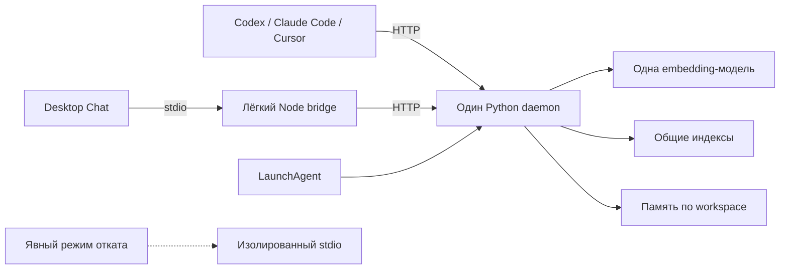

# Общий процесс Agents-Core для локальных MCP-клиентов

Дата: 2026-09-20. Статус: план реализации.

## Цель и границы

Одна установка Agents-Core обслуживает приложения одного пользователя macOS через один постоянно работающий Python-процесс. Embedding-модель и общие индексы загружаются один раз. Подключение клиента не запускает серверный Python и не прогревает модель повторно.

Целевые клиенты: Codex, Claude Code CLI, Claude Code в Code tab приложения Claude, Cursor и Claude Desktop Chat. Отдельные клоны и worktree одного Git-репозитория имеют независимую память.

В объём входят изоляция проектов, служба macOS, миграция клиентских конфигураций, bridge для Desktop Chat, диагностика, управляемое обновление и откат. Облачные клиенты, другие машины, несколько пользователей ОС, Linux/Windows-службы, смена embedding-модели, hot reload и обновления без простоя в этот объём не входят. HTTP-интерфейс предоставляет инструменты и prompts без sampling, roots и server→client уведомлений.

## Нагрузка и измерение результата

Контрольный срез от 2026-09-20 содержит следующие данные [замера процессов](shared-mcp-daemon-plan-review.md#1-измеренный-baseline-в-плане-отсутствует):

| Клиент | Процессов с моделью | Physical footprint на процесс |
|---|---:|---:|
| Codex | 5 | 1,5–1,6 GB |
| Claude Code — Code tab | 4 | около 1,5 GB |
| Claude Code CLI | 3 | 1,5–1,6 GB |
| Claude Desktop Chat | 2 | около 1,5 GB |
| Cursor | 1 | около 1,5 GB |
| **Всего** | **15** | **суммарно около 22,9 GB** |

Это зафиксированный срез нагрузки, а не актуальный счётчик процессов. В отчёте также указаны 36 GB RAM и 25,7 из 26,0 GiB занятого swap. Сырые результаты к отчёту не приложены; скрипт baseline сохраняет воспроизводимый срез перед миграцией. Модель сравнительного прогона — `intfloat/multilingual-e5-large`.

Скрипт собирает PID, родительское приложение, возраст процесса, physical footprint через `vmmap --summary`, swap и задержки MCP. Полные командные строки и секреты в отчёт не записываются. RSS служит дополнительной метрикой. До и после миграции используются одинаковые единицы, модель, запросы и число клиентов. Сумма footprint сравнивает процессы; изменение системного swap измеряется отдельно.

После первой поставки восемь серверов Codex и Claude Code CLI заменяются одним daemon: при неизменной нагрузке всего остаётся восемь процессов с моделью, включая семь подключений Code tab, Cursor и Desktop Chat. После второй поставки все 15 подключений обслуживает одна модель. При достижении общего footprint 2,5 GB разница с контрольным срезом составляет около 20,4 GB; фактический результат фиксирует сравнительный прогон.

## Архитектура и контракты

### Транспорт и runtime

Пользовательский LaunchAgent запускает один worker с endpoint `http://127.0.0.1:8765/mcp`. Порт по умолчанию — 8765; явная настройка сохраняется одновременно у службы и клиентов. При конфликте порта установщик сообщает ошибку и не завершает занимающий его процесс.

MCP SDK закрепляется на проверенной версии 1.27.1 в зависимостях и lockfile. Сервер использует `FastMCP(host="127.0.0.1", port=8765, stateless_http=True, json_response=True)`. Каждый HTTP-запрос самодостаточен; сервер не хранит MCP-сессии и не выдаёт `Mcp-Session-Id`. Необязательность сессий предусмотрена [спецификацией MCP](https://modelcontextprotocol.io/specification/2025-11-25/basic/transports).

Модель, router, retrievers и rules инициализируются в lifecycle процесса/внешнего ASGI-приложения. FastMCP lifespan в stateless-режиме может выполняться на каждый запрос; в нём нет загрузки модели или общего runtime. Внешний ASGI lifespan запускает и завершает MCP transport manager. Workers и autoreload отключены.

`route_and_load`, `get_agent_context`, `refresh_persona_context`, `list_agents`, `load_implants` и соответствующие prompts работают без workspace. Персона v2 хранится у вызывающего диалога и передаётся аргументом. HTTP-ветки не вызывают sampling, roots и progress callbacks. `describe_repo` сразу возвращает `needs_summary` с контекстом для генерации текста клиентом; `SUCCESS_SAMPLED` по HTTP не используется.

### Workspace и память

Заголовок `X-Agents-Workspace` содержит UUID из пользовательского реестра службы. Реестр связывает UUID с существующим canonical absolute path. Регистрация того же realpath возвращает тот же UUID; разные каталоги, включая клоны и worktree с одним remote URL, получают разные UUID. Symlink на зарегистрированный каталог разрешается к той же записи. Коллизия UUID, конфликт пути или исчезнувший каталог дают ошибку. Перенос проекта требует явной перерегистрации.

На каждый запрос создаётся неизменяемый `ClientContext`: request ID, режим транспорта, workspace UUID и canonical root при наличии. HTTP-путь не получает корень из env, cwd или MCP roots. Файловые зависимости и executor jobs получают разрешённые пути явно; смена `os.environ`, `os.chdir()` и неявный перенос `ContextVar` не используются.

`log_interaction`, `read_history`, `describe_repo` и `write_repo_summary` требуют зарегистрированный workspace. Без заголовка возвращается `workspace_required`, с неизвестным или недопустимым ID — `workspace_invalid`; файловые операции не начинаются. Tool-аргумент `repo_path` должен разрешаться внутри workspace. Регистрировать произвольный каталог через HTTP нельзя.

MCP-инструкции задают обработку этих ошибок: продолжить routing/persona, сообщить о недоступности памяти проекта и не повторять логирование в цикле. Общий router cache и настроенный Langfuse остаются служебными хранилищами; project history/debug не записываются без workspace. Диагностика без workspace идёт в журнал службы с request ID, без подстановки INSTALL_ROOT как проекта.

`HistoryReader`, `HistoryWriter`, `RepoDescriber` и debug logger используют явный контекст. `HistoryStore` хранится в ограниченном LRU-реестре по canonical root. Начальный предел — восемь кешированных store; занятый store удерживается до завершения запроса. При исчерпании лимита операция ограниченно ожидает или получает `busy`.

Двухшаговое описание проекта имеет следующий контракт:

1. `describe_repo` возвращает исходные `workspace_id`, canonical target repo, `repo_hash` и prompt для summary.
2. `write_repo_summary` требует эти значения вместе с текстом. Workspace совпадает с заголовком, target — с разрешённым каталогом, digest — с заново вычисленным состоянием выбранных файлов.
3. Проверка и запись выполняются под блокировкой проекта. Несовпадение identity или digest отклоняет запись; проверки структуры и минимального объёма summary сохраняются. Digest отражает входные файлы описания, а не только Git HEAD.

Реестр operation tokens не требуется. Контракт не обещает exactly-once: после неоднозначного ответа клиент проверяет результат чтением, а не повторяет запись автоматически.

### Кеши, индексы и единственный писатель

`SESSION_CACHE` и `CONTEXT_HASH_CACHE` остаются ограниченными общими кешами производного контекста установки. Ключи включают необходимые входные данные и ревизию конфигурации; значения не содержат историю диалога или активную персону. Доступ синхронизируется. Глобальная очистка доступна через административный интерфейс службы; `clear_session_cache` в HTTP-каталоге не публикуется. Очистка может сбросить sticky mappings протокола 1, но не меняет клиентские дескрипторы v2.

Daemon использует отдельный постоянный каталог router cache и model marker; singleton/writer lease охватывает загрузку, invalidation, self-heal, удаления и записи. При поэтапной миграции прямые stdio-процессы не обращаются к этому каталогу. Производные history indexes daemon также имеют отдельный namespace по workspace. Исходные `history.md` и managed section проекта остаются общими и защищаются файловыми блокировками.

Новые самостоятельные stdio-запуски используют временные каталоги производных router/history indexes. Полный откат выполняется с остановленным daemon. Во время миграции критерий единственного писателя относится к хранилищам daemon; итоговая приёмка требует отсутствия прямых серверных процессов клиентов.

Первое развёртывание выполняется под maintenance с остановкой всех процессов, использующих изменяемую установку. Оставшиеся на stdio клиенты перезапускаются на совместимую версию с теми же файловыми блокировками history и managed section. Совместный доступ daemon и stdio к памяти workspace разрешается только после этой проверки; процесс без общего протокола блокировок должен завершиться до подключения daemon к этому workspace.

Формат производного индекса содержит fingerprint модели, её закреплённой ревизии/артефакта и версии схемы/preprocessing. Skills/implants дополнительно учитывают исходные `.mdc`, history index — содержимое истории. Несовместимый индекс перестраивается; history — лениво в daemon с общей моделью. Source history сохраняется. Model configuration остаётся неизменной на протяжении миграции.

### Авторизация и конфигурации клиентов

Авторизация включена с первой поставки. Служба принимает только loopback-соединения и использует встроенную защиту Host/Origin SDK. Проверки не дублируются самописным аналогом; smoke tests проверяют неверные Host/Origin и отсутствие разрешающего CORS.

ASGI middleware проверяет bearer token перед `/mcp` и `/health`. Случайный токен хранится в пользовательском каталоге службы с правами `0600`, каталог — `0700`. Он ограничивает доступ других локальных пользователей и процессов без секрета. Изоляция от программ того же UID, способных читать пользовательские файлы, не заявляется.

Установщик доставляет полную запись сервера с URL, токеном и workspace UUID. GUI-приложения не зависят от `.zshrc`, shell env или объединения HTTP headers между scopes. Private configs и backup имеют `0600`; перед записью секрета проверяется git tracking. Для untracked project config добавляется локальное исключение из git. Токены исключаются из сообщений, diff и логов.

| Клиент | Способ подключения | Контекст проекта |
|---|---|---|
| Codex | Полный private `.codex/config.toml`: `url`, `http_headers`; trusted workspace | UUID конкретного каталога |
| Claude Code CLI и Code tab | Полная local-scope запись `~/.claude.json`, `projects[canonical-path].mcpServers`; `type: "http"`, `url`, `headers` | UUID из записи проекта |
| Cursor | Полный private `.cursor/mcp.json`: `url`, `headers` | Статический UUID; каждый worktree регистрируется отдельно |
| Claude Desktop Chat | Stdio bridge с абсолютными путями Node, bridge и private config | Явный UUID в private config; без него доступен routing |

Для Codex с tracked project config используется `http_headers_helper`: абсолютная команда получает явный UUID и читает токен из пользовательского файла, выводя оба заголовка. Для Cursor с tracked project config используется bridge с off-repo private config. Секрет не попадает в tracked файл. Глобальная регистрация без выбранного проекта предоставляет routing/persona.

Миграция проверяет user, local, project и plugin scopes, удаляет конфликтующие command/args у мигрируемой записи и сохраняет чужие серверы и tool policies. Каждый clone/worktree получает собственную effective configuration. Унаследованная регистрация не назначает ему память другого проекта.

Code tab проверяется отдельно: он импортирует серверы Desktop Chat. Bridge получает имя `Agents-Core-Desktop`, прямое подключение — `Agents-Core`. Для namespace bridge установщик добавляет документированное deny-правило в настройки Claude Code, сохраняя остальные permissions. Фактическое имя namespace сверяется по обнаруженным инструментам. Приёмка проверяет один доступный набор инструментов Agents-Core в Code tab и работу bridge в Chat; лёгкий bridge-процесс может запускаться приложением.

Ротация токена выполняется командой управления с backup, атомарной заменой private configs и проверкой подключений. При частичной ошибке восстанавливается согласованный набор настроек. Секрет не выводится для ручного копирования.

### Bridge для Desktop Chat

Bridge реализуется на Node с закреплёнными зависимостями и устанавливается заранее. Его запуск не использует загрузку пакетов через `npx`, Python, FastEmbed или движок Agents-Core.

Bridge обслуживает stdio lifecycle и пересылает запросы в stateless HTTP с токеном и workspace header. Он сохраняет JSON-RPC request IDs и обрабатывает initialize, notifications, ошибки, завершение stdin и параллельные запросы. Capability contract соответствует daemon: sampling, roots и server→client notifications не предлагаются. История и активная персона в bridge не хранятся.

При недоступности daemon bridge возвращает ошибку и не запускает тяжёлый сервер. После HTTP disconnect выполнение файловой операции считается неопределённым до проверки; автоматического replay мутирующих запросов нет. Desktop Chat использует локальный bridge, а не удалённый connector к loopback.

### Служба, нагрузка и диагностика

Bootstrap проверяет recovery/maintenance state до импорта приложения. Отдельный `.daemon.lock` берётся до модели; `.sessions.lock` защищает установку на всё время исполнения. Запуск выполняет LaunchAgent, рестарт — контроллер и launchd. В daemon отключены самостоятельный `execv`, фоновый reindex и автообновление.

Управляющий интерфейс предоставляет `install`, `start`, `status`, `stop`, `restart`, `update`, `uninstall`, регистрацию workspace и ротацию токена. Команды не импортируют модель. Повторный start идемпотентен; PID-файл служит диагностикой, владение проверяется ОС-блокировкой и identity службы.

`GET /health` возвращает state, instance ID, PID, версию, install root, uptime, model-ready, число выполняющихся запросов и размер очереди. Состояния: `starting`, `ready`, `draining`, `failed`. HTTP 200 означает ready, остальные состояния дают 503. До открытия порта `status` читает lifecycle state у supervisor. Ready выставляется после загрузки модели и проверки индексов.

Начальная конфигурация: один inference worker, очередь до 64 embedding jobs, до 32 принятых tool calls, до восьми I/O workers. Ограничения охватывают все embedding entry points, включая историю. Переполнение даёт `busy`. Request admission, inference и блокирующий I/O разделены, чтобы ожидание файла не занимало event loop или все ресурсы inference.

Файловый I/O, ожидание блокировок, SDK telemetry и другие блокирующие вызовы выполняются вне event loop. Отмена async-ожидания не означает остановку worker thread: ресурсы учитываются до фактического завершения, мутирующей операции не сообщается гарантированный rollback по одному таймауту. Shutdown flush ограничен по времени и не приводит к повторной записи истории.

Plist содержит абсолютные пути Python, Git, рабочего каталога, конфигурации и логов, явный PATH с необходимыми путями, найденными при установке. Служба стартует при login, остаётся после отключения клиентов и восстанавливается после сбоя. Launchd throttling настраивается явно; ошибочный startup не создаёт цикл интенсивного warmup. `ProcessType=Interactive` соответствует обслуживанию интерактивных HTTP-запросов; CPU-нагрузку ограничивают executor и admission limits. Git credentials и SSH agent проверяются из окружения службы отдельно от терминала.

Журналы используют ротацию, debug-файлы — request UUID и ограниченный срок хранения. Начальные пределы: журнал 10 MiB × 5 файлов; debug до семи суток и 100 MiB суммарно. Вывод до настройки Python logging также ограничивается обслуживанием launchd stdout/stderr файлов.

### Обновление и maintenance

Обновление выполняется явной командой с окном недоступности. Контроллер использует fast-forward updater с проверками ветки, чистоты working tree, journal и rollback. Размер файлов индексов не служит оценкой времени reindex.

1. Контроллер сериализует управляющие операции, устанавливает durable maintenance state и блокирует ручные старты и autostart launchd. До файловых изменений записывается service transaction journal: исходный и целевой SHA, rollback artifacts, фаза операции и состояние autostart. Он сохраняется до подтверждённого ready или завершённого recovery.
2. Daemon прекращает принимать новые tool calls и ожидает фактического завершения принятых операций до 60 секунд. При превышении срока обычная команда возвращает `blocked`, снимает намерение остановки и восстанавливает обслуживание. Принудительная остановка задаётся явно.
3. Контроллер останавливает daemon и ожидает updater/reindex descendants. Прямые stdio readers блокируют изменение установки; их lease не снимаются принудительно.
4. До импорта изменяемого приложения контроллер получает exclusive installation lease, затем updater lock в порядке, согласованном с `src/startup.py` и `src/self_update.py`. Контроллер не импортирует server, enrichment или embedder.
5. Updater выполняет допустимый fast-forward с recovery journal. Reindex запускается единственным дочерним процессом с моделью; daemon остановлен. Контроллер дожидается child и его потомков, сохраняя необходимые lock FD.
6. Skills/implants проходят rebuild и проверку fingerprint; несовместимый runtime router cache инвалидируется отдельно. История проекта сохраняется, её производный индекс обновляется лениво после старта.
7. После завершения reindex и файловой транзакции контроллер освобождает exclusive installation lease и updater lock, сохраняя control lock и maintenance state. Тот же LaunchAgent запускает проверочный daemon по одноразовому admission контроллера. Остальные старты заблокированы; daemon получает lifetime shared installation lease. Guard незавершённого файлового recovery journal не обходится.
8. Update успешен только после `/health = ready`. При неуспешном старте проверочный процесс и его потомки полностью завершаются; контроллер повторно получает exclusive leases, восстанавливает ревизию и совместимые производные данные, освобождает leases и проверяет восстановленный runtime. Неполный rollback оставляет службу остановленной с recovery state. Service journal позволяет продолжить recovery после падения контроллера, даже если updater завершил собственную файловую транзакцию.
9. После ready тот же PID становится штатным daemon. Контроллер снимает maintenance, фиксирует завершение service transaction и возвращает штатную политику launchd без второго запуска и warmup. Отказ до файловой mutation, включая stdio-reader или lock timeout, восстанавливает исходную службу и autostart; если служба была запущена до команды, ready проверяется до снятия maintenance.

Reindex и daemon загружают модель последовательно. Два прогрева входят в стоимость обновления; одновременно находится в памяти не более одной модели Agents-Core. Обновление `.venv` и зависимостей выполняет установщик под тем же maintenance-протоколом. Обычный update отклоняет изменение dependency manifests с указанием на обслуживание зависимостей; скрытый `pip install` не выполняется.

Ручной reindex и операции над исполняемой установкой также используют maintenance. Фоновая подготовка с отдельной моделью и периодический polling отключены. Сбой сети до изменения файлов возвращает рабочую версию в ready; повреждённая установка остаётся fail-closed.

## Поставки

Каждая поставка заканчивается работающими подключениями и измерением footprint. S — ограниченная доработка, M — несколько модулей с интеграционной проверкой, L — несколько подсистем с клиентской миграцией. Это оценка объёма, а не календарного срока.

| Поставка | Содержание | Ответственность | Объём | Результат |
|---|---|---|---|---|
| 1 | Baseline и HTTP compatibility smoke; stateless daemon; explicit workspace memory; auth; ограничение нагрузки; health; LaunchAgent; миграция Codex и Claude Code CLI | Runtime + клиентская интеграция | L | Восемь прямых серверов заменены одним; footprint мигрированной группы ≤ 2,5 GB |
| 2 | Code tab и Cursor; Node bridge Desktop Chat; устранение дублей инструментов; проверка scopes | Клиентская интеграция | M | Все пять типов клиентов используют одну модель при 15–20 подключениях |
| 3 | Offline update, service-level rollback, обслуживание зависимостей, полный откат | Lifecycle + установщик | M | Обновления с одной одновременно загруженной моделью |

В поставке 1 реализуются start/stop/restart и maintenance guard; автообновление отключено. Между поставками установка обновляется явным обслуживанием с остановкой всех readers. Перед основной разработкой клиентской миграции выполняется короткая проверка initialize/tools/prompts без `Mcp-Session-Id` на установленных приложениях.

Code tab и Desktop Chat мигрируют совместно в поставке 2: импортируемое подключение Chat к этому моменту становится лёгким bridge. Запрет инструментов не используется как доказательство отсутствия процесса; число тяжёлых серверов проверяется отдельно после перезапуска обоих интерфейсов.

| Область | Файлы реализации |
|---|---|
| Lifecycle и HTTP | `src/server.py`, `src/startup.py`, новые модули daemon/service control |
| Контекст проектов | `src/engine/config.py`, новый request/workspace context, `src/memory/config.py`, `src/memory/history.py`, `src/memory/describer.py`, `src/memory/managed_section.py` |
| Кеши и индексы | `src/engine/router.py`, `src/engine/vector_store.py`, `src/engine/embedder.py`, `src/engine/skills.py`, `src/engine/implants.py`, `src/reindex.py` |
| Диагностика | `src/utils/debug_logger.py`, debug paths в `src/engine/enrichment.py`, конфигурация logging |
| Обновления | `src/self_update.py`, service controller, установочные скрипты |
| Клиенты | `scripts/init_repo.sh`, `scripts/_helpers/inject_mcp.py`, новый TOML migration, Node bridge, LaunchAgent template |
| Документация и зависимости | `README.md`, шаблоны MCP-инструкций, `pyproject.toml`, `uv.lock`, закреплённые зависимости bridge |

JSON/TOML миграторы сохраняют посторонние настройки, создают private backup и пишут атомарно. Универсальная env-подстановка не используется: каждый клиент получает конкретные допустимые поля. Конфигурация переключается после проверки daemon; прямые подключения завершаются через приложение. Массовое завершение Python-процессов и автоматический переход на тяжёлый stdio запрещены.

## Проверки и критерии приёмки

Числа ниже — целевые пороги реализации. Задержки, idle CPU и время рестарта измеряются скриптом baseline; эти значения не объявляются уже достигнутыми.

| Метрика | Критерий |
|---|---|
| Моделей после полной миграции | Ровно одна при 15–20 клиентских подключениях |
| Серверных процессов | Один Python daemon; bridge-процессы без модели учитываются отдельно |
| Суммарный footprint | ≤ 2,5 GB для daemon и активных bridge в контрольном workload; клиентские приложения исключены |
| Новый клиент при ready daemon | p95 initialize + первый обычный routing tool ≤ 1 с без очереди и без генерации клиентской LLM |
| Параллельность | 20 routing requests без смешения контекста и превышения лимитов; p95 ≤ 10 с на контрольной машине |
| Idle CPU | Среднее ≤ 1 % одного ядра за пять минут после стабилизации, без фонового polling |
| Event loop | В нагрузочном тесте нет callback, блокирующего loop дольше 100 мс; нарушение содержит stack/source для диагностики |
| Restart → ready | ≤ 120 с с кешированной моделью; readiness deadline задаётся конфигурацией |
| Update | Один model process в каждый момент; успех только после ready; deadline updater/reindex ограничен конфигурацией |
| Рост памяти | После 1 000 connect/disconnect и запросов к 20 workspace, затем очистки неактивных кешей, footprint укладывается в общий бюджет |

Функциональные сценарии:

1. Initialize, tools/list, tools/call и prompts/get через stateless HTTP; работа без session ID и обратных запросов. Внешний lifespan загружает модель один раз.
2. Два проекта и два одинаковых клона параллельно читают/пишут только свою историю. Workspace отсутствует, неизвестен, удалён или противоречит `repo_path`: неверных файловых операций нет. Два клиента одного проекта сохраняют обе записи.
3. Describe в A, write с заголовком B, изменение исходных файлов между вызовами, одинаковый digest разных клонов: запись отклоняется. Успешная запись сохраняет unmanaged части `CLAUDE.md`.
4. Routing без workspace не создаёт project history/debug в cwd или INSTALL_ROOT. Клиент обрабатывает `workspace_required` и продолжает работу с персоной.
5. Общие кеши не содержат диалоговую память; персоны независимы. Router persistence сохраняет записи конкурентных запросов в пределах установленной политики eviction. Correlation IDs уникальны.
6. Медленный файловый lock, telemetry timeout, очередь inference и debug I/O не блокируют event loop. Timeout coroutine не освобождает фиктивно занятую квоту worker.
7. Повторный start, конфликт порта, stale PID, неуспешный warmup и crash не создают второй runtime. Сон/пробуждение Mac и восстановление HTTP проверяются во всех клиентах. Недоступный daemon даёт ошибку без тяжёлого fallback.
8. Закрытие клиента во время `log_interaction` не приводит к автоматическому replay. Завершённая запись читается после reconnect; неоднозначный результат диагностируется. Гарантии dedup соответствуют контракту `HistoryWriter`.
9. Неверный token/Host/Origin отвергается. GUI-запуск из Dock работает без shell env. В tracked файлах, diff, логах и backup с открытыми правами нет секретов.
10. Все пять типов клиентов проверяются отдельно: effective config всех scopes, число тяжёлых процессов и отсутствие дублирующих инструментов bridge в Code tab.
11. Maintenance блокирует manual/autostart; stdio-reader откладывает update. Проверены interrupted update, reindex failure, неуспешный ready новой версии, rollback, падение controller и drain timeout. Reindex не работает параллельно daemon.
12. Явный откат останавливает daemon, восстанавливает клиентские записи и сохраняет историю. Самостоятельный stdio проходит тесты с изолированными производными кешами.

Использовать существующие тесты контекста, памяти, persona protocol, sandbox, startup и updater; добавить HTTP/ASGI, process lifecycle, config migration, bridge и нагрузочные тесты. Быстрые ASGI-тесты не загружают модель. Реальная модель используется в выделенном интеграционном прогоне. После целевых проверок запускается `scripts/run_tests.sh`, отдельно — opt-in slow tests и smoke tests приложений.

## Риски и контроль

Вероятность и ущерб — качественная оценка для планирования.

| Риск | Вероятность × ущерб | Контроль |
|---|---|---|
| Ошибка workspace пишет в чужой проект | Средняя × высокий | UUID→realpath, явные пути, identity/digest validation, тест одинаковых клонов |
| Клиент игнорирует HTTP или выбирает другой scope | Высокая × высокий | Ранняя compatibility проверка, полные записи, отдельный Code tab smoke, подсчёт процессов |
| Блокирующая операция задерживает всех клиентов | Средняя × высокий | Раздельные executors, нагрузочные тесты и event-loop latency в первой поставке |
| Обновление оставляет непригодную установку | Средняя × высокий | Maintenance, journal, rollback до ready, запрет запуска в незавершённой транзакции |
| Разрыв связи приводит к повтору записи | Средняя × средний | Без blind replay, проверка состояния после reconnect, dedup по контракту |
| Расширение работ задерживает освобождение памяти | Средняя × высокий | Первая поставка заканчивается миграцией Codex/Claude Code CLI; bridge и update имеют отдельные результаты |

## Основания решений

| Решение | Назначение и стоимость |
|---|---|
| Stateless HTTP с workspace header | Детерминированный контекст запроса; HTTP-контракт без server→client callbacks |
| LaunchAgent и постоянный процесс | Один владелец runtime; модель остаётся в памяти без клиентов |
| Bearer в private конфигурации | Работа GUI без shell env; согласованная доставка и ротация секрета |
| Offline update с последовательным reindex | Пик памяти ограничен одной моделью; простой включает reindex и warmup |
| Сохранение e5-large | Качество маршрутизации не меняется как побочный эффект транспортной миграции |

Схемы клиентов: [Codex MCP](https://learn.chatgpt.com/docs/extend/mcp?surface=cli), [Claude Code MCP](https://code.claude.com/docs/en/mcp), [Code tab и импорт серверов](https://code.claude.com/docs/en/desktop), [Claude Code permissions](https://code.claude.com/docs/en/permissions), [Cursor MCP](https://cursor.com/docs/mcp), [Desktop remote connectors](https://support.claude.com/en/articles/11175166-get-started-with-custom-connectors-using-remote-mcp). Smoke tests обязательны для конкретных установленных версий приложений.
