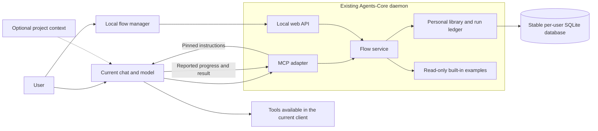

# Personal flows across MCP clients

Status: proposed design, not implemented. Date: 2026-09-28; scopes and tracked-flow
editing added 2026-09-29.

## Decision and agreed scope

Create a personal flow library outside every repository, including the
Agents-Core checkout. All clients connected to the user's Agents-Core installation
can discover, create, change and use the same library. The bot executes a flow in
the current conversation. MCP stores definitions, immutable versions and reports
about runs. A repository is optional context for one run; it does not own a flow.

The user explicitly selected execution in the current chat and clarified that
separating personal flows from repositories is the purpose of this change.
A 2026-09-29 extension keeps that personal library and adds two more sources
managed from chat and the editor: flows tracked in a project repository, and the
flows shipped with Agents-Core. Editing a tracked flow must never dirty or switch
the branch a user is working on; see [scopes and git-safe
editing](#scopes-and-git-safe-editing-of-tracked-flows).

This design covers one operating-system user on one machine. Background execution,
scheduling, cross-device synchronization and multi-user collaboration require
separate designs. No server-side LLM or workflow worker is required here.

## Verified starting point

Inspected `main` at `a27ffea` and the separate `codex/mcp-repository-flows`
worktree at `04eaddc`. That flow branch has since merged as #99 and is present in
`main` at `a5b109f`, which also removed persona protocol 1 (#101).

| Area | Existing behavior | Consequence |
|---|---|---|
| Shared daemon | `src/daemon/app.py` serves MCP in one Python process and exposes authenticated health data | Add the web adapter to this process and reuse its runtime |
| Service state | `src/daemon/state.py:state_dir` includes a hash of the installation path | Personal data needs a new stable location independent of this function |
| Workspace | `src/daemon/workspaces.py` resolves explicit workspace identities; HTTP never uses cwd as a fallback | Library operations require no workspace; runs request one only when needed |
| Installed flows (#99) | `src/flows.py` reads Markdown from `INSTALL_ROOT/flows`; `list_flows` and `run_flow` expose it | Retain the execution handoff; introduce personal and repository providers |
| Existing handoff | `run_flow` returns `needs_execution`, content and its SHA-256; the client model executes | Extend with a pinned saved version and a run identity |
| Existing telemetry | `src/server.py:log_interaction` writes project history and optional Langfuse; attribution is client-reported | Add a dedicated global run ledger |
| Project history | `src/memory/history.py` deduplicates by content and rotates the current history file | It cannot provide reliable counts of distinct flow runs |

Relevant maintained references: [daemon operations](shared-mcp-daemon.md),
[routing](routing_flow.md), [repository flows](../flows/README.md), and
[telemetry](../evals/telemetry/README.md).

## User experience

### Create and modify through conversation

1. The user asks the bot to save a repeatable process, or describes a new one.
2. The bot extracts the purpose, inputs, instructions, expected result and checks.
   It asks only for missing information that changes the process.
3. The bot saves a validated draft and shows the resulting definition or a concise
   summary. It does not copy the entire conversation into the definition.
4. If the request already authorizes making this definition usable, the bot
   publishes it in the same interaction. A request to explore or draft leaves it
   as a draft. No mandatory second approval is added to an authorized edit.
5. Later edits load the current version, save the changed draft and publish a new
   version under the same identity. The response names the saved version and
   explains what changed.

Examples: “Save our release review process as a personal flow”; “Add a documentation
check to release review”; “Restore version 2”; “Use release review for this project”.
Flow content can use the user's language; repository documentation stays in English.

### Local management interface

| View | Useful content and actions |
|---|---|
| My flows | Search, tags, purpose, published version, draft indicator, last changed; create, duplicate and archive |
| Flow editor | Structured inputs, Markdown instructions, preview, validation, version history, diff, publish and restore |
| Runs | Flow/version, last reported state, time, optional project/client, outcome and artifact references |
| Overview | Usage, known outcomes, missing reports, completion time and recurring blockers; period and sample sizes |

Default to the personal library. Built-in examples are a separate optional view.
An import creates an independent personal copy with provenance. Updating
Agents-Core or the source repository cannot change that copy.

The UI's “Use in chat” action copies a complete invocation with the canonical
flow ID and selected version. Opening a particular client is optional only after
its deep-link support is verified. Clicking this action does not create a run or
pretend to launch a worker. Reading, previewing and editing also create no runs.

## Architecture



Both adapters call the same validation, versioning and run-reporting service.
HTTP handlers do not invoke the MCP protocol internally, and the browser does not
talk directly to the database. Definitions are loaded on demand; no new flow is
registered as an individual MCP tool. The tool catalog remains stable when the
user creates or edits a flow.

MCP prompts can expose a generic `flow` entry point where supported, but ordinary
tools remain the portable chat interface. Prompts are intended for user selection
and clients choose their presentation; a universal slash-command UI is not a
protocol guarantee. See the [MCP prompt specification](https://modelcontextprotocol.io/specification/2025-11-25/server/prompts).

### Personal storage and ownership

Proposed macOS default:

```text
~/Library/Application Support/Agents-Core/user-data/
  flows.sqlite3
  backups/
```

This path has no repository or installation hash. A proposed `AGENTS_USER_DATA_DIR`
setting selects another local directory and must be persisted into the daemon's
configuration. A portable resolver can use the platform's user-data directory;
the existing daemon remains macOS-specific. Development and tests must always
select an isolated temporary library. Never open the real library during tests.

SQLite is the authoritative store for definitions, versions and run events.
Markdown plus metadata is the import/export format. Keeping both a writable
Markdown tree and a database authoritative would introduce avoidable conflicts.
The SQLite approach gives up direct text-file editing in exchange for transactional
publication, conflict handling and consistent statistics.

Use private directory/file permissions, parameterized statements, foreign keys,
short write transactions and a bounded busy timeout. WAL supports concurrent
readers with serialized writers; the store must remain on a local filesystem.
Use the [SQLite backup API](https://www.sqlite.org/backup.html) for live backups,
including changes still in WAL, rather than copying only the main file.
[SQLite's WAL documentation](https://www.sqlite.org/wal.html) explains the
concurrency and filesystem constraints.

All clients for one user share this library; workspace IDs are context, not an
authorization boundary between applications using that user's MCP credentials.
Multiple installations may intentionally point to the same library. A library-wide
schema lease permits normal compatible access and requires exclusive maintenance
for migration. An incompatible old process refuses writes. Code rollback must not
silently restore an older database over newer user changes.

Uninstall and installation-directory moves retain personal data. Export, backup,
restore and explicit deletion act on personal data separately from service state.
Schema migrations are versioned, backed up and recoverable; initialization never
silently replaces an unreadable or newer-schema database with an empty one.

### Definitions and versions

Proposed entities:

| Entity | Essential fields |
|---|---|
| `flows` | UUID, unique personal slug, lifecycle state, published version ID, metadata revision, timestamps |
| `flow_drafts` | Flow UUID, draft revision, base published version, validated definition, updated time |
| `flow_versions` | Immutable version ID and sequence number, flow UUID, definition, SHA-256, change summary, provenance, created time |
| `flow_runs` | Run UUID, flow/version snapshot, execution mode, optional context, state, report sequence, issued/started/finished times |
| `flow_run_events` | Run UUID, unique event UUID, sequence, received time, optional client time, type and bounded payload |
| `flow_mutations` | Idempotency key, operation, request digest and stored result |

A version contains title, purpose, tags, typed inputs, `instructions_md`, optional
named checkpoints, expected outputs, completion criteria and `requires_workspace`.
Supported input types are a documented limited set such as string, boolean,
number and enum. This is an instruction document, with no executable expressions
or server-side graph language. Input values are returned separately from the
instructions; the server never evaluates templates, commands or embedded code.

Checkpoints have stable IDs when step-level reporting is useful. They annotate
the instructions without duplicating every instruction in a second structure.
Capability prerequisites describe what a client needs, but do not grant access
to tools. The client checks its own available tools before work; MCP cannot inspect
the host's complete tool inventory. It can report a preflight blocker without
claiming that execution started.

Default maximum definition size: 256 KiB, preserving the current flow branch's
content bound. Validate lengths, supported fields, types, duplicate checkpoint
IDs, empty instructions and required inputs. Return field-specific errors.
Parsing must not execute arbitrary YAML constructors or follow filesystem paths.

Personal identity is `user:<UUID>`; a unique slug such as `user:release-review`
is a lookup alias. Built-ins use `builtin:<slug>`. Never silently shadow a built-in
with a personal flow. Existing bare built-in names remain accepted by the existing
API for compatibility, along with `ID.md` and `flows/ID.md`. Preserve the optional
`request=""` and the installed-catalog response for `list_flows()` with no
arguments. Personal discovery selects `source="user"` explicitly; the UI does
that by default. New UI and chat examples use qualified identities.

### Drafts, publication and concurrency

- Saving a draft requires its expected draft revision. A new flow receives its
  identity and first draft in one transaction.
- Publication requires the expected draft revision and expected published head.
  It inserts an immutable version, advances the head and records the mutation
  result in one transaction. Publishing identical content can return `unchanged`.
- A concurrent edit returns a conflict with current identities and a recoverable
  diff. It never overwrites the other client's changes silently.
- Every mutation includes a caller-generated `mutation_id`. Repeating the same
  operation and body returns the saved result; reusing the key with different
  content fails. Return an operation receipt that can be read after uncertainty.
  Stored results follow the input-retention policy: receipts never retain secret
  values, the unfiltered request text or otherwise excluded inputs. Secrets remain
  in the executing client and are not submitted as MCP flow input values.
  Apply this policy to exports, debug and telemetry too. Fingerprints cover a
  documented safe request representation; excluded values are never recoverable
  from a receipt and a replay does not attest to their equality. A client changing
  those values intentionally starts a fresh invocation rather than reusing its ID.
- Keep mutation receipts while the owning flow/run exists. After an explicit
  purge or an unavailable receipt, clients must read current state before retrying;
  the contract does not promise deduplication after deleted history.
- Restore copies an old definition into a new draft and publishes a new version.
  It preserves the intervening history and records `restored_from`.
- Archive prevents new normal invocations and keeps versions and existing runs.
  Unarchive is reversible. Permanent erasure is a separate explicit data action.

Draft editing uses the published base recorded when the draft was opened. If
another client publishes meanwhile, the user or bot merges against the new head.
Single shared draft per flow is sufficient initially; conflicting clients receive
their unsaved candidate back rather than needing a collaboration engine.

### References and optional project context

User flows must be usable without `INSTALL_ROOT`, Git, a workspace registration
or a source checkout. No relative link implicitly resolves against the library
directory. Allowed references declare their meaning: a public URL, a named user
input, or a path relative to an explicitly selected run workspace. Local paths are
data for the executing client; flow APIs never fetch or execute them automatically.

Import from a built-in or repository file is an explicit copy operation. It records
source information and detects local links. Required source instructions must be
made self-contained, converted to explicit inputs, or reported as unresolved before
publication. The import does not preserve hidden dependencies on the source checkout.
Archive imports accept bounded plain definitions; arbitrary archives and recursive
dependency downloads are outside the first release.

Global library CRUD and non-project runs work with no `X-Agents-Workspace` header.
If a flow requires a project, the HTTP request uses the existing registered
workspace, and explicit target paths remain confined to it. A supplied invalid
workspace is an error rather than a silent fallback. For other runs, no cwd or
installation directory is inferred. A run can carry an optional project label,
which is clearly distinguished from a validated workspace identity.

## Scopes and git-safe editing of tracked flows

### Three sources, one catalog

| Source | Identity | Where the definition lives | Who can change it |
|---|---|---|---|
| Agent (personal) | `user:<slug>` | Personal SQLite library | The user, from any client or the editor |
| Repository | `repo:<slug>` | `<repo>/.agents/flows/<slug>.md`, tracked in that repository | Whoever can commit there; locally through an overlay |
| Built-in | `builtin:<slug>` | `INSTALL_ROOT/flows/<slug>.md`, tracked in the Agents-Core checkout | Agents-Core maintainers; locally through an overlay |

"Agent level" in chat means the personal library: it follows the user into every
project and client. "Repository level" means flows committed with a project, so
everyone who clones it gets them. A personal flow can also carry an optional
repository binding (the normalized `origin` URL, or the workspace UUID when there
is no remote). The binding only filters and ranks the list for that project; it
is not an ownership boundary and does not put the flow into the repository.

`repo:` uses `.agents/flows/` rather than a top-level `flows/`, so a project's own
unrelated `flows/` directory is never read as instructions. Reading it needs a
resolved workspace, the same one `run_flow` already requires; its path confinement
and 256 KiB limit apply. Repository flows are shown only for that workspace.

`list_flows(scope=...)` accepts `all`, `user`, `repo` and `builtin`; the existing
no-argument call keeps returning the installed catalog. Every entry reports its
qualified identity, source, revision and whether a local overlay is active.
Qualified names never shadow each other. A bare name keeps its current meaning
(`builtin:`) for compatibility; a bare name that also exists in another scope
returns `flow_ambiguous` with the candidates rather than guessing.

### Chat management

| User says | Operation |
|---|---|
| "Save this as my flow" / "for all projects" | Draft and publish `user:<slug>` |
| "Save this flow for this repository only" | `user:<slug>` with a repository binding |
| "Add a flow to this repository for the team" | Proposal branch with `.agents/flows/<slug>.md` (see below) |
| "Change pr-review for me" | Overlay on `builtin:pr-review` |
| "Change pr-review in Agents-Core itself" | Overlay plus a proposal branch in the Agents-Core checkout |
| "Show my flows here" | `list_flows(scope="all")` in the current workspace |

The model states the scope it chose in its reply. When the request does not
determine the scope and the choice changes who sees the flow, it asks once.

### Why tracked files are not edited in place

A tracked flow file sits in a working tree that the user is using for something
else. Writing it from chat or the browser would:

- leave uncommitted changes on whatever branch is checked out, which then ride
  into an unrelated commit or block `git pull` and `git checkout`;
- race with the user's own edits and with other sessions sharing that checkout;
- for built-ins, change the running installation, because the daemon reads
  `INSTALL_ROOT/flows` directly;
- be lost or conflict on the next installation update.

The server therefore never writes into a checked-out working tree. Tracked flows
change in two separate, explicit ways.

### Local overlay (default)

Editing a `repo:` or `builtin:` flow creates an overlay in the personal library:

| Field | Meaning |
|---|---|
| `target` | Qualified identity, plus the repository identity for `repo:` |
| `base_revision` | SHA-256 of the tracked file the edit started from |
| `definition`, versions | Same draft/publish/restore rules as personal flows |
| `state` | `active`, `paused`, `upstreamed` or `discarded` |

While an overlay is `active`, `run_flow` returns its pinned version with
`source="overlay"`, the target and `base_revision`. Git sees nothing: no file,
branch or index changes. Pausing or discarding it restores the tracked version
immediately.

When the tracked file changes (a pull, an Agents-Core update), its revision no
longer matches `base_revision`. The overlay keeps working, but the response and
the editor mark it `upstream_changed` and offer a three-way view: base, current
upstream, overlay. "Rebase" produces a new overlay draft against the new upstream;
conflicts are shown, never auto-resolved. When the upstream content becomes
identical to the overlay, the overlay turns `upstreamed` and stops taking effect.

### Proposal branch (explicit)

"Change it in the repository" means preparing a commit that others can review.
The server does it without touching the user's checkout:

1. Require a registered workspace (for `repo:`) or the installation checkout (for
   `builtin:`), a clean `git` executable and a resolvable default branch.
2. `git fetch` the default branch's remote, then create a temporary worktree under
   the service state directory: `git worktree add --no-track -b
   flows/<slug>-<yyyymmdd>-<short-id> <path> <remote>/<default>`. The explicit
   `--no-track` follows the user's rule that a feature branch must not track
   another branch's upstream.
3. Refuse when the target file in that fresh base differs from the overlay's
   `base_revision`; return a conflict so the user rebases the overlay first.
4. Write only `.agents/flows/<slug>.md` (or `flows/<slug>.md` for Agents-Core),
   commit with the repository's configured author identity and a generated
   message, and remove the temporary worktree. The branch stays.
5. Return the branch name and commit. Pushing and opening a PR are separate,
   explicit steps done by the chat model with the user's own tools and
   permissions; the server never pushes.

Keep the overlay active until that change reaches the default branch, then it
becomes `upstreamed`. The user keeps the improved flow in the meantime, and the
proposal branch carries it to everyone else.

Failure behavior: a missing `git`, no remote, a detached or unborn default branch,
or a locked worktree each return a specific error and leave no partial branch.
Never run `stash`, `reset`, `checkout` or `clean` in the user's working tree.
Branch names are validated and generated, never taken verbatim from chat text.

### Editor

The same views serve all three sources, with source badges and filters:

- Personal flows: full editing.
- Tracked flows: read-only upstream text, an "Edit locally" action that creates an
  overlay, and "Propose to repository" when an overlay exists.
- Overlays: diff against upstream, `upstream_changed` warning, rebase, pause and
  discard.
- A tracked flow's history is its git log for that file (read-only); overlay and
  personal histories come from the library.

## Proposed MCP and web contracts

All names and paths in this section are proposals. `list_flows` and `run_flow`
already exist only on the inspected flow branch; extend them compatibly.

| MCP operation | Responsibility |
|---|---|
| `list_flows(scope, query, tags, cursor)` | Summaries, qualified identity, overlay state; bounded pages; valid entries plus per-entry issues |
| `get_flow(flow, version, view)` | Published definition, selected saved version or current draft; optional version history |
| `save_flow_draft(flow?, definition, expected_draft_revision, mutation_id)` | Create or update a validated draft |
| `publish_flow(flow, expected_draft_revision, expected_head, mutation_id)` | Publish atomically |
| `set_flow_archived(flow, archived, expected_metadata_revision, mutation_id)` | Archive or unarchive |
| `set_flow_overlay(target, state, expected_metadata_revision, mutation_id)` | Create, pause, resume, rebase or discard an overlay on a tracked flow |
| `propose_flow_change(target, overlay_version, mutation_id)` | Create a local proposal branch and commit; never pushes |
| `run_flow(flow, request, repo_path?, version?, inputs?, invocation_id?)` | Return pinned instructions and, for tracked invocations, a run receipt |
| `report_flow_run(run_id, event_id, expected_sequence, event)` | Record start, checkpoint, waiting/resume or terminal report |
| `get_flow_run(run_id)` | Restore a receipt, snapshot and current reported progress |
| `list_flow_runs(filters, cursor)` | Paginated run history |
| `get_flow_metrics(period, filters)` | Aggregates with denominators and coverage |

A version restore uses `get_flow` plus draft/publication operations; duplication
uses the same create path. Import/export adapters normalize through the same
schema. A read-only mutation receipt lookup is exposed through the relevant
mutation tool's documented recovery mode or a small dedicated operation;
its exact schema is resolved during implementation.

For backward compatibility, an old built-in `run_flow` call without an invocation
ID retains its current read-only handoff semantics. New tracked calls require an
invocation ID before mutation. Personal calls without one return a recoverable
validation error. Update tool annotations because tracking is a side effect.
Preserve existing response fields and `needs_execution`; do not count legacy
handoffs as observed runs. The UI shows that run coverage begins with tracking.

Web endpoints under `/api/flows/v1` map to those same operations: flows, drafts,
versions, runs, run events and metrics. Use ETags/`If-Match` or equivalent revision
fields for browser concurrency, and the same idempotency keys as MCP. Errors have
`code`, `message`, `details` and correlation ID; conflict, invalid input, unavailable
workspace, archived flow and busy storage are distinct outcomes.

Client guidance belongs in tool descriptions and the existing routing instruction
templates. Creation is explicit user intent; semantic suggestions may show a flow
but never silently execute it. Flow use preserves the active conversation,
permissions and higher-priority instructions; it does not replace the persona.

### Run reporting contract

1. Validate identity, selected version, inputs and required workspace. Atomically
   record an `issued` run and immutable snapshot; return both with `needs_execution`.
   The same invocation ID resolves to the same run, not a new execution. Recovery
   returns its safe receipt and pinned definition. Nonpersisted input values are
   omitted and identified by `missing_input_fields` and `reinput_required`; the
   client obtains them again before continuing. Exact replay of discarded input
   values is not promised.
2. The client reports `started` before carrying out the task. Server state becomes
   `running`; this is still a client claim, not execution verification.
3. The client can report checkpoints, `waiting_user`, `blocked`, and `resumed`.
   It continues using the pinned snapshot even if the library changes.
4. It reports `completed`, `failed` or `cancelled` with a short result and artifact
   references. Server state records the report and returns an acknowledgement.
5. After a disconnect, read the run and receipt before sending another event or
   executing a step again. State reporting does not make external side effects
   exactly-once. The client must inspect the actual external result before retrying.

Allowed transitions: `issued → running → waiting_user|blocked → running`, and
`running|waiting_user|blocked → completed|failed|cancelled`. `issued → blocked`
records a preflight blocker without `started_at`; its first actual start is a
`started` event, while a post-start continuation uses `resumed`. `issued → cancelled`
is also allowed. Completion requires a recorded start. A pre-start blocked run
that is cancelled or fails remains outside started-run metrics and appears in
the preflight outcomes. Terminal records are closed; corrections are explicit audit
events, and a fresh execution has a fresh run ID. Event IDs deduplicate delivery;
sequence checks reject conflicting/out-of-order progress. Checkpoints identify an
attempt so an actual retry is distinct from a duplicate report.

The absence of a terminal event never means failure. `stale` is a display flag
based on elapsed time since the last event, with a proposed default of 24 hours;
it is not a terminal state. Show the last update time, allow late reporting, and
do not infer a failure when a user is waiting or a laptop sleeps. A never-started
issued run is shown separately from a started run without a final report.

Client/conversation labels are optional, bounded and unverified unless an adapter
provides a trusted identity. Store `source=client_reported` on execution claims.
Server receipt times are authoritative receipt times; optional client timestamps
must not overwrite them. A snapshot records the exact body, content hash and
version given to that run; body deletion follows explicit retention/purge policy.

## Useful metrics

Use a cohort of runs whose start was reported in the selected period, evaluated
at the displayed observation time. Show count, filters, timezone and data coverage.
Issued-but-never-started runs have their own count. Missing data displays as
unavailable, not as zero.

| Metric | Definition and interpretation |
|---|---|
| Registered starts | Distinct runs with a start report, grouped by flow/version |
| Completed share | `completed / all_started`; show ongoing and unknown outcomes alongside |
| Success among known outcomes | `completed / (completed + failed)`; show numerator, denominator and cancellations |
| Reporting coverage | `(completed + failed + cancelled) / all_started` |
| Waiting and missing reports | Counts by last reported state and time since last update; stale is an overlapping flag |
| Time to reported completion | p50/p90 of server start-to-finish receipt time for completed runs; includes waiting and reporting delay |
| Recurring blockers | Reported failure categories and checkpoint failures per recorded attempts; show reporting coverage |
| User feedback | Optional positive ratings / submitted ratings, plus rating coverage |

For example, 18 completed, 2 failed, 2 cancelled and 7 nonterminal runs make
29 starts. Of the 7 nonterminal runs, 4 are stale and 3 have recent updates.
Known-outcome success is 18/20; reporting coverage is 22/29. This is an
illustrative dataset, not a measurement from the repository.

MCP cannot independently observe all host tool calls, model usage, costs or result
quality. Do not derive those from `log_interaction` duration or response length.
Optional future client/provider integration may supply usage with provenance and
coverage. Version comparisons show sample sizes and context differences; a change
in the dashboard alone is not causal evidence that a flow improved.

Use a separate compact service panel for existing daemon readiness, uptime,
inflight work and queues. Do not mix those measurements with flow outcomes.
Langfuse can receive optional exports; local library and run metrics work without it.

Proposed retention: versions until explicit deletion, detailed event payloads for
90 days after receipt, run summaries for one year after the last accepted event.
Nonterminal runs obey that same inactivity horizon; expiry removes stored history
without inventing a terminal outcome. Coverage explicitly excludes expired runs.
Preserve minimal event receipts (event ID, safe digest, sequence and acknowledgement)
and a pinned snapshot while the run summary is retained, so retries after detailed
payload expiry cannot apply an old event again. After summary expiry a report
returns `run_expired` or `run_not_found`, never recreates the run implicitly.
Keep coarse completed-state/duration facts needed for summary metrics;
step detail becomes unavailable after event expiry. Show the earliest available
coverage date and exact retention policy. Prune in bounded transactions. Do not
store full conversations, full outputs or secret input values by default. Persist
only explicitly allowed input fields, short reports and user-selected artifact
references; snapshots of input values apply that same policy.

## Local web delivery and access

Serve packaged static assets at `http://127.0.0.1:<daemon-port>/ui`; the current
default port is 8765. Use the existing Starlette application and a small browser
interface with no separate development server in normal operation. A lightweight
frontend is sufficient for the initial editor; add a framework only if the editor
and navigation complexity justify its maintenance and build dependencies.

The current `Service.__call__` checks a bearer token before dispatching every
path. Adding a browser page requires explicit routing/authentication changes:

- Keep MCP and service administration on their current bearer authentication.
- Add a proposed local CLI entry `python -m src.daemon flows ui` that opens the
  page with a short-lived one-use bootstrap code in the URL fragment. It does not
  expose the daemon's bearer token to browser storage or URL query logs.
- Exchange that code for an HttpOnly, SameSite=Strict browser session. Use an
  explicit Origin/Host allowlist, CSRF checks for mutations and session expiry.
  A proposed session policy is 30 minutes idle and eight hours maximum.
- Browser sessions authorize only the flow UI API. They cannot call `/mcp`,
  drain, token rotation, service update or other administrative endpoints.
- The static shell contains no private data. Serve sensitive API responses with
  `Cache-Control: no-store`; render Markdown without raw active HTML; use a
  restrictive CSP and no external runtime assets or permissive CORS.

Loopback alone does not replace authentication or origin validation. The
[MCP transport specification](https://modelcontextprotocol.io/specification/2025-11-25/basic/transports)
requires Origin validation for its HTTP transport and recommends local binding
and authentication. Apply equivalent explicit protections to the new browser API.

Web mutations participate in existing admission, job accounting and drain.
Drain waits for accepted writes and returns a clear retryable result to new work.
An open editor retains its unsaved draft on an error. Dashboard polling occurs
only while visible; passive reads should not prevent the daemon's idle update
policy. Active writes count as activity. The browser reconnects after a restart
and revalidates revisions before publishing.

## Capacity assumptions and failure behavior

Planning assumptions, not measured limits: one user, up to 20 connected clients,
1,000 flows, 20 saved versions per flow, typical definition size 8 KiB, 100 runs/day
and 20 events/run at about 1 KiB/event. Definition data is approximately
1,000 × 20 × 8 KiB = 156 MiB. Ninety days of events is about 176 MiB. One year of
4 KiB run summaries is about 143 MiB, plus about 285 MiB if each summary keeps an
8 KiB snapshot independently. Indexes, WAL and backups need additional space;
allow a few GiB rather than treating raw payload size as the disk bound.

That workload averages about 0.02 event writes/second, with brief concurrent
bursts. It suggests a local transactional store is adequate; confirm against
actual payloads. Initial targets on the development machine: p95 ordinary reads
under 100 ms, saves under 250 ms, and a 90-day overview under 500 ms after warmup,
excluding model generation and client execution. These are proposed acceptance
targets, not existing benchmarks. Index flow, version, run start time and event
sequence; add daily rollups only if measured query cost needs them.

| Failure | Required behavior |
|---|---|
| Chat and browser edit together | Revision conflict; preserve both candidates and show a diff |
| Response lost after a save | Read/replay the same mutation receipt; no extra version |
| New version published during a run | Existing run keeps its exact snapshot |
| Chat closes without reporting | Display last reported state and unknown outcome |
| Storage full, busy or corrupt | Clear error; no reported success or empty replacement library |
| Personal store unavailable | Existing routing/personas and available built-ins remain usable |
| Source repository disappears | Imported personal definition remains available and self-contained |
| Daemon restarts or is upgraded | Library survives; accepted writes follow drain; schema compatibility is checked |
| Old and new installations share data | Global migration lease and schema guards prevent incompatible writes |
| Flow mentions unsupported tools | Client reports blocked; no fabricated completion |

## Delivery plan and acceptance

### 1. Personal library and chat authoring

Implement a stable data-path resolver, typed schema, SQLite repository, drafts,
versions, archive, import/export and recovery receipts. Add MCP tools and preserve
the existing flow branch's handoff contract. Include minimal personal run issuance,
invocation receipts and pinned snapshot persistence so personal flows can already
be used. Proposed modules: `src/user_flows/`
for storage/service/schema and a thin adapter in `src/server.py`.

Acceptance: create in one MCP client without a workspace, discover and edit in
another; use outside a Git project; concurrent edits do not lose changes; moving
or updating the installation leaves the library intact. Import a source flow,
remove the source checkout and successfully retrieve its independent definition.

### 2. Run history and honest metrics

Extend the run receipts with progress events and terminal reports.
Implement metrics and retention on the dedicated ledger. Update client-facing
instructions and examples for start/finish reporting and interrupted-run recovery.

Acceptance: duplicate delivery counts once; repeated real executions count twice;
running versions stay pinned; legacy handoffs and missing reports do not inflate
success. Fixed fixture data produces the documented denominators. Test disconnects,
late reports, out-of-order events and retention boundaries.

### 3. Repository flows and overlays

Add the `repo:` provider for `.agents/flows/`, scoped listing, `flow_ambiguous`,
overlays with base revisions and rebase, and `propose_flow_change` for both
repository and built-in flows.

Acceptance: an overlay changes `run_flow` output while `git status` in the
target checkout stays clean; an upstream change marks the overlay and rebase
preserves it; a proposal creates one commit on a new untracked branch from the
fresh default branch, without changing the current branch, index or working tree;
a stale base is refused; a failure leaves no partial branch or worktree.

### 4. Local manager

Add packaged UI assets, a thin web API and browser-session bootstrap. Include the
library/editor/history/overview views and “Use in chat”. Use the same service and
revision rules as MCP. Add UI routing and admission changes in `src/daemon/app.py`;
extend the local controller entry points for opening the manager.

Acceptance: create in chat and edit in the browser, then retrieve the new version
from another client; show a conflict when both edit; browser sessions cannot call
service administration; test origin/CSRF/XSS boundaries, draft recovery, mobile
widths and restart/drain behavior. No second embedding process is started.

### Cross-cutting checks and documentation

Use fast storage/service/ASGI tests with isolated personal directories. Reuse the
flow branch's confinement, freshness and handoff tests; revise any assertion that
all runs require a project. No embedding model is needed for library CRUD tests.
Run one real multi-client smoke test and only one heavy model process at a time.
Add backup/restore and schema-migration failure tests before enabling migrations.

Document the personal path, lifecycle, contracts, retained data, recovery and
installation independence in README and a maintained reference. Update the
routing template, then regenerate managed instructions through
the repository helper. Do not turn this design document into a reusable task flow
or modify live client configurations as part of design work.

## Choices and trade-offs

| Choice | Benefit | Cost / alternative |
|---|---|---|
| Stable personal library outside repositories | Works across projects and survives checkout moves | Backup/sync need explicit personal-data operations |
| SQLite canonical store with portable exports | Atomic versions, receipts and run queries | Direct file edits require import; Markdown-only storage is simpler but weak for concurrent edits and metrics |
| Existing daemon plus a small UI | One installation and runtime to operate | UI needs carefully separated browser access and admission accounting |
| Client execution and reported progress | Reuses the current model, tools and permissions | Completion and tool usage are not independently observable |
| Structured inputs plus Markdown instructions | Easy chat authoring and readable diffs | Complex branching remains prose; executable graphs need a future runner |
| Explicit use and independent imports | Predictable behavior and ownership | Users choose when to copy improvements from built-ins |
| Overlays and proposal branches for tracked flows | The user's checkout and branch stay untouched; changes reach others through review | Two places to look (overlay vs upstream) and an explicit rebase when upstream moves; editing files in place is simpler but dirties branches |

The first useful milestone is a personal flow created in one chat, changed in a
second client and executed in a third without any repository owning its definition.
