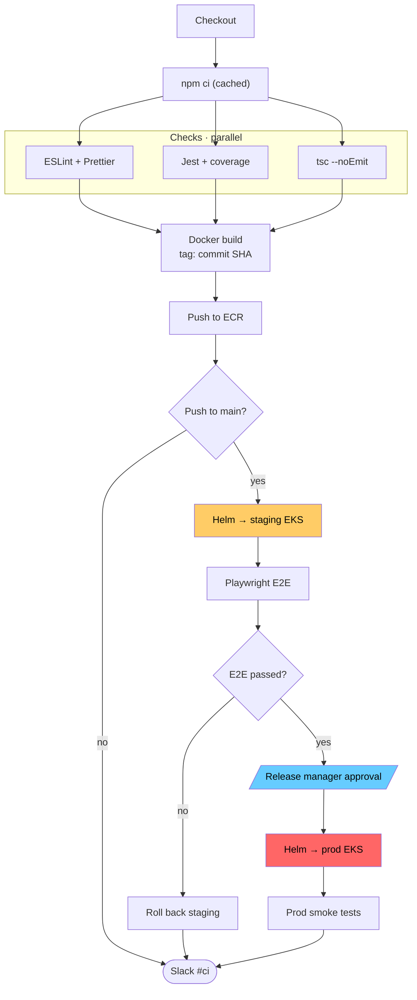

Here is the cleaned-up diagram:

What changed:
- **Short labels.** Each box now holds 2 to 4 words, which fixes the huge boxes. The detail that matters (SHA tag, npm cache, Helm, EKS) stays in.
- **`flowchart TD` with an explicit direction.** Your original used a bare `graph` with no direction.
- **The three checks sit side by side in a subgraph,** so the fan-out and fan-in draw as clean parallel lines.
- **Slack is declared last.** It's a single shared end node, so it lands at the bottom and the three arrows into it stop cutting across the deploy path. This removes most of the crossings.
- **Same colours, now in `classDef`s,** plus `color:#000` so the text stays readable in GitHub dark mode. Manual approval is drawn as a parallelogram to mark it as a human step.

The logic is unchanged: 18 nodes, the same edges, the same yes/no branches, and one Slack node fed from three places.

Two gaps in the pipeline itself that the diagram now makes easier to see. I've left both as they are:
- Nothing handles a failed lint, test, type check, build or push. In practice the job just fails, but no Slack message appears on those paths.
- If the production smoke tests fail, there's no rollback. The flow goes straight to Slack, just as it does when they pass. Staging has a rollback and production doesn't. If that isn't intended, add a `smokeOk{Smoke passed?}` decision with a `Roll back prod` branch.
