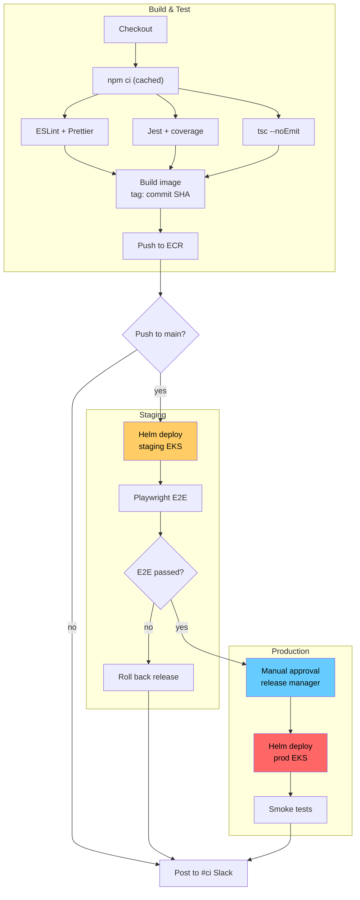

Here's the cleaned-up diagram:

What changed:
- **Set a direction (`graph TD`).** The original had just `graph`, so the renderer picked the layout. That's a big reason the arrows crossed everywhere.
- **Shortened the labels to 1–4 words.** Long sentences are what made the boxes so big. Where a detail matters (SHA tag, which cluster), I kept it on a second line with ` `.
- **Grouped the steps into three subgraphs:** Build & Test, Staging and Production. Each stage now reads as one block, and the happy path runs straight down.
- **Put the Slack node last.** It receives three arrows (not main, rollback, smoke tests), so placing it at the bottom keeps those arrows from crossing the rest.
- **Kept your colors and added `color:#000`.** Black text stays readable on the colored boxes in GitHub's dark theme.

Every node, edge and branch from the original is still there. Only the IDs and label wording changed.

Two things the original diagram doesn't show, which I left as they were:
- The Slack node is a single "post a message" step on three different paths: success, not-main and rollback. Its old ID (`notify_slack_failure_or_done`) suggests you meant to send different messages for failure and success. If so, it might be worth splitting it into two nodes.
- Lint, test, type-check and smoke-test failures have no edge. The pipeline presumably just stops there. If those failures also post to Slack, the diagram currently hides that.
