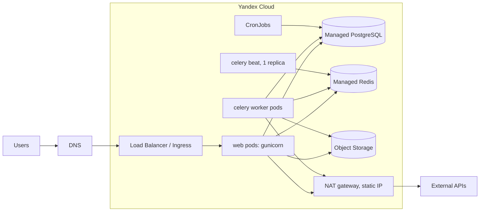

## Коротко

Переезд реально уложить в 30 минут простоя, но только если выполнить три условия:

1. **Файлы (S3) убрать из критического пути.** 300 ГБ копируются заранее и досинхронизируются инкрементально. В ночь переезда остаётся только короткий финальный `sync`.
2. **Redis не переносить, а «осушить».** Кэш стартует пустым, очередь Celery дорабатывается до нуля перед остановкой.
3. **Единственное, что реально съедает окно, это Postgres 40 ГБ.** Время `pg_dump | pg_restore` нужно **измерить на двух генеральных репетициях**, а не прикидывать. Если оно не влезает в ~20 минут, план меняется заранее, а не в ночь переезда.

И про сроки. 15 ноября 2026 — воскресенье, поэтому ночь 14→15 ноября — последнее допустимое окно, и ставить на неё основной переезд нельзя. Предлагаю так: **боевой переезд в ночь 7→8 ноября, 14→15 ноября держать резервом.**

---

## 1. Сначала о Kubernetes, раз девопса нет

Здесь нужно возразить до начала работ. Managed Kubernetes для трёх бэкендеров без опыта эксплуатации — это самый большой *организационный* риск всего проекта, больше, чем база. Ingress, сертификаты, секреты, NAT, requests/limits, логи и rollout-стратегии придётся освоить за 7 недель параллельно с переездом.

| Вариант | Плюсы | Минусы | Когда подходит |
|---|---|---|---|
| **Managed Kubernetes** | Стандарт, автоскейлинг, rolling-деплой, CronJob вместо Heroku Scheduler | Больше всего новых понятий, легко ошибиться в сетях и ingress | Если хотя бы один из вас уже работал с k8s или вы готовы потратить на это 1–2 недели |
| **2–3 VM (Compute) + docker compose + ALB** | Проще всего отладить, ближе к модели «дино = процесс» | Деплой и масштабирование скриптами, ручная работа с ОС | Когда главное — успеть в срок |
| **Serverless Containers** | Почти как Heroku, серверами не управляете | Celery-воркеры с долгими задачами туда плохо ложатся, есть лимиты по времени запроса | Для web-части, воркеры всё равно куда-то ещё |

**Моя рекомендация:** если k8s — осознанное решение, оставляйте его, но в минимальной конфигурации. Один namespace, три `Deployment` (web, worker, beat с `replicas: 1`), `CronJob` вместо Scheduler, простые манифесты + kustomize. Никаких ArgoCD, service mesh или Helm-чартов собственного производства. Если к концу 2-й недели staging в k8s так и не поднялся, это сигнал переключиться на VM и не терять сроки.

---

## 2. Оценки (порядок величин, всё проверить на репетиции)

| Что | Расчёт | Итог |
|---|---|---|
| **Дамп БД** | 40 ГБ «на диске» включают индексы и bloat. Данных в дампе обычно в 2–4 раза меньше, со сжатием ещё меньше, условно 8–15 ГБ | — |
| **Передача** Heroku (AWS) → Yandex Cloud | Межоблачный канал между континентами, реалистично 20–50 МБ/с. 15 ГБ / 20 МБ/с ≈ 12 мин, при 50 МБ/с ≈ 5 мин | 5–15 мин |
| **Restore + индексы** | `pg_restore -j 8`, индексы строятся параллельно. Очень зависит от класса хоста и самых больших таблиц | 10–30 мин ← **главный риск** |
| **ANALYZE** | `vacuumdb --analyze-in-stages`: первая стадия быстрая, этого хватает для старта | 1–3 мин |
| **S3 → Object Storage** | 300 ГБ при 50 МБ/с ≈ 1,7 ч. Реально дольше, если файлов миллионы: упирается в число объектов, а не в объём | часы, **делается заранее** |
| **Egress из AWS** | ~300 ГБ × ~$0.09/ГБ (тариф по памяти, не проверял) | ≈ $30, копейки |

Бюджет окна в 30 минут: ~3 мин на остановку, ≤20 мин на базу, ~5 мин на проверки и DNS, ~2 мин запаса. **Если на репетиции база занимает больше 20 минут, укладываться придётся по-другому** (см. раздел 6).

---

## 3. Целевая архитектура

Что появляется нового по сравнению с Heroku:
- **Container Registry**: образ собирается из Dockerfile вместо buildpack.
- **Lockbox** (или хотя бы k8s Secrets) вместо `heroku config`.
- **Статический исходящий IP** через NAT. На Heroku его не было, и он может понадобиться партнёрам для allowlist.
- **Логи и метрики**: Cloud Logging плюс то, что у вас уже есть (Sentry и т.п.).
- **Пул соединений.** У Managed PostgreSQL, насколько я помню, есть встроенный пулер (Odyssey, порт 6432). Это нужно проверить в документации. Если использовать его в режиме transaction, в Django нужно `DISABLE_SERVER_SIDE_CURSORS = True`, иначе `.iterator()` будет падать на проде.

---

## 4. План по неделям

Каждый шаг заканчивается проверкой. Пока проверка не пройдена, дальше не идём.

### Неделя 1 (28 сен – 4 окт): инвентаризация и контейнеризация
- **Выгрузить всё, что живёт в Heroku:** `heroku config -s`, список add-ons, задачи Heroku Scheduler, log drains, домены и сертификаты, `release`-фаза в Procfile, размеры дино.
- **Проверить базу:**
  - версию Postgres и совпадение с доступными в Yandex;
  - расширения (`\dx`): доступны ли они в Managed PG, включаются ли через консоль;
  - collation/locale;
  - 10 самых больших таблиц и индексов (`pg_total_relation_size`);
  - какие из них append-only (логи, события): это пригодится в плане Б.
- **Проверить, можно ли на Heroku Postgres логическую репликацию.** Насколько я помню, внешним потребителям Heroku роль `REPLICATION` не выдаёт, поэтому Yandex Data Transfer в режиме «копирование + репликация», скорее всего, не заработает. Проверьте сразу, от этого зависит план Б.
- **Написать Dockerfile**: gunicorn, `collectstatic` при сборке, слушать `$PORT` или фиксированный порт.
- **Найти Heroku-специфику в коде:**
  - `SECURE_PROXY_SSL_HEADER`, `ALLOWED_HOSTS`, `CSRF_TRUSTED_ORIGINS`;
  - `dj-database-url`, SSL-параметры Redis (у Heroku Redis `rediss://` с самоподписанным сертификатом);
  - захардкоженные `*.herokuapp.com` и `s3.amazonaws.com`.
- **Проверить, нет ли полных S3-URL в базе** (в полях, в HTML-контенте). Если есть, понадобится миграция данных.
- ✅ Готово, когда образ локально запускается через docker compose с Postgres/Redis и проходят тесты.

### Неделя 2 (5–11 окт): инфраструктура в Yandex Cloud
- VPC, подсети, NAT-шлюз, Managed PG (класс хоста подобрать под текущую нагрузку, лучше на ступень больше), Managed Redis, бакет Object Storage, Registry, кластер k8s (2–3 ноды в разных зонах).
- Описать это в Terraform. Для троих людей это окупится: staging и prod будут одинаковыми, а ночью не будет «а какую галочку мы тогда ставили».
- **Сертификат для боевого домена выпустить заранее через DNS-валидацию** (Certificate Manager или cert-manager с DNS-01). HTTP-01 не сработает, пока домен смотрит на Heroku.
- **Запустить первичную копию S3 → Object Storage** (`rclone sync` с VM в Yandex Cloud, `--transfers 32..64`, `--checkers 64`). Флаги я привожу по памяти, сверьте с `rclone --help`.
- **Сообщить новый исходящий IP** всем партнёрам с IP-allowlist: платёжкам, API и т.д. У них согласование может занять недели.
- ✅ Готово, когда пустое приложение отвечает в staging по HTTPS.

### Неделя 3 (12–18 окт): staging на копии прода + репетиция №1
- Переключить django-storages на Object Storage: `endpoint_url=https://storage.yandexcloud.net`, регион `ru-central1`. Проверить presigned URL, публичные файлы, CORS и политики бакета.
- **Репетиция №1 (выходные 17–18 окт):** настоящий `pg_dump -Fd -j 8` с прод-базы Heroku, restore в staging-PG, **засечь время каждого этапа**. Прогнать приложение, пройтись руками по ключевым сценариям.
- ✅ Готово, когда есть цифры по времени и список всего, что сломалось.

### Неделя 4 (19–25 окт): исправления и нагрузка
- Исправить найденное. Настроить requests/limits, пробы (`readinessProbe` на лёгкий healthcheck-эндпоинт), graceful shutdown gunicorn и Celery.
- Нагрузочный тест staging на уровне текущего пика плюс запас. Проверить число соединений к PG: pods × gunicorn workers × потоки < `max_connections` / лимит пулера.
- Алерты: 5xx, p99 latency, длина очереди Celery, CPU/соединения PG, свободное место на диске PG.
- **За неделю до переезда снизить TTL DNS до 60–300 с.**
- Заморозка: в последнюю неделю не выкатывать миграции схемы.

### Неделя 5 (26 окт – 1 ноя): репетиция №2, полный прогон по runbook
- В ночь 31 окт → 1 ноя, в то же время суток, по тому же скрипту, теми же людьми. Не переключаем только DNS.
- Проверить ещё и откат.
- ✅ Готово, когда весь прогон уложился в ≤25 минут с запасом. Если не уложился, включаем план Б (раздел 6).

### Неделя 6: боевой переезд в ночь 7→8 ноября
- В четверг 5 ноября — go/no-go: все пункты чек-листа закрыты, партнёры подтвердили IP.

### Резерв: ночь 14→15 ноября

---

## 5. Runbook на ночь переезда

**Роли:**
- **A — база**: dump, restore, проверки.
- **B — приложение, k8s и DNS.**
- **C — ведущий**: следит за временем, отмечает пункты, делает smoke-тесты, держит связь с бизнесом. У C нет своих технических задач, и это сознательно.

Команды ниже по памяти. Точный синтаксис зафиксируйте на репетициях и вставьте в runbook дословно.

**T−1 день**
- В Yandex задеплоена финальная версия; web, worker и beat в `replicas: 0`.
- Инкрементальный `rclone sync` уже прошёл, дельта маленькая.
- Сделан свежий бэкап Heroku: `heroku pg:backups:capture`.
- Связь и доступы у всех проверены.

**T−60 мин**
- Финальный `rclone sync`, общий созвон.
- VM для dump/restore в Yandex Cloud запущена, на диске хватает места под дамп.

**T−15 мин**
- Проверить, нет ли в очереди отложенных задач (`eta`/`countdown`). При переключении Redis они потеряются. Либо дождаться их, либо договориться, что они будут перезапущены.

**T+0: стоп на Heroku**
1. `heroku maintenance:on` — пользователи видят страницу обслуживания.
2. Отключить задачи Heroku Scheduler.
3. Дождаться, пока очередь опустеет (`celery inspect active`, длина очереди в Redis = 0), затем `heroku ps:scale worker=0` (и beat, если он отдельно).
4. Проверить, что активных соединений приложения к БД не осталось (`pg_stat_activity`).

**T+3: база (A)**
5. `pg_dump -Fd -j 8 --no-owner --no-acl` с Heroku на диск VM в Yandex.
6. `pg_restore -j 8 --no-owner --no-acl` в Managed PG.
7. `vacuumdb --analyze-in-stages`. Без этого первые запросы после старта могут быть очень медленными: статистика в дамп не попадает.
8. Сверка: число строк в 10–15 ключевых таблицах и max(id) — скриптом, подготовленным заранее, сравнить с Heroku. Проверить sequences: следующий id больше max(id).

**T+20: приложение (B)**
9. `python manage.py showmigrations` или `migrate --check`: несоответствий быть не должно.
10. Масштабировать web, worker и beat (beat строго 1).
11. **Smoke-тесты (C) через новый адрес** (`/etc/hosts` или прямой адрес балансировщика): логин, ключевой сценарий с записью, загрузка и скачивание файла, фоновая задача прошла, письмо или уведомление ушло.

**T+25: go/no-go**
12. Если всё зелёное, переключаем DNS. **Heroku оставляем в maintenance**: клиенты со старым DNS-кэшем увидят страницу обслуживания и не будут писать в старую базу. Это защищает от split-brain.
13. Мониторинг: 5xx, latency, очередь, ошибки в Sentry.

**T+30 … T+2 ч**: дежурство, наблюдение, в том числе за первыми запусками CronJob.

### Откат
- **До переключения DNS (шаг 12)** откат дешёвый: `maintenance:off` на Heroku и вернуть воркеры. Около 2 минут, данные не теряются. Критерии «откатываемся» пропишите заранее: сверка строк не сошлась, smoke-тест упал, restore не закончился к T+22.
- **После открытия трафика** в Yandex появляются новые записи, и откат означает либо потерю этих данных, либо ручной перенос дельты обратно. Поэтому правило такое: **откат разрешён в первые ~30–60 минут и только при критической поломке, дальше чиним на месте.** Решите это заранее вместе с бизнесом, а не в 3 часа ночи.
- Heroku (в maintenance, с базой) не удалять ещё 1–2 недели, финальный бэкап сохранить. AWS S3 не удалять, пока не убедитесь, что в Object Storage есть всё.

---

## 6. План Б, если база не влезает в окно

Вероятнее всего, по моей оценке, узким местом окажется restore и построение индексов на самых больших таблицах. Варианты по возрастанию сложности:

| Вариант | Суть | Цена |
|---|---|---|
| **Больше ресурсов на время переезда** | Мощнее класс хоста PG на ночь, больше `-j`, VM для dump рядом с целевой базой | Деньги, почти без сложности. Пробуйте первым |
| **Почистить базу** | Удалить или архивировать старые логи и сессии (`django_session`!), убрать неиспользуемые индексы | Часто даёт больше всего, стоит сделать в любом случае |
| **Перенести append-only таблицы заранее** | Большие таблицы, где строки только добавляются, копируются за день-два до переезда, в ночь переезда — только хвост `WHERE id > X` | Скрипт и тщательная сверка; риск ошибиться, если строки всё-таки обновляются |
| **Логическая репликация / Data Transfer** | Почти нулевой простой | Скорее всего, Heroku её не позволяет (см. неделю 1) |
| **Попросить у бизнеса окно 60 мин** | — | Честнее, чем сорвать 30 минут |

---

## 7. Pre-mortem: что обычно ломается в такую ночь

Представим, что переезд провалился. Самые вероятные причины и как их отловить заранее:

1. **Restore шёл 50 минут вместо 15.** → Две репетиции с замером, план Б готов до недели 5.
2. **Забыли переменную окружения, add-on или задачу Scheduler.** → Diff `heroku config` с секретами в Yandex, прописанный по пунктам. Каждую задачу Scheduler перенести в CronJob и проверить на staging.
3. **Партнёр режет запросы с нового IP** (платежи, вебхуки). → Статический NAT IP на неделе 2, письменные подтверждения до go/no-go.
4. **Файлы открываются, но не все**: захардкоженные S3-URL, ACL, CORS, presigned-ссылки со старым хостом. → Grep по коду и БД, тест загрузки и скачивания в smoke-наборе.
5. **Кончились соединения к PG** под нагрузкой после старта. → Посчитать соединения, нагрузочный тест, пулер.
6. **Два beat или задачи задвоились / отложенные задачи пропали.** → beat `replicas: 1` со стратегией `Recreate`, отдельная проверка eta-задач.
7. **Сертификат не выпустился или DNS закэширован надолго.** → Сертификат через DNS-валидацию заранее, TTL снизить за неделю.
8. **Ночью всё работало, а утром при нагрузке нет.** → Алерты настроены до переезда, утром в понедельник один человек дежурит.

Если хотите, распишу следующий шаг подробно: k8s-манифесты для web/worker/beat, скрипт сверки базы или точный runbook с командами под вашу конфигурацию. Для этого пришлите версию Postgres, список расширений и 10 самых больших таблиц.
