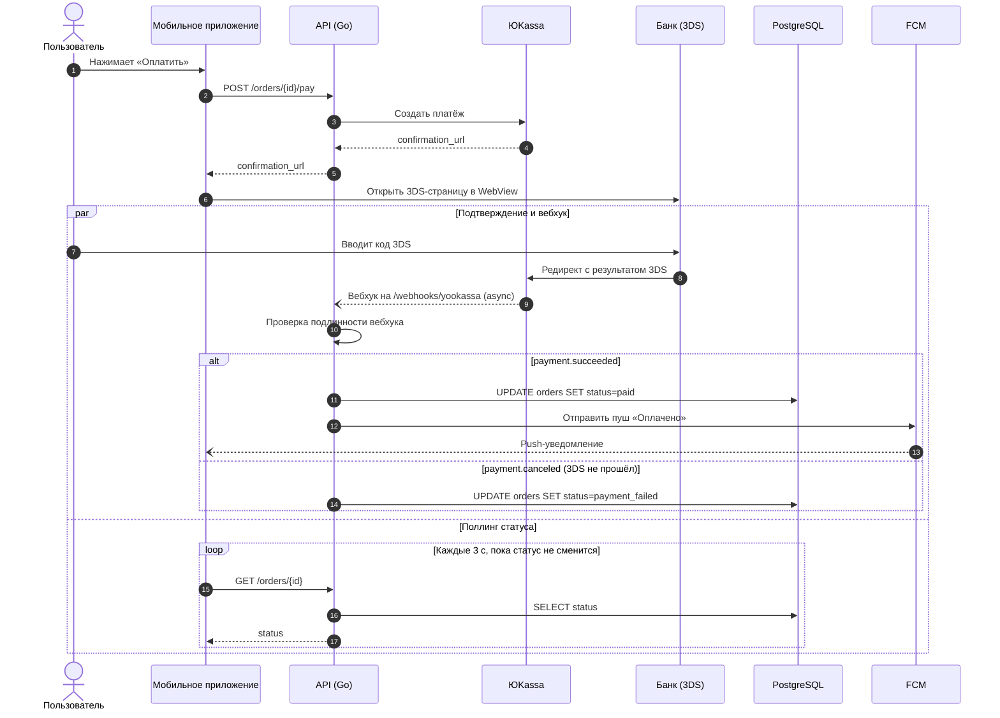

Вот диаграмма последовательности. Для такого процесса она подходит лучше flowchart, потому что видно, кто кому и в каком порядке шлёт запросы, а асинхронный вебхук и поллинг идут параллельно.

Как читать:
- Сплошная стрелка означает синхронный запрос, пунктирная с обычным наконечником (`-->>`) означает ответ, пунктирная с открытым наконечником (`--)`) означает асинхронное событие.
- Блок `par` показывает, что поллинг приложения идёт одновременно с 3DS и вебхуком. Статус в приложении меняется, когда срабатывает первое из двух: ответ поллинга или пуш.

Два замечания:

1. **«Проверяет подпись».** Насколько я помню (не проверял сейчас, лучше свериться с документацией ЮKassa), HMAC-подписи у вебхуков ЮKassa нет. Обычно подлинность проверяют по IP-адресам из их списка или повторным запросом `GET /v3/payments/{payment_id}`. Поэтому в диаграмме написано нейтрально: «Проверка подлинности вебхука». Если у вас в коде реально проверяется что-то конкретное, впишите это вместо общей формулировки. Новичкам полезно видеть точный механизм.
2. **Confluence.** Какую версию Mermaid поддерживает макрос, зависит от плагина. `par`, `alt`, `loop`, `autonumber` и стрелка `--)` появились давно и должны работать в большинстве плагинов. Если диаграмма не отрисуется, сначала уберите `autonumber` и замените `--)` на `-->>`.
