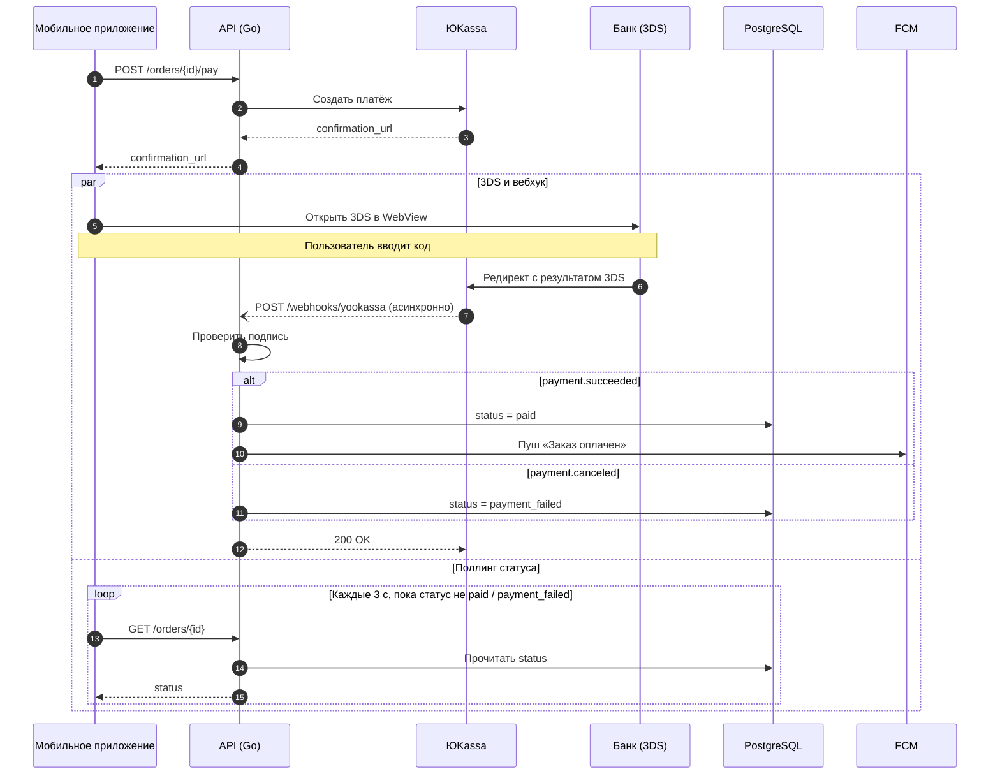

Для такого потока лучше всего подходит sequence-диаграмма: сразу видно, кто кого вызывает, где начинается асинхронная часть и что поллинг идёт одновременно с 3DS.

Как читать диаграмму:
- **Шаги 1–4**: синхронная часть, приложение получает `confirmation_url`.
- **Блок `par`**: две ветки идут одновременно. Сверху пользователь проходит 3DS, а ЮKassa присылает вебхук. Снизу приложение поллит статус заказа.
- **Блок `alt`**: заказ завершается одним из двух исходов, `paid` (с пушем) или `payment_failed`.
- Пунктирная стрелка с открытым концом (`--)`) обозначает асинхронный вебхук.

Три замечания, прежде чем публиковать:

1. **«Проверяет подпись»**: насколько я помню, ЮKassa не подписывает HTTP-уведомления, как это делают, например, Stripe. Вместо этого она рекомендует проверять IP-адрес отправителя по своему списку и/или перезапрашивать статус через `GET /v3/payments/{payment_id}`. Я этого не проверял, так что сверьтесь с документацией ЮKassa и с тем, что реально делает ваш хендлер. Если там проверка IP или перезапрос статуса, поменяйте подпись шага, иначе новички будут искать в коде несуществующую проверку подписи.
2. **`200 OK` в ответ на вебхук** я добавил сам, в описании его не было. Новичкам полезно знать, что без него ЮKassa будет присылать уведомление повторно. Хендлер из-за этого должен быть идемпотентным.
3. **Confluence**: сам по себе Confluence не рендерит Mermaid, нужен плагин из Marketplace (например, Mermaid Diagrams for Confluence) или встроенный макрос, если у вас он уже есть. Проверьте, что ваш плагин поддерживает `par` и `autonumber`. В старых версиях Mermaid этих блоков может не быть.
