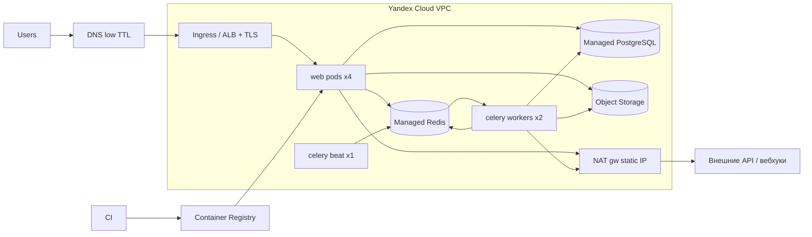

## Коротко

Переезд реален, но всё решают два момента, и на оба стоит закладываться с самого начала.

1. **Перенос 40 ГБ Postgres за 30 минут простоя.** Это главный риск. Логическую репликацию с Heroku Postgres наружу, насколько я помню, настроить нельзя: у пользователя нет прав `REPLICATION` (не проверял, уточните у поддержки Heroku). Тогда остаётся `pg_dump`/`pg_restore` прямо в окне простоя, и уложатся ли они в ~15 минут, покажет только репетиция на реальных данных. Если не уложатся, нужен план Б (ниже), и выбрать его надо **в октябре, а не в ночь переезда**.
2. **Kubernetes без девопса.** Из всех новых вещей эта самая сложная. Её надо поднять и обкатать на staging в первые 2–3 недели, иначе к ноябрю она станет узким местом.

Файлы (300 ГБ) и Redis на простой почти не влияют: файлы копируются заранее, кэш не переносится, очереди дренируются.

**Даты.** 15 ноября 2026 — воскресенье. Остаются три подходящие ночи: 31.10→01.11, 07.11→08.11, 14.11→15.11. Предлагаю так: **31.10 — генеральная репетиция** (без переключения трафика), **07.11 — основной переезд**, **14.11 — резерв**. Если 15.11 для Heroku жёсткая дата (заканчивается контракт), то при переезде 14.11 откатиться будет некуда. Поэтому основной датой должна быть 07.11.

---

### Requirements Summary

- **Функционально:** Django 4.2 (web + Celery worker + скорее всего beat), PostgreSQL, Redis (брокер + кэш), S3-файлы.
- **Нефункционально:** простой ≤ 30 мин, окно в ночь с субботы на воскресенье, после переезда сервис должен работать не хуже, чем на Heroku.
- **Ограничения:** 3 бэкендера, девопса нет, срок около 7 недель (сегодня 25.09).
- **Anti-requirements (что сейчас НЕ делаем):** не меняем архитектуру приложения, не обновляем Django, не делим монолит, не внедряем service mesh, GitOps и прочее. Задача переезда — **перенести систему как есть**, всё остальное потом.

### Estimation

| Что | Оценка | Вывод |
|---|---|---|
| БД 40 ГБ | Цифра из `pg:info` включает индексы; самих данных обычно 50–70%, то есть ~20–28 ГБ по сети | Время решают сетевой канал Heroku (AWS) → Yandex и перестроение индексов |
| Канал | При 50–100 МБ/с: 25 ГБ / 75 МБ/с ≈ **6 мин** на выгрузку; восстановление с индексами при `-j 8` ещё **~5–15 мин** | Оптимистично это 10–20 мин. Цифры прикидочные, их **обязательно** надо замерить |
| Файлы 300 ГБ | При 50 МБ/с ≈ 100 мин, реально за счёт мелких объектов несколько часов | Копировать заранее, в окне переносить только дельту |
| Egress AWS S3 | ~$0.09/ГБ × 300 ГБ ≈ **~$27** (тариф по памяти, сверьте с прайсом AWS) | Не блокер |
| Web | 4 дино. Узнайте размер (`heroku ps`) и число gunicorn-воркеров | Под на старте = одно дино по CPU/RAM, 4 реплики. Потом смотреть на метрики |

Бюджет окна в 30 минут:

| Минуты | Шаг |
|---|---|
| 0–3 | Maintenance, остановка web/worker/beat, проверка, что очереди пусты |
| 3–18 | `pg_dump` → `pg_restore` (**≤ 15 мин по репетиции, иначе план Б**) |
| 18–22 | `ANALYZE`, проверки данных, sequences |
| 22–26 | Запуск приложения в K8s, smoke-тесты, переключение DNS |
| 26–30 | Запас |

### Architecture (целевая)



Что меняется при переходе с Heroku (обычно всплывает именно это):

| Heroku | Yandex Cloud / K8s |
|---|---|
| Buildpack + Procfile | Dockerfile + Deployment `web`, `worker`, отдельный `beat` (1 реплика, `strategy: Recreate`) |
| Release phase (`migrate`) | K8s Job перед выкаткой |
| Heroku Scheduler | CronJob (или задачи в beat) |
| Config vars | K8s Secrets / Lockbox |
| Роутер Heroku, ACM-сертификат | Ingress + cert-manager / Certificate Manager |
| `heroku logs`, аддоны логов и метрик | Cloud Logging / Monitoring, Sentry оставить |
| Динамические исходящие IP | NAT gateway со **статическим** IP |

---

### Пошаговый план

#### Неделя 1 (28.09–04.10): инвентаризация и фундамент

1. **Инвентаризация Heroku:**
   - `heroku config`, `heroku addons`, `heroku ps`, Procfile, Scheduler;
   - `heroku pg:info` (версия PG, размер), список расширений (`\dx`), топ-20 таблиц по размеру.
2. **Проверки, которые потом внезапно всплывают:**
   - Что лежит в Redis, кроме очередей и кэша? Сессии (`SESSION_ENGINE` на cache → при переезде разлогинит всех), блокировки, rate limits, result backend Celery.
   - Хранятся ли в БД **полные URL** на `*.amazonaws.com` (поля, HTML в тексте)? Если да, нужен скрипт перезаписи или бакет AWS в режиме read-only ещё на месяц.
   - Какие внешние сервисы держат **allowlist ваших IP** (платёжки, партнёрские API) и куда приходят **вебхуки**.
   - Версии расширений PG: есть ли они в Yandex Managed PG для выбранной версии.
3. **Yandex Cloud:** облако, биллинг, сервисный аккаунт, VPC, подсети, NAT gateway со статическим IP. Всё описывать в **Terraform**. Без девопса код инфраструктуры и есть ваша документация, и второе окружение из него поднимается за минуты.
4. Сразу отправьте партнёрам новый исходящий IP для allowlist: согласование у них может занять недели.

#### Неделя 2 (05.10–11.10): контейнер и платформа

5. **Dockerfile** (gunicorn, `collectstatic` на этапе сборки, non-root) и CI → Container Registry.
6. **Managed Kubernetes:** один кластер, одна node group с автомасштабированием, ingress и сертификаты. Держите всё минимальным: plain manifests или простой Helm-чарт, без Argo и без mesh.
7. Правки в Django:
   - `SECURE_PROXY_SSL_HEADER`, `ALLOWED_HOSTS`, `CSRF_TRUSTED_ORIGINS`;
   - SSL к PG и Redis с CA-сертификатом Яндекса;
   - `django-storages` с endpoint Object Storage (по памяти `https://storage.yandexcloud.net`, регион `ru-central1`, сверьте с документацией).
8. **Пулер соединений.** Насколько я помню, в Managed PG есть встроенный пулер (Odyssey, порт 6432), но режим и порт проверьте в документации. Если пулинг транзакционный, в Django нужен `DISABLE_SERVER_SIDE_CURSORS = True`, иначе `.iterator()` начнёт ломаться.
9. Probes (readiness/liveness), requests/limits, graceful shutdown для Celery (`terminationGracePeriodSeconds` больше самой длинной задачи).

#### Неделя 3 (12.10–18.10): данные, репетиция №1

10. **Файлы:** первичная копия `rclone sync s3:bucket yc:bucket` с VM в Yandex, затем ежедневная инкрементальная синхронизация. Перенести CORS, политику публичного доступа, lifecycle-правила.
11. **Репетиция БД №1** на VM в той же зоне, что и Managed PG (быстрый SSD, 8+ vCPU):
    ```bash
    pg_dump "$HEROKU_DATABASE_URL" -Fd -j 8 --no-owner --no-acl -f /data/dump
    pg_restore -d "$YC_DATABASE_URL" -j 8 --no-owner --no-acl /data/dump
    vacuumdb -d "$YC_DATABASE_URL" --analyze-in-stages -j 8
    ```
    Флаги стандартные, но синтаксис строк подключения и опции сверьте с вашей версией `pg_dump`. Версия клиента должна быть не ниже версии сервера Heroku.
    **Замерьте каждую фазу отдельно:** dump, restore данных, построение индексов, analyze.
12. На восстановленной копии поднимите staging в K8s и прогоните приложение целиком: логин, загрузка файлов, фоновые задачи, крон.

#### Если репетиция показала > 15 минут: план Б

| Вариант | Плюсы | Минусы | Когда подходит |
|---|---|---|---|
| **A. Предварительный перенос больших append-only таблиц** (логи, аудит, события): основная масса копируется заранее, в окне догружается дельта по `id`/`created_at` | Резко сокращает объём в окне | Для каждой таблицы нужен свой скрипт и сверка. Годится только для таблиц без UPDATE/DELETE | 70%+ объёма в 2–3 таблицах-журналах |
| **B. Индексы после открытия:** в окне восстановить данные и PK/уникальные, остальные индексы строить `CREATE INDEX CONCURRENTLY` уже под трафиком | Экономит минуты на индексах | Первый час запросы медленнее | Индексы занимают большую долю времени restore |
| **C. Спросить поддержку Heroku** про помощь с миграцией наружу (физический бэкап + WAL) | Почти нулевой простой | Не уверен, что это доступно на Standard. Непредсказуемые сроки | Спросить **на неделе 1**, параллельно |
| **D. Согласовать окно больше** (например, 60 мин) | Самый простой и надёжный вариант | Нужно разрешение бизнеса | Если A и B не помогли |
| **E. Почистить данные заранее** (старые сессии, логи, мусорные таблицы) | Дёшево | Эффект обычно небольшой | Всегда, в дополнение к остальному |

Моя рекомендация: сначала E, затем B, если нужно ещё — A. D держите как честный запасной вариант для разговора с бизнесом, с цифрами из репетиций на руках.

#### Неделя 4 (19.10–25.10): эксплуатация и runbook

13. **Мониторинг до переезда, а не после:**
    - 5xx rate и p95 latency на ingress;
    - длина очередей Celery;
    - соединения, CPU и диск PG;
    - рестарты подов;
    - алерты в Telegram или почту.
14. **Нагрузочный тест** staging трафиком, близким к пиковому. Проверьте число соединений к PG: 4 реплики × воркеры gunicorn плюс Celery не должны упираться в `max_connections`.
15. **Runbook**: по минутам, с конкретными командами, ответственным за каждый шаг и go/no-go точками. Трое человек, трое ролей: «БД», «приложение/K8s», «координатор + проверки + DNS».
16. За 7+ дней до переезда **снизить TTL DNS** до 60–300 с.
17. **Сертификат выпустить заранее.** Let's Encrypt через HTTP-01 не выпустится, пока DNS смотрит на Heroku: используйте DNS-01 или загрузите сертификат вручную. Это классический сюрприз ночи переезда.

#### 31.10→01.11: генеральная репетиция (трафик не переключаем)

18. Прогнать **весь runbook** на свежем дампе прода, с таймером, в то же время суток. Трафик остаётся на Heroku, а в K8s открывается временный домен, где идут smoke-тесты.
19. **Прогнать и откат:** убедиться, что Heroku поднимается за 2 минуты.
20. С понедельника **заморозка**: никаких миграций схемы и новых зависимостей до переезда.

#### 07.11→08.11: переезд

**T−1 день:** финальный `rclone sync`, выгрузить список отложенных задач (ETA/countdown) Celery, предупредить пользователей, проверить доступы всех троих.

**T−60 мин:** поднять VM для дампа; держать K8s-деплойменты в `replicas: 0` с финальным образом; Managed PG пустой (или очищенный после репетиции); сделать свежий бэкап Heroku (`heroku pg:backups:capture`) как страховку.

| T | Действие | Go/No-go |
|---|---|---|
| 0 | `heroku maintenance:on`, остановить beat, затем web; дать воркерам доработать и остановить их (`heroku ps:scale web=0 worker=0`) | Очередь пуста или оставшиеся задачи выгружены |
| +3 | `pg_dump -Fd -j 8` → `pg_restore -j 8` | Если к +20 не закончилось: **откат** |
| +18 | `vacuumdb --analyze-in-stages`, сверка: число строк в 10 ключевых таблицах, `max(id)`, значения sequences, `django migrate --check` | Расхождение: **откат** |
| +22 | Масштабировать web/worker/beat в K8s, smoke-тесты через hosts-файл или временный домен: логин, чтение и загрузка файла, Celery-задача | Любой красный smoke: **откат** |
| +25 | Переключить DNS. Heroku оставить в maintenance, чтобы клиенты со старым кешем DNS не писали в старую БД | — |
| +26 | Запустить `rclone copy` дельты файлов (созданных после последнего sync); это можно делать уже под трафиком | — |
| +30 | Открыто. Дежурство по дашбордам ещё 1–2 часа | — |

**Точка невозврата — момент, когда новый прод принял первые пользовательские записи.** До неё откат простой: DNS обратно, `maintenance:off`, scale up на Heroku. После неё для отката пришлось бы переносить данные обратно. Поэтому все проверки делаются **до** переключения DNS, и решение принимает координатор, а не «давайте ещё чуть-чуть подождём».

#### После переезда

- Heroku держать в maintenance ещё 1–2 недели (базу не удалять), AWS-бакет в read-only месяц.
- Проверить, что beat работает **в одном экземпляре** и крон-задачи не задвоились.
- Сверить счёт Yandex Cloud за первую неделю с ожиданиями.

---

### Trade-Off: K8s или проще

| Вариант | Плюсы | Минусы | Когда подходит |
|---|---|---|---|
| **Managed K8s** (ваш выбор) | Стандарт, масштабирование, rolling deploy, CronJob из коробки | Много новых сущностей (ingress, сертификаты, RBAC, node groups). Без девопса отлаживать дольше всего | Команда готова потратить на это 1–2 недели в первой половине срока |
| **VM (Instance Group) + Docker Compose** | Понятно любому бэкендеру, быстро поднимается | Деплой и масштабирование придётся скриптовать самим, выглядит менее «правильно» | Если к ~18.10 K8s staging ещё не работает стабильно |

Рекомендация: идти в K8s, но с жёстким контрольным сроком. Если к **18 октября** staging в K8s не проходит полный прогон, переезжайте на VM, а в K8s переходите уже после 15 ноября, спокойно. Задача переезда — уехать с Heroku, и её не стоит смешивать с изучением новой платформы под дедлайн.

### Failure Modes (pre-mortem: «переезд провалился, почему?»)

| Риск | Вероятность × ущерб | Предотвращение | Ранний сигнал |
|---|---|---|---|
| Dump/restore не влез в окно | Высокая × высокий | Две репетиции с замерами, план Б выбран заранее | Репетиция №1 > 15 мин |
| Partner API отвечает 403 из-за нового IP | Средняя × высокий | Статический NAT IP, allowlist согласован заранее | Нет подтверждения от партнёра к 25.10 |
| TLS не выпустился после переключения DNS | Средняя × высокий | Сертификат выпущен до дня X | Staging-домен без валидного сертификата |
| Соединения к PG закончились под нагрузкой | Средняя × средний | Пулер, расчёт соединений, нагрузочный тест | `too many connections` на staging |
| Задвоились или потерялись фоновые задачи | Средняя × средний | Один beat, дренаж очередей, выгрузка ETA-задач | Дубли писем или крона на репетиции |
| Битые ссылки на файлы (URL из AWS в БД) | Средняя × средний | Аудит на неделе 1, бакет AWS в read-only | Grep по дампу на `amazonaws.com` |
| Все пользователи разлогинены | Высокая (если сессии в Redis) × низкий | Осознанно принять или перенести сессии в БД заранее | `SESSION_ENGINE` в settings |

Если хотите, могу сразу набросать шаблон runbook-а (таблица «время / команда / ответственный / как проверить / критерий отката») или минимальный набор K8s-манифестов для web, worker, beat и migrate-Job.
