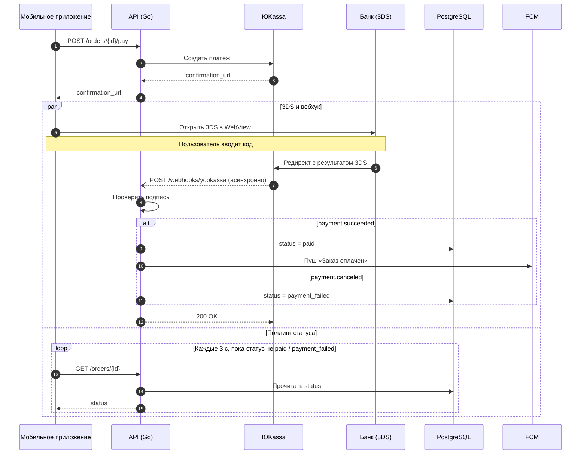
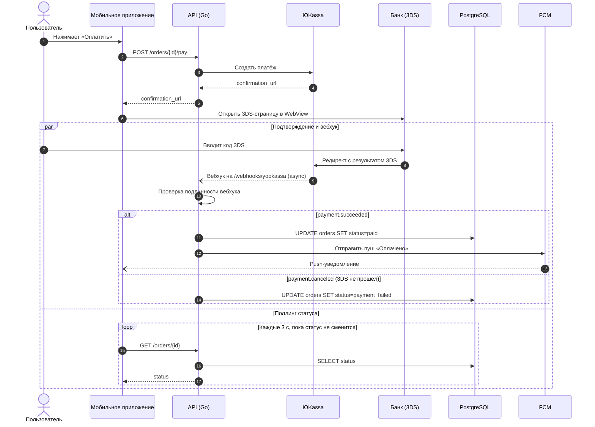

# Case mermaid-payment-flow-type-ru

## Conversation so far
(none)

## Latest user message
Нужна диаграмма в mermaid для Confluence, чтобы новым бэкендерам объяснить, как у нас проходит оплата картой. Как это работает сейчас: мобильное приложение шлёт POST /orders/{id}/pay на наш API (Go), API создаёт платёж в ЮKassa и получает confirmation_url, возвращает его приложению, приложение открывает 3DS-страницу банка в WebView, пользователь вводит код, банк редиректит обратно в ЮKassa, ЮKassa асинхронно шлёт вебхук payment.succeeded на наш /webhooks/yookassa, API проверяет подпись, обновляет заказ в PostgreSQL на status=paid и отправляет пуш через FCM. Если 3DS не прошёл, приходит payment.canceled и заказ уходит в status=payment_failed. Приложение параллельно раз в 3 секунды поллит GET /orders/{id}, пока статус не сменится. Нарисуй, пожалуйста, чтобы было понятно с первого взгляда.

## Rubric (what a strong answer does)
1. Uses a sequenceDiagram (not a flowchart) with separate participants for at least the app, the API, YooKassa and the database, declared with short IDs and readable names via 'participant X as Label'
2. Message labels are short (roughly endpoint or event names like 'POST /orders/{id}/pay', 'payment.succeeded', 'status=paid'), not full sentences
3. Shows both outcomes (payment.succeeded -> paid + FCM push, payment.canceled -> payment_failed), e.g. with alt/else, and represents the app's polling of GET /orders/{id} (e.g. with loop or a note)
4. The flow matches the description: the webhook goes from YooKassa to the API asynchronously after 3DS, the API verifies the signature before updating PostgreSQL, and the Mermaid code looks syntactically valid

## Answer A
Для такого потока лучше всего подходит sequence-диаграмма: сразу видно, кто кого вызывает, где начинается асинхронная часть и что поллинг идёт одновременно с 3DS.

Как читать диаграмму:
- **Шаги 1–4**: синхронная часть, приложение получает `confirmation_url`.
- **Блок `par`**: две ветки идут одновременно. Сверху пользователь проходит 3DS, а ЮKassa присылает вебхук. Снизу приложение поллит статус заказа.
- **Блок `alt`**: заказ завершается одним из двух исходов, `paid` (с пушем) или `payment_failed`.
- Пунктирная стрелка с открытым концом (`--)`) обозначает асинхронный вебхук.

Три замечания, прежде чем публиковать:

1. **«Проверяет подпись»**: насколько я помню, ЮKassa не подписывает HTTP-уведомления, как это делают, например, Stripe. Вместо этого она рекомендует проверять IP-адрес отправителя по своему списку и/или перезапрашивать статус через `GET /v3/payments/{payment_id}`. Я этого не проверял, так что сверьтесь с документацией ЮKassa и с тем, что реально делает ваш хендлер. Если там проверка IP или перезапрос статуса, поменяйте подпись шага, иначе новички будут искать в коде несуществующую проверку подписи.
2. **`200 OK` в ответ на вебхук** я добавил сам, в описании его не было. Новичкам полезно знать, что без него ЮKassa будет присылать уведомление повторно. Хендлер из-за этого должен быть идемпотентным.
3. **Confluence**: сам по себе Confluence не рендерит Mermaid, нужен плагин из Marketplace (например, Mermaid Diagrams for Confluence) или встроенный макрос, если у вас он уже есть. Проверьте, что ваш плагин поддерживает `par` и `autonumber`. В старых версиях Mermaid этих блоков может не быть.

## Answer B
Вот диаграмма последовательности. Для такого процесса она подходит лучше flowchart, потому что видно, кто кому и в каком порядке шлёт запросы, а асинхронный вебхук и поллинг идут параллельно.

Как читать:
- Сплошная стрелка означает синхронный запрос, пунктирная с обычным наконечником (`-->>`) означает ответ, пунктирная с открытым наконечником (`--)`) означает асинхронное событие.
- Блок `par` показывает, что поллинг приложения идёт одновременно с 3DS и вебхуком. Статус в приложении меняется, когда срабатывает первое из двух: ответ поллинга или пуш.

Два замечания:

1. **«Проверяет подпись».** Насколько я помню (не проверял сейчас, лучше свериться с документацией ЮKassa), HMAC-подписи у вебхуков ЮKassa нет. Обычно подлинность проверяют по IP-адресам из их списка или повторным запросом `GET /v3/payments/{payment_id}`. Поэтому в диаграмме написано нейтрально: «Проверка подлинности вебхука». Если у вас в коде реально проверяется что-то конкретное, впишите это вместо общей формулировки. Новичкам полезно видеть точный механизм.
2. **Confluence.** Какую версию Mermaid поддерживает макрос, зависит от плагина. `par`, `alt`, `loop`, `autonumber` и стрелка `--)` появились давно и должны работать в большинстве плагинов. Если диаграмма не отрисуется, сначала уберите `autonumber` и замените `--)` на `-->>`.

