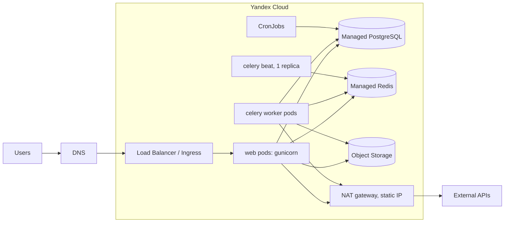
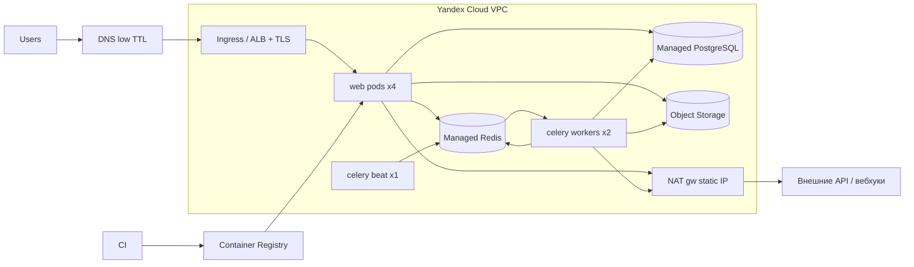

# Case heroku-to-yandex-cloud-migration-plan-ru

## Conversation so far
(none)

## Latest user message
Нам надо съехать с Heroku в Yandex Cloud до 15 ноября. Сейчас: Django 4.2 монолит на 4 web-дино + 2 worker (Celery), Heroku Postgres Standard (база ~40 ГБ), Heroku Redis для очередей и кэша, файлы пользователей лежат в AWS S3 (~300 ГБ). В Yandex Cloud хотим Managed PostgreSQL, Managed Redis, Object Storage и приложение в Managed Kubernetes. Бизнес разрешает простой максимум 30 минут, ночью с субботы на воскресенье. Нас трое бэкендеров, девопса нет. Распиши, пожалуйста, как это провести по шагам, чтобы в день переезда не было сюрпризов.

## Rubric (what a strong answer does)
1. Each major step comes with a concrete check that must pass before continuing (e.g. comparing row counts or checksums after the database copy, comparing object counts/sizes after the storage sync, a smoke test of the app in the new cluster against the new database), not just a list of actions.
2. States which work can run in parallel and which depends on earlier steps (e.g. the ~300 GB file sync and the cluster/app setup can proceed independently ahead of cutover, while the final database switch depends on the app already being verified in Yandex Cloud).
3. Defines what counts as a successful cutover and gives a rollback path for migration night (e.g. keeping Heroku intact and read-only-capable, lowering DNS TTL in advance, a go/no-go point with a time limit inside the 30-minute window).
4. Addresses whether moving a ~40 GB database fits into the 30-minute window (e.g. proposes timing a full dump/restore during a rehearsal on a copy of production data and setting a go/no-go threshold from that timing) instead of assuming it will fit.

## Answer A
## Коротко

Переезд реально уложить в 30 минут простоя, но только если выполнить три условия:

1. **Файлы (S3) убрать из критического пути.** 300 ГБ копируются заранее и досинхронизируются инкрементально. В ночь переезда остаётся только короткий финальный `sync`.
2. **Redis не переносить, а «осушить».** Кэш стартует пустым, очередь Celery дорабатывается до нуля перед остановкой.
3. **Единственное, что реально съедает окно, это Postgres 40 ГБ.** Время `pg_dump | pg_restore` нужно **измерить на двух генеральных репетициях**, а не прикидывать. Если оно не влезает в ~20 минут, план меняется заранее, а не в ночь переезда.

И про сроки. 15 ноября 2026 — воскресенье, поэтому ночь 14→15 ноября — последнее допустимое окно, и ставить на неё основной переезд нельзя. Предлагаю так: **боевой переезд в ночь 7→8 ноября, 14→15 ноября держать резервом.**

---

## 1. Сначала о Kubernetes, раз девопса нет

Здесь нужно возразить до начала работ. Managed Kubernetes для трёх бэкендеров без опыта эксплуатации — это самый большой *организационный* риск всего проекта, больше, чем база. Ingress, сертификаты, секреты, NAT, requests/limits, логи и rollout-стратегии придётся освоить за 7 недель параллельно с переездом.

| Вариант | Плюсы | Минусы | Когда подходит |
|---|---|---|---|
| **Managed Kubernetes** | Стандарт, автоскейлинг, rolling-деплой, CronJob вместо Heroku Scheduler | Больше всего новых понятий, легко ошибиться в сетях и ingress | Если хотя бы один из вас уже работал с k8s или вы готовы потратить на это 1–2 недели |
| **2–3 VM (Compute) + docker compose + ALB** | Проще всего отладить, ближе к модели «дино = процесс» | Деплой и масштабирование скриптами, ручная работа с ОС | Когда главное — успеть в срок |
| **Serverless Containers** | Почти как Heroku, серверами не управляете | Celery-воркеры с долгими задачами туда плохо ложатся, есть лимиты по времени запроса | Для web-части, воркеры всё равно куда-то ещё |

**Моя рекомендация:** если k8s — осознанное решение, оставляйте его, но в минимальной конфигурации. Один namespace, три `Deployment` (web, worker, beat с `replicas: 1`), `CronJob` вместо Scheduler, простые манифесты + kustomize. Никаких ArgoCD, service mesh или Helm-чартов собственного производства. Если к концу 2-й недели staging в k8s так и не поднялся, это сигнал переключиться на VM и не терять сроки.

---

## 2. Оценки (порядок величин, всё проверить на репетиции)

| Что | Расчёт | Итог |
|---|---|---|
| **Дамп БД** | 40 ГБ «на диске» включают индексы и bloat. Данных в дампе обычно в 2–4 раза меньше, со сжатием ещё меньше, условно 8–15 ГБ | — |
| **Передача** Heroku (AWS) → Yandex Cloud | Межоблачный канал между континентами, реалистично 20–50 МБ/с. 15 ГБ / 20 МБ/с ≈ 12 мин, при 50 МБ/с ≈ 5 мин | 5–15 мин |
| **Restore + индексы** | `pg_restore -j 8`, индексы строятся параллельно. Очень зависит от класса хоста и самых больших таблиц | 10–30 мин ← **главный риск** |
| **ANALYZE** | `vacuumdb --analyze-in-stages`: первая стадия быстрая, этого хватает для старта | 1–3 мин |
| **S3 → Object Storage** | 300 ГБ при 50 МБ/с ≈ 1,7 ч. Реально дольше, если файлов миллионы: упирается в число объектов, а не в объём | часы, **делается заранее** |
| **Egress из AWS** | ~300 ГБ × ~$0.09/ГБ (тариф по памяти, не проверял) | ≈ $30, копейки |

Бюджет окна в 30 минут: ~3 мин на остановку, ≤20 мин на базу, ~5 мин на проверки и DNS, ~2 мин запаса. **Если на репетиции база занимает больше 20 минут, укладываться придётся по-другому** (см. раздел 6).

---

## 3. Целевая архитектура



Что появляется нового по сравнению с Heroku:
- **Container Registry**: образ собирается из Dockerfile вместо buildpack.
- **Lockbox** (или хотя бы k8s Secrets) вместо `heroku config`.
- **Статический исходящий IP** через NAT. На Heroku его не было, и он может понадобиться партнёрам для allowlist.
- **Логи и метрики**: Cloud Logging плюс то, что у вас уже есть (Sentry и т.п.).
- **Пул соединений.** У Managed PostgreSQL, насколько я помню, есть встроенный пулер (Odyssey, порт 6432). Это нужно проверить в документации. Если использовать его в режиме transaction, в Django нужно `DISABLE_SERVER_SIDE_CURSORS = True`, иначе `.iterator()` будет падать на проде.

---

## 4. План по неделям

Каждый шаг заканчивается проверкой. Пока проверка не пройдена, дальше не идём.

### Неделя 1 (28 сен – 4 окт): инвентаризация и контейнеризация
- **Выгрузить всё, что живёт в Heroku:** `heroku config -s`, список add-ons, задачи Heroku Scheduler, log drains, домены и сертификаты, `release`-фаза в Procfile, размеры дино.
- **Проверить базу:**
  - версию Postgres и совпадение с доступными в Yandex;
  - расширения (`\dx`): доступны ли они в Managed PG, включаются ли через консоль;
  - collation/locale;
  - 10 самых больших таблиц и индексов (`pg_total_relation_size`);
  - какие из них append-only (логи, события): это пригодится в плане Б.
- **Проверить, можно ли на Heroku Postgres логическую репликацию.** Насколько я помню, внешним потребителям Heroku роль `REPLICATION` не выдаёт, поэтому Yandex Data Transfer в режиме «копирование + репликация», скорее всего, не заработает. Проверьте сразу, от этого зависит план Б.
- **Написать Dockerfile**: gunicorn, `collectstatic` при сборке, слушать `$PORT` или фиксированный порт.
- **Найти Heroku-специфику в коде:**
  - `SECURE_PROXY_SSL_HEADER`, `ALLOWED_HOSTS`, `CSRF_TRUSTED_ORIGINS`;
  - `dj-database-url`, SSL-параметры Redis (у Heroku Redis `rediss://` с самоподписанным сертификатом);
  - захардкоженные `*.herokuapp.com` и `s3.amazonaws.com`.
- **Проверить, нет ли полных S3-URL в базе** (в полях, в HTML-контенте). Если есть, понадобится миграция данных.
- ✅ Готово, когда образ локально запускается через docker compose с Postgres/Redis и проходят тесты.

### Неделя 2 (5–11 окт): инфраструктура в Yandex Cloud
- VPC, подсети, NAT-шлюз, Managed PG (класс хоста подобрать под текущую нагрузку, лучше на ступень больше), Managed Redis, бакет Object Storage, Registry, кластер k8s (2–3 ноды в разных зонах).
- Описать это в Terraform. Для троих людей это окупится: staging и prod будут одинаковыми, а ночью не будет «а какую галочку мы тогда ставили».
- **Сертификат для боевого домена выпустить заранее через DNS-валидацию** (Certificate Manager или cert-manager с DNS-01). HTTP-01 не сработает, пока домен смотрит на Heroku.
- **Запустить первичную копию S3 → Object Storage** (`rclone sync` с VM в Yandex Cloud, `--transfers 32..64`, `--checkers 64`). Флаги я привожу по памяти, сверьте с `rclone --help`.
- **Сообщить новый исходящий IP** всем партнёрам с IP-allowlist: платёжкам, API и т.д. У них согласование может занять недели.
- ✅ Готово, когда пустое приложение отвечает в staging по HTTPS.

### Неделя 3 (12–18 окт): staging на копии прода + репетиция №1
- Переключить django-storages на Object Storage: `endpoint_url=https://storage.yandexcloud.net`, регион `ru-central1`. Проверить presigned URL, публичные файлы, CORS и политики бакета.
- **Репетиция №1 (выходные 17–18 окт):** настоящий `pg_dump -Fd -j 8` с прод-базы Heroku, restore в staging-PG, **засечь время каждого этапа**. Прогнать приложение, пройтись руками по ключевым сценариям.
- ✅ Готово, когда есть цифры по времени и список всего, что сломалось.

### Неделя 4 (19–25 окт): исправления и нагрузка
- Исправить найденное. Настроить requests/limits, пробы (`readinessProbe` на лёгкий healthcheck-эндпоинт), graceful shutdown gunicorn и Celery.
- Нагрузочный тест staging на уровне текущего пика плюс запас. Проверить число соединений к PG: pods × gunicorn workers × потоки < `max_connections` / лимит пулера.
- Алерты: 5xx, p99 latency, длина очереди Celery, CPU/соединения PG, свободное место на диске PG.
- **За неделю до переезда снизить TTL DNS до 60–300 с.**
- Заморозка: в последнюю неделю не выкатывать миграции схемы.

### Неделя 5 (26 окт – 1 ноя): репетиция №2, полный прогон по runbook
- В ночь 31 окт → 1 ноя, в то же время суток, по тому же скрипту, теми же людьми. Не переключаем только DNS.
- Проверить ещё и откат.
- ✅ Готово, когда весь прогон уложился в ≤25 минут с запасом. Если не уложился, включаем план Б (раздел 6).

### Неделя 6: боевой переезд в ночь 7→8 ноября
- В четверг 5 ноября — go/no-go: все пункты чек-листа закрыты, партнёры подтвердили IP.

### Резерв: ночь 14→15 ноября

---

## 5. Runbook на ночь переезда

**Роли:**
- **A — база**: dump, restore, проверки.
- **B — приложение, k8s и DNS.**
- **C — ведущий**: следит за временем, отмечает пункты, делает smoke-тесты, держит связь с бизнесом. У C нет своих технических задач, и это сознательно.

Команды ниже по памяти. Точный синтаксис зафиксируйте на репетициях и вставьте в runbook дословно.

**T−1 день**
- В Yandex задеплоена финальная версия; web, worker и beat в `replicas: 0`.
- Инкрементальный `rclone sync` уже прошёл, дельта маленькая.
- Сделан свежий бэкап Heroku: `heroku pg:backups:capture`.
- Связь и доступы у всех проверены.

**T−60 мин**
- Финальный `rclone sync`, общий созвон.
- VM для dump/restore в Yandex Cloud запущена, на диске хватает места под дамп.

**T−15 мин**
- Проверить, нет ли в очереди отложенных задач (`eta`/`countdown`). При переключении Redis они потеряются. Либо дождаться их, либо договориться, что они будут перезапущены.

**T+0: стоп на Heroku**
1. `heroku maintenance:on` — пользователи видят страницу обслуживания.
2. Отключить задачи Heroku Scheduler.
3. Дождаться, пока очередь опустеет (`celery inspect active`, длина очереди в Redis = 0), затем `heroku ps:scale worker=0` (и beat, если он отдельно).
4. Проверить, что активных соединений приложения к БД не осталось (`pg_stat_activity`).

**T+3: база (A)**
5. `pg_dump -Fd -j 8 --no-owner --no-acl` с Heroku на диск VM в Yandex.
6. `pg_restore -j 8 --no-owner --no-acl` в Managed PG.
7. `vacuumdb --analyze-in-stages`. Без этого первые запросы после старта могут быть очень медленными: статистика в дамп не попадает.
8. Сверка: число строк в 10–15 ключевых таблицах и max(id) — скриптом, подготовленным заранее, сравнить с Heroku. Проверить sequences: следующий id больше max(id).

**T+20: приложение (B)**
9. `python manage.py showmigrations` или `migrate --check`: несоответствий быть не должно.
10. Масштабировать web, worker и beat (beat строго 1).
11. **Smoke-тесты (C) через новый адрес** (`/etc/hosts` или прямой адрес балансировщика): логин, ключевой сценарий с записью, загрузка и скачивание файла, фоновая задача прошла, письмо или уведомление ушло.

**T+25: go/no-go**
12. Если всё зелёное, переключаем DNS. **Heroku оставляем в maintenance**: клиенты со старым DNS-кэшем увидят страницу обслуживания и не будут писать в старую базу. Это защищает от split-brain.
13. Мониторинг: 5xx, latency, очередь, ошибки в Sentry.

**T+30 … T+2 ч**: дежурство, наблюдение, в том числе за первыми запусками CronJob.

### Откат
- **До переключения DNS (шаг 12)** откат дешёвый: `maintenance:off` на Heroku и вернуть воркеры. Около 2 минут, данные не теряются. Критерии «откатываемся» пропишите заранее: сверка строк не сошлась, smoke-тест упал, restore не закончился к T+22.
- **После открытия трафика** в Yandex появляются новые записи, и откат означает либо потерю этих данных, либо ручной перенос дельты обратно. Поэтому правило такое: **откат разрешён в первые ~30–60 минут и только при критической поломке, дальше чиним на месте.** Решите это заранее вместе с бизнесом, а не в 3 часа ночи.
- Heroku (в maintenance, с базой) не удалять ещё 1–2 недели, финальный бэкап сохранить. AWS S3 не удалять, пока не убедитесь, что в Object Storage есть всё.

---

## 6. План Б, если база не влезает в окно

Вероятнее всего, по моей оценке, узким местом окажется restore и построение индексов на самых больших таблицах. Варианты по возрастанию сложности:

| Вариант | Суть | Цена |
|---|---|---|
| **Больше ресурсов на время переезда** | Мощнее класс хоста PG на ночь, больше `-j`, VM для dump рядом с целевой базой | Деньги, почти без сложности. Пробуйте первым |
| **Почистить базу** | Удалить или архивировать старые логи и сессии (`django_session`!), убрать неиспользуемые индексы | Часто даёт больше всего, стоит сделать в любом случае |
| **Перенести append-only таблицы заранее** | Большие таблицы, где строки только добавляются, копируются за день-два до переезда, в ночь переезда — только хвост `WHERE id > X` | Скрипт и тщательная сверка; риск ошибиться, если строки всё-таки обновляются |
| **Логическая репликация / Data Transfer** | Почти нулевой простой | Скорее всего, Heroku её не позволяет (см. неделю 1) |
| **Попросить у бизнеса окно 60 мин** | — | Честнее, чем сорвать 30 минут |

---

## 7. Pre-mortem: что обычно ломается в такую ночь

Представим, что переезд провалился. Самые вероятные причины и как их отловить заранее:

1. **Restore шёл 50 минут вместо 15.** → Две репетиции с замером, план Б готов до недели 5.
2. **Забыли переменную окружения, add-on или задачу Scheduler.** → Diff `heroku config` с секретами в Yandex, прописанный по пунктам. Каждую задачу Scheduler перенести в CronJob и проверить на staging.
3. **Партнёр режет запросы с нового IP** (платежи, вебхуки). → Статический NAT IP на неделе 2, письменные подтверждения до go/no-go.
4. **Файлы открываются, но не все**: захардкоженные S3-URL, ACL, CORS, presigned-ссылки со старым хостом. → Grep по коду и БД, тест загрузки и скачивания в smoke-наборе.
5. **Кончились соединения к PG** под нагрузкой после старта. → Посчитать соединения, нагрузочный тест, пулер.
6. **Два beat или задачи задвоились / отложенные задачи пропали.** → beat `replicas: 1` со стратегией `Recreate`, отдельная проверка eta-задач.
7. **Сертификат не выпустился или DNS закэширован надолго.** → Сертификат через DNS-валидацию заранее, TTL снизить за неделю.
8. **Ночью всё работало, а утром при нагрузке нет.** → Алерты настроены до переезда, утром в понедельник один человек дежурит.

Если хотите, распишу следующий шаг подробно: k8s-манифесты для web/worker/beat, скрипт сверки базы или точный runbook с командами под вашу конфигурацию. Для этого пришлите версию Postgres, список расширений и 10 самых больших таблиц.


## Answer B
## Коротко

Переезд реален, но всё решают два момента, и на оба стоит закладываться с самого начала.

1. **Перенос 40 ГБ Postgres за 30 минут простоя.** Это главный риск. Логическую репликацию с Heroku Postgres наружу, насколько я помню, настроить нельзя: у пользователя нет прав `REPLICATION` (не проверял, уточните у поддержки Heroku). Тогда остаётся `pg_dump`/`pg_restore` прямо в окне простоя, и уложатся ли они в ~15 минут, покажет только репетиция на реальных данных. Если не уложатся, нужен план Б (ниже), и выбрать его надо **в октябре, а не в ночь переезда**.
2. **Kubernetes без девопса.** Из всех новых вещей эта самая сложная. Её надо поднять и обкатать на staging в первые 2–3 недели, иначе к ноябрю она станет узким местом.

Файлы (300 ГБ) и Redis на простой почти не влияют: файлы копируются заранее, кэш не переносится, очереди дренируются.

**Даты.** 15 ноября 2026 — воскресенье. Остаются три подходящие ночи: 31.10→01.11, 07.11→08.11, 14.11→15.11. Предлагаю так: **31.10 — генеральная репетиция** (без переключения трафика), **07.11 — основной переезд**, **14.11 — резерв**. Если 15.11 для Heroku жёсткая дата (заканчивается контракт), то при переезде 14.11 откатиться будет некуда. Поэтому основной датой должна быть 07.11.

---

### Requirements Summary

- **Функционально:** Django 4.2 (web + Celery worker + скорее всего beat), PostgreSQL, Redis (брокер + кэш), S3-файлы.
- **Нефункционально:** простой ≤ 30 мин, окно в ночь с субботы на воскресенье, после переезда сервис должен работать не хуже, чем на Heroku.
- **Ограничения:** 3 бэкендера, девопса нет, срок около 7 недель (сегодня 25.09).
- **Anti-requirements (что сейчас НЕ делаем):** не меняем архитектуру приложения, не обновляем Django, не делим монолит, не внедряем service mesh, GitOps и прочее. Задача переезда — **перенести систему как есть**, всё остальное потом.

### Estimation

| Что | Оценка | Вывод |
|---|---|---|
| БД 40 ГБ | Цифра из `pg:info` включает индексы; самих данных обычно 50–70%, то есть ~20–28 ГБ по сети | Время решают сетевой канал Heroku (AWS) → Yandex и перестроение индексов |
| Канал | При 50–100 МБ/с: 25 ГБ / 75 МБ/с ≈ **6 мин** на выгрузку; восстановление с индексами при `-j 8` ещё **~5–15 мин** | Оптимистично это 10–20 мин. Цифры прикидочные, их **обязательно** надо замерить |
| Файлы 300 ГБ | При 50 МБ/с ≈ 100 мин, реально за счёт мелких объектов несколько часов | Копировать заранее, в окне переносить только дельту |
| Egress AWS S3 | ~$0.09/ГБ × 300 ГБ ≈ **~$27** (тариф по памяти, сверьте с прайсом AWS) | Не блокер |
| Web | 4 дино. Узнайте размер (`heroku ps`) и число gunicorn-воркеров | Под на старте = одно дино по CPU/RAM, 4 реплики. Потом смотреть на метрики |

Бюджет окна в 30 минут:

| Минуты | Шаг |
|---|---|
| 0–3 | Maintenance, остановка web/worker/beat, проверка, что очереди пусты |
| 3–18 | `pg_dump` → `pg_restore` (**≤ 15 мин по репетиции, иначе план Б**) |
| 18–22 | `ANALYZE`, проверки данных, sequences |
| 22–26 | Запуск приложения в K8s, smoke-тесты, переключение DNS |
| 26–30 | Запас |

### Architecture (целевая)



Что меняется при переходе с Heroku (обычно всплывает именно это):

| Heroku | Yandex Cloud / K8s |
|---|---|
| Buildpack + Procfile | Dockerfile + Deployment `web`, `worker`, отдельный `beat` (1 реплика, `strategy: Recreate`) |
| Release phase (`migrate`) | K8s Job перед выкаткой |
| Heroku Scheduler | CronJob (или задачи в beat) |
| Config vars | K8s Secrets / Lockbox |
| Роутер Heroku, ACM-сертификат | Ingress + cert-manager / Certificate Manager |
| `heroku logs`, аддоны логов и метрик | Cloud Logging / Monitoring, Sentry оставить |
| Динамические исходящие IP | NAT gateway со **статическим** IP |

---

### Пошаговый план

#### Неделя 1 (28.09–04.10): инвентаризация и фундамент

1. **Инвентаризация Heroku:**
   - `heroku config`, `heroku addons`, `heroku ps`, Procfile, Scheduler;
   - `heroku pg:info` (версия PG, размер), список расширений (`\dx`), топ-20 таблиц по размеру.
2. **Проверки, которые потом внезапно всплывают:**
   - Что лежит в Redis, кроме очередей и кэша? Сессии (`SESSION_ENGINE` на cache → при переезде разлогинит всех), блокировки, rate limits, result backend Celery.
   - Хранятся ли в БД **полные URL** на `*.amazonaws.com` (поля, HTML в тексте)? Если да, нужен скрипт перезаписи или бакет AWS в режиме read-only ещё на месяц.
   - Какие внешние сервисы держат **allowlist ваших IP** (платёжки, партнёрские API) и куда приходят **вебхуки**.
   - Версии расширений PG: есть ли они в Yandex Managed PG для выбранной версии.
3. **Yandex Cloud:** облако, биллинг, сервисный аккаунт, VPC, подсети, NAT gateway со статическим IP. Всё описывать в **Terraform**. Без девопса код инфраструктуры и есть ваша документация, и второе окружение из него поднимается за минуты.
4. Сразу отправьте партнёрам новый исходящий IP для allowlist: согласование у них может занять недели.

#### Неделя 2 (05.10–11.10): контейнер и платформа

5. **Dockerfile** (gunicorn, `collectstatic` на этапе сборки, non-root) и CI → Container Registry.
6. **Managed Kubernetes:** один кластер, одна node group с автомасштабированием, ingress и сертификаты. Держите всё минимальным: plain manifests или простой Helm-чарт, без Argo и без mesh.
7. Правки в Django:
   - `SECURE_PROXY_SSL_HEADER`, `ALLOWED_HOSTS`, `CSRF_TRUSTED_ORIGINS`;
   - SSL к PG и Redis с CA-сертификатом Яндекса;
   - `django-storages` с endpoint Object Storage (по памяти `https://storage.yandexcloud.net`, регион `ru-central1`, сверьте с документацией).
8. **Пулер соединений.** Насколько я помню, в Managed PG есть встроенный пулер (Odyssey, порт 6432), но режим и порт проверьте в документации. Если пулинг транзакционный, в Django нужен `DISABLE_SERVER_SIDE_CURSORS = True`, иначе `.iterator()` начнёт ломаться.
9. Probes (readiness/liveness), requests/limits, graceful shutdown для Celery (`terminationGracePeriodSeconds` больше самой длинной задачи).

#### Неделя 3 (12.10–18.10): данные, репетиция №1

10. **Файлы:** первичная копия `rclone sync s3:bucket yc:bucket` с VM в Yandex, затем ежедневная инкрементальная синхронизация. Перенести CORS, политику публичного доступа, lifecycle-правила.
11. **Репетиция БД №1** на VM в той же зоне, что и Managed PG (быстрый SSD, 8+ vCPU):
    ```bash
    pg_dump "$HEROKU_DATABASE_URL" -Fd -j 8 --no-owner --no-acl -f /data/dump
    pg_restore -d "$YC_DATABASE_URL" -j 8 --no-owner --no-acl /data/dump
    vacuumdb -d "$YC_DATABASE_URL" --analyze-in-stages -j 8
    ```
    Флаги стандартные, но синтаксис строк подключения и опции сверьте с вашей версией `pg_dump`. Версия клиента должна быть не ниже версии сервера Heroku.
    **Замерьте каждую фазу отдельно:** dump, restore данных, построение индексов, analyze.
12. На восстановленной копии поднимите staging в K8s и прогоните приложение целиком: логин, загрузка файлов, фоновые задачи, крон.

#### Если репетиция показала > 15 минут: план Б

| Вариант | Плюсы | Минусы | Когда подходит |
|---|---|---|---|
| **A. Предварительный перенос больших append-only таблиц** (логи, аудит, события): основная масса копируется заранее, в окне догружается дельта по `id`/`created_at` | Резко сокращает объём в окне | Для каждой таблицы нужен свой скрипт и сверка. Годится только для таблиц без UPDATE/DELETE | 70%+ объёма в 2–3 таблицах-журналах |
| **B. Индексы после открытия:** в окне восстановить данные и PK/уникальные, остальные индексы строить `CREATE INDEX CONCURRENTLY` уже под трафиком | Экономит минуты на индексах | Первый час запросы медленнее | Индексы занимают большую долю времени restore |
| **C. Спросить поддержку Heroku** про помощь с миграцией наружу (физический бэкап + WAL) | Почти нулевой простой | Не уверен, что это доступно на Standard. Непредсказуемые сроки | Спросить **на неделе 1**, параллельно |
| **D. Согласовать окно больше** (например, 60 мин) | Самый простой и надёжный вариант | Нужно разрешение бизнеса | Если A и B не помогли |
| **E. Почистить данные заранее** (старые сессии, логи, мусорные таблицы) | Дёшево | Эффект обычно небольшой | Всегда, в дополнение к остальному |

Моя рекомендация: сначала E, затем B, если нужно ещё — A. D держите как честный запасной вариант для разговора с бизнесом, с цифрами из репетиций на руках.

#### Неделя 4 (19.10–25.10): эксплуатация и runbook

13. **Мониторинг до переезда, а не после:**
    - 5xx rate и p95 latency на ingress;
    - длина очередей Celery;
    - соединения, CPU и диск PG;
    - рестарты подов;
    - алерты в Telegram или почту.
14. **Нагрузочный тест** staging трафиком, близким к пиковому. Проверьте число соединений к PG: 4 реплики × воркеры gunicorn плюс Celery не должны упираться в `max_connections`.
15. **Runbook**: по минутам, с конкретными командами, ответственным за каждый шаг и go/no-go точками. Трое человек, трое ролей: «БД», «приложение/K8s», «координатор + проверки + DNS».
16. За 7+ дней до переезда **снизить TTL DNS** до 60–300 с.
17. **Сертификат выпустить заранее.** Let's Encrypt через HTTP-01 не выпустится, пока DNS смотрит на Heroku: используйте DNS-01 или загрузите сертификат вручную. Это классический сюрприз ночи переезда.

#### 31.10→01.11: генеральная репетиция (трафик не переключаем)

18. Прогнать **весь runbook** на свежем дампе прода, с таймером, в то же время суток. Трафик остаётся на Heroku, а в K8s открывается временный домен, где идут smoke-тесты.
19. **Прогнать и откат:** убедиться, что Heroku поднимается за 2 минуты.
20. С понедельника **заморозка**: никаких миграций схемы и новых зависимостей до переезда.

#### 07.11→08.11: переезд

**T−1 день:** финальный `rclone sync`, выгрузить список отложенных задач (ETA/countdown) Celery, предупредить пользователей, проверить доступы всех троих.

**T−60 мин:** поднять VM для дампа; держать K8s-деплойменты в `replicas: 0` с финальным образом; Managed PG пустой (или очищенный после репетиции); сделать свежий бэкап Heroku (`heroku pg:backups:capture`) как страховку.

| T | Действие | Go/No-go |
|---|---|---|
| 0 | `heroku maintenance:on`, остановить beat, затем web; дать воркерам доработать и остановить их (`heroku ps:scale web=0 worker=0`) | Очередь пуста или оставшиеся задачи выгружены |
| +3 | `pg_dump -Fd -j 8` → `pg_restore -j 8` | Если к +20 не закончилось: **откат** |
| +18 | `vacuumdb --analyze-in-stages`, сверка: число строк в 10 ключевых таблицах, `max(id)`, значения sequences, `django migrate --check` | Расхождение: **откат** |
| +22 | Масштабировать web/worker/beat в K8s, smoke-тесты через hosts-файл или временный домен: логин, чтение и загрузка файла, Celery-задача | Любой красный smoke: **откат** |
| +25 | Переключить DNS. Heroku оставить в maintenance, чтобы клиенты со старым кешем DNS не писали в старую БД | — |
| +26 | Запустить `rclone copy` дельты файлов (созданных после последнего sync); это можно делать уже под трафиком | — |
| +30 | Открыто. Дежурство по дашбордам ещё 1–2 часа | — |

**Точка невозврата — момент, когда новый прод принял первые пользовательские записи.** До неё откат простой: DNS обратно, `maintenance:off`, scale up на Heroku. После неё для отката пришлось бы переносить данные обратно. Поэтому все проверки делаются **до** переключения DNS, и решение принимает координатор, а не «давайте ещё чуть-чуть подождём».

#### После переезда

- Heroku держать в maintenance ещё 1–2 недели (базу не удалять), AWS-бакет в read-only месяц.
- Проверить, что beat работает **в одном экземпляре** и крон-задачи не задвоились.
- Сверить счёт Yandex Cloud за первую неделю с ожиданиями.

---

### Trade-Off: K8s или проще

| Вариант | Плюсы | Минусы | Когда подходит |
|---|---|---|---|
| **Managed K8s** (ваш выбор) | Стандарт, масштабирование, rolling deploy, CronJob из коробки | Много новых сущностей (ingress, сертификаты, RBAC, node groups). Без девопса отлаживать дольше всего | Команда готова потратить на это 1–2 недели в первой половине срока |
| **VM (Instance Group) + Docker Compose** | Понятно любому бэкендеру, быстро поднимается | Деплой и масштабирование придётся скриптовать самим, выглядит менее «правильно» | Если к ~18.10 K8s staging ещё не работает стабильно |

Рекомендация: идти в K8s, но с жёстким контрольным сроком. Если к **18 октября** staging в K8s не проходит полный прогон, переезжайте на VM, а в K8s переходите уже после 15 ноября, спокойно. Задача переезда — уехать с Heroku, и её не стоит смешивать с изучением новой платформы под дедлайн.

### Failure Modes (pre-mortem: «переезд провалился, почему?»)

| Риск | Вероятность × ущерб | Предотвращение | Ранний сигнал |
|---|---|---|---|
| Dump/restore не влез в окно | Высокая × высокий | Две репетиции с замерами, план Б выбран заранее | Репетиция №1 > 15 мин |
| Partner API отвечает 403 из-за нового IP | Средняя × высокий | Статический NAT IP, allowlist согласован заранее | Нет подтверждения от партнёра к 25.10 |
| TLS не выпустился после переключения DNS | Средняя × высокий | Сертификат выпущен до дня X | Staging-домен без валидного сертификата |
| Соединения к PG закончились под нагрузкой | Средняя × средний | Пулер, расчёт соединений, нагрузочный тест | `too many connections` на staging |
| Задвоились или потерялись фоновые задачи | Средняя × средний | Один beat, дренаж очередей, выгрузка ETA-задач | Дубли писем или крона на репетиции |
| Битые ссылки на файлы (URL из AWS в БД) | Средняя × средний | Аудит на неделе 1, бакет AWS в read-only | Grep по дампу на `amazonaws.com` |
| Все пользователи разлогинены | Высокая (если сессии в Redis) × низкий | Осознанно принять или перенести сессии в БД заранее | `SESSION_ENGINE` в settings |

Если хотите, могу сразу набросать шаблон runbook-а (таблица «время / команда / ответственный / как проверить / критерий отката») или минимальный набор K8s-манифестов для web, worker, beat и migrate-Job.

