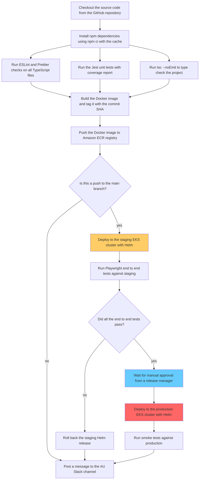
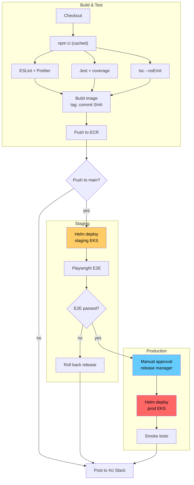
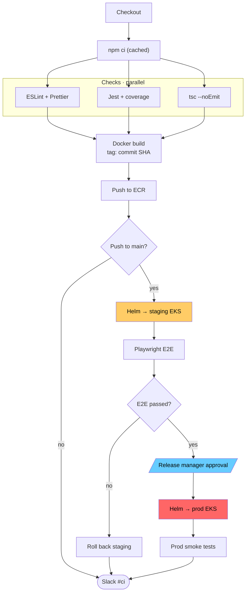

# Case mermaid-cleanup-ci-pipeline-en

## Conversation so far
(none)

## Latest user message
This is the CI/CD diagram in our README and it renders as an unreadable mess on GitHub, the boxes are huge and the arrows cross everywhere. Can you clean it up? Don't lose any of the logic.

## Rubric (what a strong answer does)
1. The cleaned diagram explicitly sets a direction (graph/flowchart TD or LR) and uses short node labels (about 1-4 words each) instead of the original full sentences
2. Groups the stages into logical sections (e.g. checks, build, staging, production) with subgraph, or splits the diagram, and uses compact syntax such as fan-out/fan-in with & or chained arrows
3. Keeps the colored nodes' meaning understandable by adding a legend or note explaining the colors, or explicitly explains why the styling was changed or dropped
4. Preserves all the original logic: the three parallel checks feeding the build, the main-branch decision, e2e pass/fail with rollback, manual approval before production, smoke tests, and the Slack notification paths; the code is valid-looking Mermaid a reader could paste back into the README

## Answer A
Here's the cleaned-up diagram:

What changed:
- **Set a direction (`graph TD`).** The original had just `graph`, so the renderer picked the layout. That's a big reason the arrows crossed everywhere.
- **Shortened the labels to 1–4 words.** Long sentences are what made the boxes so big. Where a detail matters (SHA tag, which cluster), I kept it on a second line with ` `.
- **Grouped the steps into three subgraphs:** Build & Test, Staging and Production. Each stage now reads as one block, and the happy path runs straight down.
- **Put the Slack node last.** It receives three arrows (not main, rollback, smoke tests), so placing it at the bottom keeps those arrows from crossing the rest.
- **Kept your colors and added `color:#000`.** Black text stays readable on the colored boxes in GitHub's dark theme.

Every node, edge and branch from the original is still there. Only the IDs and label wording changed.

Two things the original diagram doesn't show, which I left as they were:
- The Slack node is a single "post a message" step on three different paths: success, not-main and rollback. Its old ID (`notify_slack_failure_or_done`) suggests you meant to send different messages for failure and success. If so, it might be worth splitting it into two nodes.
- Lint, test, type-check and smoke-test failures have no edge. The pipeline presumably just stops there. If those failures also post to Slack, the diagram currently hides that.

## Answer B
Here is the cleaned-up diagram:

What changed:
- **Short labels.** Each box now holds 2 to 4 words, which fixes the huge boxes. The detail that matters (SHA tag, npm cache, Helm, EKS) stays in.
- **`flowchart TD` with an explicit direction.** Your original used a bare `graph` with no direction.
- **The three checks sit side by side in a subgraph,** so the fan-out and fan-in draw as clean parallel lines.
- **Slack is declared last.** It's a single shared end node, so it lands at the bottom and the three arrows into it stop cutting across the deploy path. This removes most of the crossings.
- **Same colours, now in `classDef`s,** plus `color:#000` so the text stays readable in GitHub dark mode. Manual approval is drawn as a parallelogram to mark it as a human step.

The logic is unchanged: 18 nodes, the same edges, the same yes/no branches, and one Slack node fed from three places.

Two gaps in the pipeline itself that the diagram now makes easier to see. I've left both as they are:
- Nothing handles a failed lint, test, type check, build or push. In practice the job just fails, but no Slack message appears on those paths.
- If the production smoke tests fail, there's no rollback. The flow goes straight to Slack, just as it does when they pass. Staging has a rollback and production doesn't. If that isn't intended, add a `smokeOk{Smoke passed?}` decision with a `Roll back prod` branch.

