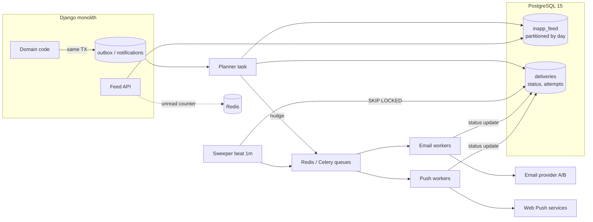

## Коротко

Не советую начинать в следующем спринте с Go + Kafka + Cassandra + Kubernetes. Дубли и потери писем происходят из-за **семантики доставки**: нет идемпотентности, нет надёжного хранения состояния отправки, повторные попытки заканчиваются слишком рано. Масштаб тут ни при чём. Kafka сама по себе даёт at-least-once, то есть дубли останутся. Cassandra не спасает письма, потерянные во время аварии провайдера. При этом ваша нагрузка (десятки RPS в среднем, сотни RPS в пике, ~300 млн строк ленты) спокойно помещается в PostgreSQL 15.

Моя рекомендация: чинить корневые причины внутри монолита, в отдельном модуле с чёткой границей. Состояние доставки хранить в Postgres, Celery использовать только как исполнитель. Ленту партиционировать по времени. Выносить в отдельный сервис стоит тогда, когда сработают измеримые триггеры (они перечислены ниже). Тогда вынос будет механическим, а не переписыванием.

---

## Оценка нагрузки

Считаю грубо. Допущение: каждое уведомление создаёт запись в ленте, часть из них ещё email/push.

| Величина | Расчёт | Итог |
|---|---|---|
| Уведомлений в сутки | 150 тыс. × 20 | **~3 млн/сутки** |
| Средний поток | 3 млн / 86 400 с | **~35/с** |
| Утренний пик | допустим, 30% суточного объёма за 2 часа: 900 тыс. / 7 200 с | **~125/с**, всплески ×3–4 → **до ~500/с** |
| Строк в ленте за 90 дней | 3 млн × 90 | **~270 млн** |
| Объём ленты | ~0,5 КБ на строку с индексами × 270 млн | **~130–200 ГБ** |
| Записи доставки (email/push) | если хотя бы 30% уходят во внешние каналы, это ~1 млн/сутки | ~12/с в среднем |

Что из этого следует:
- **~500 insert/s в пике** для PostgreSQL 15 на нормальном железе — это немного, особенно если писать пачками (`bulk_create`/`COPY` при массовой рассылке).
- **~200 ГБ с ретеншном через `DROP PARTITION`** — обычная задача для Postgres. Cassandra начинает окупаться на миллиардах строк, при multi-region записи или при write-нагрузке порядка десятков тысяч в секунду. У вас порядок величины на 1–2 ниже.
- **35–500 событий/с** не требуют Kafka. Её сильные стороны — много независимых потребителей, replay истории и очень высокий throughput. Судя по описанию, вам сейчас не нужно ни то, ни другое.

Цифры пиков — предположение. Прежде чем что-то решать, снимите реальное распределение по часам из логов Celery или провайдера.

---

## Почему текущая система ломается

| Симптом | Вероятная причина | Что реально лечит |
|---|---|---|
| Дубли писем | Celery даёт at-least-once: воркер упал после отправки, но до ack, и таск перезапустился. С Redis-брокером таски с долгим ETA/countdown ещё и перевыдаются после `visibility_timeout` (по умолчанию, насколько помню, 1 час; проверьте в документации Celery/Kombu) | Ключ идемпотентности плюс запись о доставке в БД с unique-constraint. Отправка разрешена только из статуса `pending` |
| Потеря писем при двухчасовой аварии | Ретраи закончились через несколько минут (`max_retries` × малый backoff), либо таск жил только в Redis и пропал при рестарте или вытеснении | Долговременное состояние в Postgres, backoff на часы, sweeper, который поднимает зависшие доставки. Опционально — резервный провайдер |

Ни одна из этих причин не устраняется сменой языка, брокера или хранилища. Перенос на Kafka без идемпотентности даст те же дубли, только на новом стеке, который команда не умеет эксплуатировать.

---

## Целевая архитектура (этап 1: модульный монолит)



### Компоненты и поток данных

1. **Событие в той же транзакции (transactional outbox).** Бизнес-код не вызывает `send_email.delay()`, а пишет строку в `notification_outbox` в той же транзакции, что и доменное изменение. Если транзакция откатилась, уведомления нет. Если прошла, уведомление гарантированно будет обработано.
2. **Planner.** Читает outbox, применяет пользовательские настройки (каналы, тихие часы, дайджест) и за один раз создаёт:
   - строки в `inapp_feed` — это и есть лента;
   - строки в `deliveries` — по одной на каждый внешний канал, с `UNIQUE(notification_id, channel)`, статусом, `attempts`, `next_attempt_at`, `idempotency_key`.
3. **Celery только как «толчок».** Сообщение в очереди содержит `delivery_id`, больше ничего. Если сообщение потеряется, sweeper подберёт доставку из БД. Если придёт дважды, воркер увидит, что статус уже не `pending`, и ничего не сделает.
4. **Воркер отправки**:
   ```
   UPDATE deliveries SET status='sending', locked_until=now()+'5m'
   WHERE id=:id AND status IN ('pending','retry') AND next_attempt_at <= now()
   RETURNING ...
   ```
   Если строк 0 — выход. Иначе отправка через провайдера с `idempotency_key`, если провайдер его поддерживает (это сильно зависит от провайдера, проверьте в документации). После ответа — `sent` / `retry` (с экспоненциальным backoff, суммарно до 24–48 ч) / `failed`.
5. **Sweeper** (Celery beat раз в минуту): `SELECT ... WHERE status IN ('pending','retry') AND next_attempt_at <= now() OR (status='sending' AND locked_until < now()) FOR UPDATE SKIP LOCKED LIMIT 1000`, после чего снова ставит найденное в очередь. Этот механизм и закрывает сценарий «провайдер лежал 2 часа».
6. **Отдельные очереди на канал** (`email`, `push`, `planner`) со своими пулами воркеров и rate limit. Если email-провайдер тормозит, push и лента продолжают работать.
7. **Лента.** Таблица `inapp_feed` с декларативным партиционированием по дню или неделе и индексом `(user_id, created_at DESC)` в каждой партиции. Ретеншн — ежедневный `DROP` старой партиции (pg_partman или свой cron), никаких массовых `DELETE`. Счётчик непрочитанных хранится в Redis и в денормализованном поле, Redis при этом — только кэш.

### Остаточный риск дублей

Exactly-once при отправке во внешний мир невозможен. Если провайдер принял письмо, а ответ до вас не дошёл, повторная отправка неизбежна, если только провайдер не поддерживает idempotency key. Цель — сделать дубли редкими и измеримыми, а не «нулевыми по построению».

---

## Trade-off: главное решение

| Вариант | Плюсы | Минусы | Когда уместен |
|---|---|---|---|
| **A. Модуль в монолите + Postgres outbox + Celery** | Чинит обе проблемы. Знакомый стек, 0 новых систем в эксплуатации. Первые результаты через 2–4 недели. Транзакционная консистентность с доменом | Нагрузка ложится на общий Postgres. Масштабирование ограничено одним primary. Деплой общий с монолитом | Сейчас: 4 человека, ~500/с в пике, ~200 ГБ |
| **B. Отдельный сервис на Go/Python + Postgres + managed-очередь (SQS/Pub/Sub/RabbitMQ)** | Независимый деплой и масштабирование. Изоляция отказов | Сетевые границы, распределённые транзакции (outbox всё равно нужен). Второй кодбейс и второй язык для 4 человек | Когда сработают триггеры ниже |
| **C. Предложение CTO: Go + Kafka + Cassandra + K8s** | Запас по масштабу на порядки. Replay событий | Четыре новые технологии одновременно, опыта эксплуатации ни у кого нет. Cassandra требует моделирования под запросы, tombstones от TTL, repair. У Kafka свои ребалансы, retention, schema evolution. Дубли и потери сами по себе не исчезают | Миллионы событий/с, много потребителей шины, отдельная платформенная команда |

**Рекомендую A, с границами, которые позволят позже перейти к B.** C, по моей оценке, для вашего масштаба и команды — большой риск без выигрыша.

---

## Pre-mortem плана CTO (полгода спустя, всё провалилось)

1. **Cassandra на 3 ноды, без опыта.** Лента тормозит из-за tombstones от TTL (90 дней), repair никто не настроил, после отказа ноды данные расходятся. Команда месяц разбирается в compaction strategies.
2. **Kafka.** Consumer group ребалансится на каждом деплое в K8s, во время ребаланса сообщения обрабатываются повторно. Дубли остались, потому что идемпотентность так и не сделали: «Kafka же надёжная».
3. **Двойная система.** Миграция затянулась, старые Celery-таски и новый сервис живут одновременно, и часть пользователей получает одно и то же уведомление из обоих.
4. **Bus factor.** Go-сервис знает один человек из четырёх. Он уходит в отпуск во время инцидента.
5. **Продуктовая работа стоит 2–3 квартала**, а бизнес-метрика («письма не теряются») не сдвинулась.

Самое вероятное и самое дорогое здесь — пункты 2 и 5: исходная проблема не решена, а ресурсы потрачены.

---

## План перехода

**Спринт 0 (≈1 неделя) — измерить, прежде чем чинить**
- Метрики: сколько дублей (по `Message-ID`/логам провайдера), сколько потерь, латентность от события до доставки, распределение нагрузки по часам.
- Найти, где именно рвётся: настройки `acks_late`, `max_retries`, `visibility_timeout`, persistence Redis.
- Без этих чисел нельзя будет доказать, что стало лучше.

**Этап 1 (2–3 спринта) — надёжность доставки**
- Таблица `deliveries` со state machine и unique-constraint, воркеры с атомарным захватом, backoff до 24–48 ч, sweeper.
- Circuit breaker на провайдера: при серии ошибок не долбить его, а переводить доставки в `retry` с отложенным `next_attempt_at`.
- Для web-push: удалять подписки на ответ 410 Gone.
- **Критерий готовности:** контролируемый прогон с заглушенным провайдером на 2 часа (chaos-тест на staging) — 0 потерь, дубли в пределах целевого порога.

**Этап 2 (1–2 спринта) — outbox и модульная граница**
- Весь код, который шлёт уведомления, вызывает один фасад `notifications.publish(event)`, который пишет в outbox. Прямые `.delay()` запрещены линтером или code review.
- Модуль `notifications` не импортирует чужие модели, а соседи не лезут в его таблицы. Именно это делает будущий вынос в сервис дешёвым.
- Опционально: второй email-провайдер как failover.

**Этап 3 (2 спринта) — лента на партициях, без даунтайма**
1. Создать партиционированную `inapp_feed_v2`.
2. Dual-write: planner пишет в старую и новую.
3. Backfill 90 дней батчами в низкую нагрузку.
4. Сверка количества строк и выборочно содержимого.
5. Переключить чтение фичефлагом (на долю компаний, потом на всех).
6. Остановить запись в старую таблицу, через пару недель удалить её.

Чтение ленты можно направить на реплику, но с учётом replication lag: после «отметить прочитанным» читать с primary или обновлять UI оптимистично.

**Этап 4 — продуктовые фичи** на новой основе: настройки каналов, дайджесты, throttling (не больше N писем в час на пользователя).

---

## Когда действительно выносить в отдельный сервис

Сразу договоритесь с CTO об объективных триггерах. Тогда это станет решением по данным, а не спором вкусов:

- устойчивый пик > ~2–3 тыс. уведомлений/с, **или**
- таблицы уведомлений дают > ~30–40% write-нагрузки/IO primary, и это мешает основному продукту, **или**
- появились другие продукты или сервисы, которым нужно слать уведомления, **или**
- у уведомлений появилась отдельная команда.

Даже тогда шаг — сервис со своим Postgres и managed-очередью (вариант B). Kafka имеет смысл добавлять, когда появятся несколько независимых потребителей событий или понадобится replay, и лучше в managed-виде. Cassandra — только если Postgres с партициями упрётся в запись, чего на вашем профиле я не ожидаю в обозримом горизонте. Пороги выше — ориентиры по опыту, а не жёсткие числа. Уточните их по своим метрикам.

---

## Что мониторить с первого дня

- `deliveries` по статусам: рост `retry`/`pending` старше N минут → алерт.
- Возраст самой старой необработанной строки outbox → алерт, если больше 5 минут.
- Доля ошибок у провайдера и состояние circuit breaker.
- Процент дублей (по idempotency key и логам провайдера), p95 задержки от события до доставки.
- Размер партиций ленты и отработка cron'а ретеншна: если партиции не удаляются, диск закончится тихо.

Если нужно, могу расписать DDL для `deliveries`/`inapp_feed` и псевдокод воркера и sweeper, или подготовить одностраничник для разговора с CTO: сравнение вариантов с цифрами и триггерами выноса.
