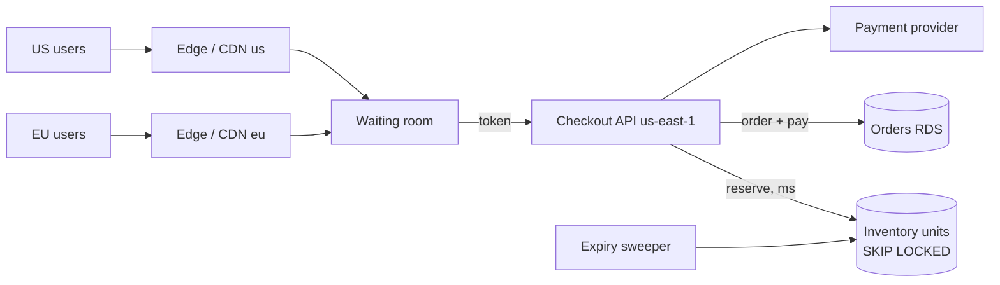

**Short answer: the plan doesn't hold up. The part that breaks is the inventory counter.** A multi-region replicated table where each region decrements locally will oversell a 5,000-pair drop. The situation where that is most likely is also the one you're building for: thousands of concurrent decrements on a single hot row. Active-active for the rest of checkout adds a lot of complexity to fix a 250 ms problem that is probably cheaper to fix another way. I'd keep one authoritative owner per unit of stock and move the latency work to the edge and the request path.

---

### Why the replicated counter fails

The principle: **you can't get strict inventory correctness (never sell pair #5,001) and local low-latency writes in two regions at the same time.** That's the CAP/PACELC trade-off, and a scarce, hot, high-contention counter is the worst case for it.

What actually happens in the multi-master options:

- **Asynchronous multi-master replication** (DynamoDB Global Tables, pglogical/BDR-style Postgres, etc.): each region checks `stock > 0` against its local copy and decrements. Replication then reconciles, usually by last-writer-wins. With 1,000+ decrements per second on one item and replication lag probably in the hundreds of milliseconds to around a second, both regions will sell the same last few hundred pairs. As I recall, DynamoDB Global Tables resolve conflicts with last-writer-wins, and conditional writes are only evaluated in the local region (recalled, not verified; confirm in the AWS docs). That means a conditional `stock > 0` check does not protect you across regions.
- **Synchronous or strongly consistent multi-region storage** (single-writer with write forwarding, Spanner-style consensus): this is correct, but every decrement pays a cross-region round trip. That's the latency you were trying to remove, and now it lands on the most contended row in the system.

So you'd be either oversold or not faster. Overselling a limited drop is the expensive failure: cancellation emails, chargebacks, social-media blowback. Given a choice between an extra 80 ms for EU users and a small chance of overselling 5,000 pairs, most businesses would probably take the latency.

### Back-of-envelope numbers

- 30k attempts in 120 s is **~250 req/s on average**. Drops are front-loaded, so I'd assume **1,000–3,000 req/s in the first 5–10 s**.
- Split: ~18k US and ~12k EU attempts.
- Demand vs. supply is **6:1**. About 25k attempts *must* fail fast. The core job is rejecting cheaply and fairly, not raw throughput.
- The hot row: a single Postgres `UPDATE inventory SET qty = qty - 1 WHERE sku = ? AND qty > 0` serializes on the row lock. At ~1 ms of lock hold time, that's roughly 1k/s at best. If the lock is held across a payment call (300–2,000 ms), the ceiling is **single-digit per second** and everything queues. How long the lock is held matters far more than which region the row lives in.
- Latency: us-east-1 to eu-west-1 RTT is probably around 70–90 ms (recalled, not verified; measure it). An extra **250 ms** suggests about 3 sequential cross-Atlantic round trips per checkout, e.g. TLS handshake, then API call, then a chatty backend. That's fixable without moving data.

### What I'd change

**1. Split inventory into a fast reservation step and a slow payment step.**
- Reserve: atomically claim one unit and get a reservation with a TTL (e.g. 5–10 min). This is the only operation that touches the hot data, and it must take milliseconds.
- Pay: charge the card against the reservation. No inventory locks are held here.
- Expire: a sweeper returns unpaid reservations to the pool.

Implement the reserve step as one of these, not as a hot counter row:
- **Pre-minted units**: 5,000 rows, one per pair, claimed with `SELECT ... FOR UPDATE SKIP LOCKED LIMIT 1`. Concurrent buyers take *different* rows, so there's no single-row lock queue. This runs on your existing RDS.
- **Redis/ElastiCache atomic decrement (Lua script)** in front of Postgres, with Postgres as the system of record. It's faster but adds a component and a durability/reconciliation story. I'd only add it if load testing shows SKIP LOCKED can't keep up, which I doubt at these numbers.

**2. Keep a single inventory owner at first (us-east-1) and cut EU latency at the edge.**
- Terminate TLS close to EU users (CloudFront or Global Accelerator) and keep warm, persistent connections to us-east-1. That removes the handshake round trips.
- Collapse checkout into **one cross-region call**: reserve plus create order in a single request, idempotency key included.
- Serve everything static and cacheable (product page, drop countdown, "sold out" state) from the CDN.
- Realistically this should bring the EU penalty down to about one RTT (~80 ms) on the reserve call. I'd measure that before building any multi-region infrastructure.

**3. Put a waiting room / admission control in front of the drop.**
With 6:1 oversubscription you want a queue that admits users at a rate the reserve path can handle, issues signed tokens, and puts the queue position (not the database) in charge of fairness. This does more for both EU and US experience than regional writes would. It also protects the rest of the store from the drop. The 30k "attempts" from the test drop may well include bots; token gating plus rate limits per account/card/device will change that number.

**4. If you still need regional writes later: partition stock, don't replicate it.**
Give each region an **allocation** (escrow), e.g. 3,000 US / 2,000 EU matching the 60/40 split. Each region is the sole authority for its own units, so decrements are local, fast and can't oversell. A rebalancer moves unsold or expired units between regions after the first N seconds, or when one side sells out.
- You give up global fairness: an EU user may see "sold out" while the US still has stock, until the next rebalance.
- You gain: no cross-region coordination on the hot path, and each region keeps selling its own allocation through an inter-region partition.

**5. Orders per region: reasonable, but name the costs.**
Regional order databases are defensible, and GDPR data residency may even favour them. But you'll need:
- a global order view for fulfillment, customer support and finance (CDC into a warehouse or a read replica),
- idempotency keys that are globally unique so retries across regions don't double-create orders,
- a decision on which region owns a customer who travels or gets routed differently between requests.
I'd defer this until after the drop fix. It's not needed for the latency problem.

### Target architecture (phase 1)

### Trade-offs

| Option | Pros | Cons | Best when |
|---|---|---|---|
| Replicated multi-master counter (your plan) | Local writes | Oversells under contention; conflict resolution on money-backed stock | Never for scarce inventory |
| Single owner + edge optimisation | Correct, simple, uses existing RDS; ~80 ms EU penalty on one call | EU still pays one RTT; single-region blast radius | Now. Fits your scale |
| Regional allocations (escrow) | Local, fast, partition-tolerant, no oversell | Rebalancing logic; perceived unfairness across regions | EU latency still matters after phase 1, or you need regional resilience |
| Strongly consistent global DB | Correct and global | Cross-region write latency on every decrement; new tech and cost | Broader global-consistency needs beyond drops |

**Recommendation:** single owner plus a reservation model plus a waiting room plus edge termination. Measure one drop. Move to regional allocations only if the remaining ~80 ms is shown to cost conversions.

### Failure modes (pre-mortem: "the drop went badly, why?")

1. **Hot-row meltdown**: the lock is held across payment and checkout stalls. *Mitigation:* reserve/pay split, SKIP LOCKED units, load test at 3k req/s. *Early signal:* lock wait time and p99 on reserve.
2. **Retry storm**: clients and load balancers retry on timeouts and double the load. *Mitigation:* idempotency keys, client backoff, waiting-room admission rate. *Signal:* request rate above admitted rate.
3. **Bots take the stock**: *Mitigation:* per-account/card/address limits, challenge at the queue. *Signal:* purchases per payment instrument.
4. **Reservations leak**: the sweeper fails and stock appears sold out while pairs sit unsold. *Mitigation:* TTL enforced in the claim query itself, not only by the sweeper. *Signal:* reserved-but-unpaid count after TTL.
5. **us-east-1 goes down mid-drop**: with a single owner, the drop pauses. *Mitigation:* the waiting room holds users and shows status; accept this risk for phase 1, or adopt regional allocations if you can't.
6. **Payment provider throttling**: at your peak, confirm your PSP's rate limits before the drop (I don't know yours).

Monitor these during the drop: reserve p50/p99, reservations issued vs. paid vs. expired, units remaining, lock waits, 5xx rate, and payment decline/timeout rate. Deploy the drop code with a canary well before drop day, and keep a feature flag that pauses admissions.
