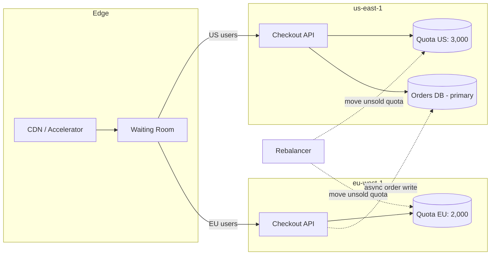

## Bottom line

**The plan doesn't hold up as written.** Decrementing a multi-region replicated counter locally in each region is how you oversell limited stock. Replication between regions is asynchronous, so both regions can see "3 left" and each sell 3. For a 5,000-pair drop with about 6x more demand than supply, that race will happen in the first seconds of every drop, not just in rare edge cases.

It also targets the wrong problem. With 30k attempts for 5k units, about 25k checkouts will fail no matter how fast the path is. The problems to solve are **hot-row contention, oversell and fairness**. EU latency is a secondary issue, and you can fix it much more cheaply.

What I'd change:
1. **Don't replicate the counter. Partition it.** Give each region a fixed quota of the stock (escrow/allocation pattern), and let each region decrement its own quota with strong local consistency.
2. **Change the checkout model from first-come to reserve-then-pay**, ideally behind a waiting room or raffle.
3. **Fix the 250 ms with edge termination and fewer cross-region round trips** before committing to full active-active.
4. **Put per-region order databases on hold** unless you have a reason beyond latency, such as data residency.

---

## Estimation

| Quantity | Math | Result |
|---|---|---|
| Average checkout rate | 30,000 / 120 s | ~250/s |
| Peak rate (drops are front-loaded, assume 5–10x in the first ~10 s) | 250 × 5–10 | **~1,250–2,500/s** |
| US / EU split | 60/40 | ~1,500/s US, ~1,000/s EU at peak |
| Stock | 5,000 pairs | Likely sold out in **~5–20 s** at the peak rate if every attempt converts |
| Failed attempts | 30k − 5k | **~25k (83%)** |

**Hot-row ceiling:** the naive `UPDATE inventory SET stock = stock - 1 WHERE sku = $1 AND stock > 0` serializes on one row lock. If each transaction holds the lock for about 1–5 ms (lock, write, WAL flush, commit), one row handles roughly **200–1,000 decrements/s**. That's below your projected peak. This is an estimate: measure it with a load test on your RDS instance class. Contention is probably your real bottleneck today, in both regions.

**Where the 250 ms comes from:** us-east-1 ↔ eu-west-1 RTT is roughly 70–80 ms (recalled, not verified; measure it). A 250 ms penalty therefore means about **3 sequential cross-Atlantic round trips** per checkout: TLS handshake to a US origin, then several chatty API calls. It is not one unavoidable hop, and most of it can be removed without moving any data.

---

## Why the replicated counter breaks

Whatever the product (DynamoDB global tables, Postgres logical replication, a CRDT counter), async multi-region replication gives you one of two outcomes:

- **Last-writer-wins on the stock value.** Concurrent decrements overwrite each other: US writes `stock=41` and EU writes `stock=41` from the same `42`, and one sale is lost from the count. You oversell.
- **Conditional writes are checked only against the local replica.** `stock > 0` is true in both regions at the same time, so you oversell by up to (in-flight decrements × replication lag).

For DynamoDB global tables specifically, conflict resolution is last-writer-wins for the default (eventually consistent) mode, as I recall. AWS added a **multi-region strong consistency** option in 2025 (recalled, not verified; check current region support and constraints). Strongly consistent writes pay cross-region coordination latency on every write, though. That gives back the latency you were trying to remove, and on the hottest item you sell.

The underlying principle is that **a globally scarce resource can't be both decremented locally and strongly consistent without coordination.** You pick two of: local latency, no oversell, and use of all the stock. Escrow picks local latency and no oversell, and recovers most of the third through rebalancing.

---

## Recommended design



### 1. Inventory: per-region quotas instead of a shared counter

- Before the drop, split the stock: **3,000 to US and 2,000 to EU**, matching the 60/40 demand.
- Each region holds its quota in its **own local store** with strong local consistency. EU checkouts reserve stock in Frankfurt/Dublin latency terms and never cross the Atlantic.
- A single-region coordinator in us-east-1 **moves unsold quota** from one region to the other, for example at T+30 s and T+60 s, or when one region hits 0 while the other has more than N left. Transfers are 2-phase: debit the source, then credit the destination. You can never create stock, only strand it for a few seconds.
- **Removing hot-row contention:** instead of one counter row, pre-create one row per unit (3,000 rows in US). Claim a unit with:

  ```sql
  UPDATE units SET status = 'held', holder = $1, held_until = now() + interval '10 minutes'
  WHERE id = (
    SELECT id FROM units
    WHERE sku = $2 AND status = 'available'
    LIMIT 1
    FOR UPDATE SKIP LOCKED
  )
  RETURNING id;
  ```

  `SKIP LOCKED` lets concurrent transactions each take a different row instead of queueing on one lock, so throughput scales with connections rather than with one row lock. This uses Postgres you already run, so it adds no new technology. If load tests show Postgres still can't keep up, a Redis `DECR` in front, reconciled into Postgres, is the next step. Justify it with measurements first.

### 2. Checkout: reserve, then pay

- **Reserve** a unit (the SQL above) with a TTL of about 10 min. **Pay** with an idempotency key. **Confirm** by marking the unit sold and writing the order.
- A sweeper releases expired holds back to `available`, which covers abandoned carts and failed payments.
- Never decrement stock at payment time. The payment provider's latency (hundreds of ms to seconds) would sit inside the contended section.

### 3. Waiting room or raffle in front

- With 6x oversubscription, first-come-first-served turns network latency into a fairness problem. EU users start about 80 ms behind, and bots beat everyone. A **virtual waiting room** that admits users at a controlled rate, or a **raffle** (enter during a window, draw winners, winners get a reserved checkout slot), turns the spike from 2,500/s into a steady rate you choose.
- This probably does more for EU customer experience than active-active, and it also addresses bots.

### 4. The 250 ms for EU users

In order of cost:
1. **Terminate TLS at the edge** (CloudFront or Global Accelerator) and keep connections to the origin warm. This removes the handshake round trips.
2. **Collapse chatty checkout calls** into a single request to the origin. Measure with a trace: if you see 3 or more sequential calls to us-east-1, that's your 250 ms.
3. Only then **run the stateless checkout tier and the regional inventory quota in eu-west-1**, as above.

Steps 1 and 2 are likely to bring the gap down to about one RTT (~80 ms) without moving any data.

### 5. Orders: one primary, not one per region

Per-region order databases create ongoing costs: a customer's order history spread across regions, global reporting and fraud checks, refunds routed to the right region, and globally unique IDs (region-prefixed UUIDv7 or similar).

- **Recommendation:** keep a single orders primary in us-east-1. The EU region writes the confirmed order **asynchronously** through a durable queue with an idempotent consumer. The customer's confirmation depends on the local reservation and payment, not on the order row reaching the US.
- **Exception:** if you have EU data-residency obligations, regional order stores become a requirement rather than a latency optimization, and the design changes. Confirm this with your legal/DPO before deciding.

---

## Trade-offs

| Option | Pros | Cons | Best when |
|---|---|---|---|
| **Replicated counter, local decrement (your plan)** | Lowest latency, simple to describe | **Oversells** under concurrent demand; conflicts resolve silently | Stock is plentiful and overselling is cheap (not your case) |
| **Single-region counter (us-east-1)** | Correct, simplest | EU pays ~1 RTT; the hot row caps throughput | Stock is low-volume or you add a waiting room |
| **Globally strongly consistent store** | Correct, one logical counter | Cross-region latency on every write; new technology; cost | You need a global counter and can accept the write latency |
| **Per-region quotas + rebalancing (recommended)** | Local latency, no oversell, survives a region partition | Stock can be stranded briefly; rebalancer logic; quota split may not match demand | Scarce stock with predictable regional demand |

What the recommendation gives up: perfect global first-come ordering (an EU user can get a pair while a US user who clicked earlier doesn't) and a few seconds of possible stranded stock. For a limited-edition drop, a raffle or waiting room makes the first trade-off acceptable.

---

## Failure modes

| Failure | Effect | Handling |
|---|---|---|
| Cross-region link degraded | Rebalancer can't move quota | Each region keeps selling its own quota; no oversell. Rebalance after recovery or run a later "restock" wave. |
| eu-west-1 outage mid-drop | EU quota is stuck | Rebalancer reclaims unheld EU units after a timeout. Held units expire by TTL. |
| Payment provider slow or failing | Holds pile up, stock looks sold out | Hold TTL plus sweeper; show "pending" rather than "sold out"; circuit breaker on payment calls. |
| Duplicate submits or retries | Double charge or double hold | Idempotency key per checkout attempt, enforced on reserve and on payment. |
| Order queue backlog (EU → US) | Order history lags | Customer sees local confirmation; alert on queue age above ~60 s. |
| Bots | Real customers lose | Waiting room, per-account limit enforced at reserve, bot detection at the edge. |

**Pre-mortem (6 months out, what most likely went wrong):**
1. *Oversold 400 pairs and had to cancel orders publicly.* Prevention: never ship a check-then-decrement on replicated state. Add an invariant alert when `sold + held > allocated` for any region.
2. *The first drop melted the database anyway.* Prevention: load-test the reserve path at **3,000/s** (above the estimated peak) before launch. It should be the gating launch criterion.
3. *Active-active took the whole quarter and the drop shipped late.* Prevention: do the edge/TLS fix and the waiting room first. They are independent and deliver most of the value.

## Monitoring for drop day

- Reserve p99 latency per region (target < 100 ms locally), reserve error rate, and lock waits on the `units` table.
- Available / held / sold per region, updated every second, with the invariant check above.
- Hold expiry rate (spikes mean payment trouble), queue age for EU → US orders, and waiting-room admission rate.

## Suggested order of work

1. Trace the EU checkout, then add edge TLS termination and collapse calls. Low risk, weeks not months.
2. Move to the reserve/pay/confirm model with per-unit rows and `SKIP LOCKED`, and load-test it single-region.
3. Add a waiting room or raffle.
4. Add the eu-west-1 checkout tier with a regional quota and the rebalancer.
5. Revisit per-region order databases only if data residency requires it.
