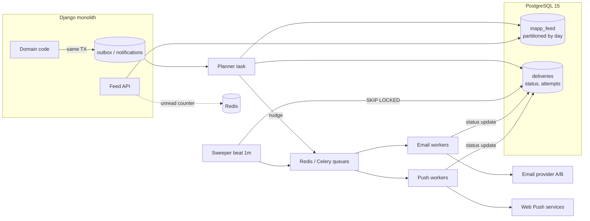
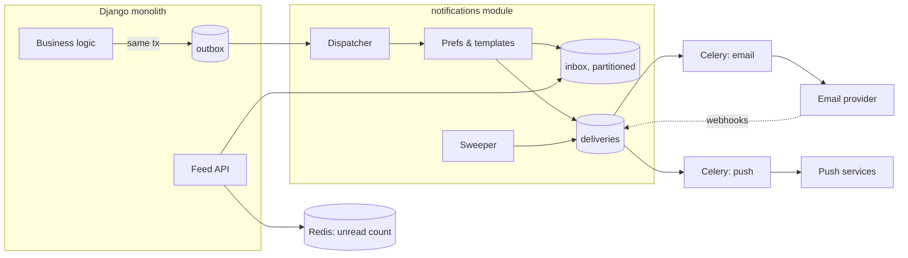

# Case notification-service-kafka-overkill-ru

## Conversation so far
(none)

## Latest user message
Нужен совет по архитектуре. У нас B2B SaaS: монолит на Django 4.2, PostgreSQL 15 (один primary + одна реплика), Redis, Celery. Около 3000 компаний-клиентов, ~150 тыс. активных пользователей. Хотим переделать уведомления (email через внешнего провайдера, web-push, in-app): сейчас в среднем ~20 уведомлений на пользователя в день, пики утром по будням. Храним историю in-app уведомлений 90 дней, чтобы показывать ленту. Сейчас это пачка Celery-тасков прямо в монолите, иногда письма дублируются, а когда у email-провайдера была авария на 2 часа, часть писем просто потерялась.

CTO предлагает выделить отдельный notification-сервис на Go, поставить Kafka как шину событий и Cassandra для хранения ленты, всё в Kubernetes. Команда бэкенда 4 человека, Kafka и Cassandra никто в проде не эксплуатировал. Он хочет начать уже в следующем спринте. Набросай, пожалуйста, архитектуру и план перехода.

## Rubric (what a strong answer does)
1. Does an explicit load estimate from the given figures: roughly 3M notifications/day, which is on the order of tens per second on average and at most hundreds per second at peak, plus a storage estimate for the 90-day feed; and uses these numbers to judge whether the proposed stack is needed.
2. Recommends starting from a simpler design built on the existing stack (e.g. PostgreSQL with a partitioned or time-bounded notifications table, outbox pattern and/or the existing Celery/Redis) and states the conditions under which Kafka or a separate store would become justified, instead of adopting the Kafka+Cassandra+Kubernetes proposal as is.
3. Addresses the stated failures directly: idempotency or deduplication keys to stop duplicate emails, and durable persistence with retries/backoff (or a dead-letter path) so messages survive a multi-hour email provider outage instead of being lost.
4. Makes the trade-offs explicit, including the operational cost for a 4-person team with no production Kafka/Cassandra experience, rather than listing only benefits of either option.

## Answer A
## Коротко

Не советую начинать в следующем спринте с Go + Kafka + Cassandra + Kubernetes. Дубли и потери писем происходят из-за **семантики доставки**: нет идемпотентности, нет надёжного хранения состояния отправки, повторные попытки заканчиваются слишком рано. Масштаб тут ни при чём. Kafka сама по себе даёт at-least-once, то есть дубли останутся. Cassandra не спасает письма, потерянные во время аварии провайдера. При этом ваша нагрузка (десятки RPS в среднем, сотни RPS в пике, ~300 млн строк ленты) спокойно помещается в PostgreSQL 15.

Моя рекомендация: чинить корневые причины внутри монолита, в отдельном модуле с чёткой границей. Состояние доставки хранить в Postgres, Celery использовать только как исполнитель. Ленту партиционировать по времени. Выносить в отдельный сервис стоит тогда, когда сработают измеримые триггеры (они перечислены ниже). Тогда вынос будет механическим, а не переписыванием.

---

## Оценка нагрузки

Считаю грубо. Допущение: каждое уведомление создаёт запись в ленте, часть из них ещё email/push.

| Величина | Расчёт | Итог |
|---|---|---|
| Уведомлений в сутки | 150 тыс. × 20 | **~3 млн/сутки** |
| Средний поток | 3 млн / 86 400 с | **~35/с** |
| Утренний пик | допустим, 30% суточного объёма за 2 часа: 900 тыс. / 7 200 с | **~125/с**, всплески ×3–4 → **до ~500/с** |
| Строк в ленте за 90 дней | 3 млн × 90 | **~270 млн** |
| Объём ленты | ~0,5 КБ на строку с индексами × 270 млн | **~130–200 ГБ** |
| Записи доставки (email/push) | если хотя бы 30% уходят во внешние каналы, это ~1 млн/сутки | ~12/с в среднем |

Что из этого следует:
- **~500 insert/s в пике** для PostgreSQL 15 на нормальном железе — это немного, особенно если писать пачками (`bulk_create`/`COPY` при массовой рассылке).
- **~200 ГБ с ретеншном через `DROP PARTITION`** — обычная задача для Postgres. Cassandra начинает окупаться на миллиардах строк, при multi-region записи или при write-нагрузке порядка десятков тысяч в секунду. У вас порядок величины на 1–2 ниже.
- **35–500 событий/с** не требуют Kafka. Её сильные стороны — много независимых потребителей, replay истории и очень высокий throughput. Судя по описанию, вам сейчас не нужно ни то, ни другое.

Цифры пиков — предположение. Прежде чем что-то решать, снимите реальное распределение по часам из логов Celery или провайдера.

---

## Почему текущая система ломается

| Симптом | Вероятная причина | Что реально лечит |
|---|---|---|
| Дубли писем | Celery даёт at-least-once: воркер упал после отправки, но до ack, и таск перезапустился. С Redis-брокером таски с долгим ETA/countdown ещё и перевыдаются после `visibility_timeout` (по умолчанию, насколько помню, 1 час; проверьте в документации Celery/Kombu) | Ключ идемпотентности плюс запись о доставке в БД с unique-constraint. Отправка разрешена только из статуса `pending` |
| Потеря писем при двухчасовой аварии | Ретраи закончились через несколько минут (`max_retries` × малый backoff), либо таск жил только в Redis и пропал при рестарте или вытеснении | Долговременное состояние в Postgres, backoff на часы, sweeper, который поднимает зависшие доставки. Опционально — резервный провайдер |

Ни одна из этих причин не устраняется сменой языка, брокера или хранилища. Перенос на Kafka без идемпотентности даст те же дубли, только на новом стеке, который команда не умеет эксплуатировать.

---

## Целевая архитектура (этап 1: модульный монолит)



### Компоненты и поток данных

1. **Событие в той же транзакции (transactional outbox).** Бизнес-код не вызывает `send_email.delay()`, а пишет строку в `notification_outbox` в той же транзакции, что и доменное изменение. Если транзакция откатилась, уведомления нет. Если прошла, уведомление гарантированно будет обработано.
2. **Planner.** Читает outbox, применяет пользовательские настройки (каналы, тихие часы, дайджест) и за один раз создаёт:
   - строки в `inapp_feed` — это и есть лента;
   - строки в `deliveries` — по одной на каждый внешний канал, с `UNIQUE(notification_id, channel)`, статусом, `attempts`, `next_attempt_at`, `idempotency_key`.
3. **Celery только как «толчок».** Сообщение в очереди содержит `delivery_id`, больше ничего. Если сообщение потеряется, sweeper подберёт доставку из БД. Если придёт дважды, воркер увидит, что статус уже не `pending`, и ничего не сделает.
4. **Воркер отправки**:
   ```
   UPDATE deliveries SET status='sending', locked_until=now()+'5m'
   WHERE id=:id AND status IN ('pending','retry') AND next_attempt_at <= now()
   RETURNING ...
   ```
   Если строк 0 — выход. Иначе отправка через провайдера с `idempotency_key`, если провайдер его поддерживает (это сильно зависит от провайдера, проверьте в документации). После ответа — `sent` / `retry` (с экспоненциальным backoff, суммарно до 24–48 ч) / `failed`.
5. **Sweeper** (Celery beat раз в минуту): `SELECT ... WHERE status IN ('pending','retry') AND next_attempt_at <= now() OR (status='sending' AND locked_until < now()) FOR UPDATE SKIP LOCKED LIMIT 1000`, после чего снова ставит найденное в очередь. Этот механизм и закрывает сценарий «провайдер лежал 2 часа».
6. **Отдельные очереди на канал** (`email`, `push`, `planner`) со своими пулами воркеров и rate limit. Если email-провайдер тормозит, push и лента продолжают работать.
7. **Лента.** Таблица `inapp_feed` с декларативным партиционированием по дню или неделе и индексом `(user_id, created_at DESC)` в каждой партиции. Ретеншн — ежедневный `DROP` старой партиции (pg_partman или свой cron), никаких массовых `DELETE`. Счётчик непрочитанных хранится в Redis и в денормализованном поле, Redis при этом — только кэш.

### Остаточный риск дублей

Exactly-once при отправке во внешний мир невозможен. Если провайдер принял письмо, а ответ до вас не дошёл, повторная отправка неизбежна, если только провайдер не поддерживает idempotency key. Цель — сделать дубли редкими и измеримыми, а не «нулевыми по построению».

---

## Trade-off: главное решение

| Вариант | Плюсы | Минусы | Когда уместен |
|---|---|---|---|
| **A. Модуль в монолите + Postgres outbox + Celery** | Чинит обе проблемы. Знакомый стек, 0 новых систем в эксплуатации. Первые результаты через 2–4 недели. Транзакционная консистентность с доменом | Нагрузка ложится на общий Postgres. Масштабирование ограничено одним primary. Деплой общий с монолитом | Сейчас: 4 человека, ~500/с в пике, ~200 ГБ |
| **B. Отдельный сервис на Go/Python + Postgres + managed-очередь (SQS/Pub/Sub/RabbitMQ)** | Независимый деплой и масштабирование. Изоляция отказов | Сетевые границы, распределённые транзакции (outbox всё равно нужен). Второй кодбейс и второй язык для 4 человек | Когда сработают триггеры ниже |
| **C. Предложение CTO: Go + Kafka + Cassandra + K8s** | Запас по масштабу на порядки. Replay событий | Четыре новые технологии одновременно, опыта эксплуатации ни у кого нет. Cassandra требует моделирования под запросы, tombstones от TTL, repair. У Kafka свои ребалансы, retention, schema evolution. Дубли и потери сами по себе не исчезают | Миллионы событий/с, много потребителей шины, отдельная платформенная команда |

**Рекомендую A, с границами, которые позволят позже перейти к B.** C, по моей оценке, для вашего масштаба и команды — большой риск без выигрыша.

---

## Pre-mortem плана CTO (полгода спустя, всё провалилось)

1. **Cassandra на 3 ноды, без опыта.** Лента тормозит из-за tombstones от TTL (90 дней), repair никто не настроил, после отказа ноды данные расходятся. Команда месяц разбирается в compaction strategies.
2. **Kafka.** Consumer group ребалансится на каждом деплое в K8s, во время ребаланса сообщения обрабатываются повторно. Дубли остались, потому что идемпотентность так и не сделали: «Kafka же надёжная».
3. **Двойная система.** Миграция затянулась, старые Celery-таски и новый сервис живут одновременно, и часть пользователей получает одно и то же уведомление из обоих.
4. **Bus factor.** Go-сервис знает один человек из четырёх. Он уходит в отпуск во время инцидента.
5. **Продуктовая работа стоит 2–3 квартала**, а бизнес-метрика («письма не теряются») не сдвинулась.

Самое вероятное и самое дорогое здесь — пункты 2 и 5: исходная проблема не решена, а ресурсы потрачены.

---

## План перехода

**Спринт 0 (≈1 неделя) — измерить, прежде чем чинить**
- Метрики: сколько дублей (по `Message-ID`/логам провайдера), сколько потерь, латентность от события до доставки, распределение нагрузки по часам.
- Найти, где именно рвётся: настройки `acks_late`, `max_retries`, `visibility_timeout`, persistence Redis.
- Без этих чисел нельзя будет доказать, что стало лучше.

**Этап 1 (2–3 спринта) — надёжность доставки**
- Таблица `deliveries` со state machine и unique-constraint, воркеры с атомарным захватом, backoff до 24–48 ч, sweeper.
- Circuit breaker на провайдера: при серии ошибок не долбить его, а переводить доставки в `retry` с отложенным `next_attempt_at`.
- Для web-push: удалять подписки на ответ 410 Gone.
- **Критерий готовности:** контролируемый прогон с заглушенным провайдером на 2 часа (chaos-тест на staging) — 0 потерь, дубли в пределах целевого порога.

**Этап 2 (1–2 спринта) — outbox и модульная граница**
- Весь код, который шлёт уведомления, вызывает один фасад `notifications.publish(event)`, который пишет в outbox. Прямые `.delay()` запрещены линтером или code review.
- Модуль `notifications` не импортирует чужие модели, а соседи не лезут в его таблицы. Именно это делает будущий вынос в сервис дешёвым.
- Опционально: второй email-провайдер как failover.

**Этап 3 (2 спринта) — лента на партициях, без даунтайма**
1. Создать партиционированную `inapp_feed_v2`.
2. Dual-write: planner пишет в старую и новую.
3. Backfill 90 дней батчами в низкую нагрузку.
4. Сверка количества строк и выборочно содержимого.
5. Переключить чтение фичефлагом (на долю компаний, потом на всех).
6. Остановить запись в старую таблицу, через пару недель удалить её.

Чтение ленты можно направить на реплику, но с учётом replication lag: после «отметить прочитанным» читать с primary или обновлять UI оптимистично.

**Этап 4 — продуктовые фичи** на новой основе: настройки каналов, дайджесты, throttling (не больше N писем в час на пользователя).

---

## Когда действительно выносить в отдельный сервис

Сразу договоритесь с CTO об объективных триггерах. Тогда это станет решением по данным, а не спором вкусов:

- устойчивый пик > ~2–3 тыс. уведомлений/с, **или**
- таблицы уведомлений дают > ~30–40% write-нагрузки/IO primary, и это мешает основному продукту, **или**
- появились другие продукты или сервисы, которым нужно слать уведомления, **или**
- у уведомлений появилась отдельная команда.

Даже тогда шаг — сервис со своим Postgres и managed-очередью (вариант B). Kafka имеет смысл добавлять, когда появятся несколько независимых потребителей событий или понадобится replay, и лучше в managed-виде. Cassandra — только если Postgres с партициями упрётся в запись, чего на вашем профиле я не ожидаю в обозримом горизонте. Пороги выше — ориентиры по опыту, а не жёсткие числа. Уточните их по своим метрикам.

---

## Что мониторить с первого дня

- `deliveries` по статусам: рост `retry`/`pending` старше N минут → алерт.
- Возраст самой старой необработанной строки outbox → алерт, если больше 5 минут.
- Доля ошибок у провайдера и состояние circuit breaker.
- Процент дублей (по idempotency key и логам провайдера), p95 задержки от события до доставки.
- Размер партиций ленты и отработка cron'а ретеншна: если партиции не удаляются, диск закончится тихо.

Если нужно, могу расписать DDL для `deliveries`/`inapp_feed` и псевдокод воркера и sweeper, или подготовить одностраничник для разговора с CTO: сравнение вариантов с цифрами и триггерами выноса.


## Answer B
## Коротко

Предложение CTO (Go + Kafka + Cassandra + Kubernetes) не устраняет ни одну из двух ваших реальных проблем, а при нагрузке ~3 млн уведомлений в сутки и команде из 4 человек почти наверняка создаст новые. Дубли и потери писем появляются не из-за того, что Celery или PostgreSQL «не тянут». Их причины в отсутствии идемпотентности и в том, что статус доставки нигде не хранится надёжно. Kafka тоже даёт at-least-once, то есть дубли останутся. Если retry-политика не переживает 2 часа аварии, письма будут теряться и с Kafka.

Моя рекомендация: сделать в монолите отдельный модуль уведомлений с чёткими границами. В его основе PostgreSQL как источник истины: transactional outbox, таблица доставок как state machine и партиционированная лента. Celery остаётся исполнителем. Это решает обе проблемы за 1–2 спринта, и позже модуль можно вынести в сервис, если появятся измеримые причины.

---

## 1. Требования (как я их понял)

**Функциональные**
- Каналы: email (внешний провайдер), web-push, in-app лента.
- История in-app хранится 90 дней, лента показывается пользователю, есть счётчик непрочитанных.
- Письмо не должно дублироваться и не должно теряться при временной недоступности провайдера.

**Нефункциональные (часть — мои допущения, проверьте)**
- ~150k активных пользователей, ~20 уведомлений на пользователя в день, пики утром в будни.
- Доставка email/push: секунды или минуты допустимы, это не критичный по латентности путь.
- Чтение ленты: p99 < 200 мс (допущение).
- Гарантия: effectively-once для email с точки зрения пользователя, то есть at-least-once плюс идемпотентность.

**Ограничения**
- 4 бэкенд-разработчика, опыт с Django/PG/Redis/Celery, без опыта эксплуатации Kafka и Cassandra.

**Анти-требования**
- Не нужна шина событий для десятка потребителей: потребитель пока один (уведомления).
- Не нужна мульти-региональная запись.

---

## 2. Оценка нагрузки

| Величина | Расчёт | Итог |
|---|---|---|
| Уведомлений в сутки | 150k × 20 | **3 млн/сутки** |
| Средний поток | 3M / 86 400 с | **~35/с** |
| Пик (утро будней) | допускаю ×10 от среднего | **~350/с** |
| Доставки по каналам | допустим, 1.5 канала на уведомление | **~500 записей/с в пике** |
| Лента за 90 дней | 3M × 90 | **~270 млн строк** |
| Размер строки | ~300–500 байт с JSON-payload | **~100–150 ГБ** данных, **~200–250 ГБ** с индексами |
| Чтения ленты/счётчика | допустим, 10 открытий на пользователя в день → 1.5M/сутки | **~20/с средн., ~200/с пик** |

Вывод: сотни операций записи в секунду для PostgreSQL 15 на нормальном железе — рядовая нагрузка. Таблица на 270 млн строк при партиционировании по времени тоже типична для PG. Kafka и Cassandra рассчитаны на нагрузку на 2–3 порядка выше. Если ваши реальные цифры (доля in-app, коэффициент пика) другие, пересчитайте, но порядок величин вряд ли изменится.

---

## 3. Откуда берутся дубли и потери

Точно сказать без логов я не могу, но это самые вероятные причины, в порядке вероятности.

**Дубли:**
1. **Celery с Redis-брокером даёт at-least-once.** При `acks_late=True` таск, который не успел подтвердиться до `visibility_timeout` (по умолчанию, насколько помню, 1 час; проверьте в документации Celery), будет выдан повторно. Воркер, упавший после отправки письма, но до ack, тоже даёт повтор.
2. **Retry после таймаута провайдера.** Провайдер письмо принял, ответ до вас не дошёл, таск ретраится, и уходит второе письмо.
3. **Двойная постановка таска,** например `.delay()` внутри транзакции, которая потом откатилась и повторилась, или сигналы Django, срабатывающие дважды.

**Потери:**
1. **Retry исчерпывается раньше, чем заканчивается авария.** Дефолты Celery, насколько помню, `max_retries=3` и `default_retry_delay=180` с (проверьте), то есть ~9 минут. Двухчасовую аварию такая политика пережить не может.
2. **Таск существует только в брокере.** После исчерпания ретраев или при потере данных в Redis (без AOF) никакой записи о недоставленном письме не остаётся.
3. **`.delay()` до коммита транзакции** или после неудачного коммита.

Общий принцип: **состояние доставки должно жить в БД, а не в очереди.** Очередь нужна только для исполнения. Это сработает с любой шиной, включая Kafka, а без этого не спасёт ни одна.

---

## 4. Целевая архитектура



### Компоненты

**1. Outbox (таблица `notification_outbox`)**
Бизнес-код пишет событие («счёт выставлен», «задача назначена») в той же транзакции, что и бизнес-данные. Так событие не теряется и не появляется без коммита. Если outbox не нужен повсеместно, минимальный вариант — `transaction.on_commit(lambda: task.delay(...))`, но полноценный outbox надёжнее.

**2. Dispatcher**
Celery-beat-таск или отдельный воркер раз в 1–2 с забирает пачку через `SELECT ... FOR UPDATE SKIP LOCKED LIMIT 500`. Для каждого события он:
- определяет получателей и каналы (настройки пользователя и компании, quiet hours, дайджесты);
- пишет запись в `inbox` (ленту);
- пишет по записи в `deliveries` на каждый внешний канал;
- ставит таски в очередь канала.

**3. Таблица `deliveries` — state machine**
```
id, notification_id, channel, recipient,
idempotency_key UNIQUE,      -- hash(event_id, user_id, channel)
status: pending → sending → sent | failed | dead
attempts, next_attempt_at, last_error, provider_message_id
```
- `UNIQUE(idempotency_key)` не даёт повторно создать доставку.
- Воркер переводит `pending → sending` условным UPDATE (`WHERE status='pending'`). Если обновлено 0 строк, запись уже взял кто-то другой, и воркер выходит.
- В запрос к провайдеру передаётся idempotency key, если провайдер его поддерживает. Многие крупные email-API поддерживают, но конкретно ваш провайдер проверьте. Это закрывает сценарий «принял, но ответ потерялся».

**4. Sweeper (reconciler)**
Периодический таск находит `pending/sending` с `next_attempt_at < now()` (зависшие, упавшие воркеры, потерянные таски в Redis) и ставит их заново. Так брокер перестаёт быть единственным хранилищем состояния: даже если Redis потеряет всё, sweeper восстановит очередь из БД.

**5. Retry-политика**
Экспоненциальный backoff с jitter: 1 мин → 5 → 15 → 30 → 1 ч → … с общим окном **24–48 ч**. После окна статус `dead`, алерт и ручной разбор. Для писем с ограниченным сроком актуальности (одноразовые коды, «встреча через 10 минут») нужно поле `expires_at`: протухшие не отправляем.

**6. Circuit breaker на провайдера**
При доле ошибок > N% за минуту канал ставится на паузу: доставки остаются `pending`, воркеры не жгут ретраи впустую. Опционально второй email-провайдер как fallback. Это прямая защита от повторения двухчасовой аварии.

**7. Лента `inbox`**
- Декларативное партиционирование PG по `created_at` (понедельно или помесячно). Удаление старых данных — `DROP PARTITION`, а не `DELETE` на миллионы строк: без bloat и нагрузки на vacuum.
- Индекс `(user_id, created_at DESC)` в каждой партиции. Запрос ленты — `WHERE user_id = ? AND created_at > now() - interval '90 days' ORDER BY created_at DESC LIMIT 20` с cursor-пагинацией по `(created_at, id)`.
- Управлять партициями можно через `pg_partman` или простой таск, создающий партиции заранее.
- Счётчик непрочитанных — в Redis (`INCR` при создании, сброс при прочтении) с периодической сверкой по БД. Если Redis недоступен, считаем из PG.
- Чтение ленты с реплики возможно, но учитывайте replication lag: после «отметить прочитанным» пользователь может увидеть старое состояние. Проще всего читать ленту с primary, пока нагрузка на него это позволяет, а по цифрам выше позволяет.

**8. Изоляция каналов**
Отдельные Celery-очереди и отдельные пулы воркеров на `email`, `push` и `dispatch`. Авария email-провайдера не должна тормозить push и in-app.

**9. Web-push**
Храните подписки в отдельной таблице. Ответы 404/410 от push-сервиса означают, что подписка мертва: удаляйте её, иначе копятся бесполезные ретраи.

---

## 5. Trade-off анализ

### Шина событий

| Вариант | Плюсы | Минусы | Когда уместен |
|---|---|---|---|
| **PG outbox + Celery/Redis** | Уже в эксплуатации; транзакционность с бизнес-данными из коробки; команда умеет дебажить | Polling outbox; потолок в тысячи событий/с на один primary | До ~1–5k событий/с, один-два потребителя — **ваш случай** |
| **Kafka** | Высокая пропускная способность, replay, много независимых потребителей | Всё равно нужен outbox (dual-write проблема никуда не девается); эксплуатация кластера, ребалансировки, lag, схемы; at-least-once → идемпотентность всё равно нужна | Десятки тысяч событий/с, много команд-потребителей, event sourcing |
| **Managed очередь (SQS/Pub/Sub и т.п.)** | Нет эксплуатации, DLQ из коробки | Новая зависимость, vendor lock-in | Если уже живёте в этом облаке и Redis-брокер станет узким местом |

**Рекомендация:** PG outbox + Celery. Kafka решает задачу пропускной способности, которой у вас нет, и не решает задачу идемпотентности, которая у вас есть.

### Хранилище ленты

| Вариант | Плюсы | Минусы | Когда уместен |
|---|---|---|---|
| **PostgreSQL, партиционирование по времени** | Та же БД, транзакции, JOIN с пользователями и компаниями, бэкапы уже есть; ~250 ГБ — нормальный объём | Растёт нагрузка на единственный primary; нужно следить за vacuum и местом | До единиц ТБ и тысяч записей/с |
| **Cassandra** | Линейное масштабирование записи, TTL из коробки | Минимум 3 ноды; моделирование «под запрос»; tombstones от TTL-удалений бьют по чтению ленты; repair, compaction; никакой экспертизы в команде | Сотни тысяч записей/с, мульти-DC, выделенные люди на эксплуатацию |
| **Отдельный PG-инстанс под уведомления** | Изоляция нагрузки от основного primary | Ещё один инстанс, нет JOIN с основной БД | Если лента начнёт мешать основной нагрузке |

**Рекомендация:** партиционированная таблица в текущем PG. Отдельный PG-инстанс — следующий шаг, если метрики покажут конкуренцию за ресурсы. Проблема tombstones в Cassandra здесь особенно неприятна: сценарий «TTL 90 дней + чтение последних N» — ровно тот паттерн, на котором её часто неправильно готовят.

### Отдельный сервис на Go

| Вариант | Плюсы | Минусы |
|---|---|---|
| **Модуль внутри Django** | Один деплой, общая транзакция, нулевые затраты на межсервисное взаимодействие | Нужна дисциплина границ (свой app, свой публичный интерфейс, никаких прямых импортов моделей снаружи) |
| **Отдельный сервис на Python** | Независимый деплой и скейлинг | Сетевые вызовы, распределённые транзакции, отдельный CI/CD |
| **Отдельный сервис на Go** | Эффективность по CPU и памяти | Всё выше плюс второй язык на 4 человек; выигрыш в производительности не нужен: узкое место в I/O к провайдерам, а не в CPU |

**Рекомендация:** модуль в монолите с жёсткими границами. Выносить в сервис стоит тогда, когда появится причина, которую можно назвать (независимый релизный цикл, другая команда, изоляция отказов, которую не даёт отдельный пул воркеров).

### Kubernetes

Предложение ничего не говорит о текущей платформе. Если вы сейчас не в K8s, то его миграция — отдельный проект, не связанный с уведомлениями. Смешивать эти изменения значит нарушить принцип «одно рискованное изменение за раз».

---

## 6. План перехода

### Этап 0 — остановить кровотечение (1 спринт)
- Idempotency key и `UNIQUE`-ограничение на отправку email: таблица `deliveries` в минимальном виде.
- Retry-политика с окном 24–48 ч и backoff; `expires_at` для срочных писем.
- `transaction.on_commit` для всех постановок тасков.
- Проверить конфигурацию Celery: `acks_late`, `visibility_timeout` больше максимального времени таска, AOF в Redis.
- Метрики: отправлено/ошибки/ретраи по каналам, возраст самого старого `pending`, глубина очередей.

**Критерий готовности:** ноль дублей за неделю (считаем по `provider_message_id` или по логам провайдера); при искусственном отключении провайдера на час все письма уходят после восстановления.

### Этап 1 — модуль и state machine (1–2 спринта)
- Выделить Django-app `notifications` с публичным API вида `notify(event_type, recipients, payload)`. Весь остальной код ходит только через него.
- Outbox, dispatcher, sweeper, circuit breaker.
- Отдельные очереди и пулы воркеров по каналам.
- Webhooks провайдера (bounce, complaint) → статус доставки и suppression list.

### Этап 2 — миграция ленты (1–2 спринта)
1. Создать партиционированную `inbox`.
2. **Dual write:** новые уведомления пишутся в старую и новую таблицы.
3. **Backfill** последних 90 дней пачками в нерабочее время.
4. Сверка (выборочное сравнение лент по пользователям).
5. Переключить чтение на новую таблицу за feature flag, сначала на часть компаний.
6. Через неделю стабильной работы выключить запись в старую таблицу, потом удалить её.

Каждый шаг обратим до шага 6.

### Этап 3 — по необходимости
- Второй email-провайдер как fallback.
- Дайджесты и батчинг (сократят объём email и нагрузку в утренний пик).
- Отдельный PG-инстанс или вынос в сервис — только по триггерам ниже.

### Когда возвращаться к идее CTO
Предложение не абсурдно, оно просто преждевременно. Пересматривать его стоит при любом из триггеров:
- устойчиво > 2–5k событий/с на запись;
- лента > 1 ТБ или заметно влияет на p99 основного primary;
- появляются 3+ независимых потребителя событий (аналитика, аудит, интеграции);
- выделены 1–2 человека на эксплуатацию платформы.

---

## 7. Отказы и масштабирование

| Что ломается | Последствие | Реакция |
|---|---|---|
| Email-провайдер лежит часы | Письма копятся в `pending` | Circuit breaker, ретраи до 48 ч, опционально fallback-провайдер; после восстановления — rate-limited слив, чтобы не упереться в лимиты провайдера |
| Redis (брокер) потерял данные | Таски пропали | Sweeper восстановит из `deliveries` — состояние в PG |
| Воркер упал после отправки, до ack | Повтор таска | Условный UPDATE статуса + idempotency key у провайдера |
| PG primary недоступен | Не создаются новые уведомления, нет ленты | Общая проблема монолита, решается failover на реплику; уведомления не хуже остального приложения |
| Утренний пик | Рост очереди | Автоскейлинг воркеров по глубине очереди; для email задержка в минуты допустима |
| Партиция не создана заранее | Ошибка вставки | Создавать партиции на 2–4 периода вперёд + алерт; default-партиция как страховка |

**Ключевые алерты:** возраст самого старого `pending` > 15 мин; доля `failed` по каналу > 5% за 5 мин; появление `dead`-записей; lag dispatcher по outbox > 1 мин.

---

## 8. Pre-mortem: «прошло 6 месяцев, проект провалился»

С планом CTO самые вероятные сценарии провала такие:
1. **Kafka и Cassandra в проде без экспертизы.** Первый инцидент (ребалансировка, tombstones, закончившееся место на ноде) случается ночью, и чинить его некому.
2. **Дубли остались.** Kafka at-least-once плюс отсутствие идемпотентности дают ту же проблему на новом стеке.
3. **Dual-write.** Монолит пишет в PG и в Kafka без outbox, события теряются при сбоях, то есть появляется новый источник потерь.
4. **Команда 4 человека на 4 новые технологии.** Фичи основного продукта стоят несколько кварталов.
5. **Полуготовая миграция:** старые Celery-таски и новый сервис живут параллельно дольше запланированного, и поддерживать приходится оба.

С моим планом главный риск — **«временное навсегда»**: модуль внутри монолита обрастает связями, и позже вынести его не получается. Митигация: публичный интерфейс модуля, линтер или import-linter на запрет прямых импортов, отдельная схема или префикс таблиц.

---

## Как говорить с CTO

Я бы сказал, что вы с ним не спорите о целях, а предлагаете добраться до них за меньшее число шагов. Покажите расчёт (~350 записей/с, ~250 ГБ) и то, что обе реальные проблемы — дубли и потери — Kafka и Cassandra не решают. Предложите конкретные триггеры, при которых вернётесь к его архитектуре. Этап 0 стоит начать в следующем спринте в любом случае: он нужен при любой целевой архитектуре.

