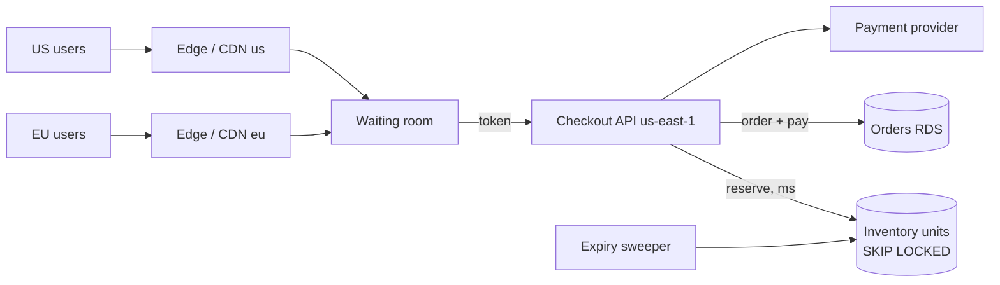
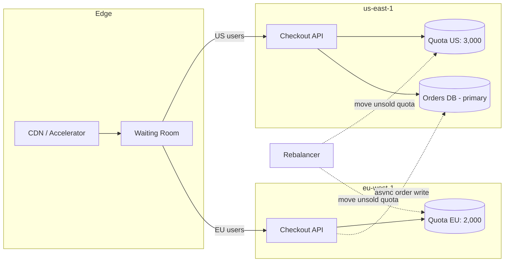

# Case flash-sale-inventory-multi-region-en

## Conversation so far
(none)

## Latest user message
We run an e-commerce platform serving mostly US and EU customers, currently single region (us-east-1), Postgres on RDS for orders and inventory. Next quarter we're doing limited-edition sneaker drops: typically 5,000 pairs per drop, and based on the last test drop we expect ~30k checkout attempts in the first 2 minutes, roughly split 60/40 US/EU. EU users complained about ~250 ms extra latency on checkout.

Our plan: go active-active in us-east-1 and eu-west-1, move the inventory counter into a multi-region replicated table so each region can decrement stock locally with low latency, and keep orders in each region's own database. Does this plan hold up? What would you change?

## Rubric (what a strong answer does)
1. Identifies that letting both regions decrement one shared stock counter with asynchronous (or last-writer-wins) cross-region replication can sell more than 5,000 pairs (concurrent or conflicting updates, and a partition between regions), notes that making the replication strongly consistent would bring back the cross-region latency, and treats overselling as the core risk of the plan.
2. Frames the choice as an explicit consistency-versus-latency/availability trade-off and proposes at least one concrete alternative that prevents overselling, such as a single authoritative write region for inventory reservations, pre-allocating stock quotas per region (e.g. roughly 3,000/2,000 with rebalancing), or a strongly consistent reservation step, stating what each option costs.
3. Uses the given numbers: about 30k attempts in 2 minutes is about 250 requests per second on average, with a higher burst at the start, and notes this is modest for a single well-indexed inventory write path, so the bottleneck is contention on one hot row or counter rather than raw throughput.
4. Covers at least one failure mode beyond overselling, such as abandoned carts or reservation expiry returning stock, payment failure after reservation, or behaviour when one region is unavailable during the drop.

## Answer A
**Short answer: the plan doesn't hold up. The part that breaks is the inventory counter.** A multi-region replicated table where each region decrements locally will oversell a 5,000-pair drop. The situation where that is most likely is also the one you're building for: thousands of concurrent decrements on a single hot row. Active-active for the rest of checkout adds a lot of complexity to fix a 250 ms problem that is probably cheaper to fix another way. I'd keep one authoritative owner per unit of stock and move the latency work to the edge and the request path.

---

### Why the replicated counter fails

The principle: **you can't get strict inventory correctness (never sell pair #5,001) and local low-latency writes in two regions at the same time.** That's the CAP/PACELC trade-off, and a scarce, hot, high-contention counter is the worst case for it.

What actually happens in the multi-master options:

- **Asynchronous multi-master replication** (DynamoDB Global Tables, pglogical/BDR-style Postgres, etc.): each region checks `stock > 0` against its local copy and decrements. Replication then reconciles, usually by last-writer-wins. With 1,000+ decrements per second on one item and replication lag probably in the hundreds of milliseconds to around a second, both regions will sell the same last few hundred pairs. As I recall, DynamoDB Global Tables resolve conflicts with last-writer-wins, and conditional writes are only evaluated in the local region (recalled, not verified; confirm in the AWS docs). That means a conditional `stock > 0` check does not protect you across regions.
- **Synchronous or strongly consistent multi-region storage** (single-writer with write forwarding, Spanner-style consensus): this is correct, but every decrement pays a cross-region round trip. That's the latency you were trying to remove, and now it lands on the most contended row in the system.

So you'd be either oversold or not faster. Overselling a limited drop is the expensive failure: cancellation emails, chargebacks, social-media blowback. Given a choice between an extra 80 ms for EU users and a small chance of overselling 5,000 pairs, most businesses would probably take the latency.

### Back-of-envelope numbers

- 30k attempts in 120 s is **~250 req/s on average**. Drops are front-loaded, so I'd assume **1,000–3,000 req/s in the first 5–10 s**.
- Split: ~18k US and ~12k EU attempts.
- Demand vs. supply is **6:1**. About 25k attempts *must* fail fast. The core job is rejecting cheaply and fairly, not raw throughput.
- The hot row: a single Postgres `UPDATE inventory SET qty = qty - 1 WHERE sku = ? AND qty > 0` serializes on the row lock. At ~1 ms of lock hold time, that's roughly 1k/s at best. If the lock is held across a payment call (300–2,000 ms), the ceiling is **single-digit per second** and everything queues. How long the lock is held matters far more than which region the row lives in.
- Latency: us-east-1 to eu-west-1 RTT is probably around 70–90 ms (recalled, not verified; measure it). An extra **250 ms** suggests about 3 sequential cross-Atlantic round trips per checkout, e.g. TLS handshake, then API call, then a chatty backend. That's fixable without moving data.

### What I'd change

**1. Split inventory into a fast reservation step and a slow payment step.**
- Reserve: atomically claim one unit and get a reservation with a TTL (e.g. 5–10 min). This is the only operation that touches the hot data, and it must take milliseconds.
- Pay: charge the card against the reservation. No inventory locks are held here.
- Expire: a sweeper returns unpaid reservations to the pool.

Implement the reserve step as one of these, not as a hot counter row:
- **Pre-minted units**: 5,000 rows, one per pair, claimed with `SELECT ... FOR UPDATE SKIP LOCKED LIMIT 1`. Concurrent buyers take *different* rows, so there's no single-row lock queue. This runs on your existing RDS.
- **Redis/ElastiCache atomic decrement (Lua script)** in front of Postgres, with Postgres as the system of record. It's faster but adds a component and a durability/reconciliation story. I'd only add it if load testing shows SKIP LOCKED can't keep up, which I doubt at these numbers.

**2. Keep a single inventory owner at first (us-east-1) and cut EU latency at the edge.**
- Terminate TLS close to EU users (CloudFront or Global Accelerator) and keep warm, persistent connections to us-east-1. That removes the handshake round trips.
- Collapse checkout into **one cross-region call**: reserve plus create order in a single request, idempotency key included.
- Serve everything static and cacheable (product page, drop countdown, "sold out" state) from the CDN.
- Realistically this should bring the EU penalty down to about one RTT (~80 ms) on the reserve call. I'd measure that before building any multi-region infrastructure.

**3. Put a waiting room / admission control in front of the drop.**
With 6:1 oversubscription you want a queue that admits users at a rate the reserve path can handle, issues signed tokens, and puts the queue position (not the database) in charge of fairness. This does more for both EU and US experience than regional writes would. It also protects the rest of the store from the drop. The 30k "attempts" from the test drop may well include bots; token gating plus rate limits per account/card/device will change that number.

**4. If you still need regional writes later: partition stock, don't replicate it.**
Give each region an **allocation** (escrow), e.g. 3,000 US / 2,000 EU matching the 60/40 split. Each region is the sole authority for its own units, so decrements are local, fast and can't oversell. A rebalancer moves unsold or expired units between regions after the first N seconds, or when one side sells out.
- You give up global fairness: an EU user may see "sold out" while the US still has stock, until the next rebalance.
- You gain: no cross-region coordination on the hot path, and each region keeps selling its own allocation through an inter-region partition.

**5. Orders per region: reasonable, but name the costs.**
Regional order databases are defensible, and GDPR data residency may even favour them. But you'll need:
- a global order view for fulfillment, customer support and finance (CDC into a warehouse or a read replica),
- idempotency keys that are globally unique so retries across regions don't double-create orders,
- a decision on which region owns a customer who travels or gets routed differently between requests.
I'd defer this until after the drop fix. It's not needed for the latency problem.

### Target architecture (phase 1)



### Trade-offs

| Option | Pros | Cons | Best when |
|---|---|---|---|
| Replicated multi-master counter (your plan) | Local writes | Oversells under contention; conflict resolution on money-backed stock | Never for scarce inventory |
| Single owner + edge optimisation | Correct, simple, uses existing RDS; ~80 ms EU penalty on one call | EU still pays one RTT; single-region blast radius | Now. Fits your scale |
| Regional allocations (escrow) | Local, fast, partition-tolerant, no oversell | Rebalancing logic; perceived unfairness across regions | EU latency still matters after phase 1, or you need regional resilience |
| Strongly consistent global DB | Correct and global | Cross-region write latency on every decrement; new tech and cost | Broader global-consistency needs beyond drops |

**Recommendation:** single owner plus a reservation model plus a waiting room plus edge termination. Measure one drop. Move to regional allocations only if the remaining ~80 ms is shown to cost conversions.

### Failure modes (pre-mortem: "the drop went badly, why?")

1. **Hot-row meltdown**: the lock is held across payment and checkout stalls. *Mitigation:* reserve/pay split, SKIP LOCKED units, load test at 3k req/s. *Early signal:* lock wait time and p99 on reserve.
2. **Retry storm**: clients and load balancers retry on timeouts and double the load. *Mitigation:* idempotency keys, client backoff, waiting-room admission rate. *Signal:* request rate above admitted rate.
3. **Bots take the stock**: *Mitigation:* per-account/card/address limits, challenge at the queue. *Signal:* purchases per payment instrument.
4. **Reservations leak**: the sweeper fails and stock appears sold out while pairs sit unsold. *Mitigation:* TTL enforced in the claim query itself, not only by the sweeper. *Signal:* reserved-but-unpaid count after TTL.
5. **us-east-1 goes down mid-drop**: with a single owner, the drop pauses. *Mitigation:* the waiting room holds users and shows status; accept this risk for phase 1, or adopt regional allocations if you can't.
6. **Payment provider throttling**: at your peak, confirm your PSP's rate limits before the drop (I don't know yours).

Monitor these during the drop: reserve p50/p99, reservations issued vs. paid vs. expired, units remaining, lock waits, 5xx rate, and payment decline/timeout rate. Deploy the drop code with a canary well before drop day, and keep a feature flag that pauses admissions.


## Answer B
## Bottom line

**The plan doesn't hold up as written.** Decrementing a multi-region replicated counter locally in each region is how you oversell limited stock. Replication between regions is asynchronous, so both regions can see "3 left" and each sell 3. For a 5,000-pair drop with about 6x more demand than supply, that race will happen in the first seconds of every drop, not just in rare edge cases.

It also targets the wrong problem. With 30k attempts for 5k units, about 25k checkouts will fail no matter how fast the path is. The problems to solve are **hot-row contention, oversell and fairness**. EU latency is a secondary issue, and you can fix it much more cheaply.

What I'd change:
1. **Don't replicate the counter. Partition it.** Give each region a fixed quota of the stock (escrow/allocation pattern), and let each region decrement its own quota with strong local consistency.
2. **Change the checkout model from first-come to reserve-then-pay**, ideally behind a waiting room or raffle.
3. **Fix the 250 ms with edge termination and fewer cross-region round trips** before committing to full active-active.
4. **Put per-region order databases on hold** unless you have a reason beyond latency, such as data residency.

---

## Estimation

| Quantity | Math | Result |
|---|---|---|
| Average checkout rate | 30,000 / 120 s | ~250/s |
| Peak rate (drops are front-loaded, assume 5–10x in the first ~10 s) | 250 × 5–10 | **~1,250–2,500/s** |
| US / EU split | 60/40 | ~1,500/s US, ~1,000/s EU at peak |
| Stock | 5,000 pairs | Likely sold out in **~5–20 s** at the peak rate if every attempt converts |
| Failed attempts | 30k − 5k | **~25k (83%)** |

**Hot-row ceiling:** the naive `UPDATE inventory SET stock = stock - 1 WHERE sku = $1 AND stock > 0` serializes on one row lock. If each transaction holds the lock for about 1–5 ms (lock, write, WAL flush, commit), one row handles roughly **200–1,000 decrements/s**. That's below your projected peak. This is an estimate: measure it with a load test on your RDS instance class. Contention is probably your real bottleneck today, in both regions.

**Where the 250 ms comes from:** us-east-1 ↔ eu-west-1 RTT is roughly 70–80 ms (recalled, not verified; measure it). A 250 ms penalty therefore means about **3 sequential cross-Atlantic round trips** per checkout: TLS handshake to a US origin, then several chatty API calls. It is not one unavoidable hop, and most of it can be removed without moving any data.

---

## Why the replicated counter breaks

Whatever the product (DynamoDB global tables, Postgres logical replication, a CRDT counter), async multi-region replication gives you one of two outcomes:

- **Last-writer-wins on the stock value.** Concurrent decrements overwrite each other: US writes `stock=41` and EU writes `stock=41` from the same `42`, and one sale is lost from the count. You oversell.
- **Conditional writes are checked only against the local replica.** `stock > 0` is true in both regions at the same time, so you oversell by up to (in-flight decrements × replication lag).

For DynamoDB global tables specifically, conflict resolution is last-writer-wins for the default (eventually consistent) mode, as I recall. AWS added a **multi-region strong consistency** option in 2025 (recalled, not verified; check current region support and constraints). Strongly consistent writes pay cross-region coordination latency on every write, though. That gives back the latency you were trying to remove, and on the hottest item you sell.

The underlying principle is that **a globally scarce resource can't be both decremented locally and strongly consistent without coordination.** You pick two of: local latency, no oversell, and use of all the stock. Escrow picks local latency and no oversell, and recovers most of the third through rebalancing.

---

## Recommended design



### 1. Inventory: per-region quotas instead of a shared counter

- Before the drop, split the stock: **3,000 to US and 2,000 to EU**, matching the 60/40 demand.
- Each region holds its quota in its **own local store** with strong local consistency. EU checkouts reserve stock in Frankfurt/Dublin latency terms and never cross the Atlantic.
- A single-region coordinator in us-east-1 **moves unsold quota** from one region to the other, for example at T+30 s and T+60 s, or when one region hits 0 while the other has more than N left. Transfers are 2-phase: debit the source, then credit the destination. You can never create stock, only strand it for a few seconds.
- **Removing hot-row contention:** instead of one counter row, pre-create one row per unit (3,000 rows in US). Claim a unit with:

  ```sql
  UPDATE units SET status = 'held', holder = $1, held_until = now() + interval '10 minutes'
  WHERE id = (
    SELECT id FROM units
    WHERE sku = $2 AND status = 'available'
    LIMIT 1
    FOR UPDATE SKIP LOCKED
  )
  RETURNING id;
  ```

  `SKIP LOCKED` lets concurrent transactions each take a different row instead of queueing on one lock, so throughput scales with connections rather than with one row lock. This uses Postgres you already run, so it adds no new technology. If load tests show Postgres still can't keep up, a Redis `DECR` in front, reconciled into Postgres, is the next step. Justify it with measurements first.

### 2. Checkout: reserve, then pay

- **Reserve** a unit (the SQL above) with a TTL of about 10 min. **Pay** with an idempotency key. **Confirm** by marking the unit sold and writing the order.
- A sweeper releases expired holds back to `available`, which covers abandoned carts and failed payments.
- Never decrement stock at payment time. The payment provider's latency (hundreds of ms to seconds) would sit inside the contended section.

### 3. Waiting room or raffle in front

- With 6x oversubscription, first-come-first-served turns network latency into a fairness problem. EU users start about 80 ms behind, and bots beat everyone. A **virtual waiting room** that admits users at a controlled rate, or a **raffle** (enter during a window, draw winners, winners get a reserved checkout slot), turns the spike from 2,500/s into a steady rate you choose.
- This probably does more for EU customer experience than active-active, and it also addresses bots.

### 4. The 250 ms for EU users

In order of cost:
1. **Terminate TLS at the edge** (CloudFront or Global Accelerator) and keep connections to the origin warm. This removes the handshake round trips.
2. **Collapse chatty checkout calls** into a single request to the origin. Measure with a trace: if you see 3 or more sequential calls to us-east-1, that's your 250 ms.
3. Only then **run the stateless checkout tier and the regional inventory quota in eu-west-1**, as above.

Steps 1 and 2 are likely to bring the gap down to about one RTT (~80 ms) without moving any data.

### 5. Orders: one primary, not one per region

Per-region order databases create ongoing costs: a customer's order history spread across regions, global reporting and fraud checks, refunds routed to the right region, and globally unique IDs (region-prefixed UUIDv7 or similar).

- **Recommendation:** keep a single orders primary in us-east-1. The EU region writes the confirmed order **asynchronously** through a durable queue with an idempotent consumer. The customer's confirmation depends on the local reservation and payment, not on the order row reaching the US.
- **Exception:** if you have EU data-residency obligations, regional order stores become a requirement rather than a latency optimization, and the design changes. Confirm this with your legal/DPO before deciding.

---

## Trade-offs

| Option | Pros | Cons | Best when |
|---|---|---|---|
| **Replicated counter, local decrement (your plan)** | Lowest latency, simple to describe | **Oversells** under concurrent demand; conflicts resolve silently | Stock is plentiful and overselling is cheap (not your case) |
| **Single-region counter (us-east-1)** | Correct, simplest | EU pays ~1 RTT; the hot row caps throughput | Stock is low-volume or you add a waiting room |
| **Globally strongly consistent store** | Correct, one logical counter | Cross-region latency on every write; new technology; cost | You need a global counter and can accept the write latency |
| **Per-region quotas + rebalancing (recommended)** | Local latency, no oversell, survives a region partition | Stock can be stranded briefly; rebalancer logic; quota split may not match demand | Scarce stock with predictable regional demand |

What the recommendation gives up: perfect global first-come ordering (an EU user can get a pair while a US user who clicked earlier doesn't) and a few seconds of possible stranded stock. For a limited-edition drop, a raffle or waiting room makes the first trade-off acceptable.

---

## Failure modes

| Failure | Effect | Handling |
|---|---|---|
| Cross-region link degraded | Rebalancer can't move quota | Each region keeps selling its own quota; no oversell. Rebalance after recovery or run a later "restock" wave. |
| eu-west-1 outage mid-drop | EU quota is stuck | Rebalancer reclaims unheld EU units after a timeout. Held units expire by TTL. |
| Payment provider slow or failing | Holds pile up, stock looks sold out | Hold TTL plus sweeper; show "pending" rather than "sold out"; circuit breaker on payment calls. |
| Duplicate submits or retries | Double charge or double hold | Idempotency key per checkout attempt, enforced on reserve and on payment. |
| Order queue backlog (EU → US) | Order history lags | Customer sees local confirmation; alert on queue age above ~60 s. |
| Bots | Real customers lose | Waiting room, per-account limit enforced at reserve, bot detection at the edge. |

**Pre-mortem (6 months out, what most likely went wrong):**
1. *Oversold 400 pairs and had to cancel orders publicly.* Prevention: never ship a check-then-decrement on replicated state. Add an invariant alert when `sold + held > allocated` for any region.
2. *The first drop melted the database anyway.* Prevention: load-test the reserve path at **3,000/s** (above the estimated peak) before launch. It should be the gating launch criterion.
3. *Active-active took the whole quarter and the drop shipped late.* Prevention: do the edge/TLS fix and the waiting room first. They are independent and deliver most of the value.

## Monitoring for drop day

- Reserve p99 latency per region (target < 100 ms locally), reserve error rate, and lock waits on the `units` table.
- Available / held / sold per region, updated every second, with the invariant check above.
- Hold expiry rate (spikes mean payment trouble), queue age for EU → US orders, and waiting-room admission rate.

## Suggested order of work

1. Trace the EU checkout, then add edge TLS termination and collapse calls. Low risk, weeks not months.
2. Move to the reserve/pay/confirm model with per-unit rows and `SKIP LOCKED`, and load-test it single-region.
3. Add a waiting room or raffle.
4. Add the eu-west-1 checkout tier with a regional quota and the rebalancer.
5. Revisit per-region order databases only if data residency requires it.

