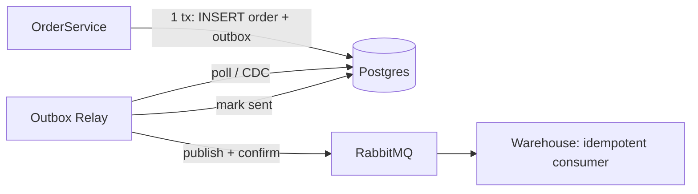

**Коротко:** ни один фикс в текущем виде принимать не стоит. Все три бага — одна и та же проблема **dual write**: сервис пишет в две системы (Postgres + RabbitMQ / Redis / SMTP), а общей транзакции между ними нет. Первый и третий фиксы переносят окно рассогласования в другое место, но не закрывают его. Второй годится как страховка, но причину не устраняет. Лечится всё одним паттерном: **transactional outbox** (или CDC) плюс идемпотентные потребители.

| # | Предложенный фикс | Вердикт | Почему |
|---|---|---|---|
| 1 | Отправка в RabbitMQ внутри транзакции, до коммита | **Переделать** | Меняет одну аномалию на обратную |
| 2 | TTL 5 минут | **Принять как страховку, но не как фикс** | Сокращает окно устаревания, причину не трогает |
| 3 | Ретраи на SMTP | **Переделать** | Первый сценарий закрывает только частично, второй не закрывает вообще |

---

## 1) Заказы: OrderCreated теряется

**Что сломается с предложенным фиксом.** Если слать событие до коммита, то при откате коммита (constraint, deadlock, таймаут, падение пода между `send` и `COMMIT`) склад получит событие о заказе, которого в базе нет. Сейчас бывает «заказ есть, события нет», а станет «событие есть, заказа нет». Для склада это, вероятно, хуже: он зарезервирует товар под фантомный заказ.

Даже если включить `channelTransacted` у `RabbitTemplate` и синхронизировать его с DB-транзакцией, это не XA, а best-effort: два коммита идут последовательно, и между ними остаётся окно.

**Почему события теряются сейчас (гипотезы, проверьте по логам):**
- под падает или деплоится между коммитом в Postgres и `convertAndSend`;
- publish уходит без **publisher confirms**: брокер не принял сообщение или оно стало unroutable, а приложение об этом не узнало. «Раз в пару дней» хорошо объясняется именно так: переподключения, failover ноды, рестарты.

Сначала проверьте, включены ли confirms и returns (в Spring Boot это, насколько помню, `spring.rabbitmq.publisher-confirm-type=correlated` и `spring.rabbitmq.publisher-returns=true`; точные ключи сверьте с документацией вашей версии).

**Правильный фикс — transactional outbox:**

- В той же транзакции, что и заказ, пишем строку в таблицу `outbox` (`id, aggregate_id, type, payload, created_at, sent_at`). Атомарность даёт сам Postgres.
- Отдельный relay публикует непосланные строки с publisher confirms и после ack проставляет `sent_at`. Relay — это либо polling (`SELECT ... FOR UPDATE SKIP LOCKED`), либо CDC через Debezium. Debezium — новая инфраструктура, и тащить её стоит только если polling не справляется по задержке или нагрузке. Для заказов polling раз в 0,5–1 с почти наверняка хватит.
- Гарантия получается **at-least-once**, значит склад обязан дедуплицировать по `event_id` или `order_id`. Без этого решение неполное.

Чем платим: задержка доставки растёт на интервал поллинга, плюс нужно чистить outbox (партиционирование по дате или периодический DELETE).

---

## 2) Каталог: старая цена в Redis

**Почему TTL 5 минут — не фикс.** Он не устраняет причину, а лишь ограничивает, сколько длится ошибка: вместо суток максимум 5 минут. Причин, по которым DEL не срабатывает, на самом деле две, и обе остаются:

1. **DEL не выполнился:** таймаут до Redis, под убили после коммита, но до DEL. Это тот же dual write, что и в пункте 1.
2. **Гонка cache-aside**, которую TTL тоже не лечит: читатель промахнулся по кэшу → прочитал из БД старую цену → писатель обновил БД и сделал DEL → читатель записал в кэш старое значение. После этого DEL уже ничего не исправит.

**Цена короткого TTL.** Сутки — это 86 400 с, 5 минут — 300 с, то есть для горячего ключа промахов станет примерно в 288 раз больше. Для каталога это обычно терпимо (один SELECT по PK на ключ раз в 5 минут), но проверьте на своих объёмах: если горячих SKU сотни тысяч, нагрузка на Postgres от перезагрузок станет заметной. Добавьте jitter к TTL, чтобы ключи не истекали пачкой после прогрева.

**Что сделать:**
- **TTL 5 минут оставить как backstop** (с jitter). Эту часть принимаем.
- Инвалидацию сделать надёжной: событие `PriceChanged` через тот же outbox или CDC → consumer делает DEL с ретраями. Так пропущенный DEL перестаёт быть возможным.
- Против гонки: хранить в кэше значение с версией (`updated_at` или `version` из строки) и записывать только если версия не старее текущей (`SET` через Lua-скрипт с проверкой). Более дешёвый, но менее строгий вариант — delayed double delete (повторный DEL через 0,5–1 с).
- Бизнес-вопрос, который важнее техники: **checkout и расчёт суммы заказа должны брать цену из Postgres, а не из кэша.** Тогда устаревшая цена в кэше — это только неудобство на витрине, а не продажа по неверной цене.

---

## 3) Регистрация: welcome-письмо

**Почему ретраи не помогают:**
- Сценарий «письмо ушло, а регистрация откатилась» ретраи вообще не затрагивают: проблема в том, что письмо отправляется **до** коммита. Ретраи только увеличат шанс отправить письмо несуществующему пользователю.
- Сценарий «пользователь есть, письма нет» синхронные ретраи закрывают лишь частично. Если под упал после коммита, ретраить некому. Зато HTTP-запрос регистрации будет висеть, пока идут ретраи к SMTP, а поскольку SMTP не идемпотентен, возможны дубли (таймаут на ответ при фактически отправленном письме).

**Что сделать:**
- Письмо отправлять **только после коммита и асинхронно**. Надёжный вариант — тот же outbox: в транзакции регистрации пишем `outbox(type=WelcomeEmail, user_id)`, воркер отправляет письмо.
- **Ретраи переезжают в воркер**, а не в запрос: экспоненциальный backoff, ограниченное число попыток, dead letter для ручного разбора. В этом смысле идея ретраев правильная, просто не в том месте.
- Дедупликация: флаг или `email_sent_at` у пользователя либо уникальный ключ задачи. Если провайдер поддерживает idempotency key или message-id — используйте его.
- Вариант попроще — `@TransactionalEventListener(phase = AFTER_COMMIT)` + `@Async`. Он закрывает сценарий «письмо ушло, а регистрация откатилась», но при падении пода после коммита письмо всё равно потеряется, потому что событие живёт только в памяти. Для welcome-письма это, может быть, и приемлемый компромисс, но раз outbox всё равно появится ради пункта 1, дешевле переиспользовать его.

---

## Итог для бэклога

- Три тикета у трёх людей — это на самом деле **один архитектурный долг**. Имеет смысл сделать один общий outbox-модуль (таблица + relay + метрики) и подключить к нему все три сервиса, а не чинить каждый по-своему.
- Что мониторить после внедрения: возраст самой старой неотправленной записи в outbox (алерт, например, если больше минуты), число ретраев и DLQ, долю дублей, отброшенных на стороне потребителей.
- Порядок внедрения: п.1 первым — склад и фантомные или потерянные заказы важнее всего для бизнеса. П.2 можно сразу закрыть TTL 5 минут + jitter как временную меру, а надёжную инвалидацию сделать поверх outbox. П.3 — третьим.
