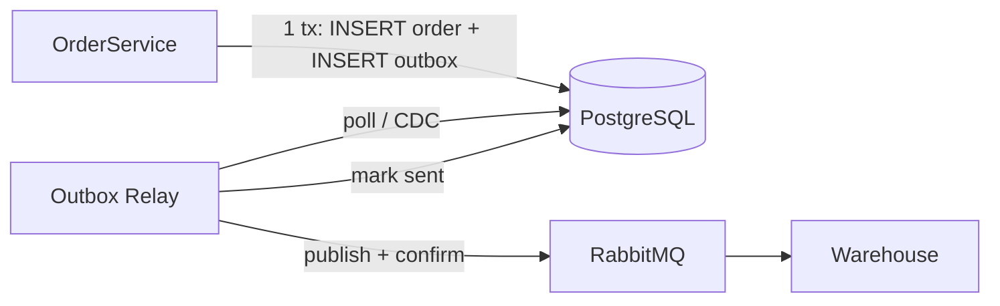

**Коротко:** ни один из трёх фиксов в текущем виде принимать не стоит. Первый делает хуже, второй и третий только сужают окно проблемы. При этом все три бага устроены одинаково: это **dual write**. Сервис пишет в две системы (Postgres + RabbitMQ/Redis/SMTP), а общей транзакции у них нет. Поэтому любой порядок вызовов «сначала A, потом B» ломается, если процесс упадёт, случится таймаут или деплой ровно между A и B. Лечится это не ретраями и не перестановкой вызовов, а тем, чтобы запись в БД стала единственным источником правды, а всё остальное выводилось из неё надёжно и асинхронно.

| # | Предложенный фикс | Вердикт | Что делать вместо |
|---|---|---|---|
| 1 | Отправка в RabbitMQ внутри транзакции | **Отклонить**, будет хуже | Transactional outbox + publisher confirms + идемпотентный консьюмер |
| 2 | TTL 24ч → 5 мин | **Принять только как страховку**, не как фикс | Надёжная инвалидация (outbox/CDC → DEL с ретраями) + delayed double delete или версионирование |
| 3 | Ретраи на SMTP | **Переделать** | Письмо после коммита через outbox-воркер, ретраи и дедупликация в воркере |

---

## 1. Заказы: событие OrderCreated теряется

**Почему предложенный фикс плохой.** Если отправить событие до коммита, баг просто меняет знак:
- Сообщение ушло, а коммит упал (unique constraint, deadlock, таймаут, рестарт пода). Склад получает событие о заказе, **которого нет**. Это «фантомный» заказ, и он хуже потерянного: склад резервирует товар под несуществующий заказ.
- Консьюмер склада может получить событие раньше, чем транзакция закоммитилась. Если он сходит в сервис заказов за деталями, то получит 404.
- RabbitMQ в JDBC-транзакцию не входит. `channelTransacted=true` в Spring AMQP даёт только синхронизацию «best effort»: AMQP-транзакция коммитится после JDBC. Окно между двумя коммитами остаётся, и атомарности нет.

**Что, скорее всего, происходит сейчас.** Событие отправляется после коммита (через `@TransactionalEventListener(phase = AFTER_COMMIT)` или просто в конце метода), и отправка иногда не доходит. Вероятные причины:
- рестарт или деплой между коммитом и `convertAndSend`;
- не включены **publisher confirms**. Без них `convertAndSend` отработал без исключения, а брокер сообщение не принял (разрыв соединения, flow control);
- нет `mandatory`/returns: сообщение ушло в exchange без подходящего binding и молча выброшено;
- неперсистентные сообщения или non-durable очередь при рестарте брокера.

Последние три пункта проверьте в первую очередь: это дешёвая диагностика, и она может объяснить «раз в пару дней» без всякого деплоя.

**Правильный фикс: transactional outbox.**

- В той же транзакции, что и заказ, делаем `INSERT INTO outbox(id, aggregate_id, type, payload, created_at, sent_at)`. Атомарность даёт сам Postgres.
- Relay (отдельный поток или сервис) читает неотправленные записи через `SELECT ... FOR UPDATE SKIP LOCKED LIMIT N`, публикует их, **ждёт publisher confirm** и только потом проставляет `sent_at`. Альтернатива поллингу: CDC через Debezium по WAL. Он даёт меньшую задержку, но добавляет Kafka Connect/Debezium Server в эксплуатацию. Для одного сервиса с умеренной нагрузкой поллинга раз в 100–500 мс почти наверняка хватит.
- Гарантия получается **at-least-once**. Дубли возможны: например, relay упал после confirm, но до `sent_at`. Поэтому консьюмер склада должен быть идемпотентным: таблица `processed_events(event_id PK)` или upsert по `order_id`.

Цена решения: одна таблица, один фоновый процесс, задержка доставки в сотни миллисекунд и обязательная очистка outbox (партиции по дате или периодический DELETE).

---

## 2. Каталог: устаревшая цена в Redis

**Почему TTL 5 минут — это не фикс.** Он уменьшает худший случай с 24 часов до 5 минут, но баг никуда не девается. Если цену меняют под акцию, пять минут неверной цены на витрине вполне могут быть бизнес-инцидентом. Плюс цена самого решения: hit rate падает. Если каталог читается, условно, 5k RPS по 100k горячих SKU, то при TTL 24ч промахов почти нет, а при TTL 5 мин получится порядка 100k / 300 с ≈ 330 доп. запросов/с в Postgres в стационаре и всплески при синхронной экспирации. Цифры иллюстративные, подставьте свои. Выдержит ли это БД, надо проверить, а не предполагать.

**Откуда реально берётся старая цена.** Здесь три независимые причины:
1. **DEL не выполнился**: сетевой таймаут до Redis, процесс убит деплоем между коммитом и DEL. Ретраев нет, так что ключ живёт до TTL.
2. **Гонка cache-aside**, классическая. Читатель ловит промах и читает из БД старую цену. В этот момент писатель коммитит новую цену и делает DEL. После этого читатель кладёт в кэш старое значение, и оно живёт сутки. Это объясняет случаи без всяких таймаутов.
3. **DEL до коммита**, если где-то в коде порядок перепутан или DEL вызывается внутри `@Transactional`. Стоит проверить.

**Правильный фикс** (по возрастанию сложности):
- **Надёжная инвалидация.** Событие `PriceChanged` пишется в outbox в той же транзакции (та же инфраструктура, что в п.1) либо берётся через CDC из WAL. Воркер делает DEL с ретраями до успеха. Это закрывает причину 1.
- **Delayed double delete**: DEL сразу и ещё один DEL через 0,5–2 с. Сильно сужает окно гонки из причины 2, но не закрывает его на 100%. Дёшево в реализации.
- **Версионирование** закрывает гонку полностью. В строке цены хранится `version` (или `updated_at`). В Redis пишем только если версия новее той, что уже лежит (Lua-скрипт с compare-and-set). Старое значение физически не может перезаписать новое.
- **Короткий TTL оставить, но как страховку**: например, 1 час + jitter ±10%, чтобы ключи не протухали одновременно. Это ограничивает ущерб от бага, который вы ещё не нашли.

И отдельно: **в чекауте цену брать из БД**, а не из кэша. Кэш годится для витрины, а деньги считаются по источнику правды. Тогда устаревший кэш в худшем случае портит отображение, но не ведёт к неверному списанию.

---

## 3. Регистрация: письмо без пользователя и пользователь без письма

**Почему ретраи не помогают.**
- От «письмо ушло, а регистрация откатилась» ретраи не спасают никак: письмо отправляется **до** коммита, коммит падает на unique constraint, а письмо уже не вернуть.
- «Пользователь есть, письма нет» ретраи лечат лишь частично. Если процесс умер между коммитом и отправкой, ретраить некому: ретрай живёт в памяти того же процесса.
- Синхронные ретраи внутри запроса регистрации растягивают latency (SMTP-провайдер тормозит, и регистрация висит 10–30 с) и держат соединение с БД, если это происходит внутри транзакции.
- SMTP не идемпотентен. Бывает, что провайдер принял письмо, а ответ до вас не дошёл (таймаут). Тогда ретрай отправит **дубль**.

**Правильный фикс: тот же outbox.**
- В транзакции регистрации: `INSERT user` + `INSERT outbox(type='welcome_email', user_id, ...)`. Если сработал unique constraint, откатываются обе записи, и письма физически не будет. Первая половина бага закрыта.
- Воркер после коммита забирает запись и шлёт письмо. **Ретраи с экспоненциальным backoff и лимитом попыток живут здесь**, вне пользовательского запроса. После исчерпания попыток запись уходит в dead-letter с алертом. Вторая половина бага закрыта.
- Дедупликация: статус письма хранится (`pending → sent`), ключ `(user_id, 'welcome')` уникален. Полностью исключить дубль при таймауте после приёма письма провайдером через голый SMTP нельзя. Для welcome-письма редкий дубль, скорее всего, приемлем. Если нет, у многих провайдеров HTTP API принимает idempotency key или custom message ID, через SMTP так обычно не сделать. Возможности конкретного провайдера проверьте в его документации, я их здесь не проверял.
- Unique constraint сам по себе: стоит сделать pre-check на email до попытки вставки, чтобы вернуть пользователю нормальную ошибку. Но это UX, а не защита: гонку двух одновременных регистраций закрывает только constraint + outbox.

---

## Что делать с тикетами

Раз фиксы у трёх разных людей, стоит договориться об **одном общем механизме outbox** (таблица + relay/воркер, в идеале общая библиотека или стартер). Иначе вы получите три разные самописные реализации одной и той же идеи. Приоритет я бы расставил так:
1. **Заказы.** Потерянный заказ на складе — это прямые деньги. Сначала за час проверить publisher confirms, `mandatory` и durability, потом делать outbox.
2. **Регистрация.** Переиспользует outbox из п.1 почти без доработок.
3. **Каталог.** Сразу принять TTL ~1ч + jitter как временную страховку и перевести чекаут на цену из БД. Затем инвалидация через outbox/CDC и версионирование.

Общий мониторинг для всех трёх: возраст самой старой неотправленной записи в outbox (алерт, если больше N минут), размер dead-letter, число ретраев в минуту.
