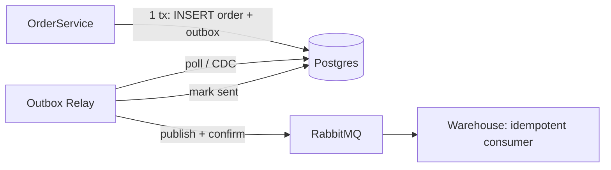
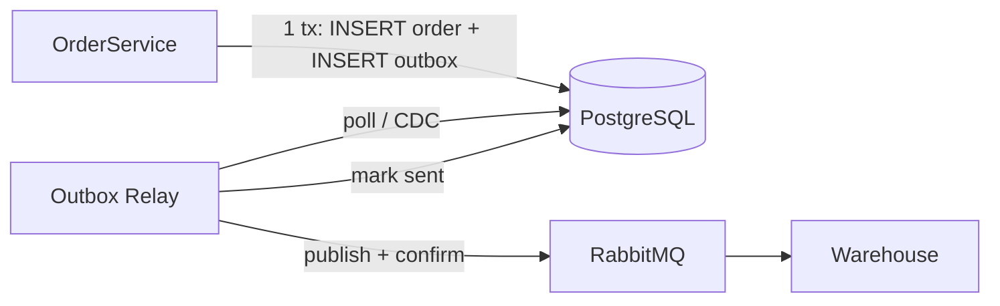

# Case three-lost-side-effects-ru

## Conversation so far
(none)

## Latest user message
Разбираю бэклог, там три бага по разным сервисам, тикеты уже раскиданы на трёх людей, у каждого есть предложенный фикс. Хочу, чтобы кто-то со стороны глянул, нормальные ли фиксы. 1) Сервис заказов (Spring Boot 3.2, PostgreSQL 15): сохраняем заказ, потом в @Transactional методе шлём событие OrderCreated в RabbitMQ. Раз в пару дней событие теряется — заказ в базе есть, склад о нём не знает. Коллега предлагает перенести отправку в RabbitMQ внутрь транзакции, до коммита. 2) Сервис каталога: обновляем цену в Postgres, затем делаем DEL ключа в Redis. Иногда после деплоя или сетевого таймаута в кэше висит старая цена до истечения TTL (сутки). Тут предлагают поставить TTL 5 минут. 3) Сервис регистрации: создаём пользователя в базе и тут же через SMTP-провайдера шлём welcome-письмо. Бывает, что пользователь есть, а письма нет, и наоборот — письмо ушло, а регистрация откатилась по unique constraint. Предлагают добавить ретраи на SMTP. Какие из фиксов принять, а какие переделать?

## Rubric (what a strong answer does)
1. Explicitly states that all three bugs are the same underlying problem: a database write and a side effect in another system (broker, cache, mail provider) are not atomic, so either one can happen without the other.
2. Proposes one shared mechanism for all three (for example a transactional outbox table written in the same DB transaction and relayed afterwards, or change data capture from the DB log), with at-least-once delivery and idempotent or deduplicated handling on the receiving side.
3. Points out that publishing to RabbitMQ inside the transaction before commit does not fix case 1: the message can be sent and the transaction can still roll back, producing an event for an order that does not exist.
4. Maps the common solution back to each concrete case, noting a case-specific detail (for example a dedup key so a retried welcome email is not sent twice, or cache invalidation done only after commit, with a shorter TTL as a mitigation rather than a fix).

## Answer A
**Коротко:** ни один фикс в текущем виде принимать не стоит. Все три бага — одна и та же проблема **dual write**: сервис пишет в две системы (Postgres + RabbitMQ / Redis / SMTP), а общей транзакции между ними нет. Первый и третий фиксы переносят окно рассогласования в другое место, но не закрывают его. Второй годится как страховка, но причину не устраняет. Лечится всё одним паттерном: **transactional outbox** (или CDC) плюс идемпотентные потребители.

| # | Предложенный фикс | Вердикт | Почему |
|---|---|---|---|
| 1 | Отправка в RabbitMQ внутри транзакции, до коммита | **Переделать** | Меняет одну аномалию на обратную |
| 2 | TTL 5 минут | **Принять как страховку, но не как фикс** | Сокращает окно устаревания, причину не трогает |
| 3 | Ретраи на SMTP | **Переделать** | Первый сценарий закрывает только частично, второй не закрывает вообще |

---

## 1) Заказы: OrderCreated теряется

**Что сломается с предложенным фиксом.** Если слать событие до коммита, то при откате коммита (constraint, deadlock, таймаут, падение пода между `send` и `COMMIT`) склад получит событие о заказе, которого в базе нет. Сейчас бывает «заказ есть, события нет», а станет «событие есть, заказа нет». Для склада это, вероятно, хуже: он зарезервирует товар под фантомный заказ.

Даже если включить `channelTransacted` у `RabbitTemplate` и синхронизировать его с DB-транзакцией, это не XA, а best-effort: два коммита идут последовательно, и между ними остаётся окно.

**Почему события теряются сейчас (гипотезы, проверьте по логам):**
- под падает или деплоится между коммитом в Postgres и `convertAndSend`;
- publish уходит без **publisher confirms**: брокер не принял сообщение или оно стало unroutable, а приложение об этом не узнало. «Раз в пару дней» хорошо объясняется именно так: переподключения, failover ноды, рестарты.

Сначала проверьте, включены ли confirms и returns (в Spring Boot это, насколько помню, `spring.rabbitmq.publisher-confirm-type=correlated` и `spring.rabbitmq.publisher-returns=true`; точные ключи сверьте с документацией вашей версии).

**Правильный фикс — transactional outbox:**

- В той же транзакции, что и заказ, пишем строку в таблицу `outbox` (`id, aggregate_id, type, payload, created_at, sent_at`). Атомарность даёт сам Postgres.
- Отдельный relay публикует непосланные строки с publisher confirms и после ack проставляет `sent_at`. Relay — это либо polling (`SELECT ... FOR UPDATE SKIP LOCKED`), либо CDC через Debezium. Debezium — новая инфраструктура, и тащить её стоит только если polling не справляется по задержке или нагрузке. Для заказов polling раз в 0,5–1 с почти наверняка хватит.
- Гарантия получается **at-least-once**, значит склад обязан дедуплицировать по `event_id` или `order_id`. Без этого решение неполное.

Чем платим: задержка доставки растёт на интервал поллинга, плюс нужно чистить outbox (партиционирование по дате или периодический DELETE).

---

## 2) Каталог: старая цена в Redis

**Почему TTL 5 минут — не фикс.** Он не устраняет причину, а лишь ограничивает, сколько длится ошибка: вместо суток максимум 5 минут. Причин, по которым DEL не срабатывает, на самом деле две, и обе остаются:

1. **DEL не выполнился:** таймаут до Redis, под убили после коммита, но до DEL. Это тот же dual write, что и в пункте 1.
2. **Гонка cache-aside**, которую TTL тоже не лечит: читатель промахнулся по кэшу → прочитал из БД старую цену → писатель обновил БД и сделал DEL → читатель записал в кэш старое значение. После этого DEL уже ничего не исправит.

**Цена короткого TTL.** Сутки — это 86 400 с, 5 минут — 300 с, то есть для горячего ключа промахов станет примерно в 288 раз больше. Для каталога это обычно терпимо (один SELECT по PK на ключ раз в 5 минут), но проверьте на своих объёмах: если горячих SKU сотни тысяч, нагрузка на Postgres от перезагрузок станет заметной. Добавьте jitter к TTL, чтобы ключи не истекали пачкой после прогрева.

**Что сделать:**
- **TTL 5 минут оставить как backstop** (с jitter). Эту часть принимаем.
- Инвалидацию сделать надёжной: событие `PriceChanged` через тот же outbox или CDC → consumer делает DEL с ретраями. Так пропущенный DEL перестаёт быть возможным.
- Против гонки: хранить в кэше значение с версией (`updated_at` или `version` из строки) и записывать только если версия не старее текущей (`SET` через Lua-скрипт с проверкой). Более дешёвый, но менее строгий вариант — delayed double delete (повторный DEL через 0,5–1 с).
- Бизнес-вопрос, который важнее техники: **checkout и расчёт суммы заказа должны брать цену из Postgres, а не из кэша.** Тогда устаревшая цена в кэше — это только неудобство на витрине, а не продажа по неверной цене.

---

## 3) Регистрация: welcome-письмо

**Почему ретраи не помогают:**
- Сценарий «письмо ушло, а регистрация откатилась» ретраи вообще не затрагивают: проблема в том, что письмо отправляется **до** коммита. Ретраи только увеличат шанс отправить письмо несуществующему пользователю.
- Сценарий «пользователь есть, письма нет» синхронные ретраи закрывают лишь частично. Если под упал после коммита, ретраить некому. Зато HTTP-запрос регистрации будет висеть, пока идут ретраи к SMTP, а поскольку SMTP не идемпотентен, возможны дубли (таймаут на ответ при фактически отправленном письме).

**Что сделать:**
- Письмо отправлять **только после коммита и асинхронно**. Надёжный вариант — тот же outbox: в транзакции регистрации пишем `outbox(type=WelcomeEmail, user_id)`, воркер отправляет письмо.
- **Ретраи переезжают в воркер**, а не в запрос: экспоненциальный backoff, ограниченное число попыток, dead letter для ручного разбора. В этом смысле идея ретраев правильная, просто не в том месте.
- Дедупликация: флаг или `email_sent_at` у пользователя либо уникальный ключ задачи. Если провайдер поддерживает idempotency key или message-id — используйте его.
- Вариант попроще — `@TransactionalEventListener(phase = AFTER_COMMIT)` + `@Async`. Он закрывает сценарий «письмо ушло, а регистрация откатилась», но при падении пода после коммита письмо всё равно потеряется, потому что событие живёт только в памяти. Для welcome-письма это, может быть, и приемлемый компромисс, но раз outbox всё равно появится ради пункта 1, дешевле переиспользовать его.

---

## Итог для бэклога

- Три тикета у трёх людей — это на самом деле **один архитектурный долг**. Имеет смысл сделать один общий outbox-модуль (таблица + relay + метрики) и подключить к нему все три сервиса, а не чинить каждый по-своему.
- Что мониторить после внедрения: возраст самой старой неотправленной записи в outbox (алерт, например, если больше минуты), число ретраев и DLQ, долю дублей, отброшенных на стороне потребителей.
- Порядок внедрения: п.1 первым — склад и фантомные или потерянные заказы важнее всего для бизнеса. П.2 можно сразу закрыть TTL 5 минут + jitter как временную меру, а надёжную инвалидацию сделать поверх outbox. П.3 — третьим.

## Answer B
**Коротко:** ни один из трёх фиксов в текущем виде принимать не стоит. Первый делает хуже, второй и третий только сужают окно проблемы. При этом все три бага устроены одинаково: это **dual write**. Сервис пишет в две системы (Postgres + RabbitMQ/Redis/SMTP), а общей транзакции у них нет. Поэтому любой порядок вызовов «сначала A, потом B» ломается, если процесс упадёт, случится таймаут или деплой ровно между A и B. Лечится это не ретраями и не перестановкой вызовов, а тем, чтобы запись в БД стала единственным источником правды, а всё остальное выводилось из неё надёжно и асинхронно.

| # | Предложенный фикс | Вердикт | Что делать вместо |
|---|---|---|---|
| 1 | Отправка в RabbitMQ внутри транзакции | **Отклонить**, будет хуже | Transactional outbox + publisher confirms + идемпотентный консьюмер |
| 2 | TTL 24ч → 5 мин | **Принять только как страховку**, не как фикс | Надёжная инвалидация (outbox/CDC → DEL с ретраями) + delayed double delete или версионирование |
| 3 | Ретраи на SMTP | **Переделать** | Письмо после коммита через outbox-воркер, ретраи и дедупликация в воркере |

---

## 1. Заказы: событие OrderCreated теряется

**Почему предложенный фикс плохой.** Если отправить событие до коммита, баг просто меняет знак:
- Сообщение ушло, а коммит упал (unique constraint, deadlock, таймаут, рестарт пода). Склад получает событие о заказе, **которого нет**. Это «фантомный» заказ, и он хуже потерянного: склад резервирует товар под несуществующий заказ.
- Консьюмер склада может получить событие раньше, чем транзакция закоммитилась. Если он сходит в сервис заказов за деталями, то получит 404.
- RabbitMQ в JDBC-транзакцию не входит. `channelTransacted=true` в Spring AMQP даёт только синхронизацию «best effort»: AMQP-транзакция коммитится после JDBC. Окно между двумя коммитами остаётся, и атомарности нет.

**Что, скорее всего, происходит сейчас.** Событие отправляется после коммита (через `@TransactionalEventListener(phase = AFTER_COMMIT)` или просто в конце метода), и отправка иногда не доходит. Вероятные причины:
- рестарт или деплой между коммитом и `convertAndSend`;
- не включены **publisher confirms**. Без них `convertAndSend` отработал без исключения, а брокер сообщение не принял (разрыв соединения, flow control);
- нет `mandatory`/returns: сообщение ушло в exchange без подходящего binding и молча выброшено;
- неперсистентные сообщения или non-durable очередь при рестарте брокера.

Последние три пункта проверьте в первую очередь: это дешёвая диагностика, и она может объяснить «раз в пару дней» без всякого деплоя.

**Правильный фикс: transactional outbox.**

- В той же транзакции, что и заказ, делаем `INSERT INTO outbox(id, aggregate_id, type, payload, created_at, sent_at)`. Атомарность даёт сам Postgres.
- Relay (отдельный поток или сервис) читает неотправленные записи через `SELECT ... FOR UPDATE SKIP LOCKED LIMIT N`, публикует их, **ждёт publisher confirm** и только потом проставляет `sent_at`. Альтернатива поллингу: CDC через Debezium по WAL. Он даёт меньшую задержку, но добавляет Kafka Connect/Debezium Server в эксплуатацию. Для одного сервиса с умеренной нагрузкой поллинга раз в 100–500 мс почти наверняка хватит.
- Гарантия получается **at-least-once**. Дубли возможны: например, relay упал после confirm, но до `sent_at`. Поэтому консьюмер склада должен быть идемпотентным: таблица `processed_events(event_id PK)` или upsert по `order_id`.

Цена решения: одна таблица, один фоновый процесс, задержка доставки в сотни миллисекунд и обязательная очистка outbox (партиции по дате или периодический DELETE).

---

## 2. Каталог: устаревшая цена в Redis

**Почему TTL 5 минут — это не фикс.** Он уменьшает худший случай с 24 часов до 5 минут, но баг никуда не девается. Если цену меняют под акцию, пять минут неверной цены на витрине вполне могут быть бизнес-инцидентом. Плюс цена самого решения: hit rate падает. Если каталог читается, условно, 5k RPS по 100k горячих SKU, то при TTL 24ч промахов почти нет, а при TTL 5 мин получится порядка 100k / 300 с ≈ 330 доп. запросов/с в Postgres в стационаре и всплески при синхронной экспирации. Цифры иллюстративные, подставьте свои. Выдержит ли это БД, надо проверить, а не предполагать.

**Откуда реально берётся старая цена.** Здесь три независимые причины:
1. **DEL не выполнился**: сетевой таймаут до Redis, процесс убит деплоем между коммитом и DEL. Ретраев нет, так что ключ живёт до TTL.
2. **Гонка cache-aside**, классическая. Читатель ловит промах и читает из БД старую цену. В этот момент писатель коммитит новую цену и делает DEL. После этого читатель кладёт в кэш старое значение, и оно живёт сутки. Это объясняет случаи без всяких таймаутов.
3. **DEL до коммита**, если где-то в коде порядок перепутан или DEL вызывается внутри `@Transactional`. Стоит проверить.

**Правильный фикс** (по возрастанию сложности):
- **Надёжная инвалидация.** Событие `PriceChanged` пишется в outbox в той же транзакции (та же инфраструктура, что в п.1) либо берётся через CDC из WAL. Воркер делает DEL с ретраями до успеха. Это закрывает причину 1.
- **Delayed double delete**: DEL сразу и ещё один DEL через 0,5–2 с. Сильно сужает окно гонки из причины 2, но не закрывает его на 100%. Дёшево в реализации.
- **Версионирование** закрывает гонку полностью. В строке цены хранится `version` (или `updated_at`). В Redis пишем только если версия новее той, что уже лежит (Lua-скрипт с compare-and-set). Старое значение физически не может перезаписать новое.
- **Короткий TTL оставить, но как страховку**: например, 1 час + jitter ±10%, чтобы ключи не протухали одновременно. Это ограничивает ущерб от бага, который вы ещё не нашли.

И отдельно: **в чекауте цену брать из БД**, а не из кэша. Кэш годится для витрины, а деньги считаются по источнику правды. Тогда устаревший кэш в худшем случае портит отображение, но не ведёт к неверному списанию.

---

## 3. Регистрация: письмо без пользователя и пользователь без письма

**Почему ретраи не помогают.**
- От «письмо ушло, а регистрация откатилась» ретраи не спасают никак: письмо отправляется **до** коммита, коммит падает на unique constraint, а письмо уже не вернуть.
- «Пользователь есть, письма нет» ретраи лечат лишь частично. Если процесс умер между коммитом и отправкой, ретраить некому: ретрай живёт в памяти того же процесса.
- Синхронные ретраи внутри запроса регистрации растягивают latency (SMTP-провайдер тормозит, и регистрация висит 10–30 с) и держат соединение с БД, если это происходит внутри транзакции.
- SMTP не идемпотентен. Бывает, что провайдер принял письмо, а ответ до вас не дошёл (таймаут). Тогда ретрай отправит **дубль**.

**Правильный фикс: тот же outbox.**
- В транзакции регистрации: `INSERT user` + `INSERT outbox(type='welcome_email', user_id, ...)`. Если сработал unique constraint, откатываются обе записи, и письма физически не будет. Первая половина бага закрыта.
- Воркер после коммита забирает запись и шлёт письмо. **Ретраи с экспоненциальным backoff и лимитом попыток живут здесь**, вне пользовательского запроса. После исчерпания попыток запись уходит в dead-letter с алертом. Вторая половина бага закрыта.
- Дедупликация: статус письма хранится (`pending → sent`), ключ `(user_id, 'welcome')` уникален. Полностью исключить дубль при таймауте после приёма письма провайдером через голый SMTP нельзя. Для welcome-письма редкий дубль, скорее всего, приемлем. Если нет, у многих провайдеров HTTP API принимает idempotency key или custom message ID, через SMTP так обычно не сделать. Возможности конкретного провайдера проверьте в его документации, я их здесь не проверял.
- Unique constraint сам по себе: стоит сделать pre-check на email до попытки вставки, чтобы вернуть пользователю нормальную ошибку. Но это UX, а не защита: гонку двух одновременных регистраций закрывает только constraint + outbox.

---

## Что делать с тикетами

Раз фиксы у трёх разных людей, стоит договориться об **одном общем механизме outbox** (таблица + relay/воркер, в идеале общая библиотека или стартер). Иначе вы получите три разные самописные реализации одной и той же идеи. Приоритет я бы расставил так:
1. **Заказы.** Потерянный заказ на складе — это прямые деньги. Сначала за час проверить publisher confirms, `mandatory` и durability, потом делать outbox.
2. **Регистрация.** Переиспользует outbox из п.1 почти без доработок.
3. **Каталог.** Сразу принять TTL ~1ч + jitter как временную страховку и перевести чекаут на цену из БД. Затем инвалидация через outbox/CDC и версионирование.

Общий мониторинг для всех трёх: возраст самой старой неотправленной записи в outbox (алерт, если больше N минут), размер dead-letter, число ретраев в минуту.

