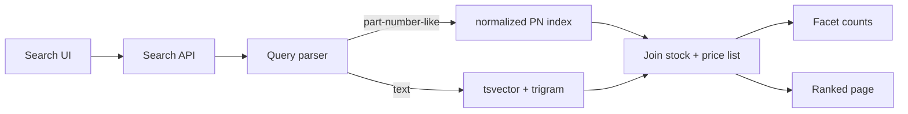

**Go with Postgres.** Engineer A's plan as written won't fix your problems, though. `tsvector` does nothing for typos like "bering". You need `pg_trgm` for fuzzy matching and a normalized part-number column on top of it. Set this up as a time-boxed spike with pass/fail gates, and agree now on what result would bring Elasticsearch back into the discussion. Then the argument ends on data, not on who argues longer.

## Why Postgres wins for you

The deciding factor is customer-specific pricing, not stock.

- **Pricing is the hard problem for ES.** Customers filter and sort by their own net price across ~1,800 contract price lists. In ES you'd need either ~1,800 price fields per document (mapping explosion), nested price docs (slow, and awkward for sorting), or a two-step query where ES returns candidates and Postgres prices them. The two-step version breaks "sort by my net price" and makes price-range facets wrong whenever the candidate set is truncated. In Postgres it's a join on an index `(price_list_id, sku_id)`.
- **Stock sync is a smaller problem than it looks.** 40k updates/hour is about 11/s. Postgres doesn't notice that, and an ES cluster could absorb it too. The real cost is everything around it: a CDC pipeline (outbox or Debezium), monitoring sync lag, full reindexes, and debugging "why does ES disagree with the DB". With 3 devs and no ops person, that's a permanent tax.
- **The scale is small.** 2.1M SKUs at maybe 1–2 KB of searchable text each comes to roughly 2–4 GB with indexes. That fits in RAM on one modest Postgres box. ES's scale advantages don't come into play here.

## Pushback on the stock argument

The "showed in stock, wasn't in stock" complaints came from a system that *already* reads Postgres directly. So this isn't a search-engine problem, and neither option fixes it by itself. Stock can change between the search and the click whatever you use. The fix is to **re-validate stock (and reserve it, if you can) at add-to-cart and at order submission**, and to show "limited stock" when quantity is low. Do that whichever engine you pick. It also takes some weight off Engineer A's "always correct" argument: Postgres gives *fresher* search results, not guaranteed ones.

## Where Engineer B is right

- **Faceted counts are Postgres's weak spot.** Counting brand/category/dimension values over a broad match (say "bearing" hitting 150k SKUs), after filtering by warehouse stock and the customer's price list, means scanning all the matching rows. My rough guess is somewhere between tens and hundreds of milliseconds per facet group after tuning. That's an estimate, not a benchmark, and it's the main thing the spike has to measure.
- **Relevance tuning is better in ES.** Out of the box you get BM25, field boosting, synonyms and fuzziness. In Postgres you build ranking from `ts_rank` and trigram similarity yourself. For a parts catalog, where most queries are part numbers, brands and a few nouns, that's usually enough. For free-text descriptive search it would be the weaker option.

## The Postgres design that actually works

1. **Part numbers:** store `pn_norm = upper(regexp_replace(pn, '[^A-Za-z0-9]', '', 'g'))` and normalize the query the same way. `6204-2RS`, `62042RS` and `6204 2rs` then all match exactly (btree), and a trigram index on `pn_norm` catches near-misses.
2. **Typos in words:** a `pg_trgm` GIN index on name/description, using the `%` / `word_similarity` operators, handles "bering" → "bearing". Keep `tsvector` for stemming and multi-word ranking, and blend the two scores. Trigram operator names and threshold settings are from memory, so check them against the PG 15 `pg_trgm` docs.
3. **Synonyms:** use a small synonym table (e.g. "ball bearing" ↔ "deep groove", "SS" ↔ "stainless") and expand the query in the app. It's simpler to maintain than a Postgres thesaurus dictionary.
4. **Facets:** keep facet attributes (brand_id, category_id, key dimensions) in one flattened `search_items` table so counting doesn't need joins. For very broad queries, cap exact counting (e.g. count the top N matches, or show "1,000+") and precompute counts per category.
5. **Stock/price:** join live at query time. There's nothing to sync.

## Trade-off summary

| Option | Pros | Cons | Best when |
|---|---|---|---|
| **Postgres (pg_trgm + tsvector)** | One system, live stock/price, joins are easy, no sync pipeline, fits a 3-person team | Facet counts on broad queries may be slow; relevance is hand-built | Per-customer data drives filtering/sorting; small team; catalog of a few million rows |
| **Elasticsearch** | Fast facets, fuzzy matching/synonyms/relevance built in | CDC pipeline, sync lag, cluster ops, per-customer price modeling is painful | Mostly-static catalog, shared pricing, someone owns ops |
| **Hybrid (ES for text → IDs, PG for stock/price)** | Better relevance, live stock/price | Two systems, and facets/price sort are wrong unless ES returns the full candidate set | Only if the Postgres spike fails on relevance, not on facets |

## The tiebreaker process (about 2 weeks)

Build the Postgres version on a copy of production data and test it against:

- **Typo/PN recall:** take ~200 real failed or zero-result queries from your search logs. Target ≥ 90% with the right item in the top 10.
- **Latency:** p95 ≤ 300 ms for search plus facets on your 50 most common queries, including the broadest ones, under a realistic customer price list.
- **Stock freshness:** zero lag, by construction.

If it passes, you're done and have one system. If it **fails on facet latency or relevance after a real tuning effort**, that's the evidence for ES, and Engineer B's case becomes concrete. Even then, keep stock and pricing authoritative in Postgres and budget for the sync pipeline and a managed ES/OpenSearch service, not a self-run cluster. The 300 ms and 90% thresholds are my suggestions, so set them to whatever your UI actually needs before the spike starts, not after.
