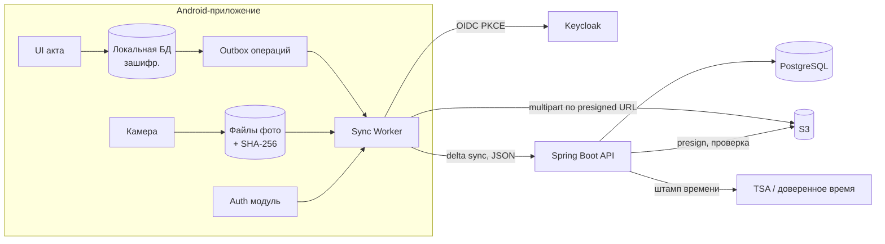

## Коротко

Из трёх пунктов текущего плана два не выдержат ваших же вводных:

1. **Суточный пакет «акт + фото одним запросом»** на слабом, рвущемся канале почти не имеет шансов дойти: 100–600 МБ, и при любом обрыве всё начинается заново. Метаданные и фото нужно разделить. Фото передавать возобновляемыми чанками, синхронизацию запускать сразу при появлении сети, а не раз в сутки.
2. **LWW по времени устройства** опирается на то самое время телефона, которому не доверяют юристы. Хуже того, он молча теряет правки второго инспектора целиком. Нужны серверные ревизии и слияние по полям с явным разбором конфликтов.
3. **«При протухшем токене — заново логин»** как раз нормально, и с ограничениями ИБ по-другому не получится. Главное условие: повторный логин не должен трогать локальные данные и очередь отправки.

Есть и четвёртая проблема, которой нет в плане, но она важнее первых трёх. **Достоверное время подписания нельзя получить офлайн**, это ограничение физики, а не архитектуры. Подпись может быть поставлена на объекте, но юридически значимое время появится только при первом контакте с сервером. Это решение нужно согласовать с юристами до начала разработки (подробности в разделе 4).

Дальше описано, как части стыкуются между собой. Общий принцип: **local-first**. Телефон хранит источник правды для черновиков, сервер хранит источник правды для порядка ревизий, времени и подписанных актов.

---

## 1. Оценки (порядок величин)

Допущения, проверьте их: около 1 акта на инспектора в рабочий день, 250 рабочих дней, в среднем 40 фото по 7 МБ.

| Величина | Расчёт | Итог |
|---|---|---|
| Размер акта | 40 × 7 МБ | ≈ 300 МБ (диапазон 100–600 МБ) |
| Актов в год | 400 × 250 | ≈ 100 тыс. |
| Хранилище в год | 100 тыс. × 0,3 ГБ | **≈ 30 ТБ/год** |
| То же при сжатии фото до ~2 МБ | 100 тыс. × 40 × 2 МБ | ≈ 8 ТБ/год |
| Накопление на телефоне за 3 дня | 3–6 актов × 300–600 МБ | **1–4 ГБ** |
| Выгрузка одного акта по мобильной сети | 300 МБ × 8 / ~1 Мбит/с эффективно | **≈ 40 мин**, при 600 МБ больше часа, с обрывами |
| Нагрузка на API | 400 пользователей | единицы RPS, узкое место не здесь |

Выводы:
- Узкие места: **канал с телефона** и **объём хранилища**, а не бэкенд. Spring Boot + PostgreSQL выдержат такую нагрузку с большим запасом.
- Сжатие фото сильнее всего влияет и на трафик, и на стоимость хранения. Однако оно касается юридической части: подписывать нужно ровно те байты, которые потом хранятся (см. раздел 4).
- Перед выездом приложение должно проверять свободное место и предупреждать об этом.

---

## 2. Архитектура

**Ключевой стык: два независимых канала синхронизации.**

- **Канал данных**: мелкий, приоритетный, идёт первым. Операции над актами (JSON, килобайты) и подпись.
- **Канал файлов**: тяжёлый, фоновый, возобновляемый. Фото загружаются напрямую в S3 multipart-загрузкой по presigned URL, которые выдаёт бэкенд. Spring Boot не проксирует через себя сотни мегабайт.

Акт на сервере считается **полным**, когда метаданные пришли и все фото из его манифеста подтверждены в S3 (бэкенд сверяет хэши). До этого акт принят, но находится в статусе «ожидает файлы».

---

## 3. Модули и их контракты

### 3.1 Локальное хранение (телефон)

- Локальная БД (Room/SQLite) шифруется, ключ хранится в Android Keystore. Устройство неделями носит персональные данные, и при потере телефона они не должны утечь.
- **ID генерируются на клиенте**: UUID (удобен v7, он сортируется по времени). Акт, раздел, нарушение и фото получают ID офлайн, и серверу не нужно их переназначать.
- **Фото адресуются по содержимому**: SHA-256 считается сразу после съёмки и финальной обработки. Хэш служит одновременно ключом дедупликации, основой для проверки целостности и элементом подписываемого манифеста.
- **Outbox**: каждое изменение записывается как операция `{op_id, entity, field, new_value, base_revision}`. `op_id` служит ключом идемпотентности: повторная отправка после обрыва не создаёт дублей.

### 3.2 Синхронизация

- Запускается **при появлении сети** и периодически, в фоне через WorkManager с ограничением «есть сеть», с экспоненциальным backoff. Инспектор может нажать «синхронизировать сейчас», но не обязан.
- Порядок: авторизация → push операций (outbox) → pull изменений по курсору (`GET /sync?since=<server_cursor>`) → загрузка файлов в фоне.
- Фото загружаются частями примерно по 5–8 МБ (у S3 multipart минимальная часть 5 МБ, кроме последней; помню это по памяти, проверьте для вашего хранилища). После обрыва клиент запрашивает у бэкенда уже загруженные части и продолжает с места обрыва. Альтернатива: протокол tus через бэкенд. Он проще на клиенте, но весь трафик пойдёт через Spring.
- Если сеть есть только в гостинице по Wi-Fi, можно ставить тяжёлый канал в режим «только Wi-Fi / без ограничений». Это стоит сделать настройкой.

### 3.3 Авторизация

Офлайн-работе токены вообще не нужны: они требуются только в момент синхронизации. Поэтому схема такая.

- Вход через Keycloak по OIDC Authorization Code + PKCE, в системном браузере (на Android обычно используют библиотеку AppAuth).
- **Локальная разблокировка приложения** (PIN/биометрия через Keystore) не зависит от токенов. Инспектор три дня работает под «последним подтверждённым пользователем».
- После трёх суток refresh-токен гарантированно протух: 8 часов меньше 72. При первой синхронизации нужен интерактивный логин, это и есть ваш план. Условия:
  - логин **не очищает** БД и outbox;
  - после логина проверяется, что `sub` нового токена совпадает с автором неотправленных операций. Если на телефоне залогинился другой человек, отправка блокируется и нужен явный сценарий передачи устройства;
  - SSO-сессия Keycloak на момент возврата тоже, вероятно, истекла, так что инспектор введёт пароль. Это нормально.
- В Keycloak есть offline-токены (scope `offline_access`, по памяти; проверьте в документации вашей версии). Формально они решают проблему, но по сути это то самое удлинение, против которого ИБ. Закладываться на них не стоит, можно лишь упомянуть при обсуждении с ИБ.

### 3.4 Бэкенд (Spring Boot + PostgreSQL)

Минимальная модель:

- `acts`: id, статус (`draft` / `signed` / `complete`), `server_revision`.
- `act_ops` или `act_revisions`: append-only журнал принятых операций с `op_id` (уникальный индекс, он даёт идемпотентность), автором, `base_revision` и серверным временем приёма.
- `photos`: sha256, s3_key, размер, статус загрузки.
- `signatures`: act_id, `manifest_hash`, подписант, `device_time` (только для справки), `server_received_at`, `tsa_token`.

Серверная ревизия (монотонный счётчик на акт) служит единственным источником порядка. Время устройства хранится, но ни на что не влияет.

---

## 4. Подпись, неизменяемость и достоверное время

Это самый рискованный стык, потому что здесь сходятся офлайн-режим, юристы и хранение фото.

**Что происходит на телефоне при подписании:**
1. Акт переводится в статус `signed_local`, редактирование блокируется в UI.
2. Строится **манифест**: канонизированный JSON с содержимым акта, списком SHA-256 всех фото, ID подписанта и версией черновика, на которой ставилась подпись. От манифеста считается хэш.
3. Подпись (простая ЭП) привязывается к хэшу манифеста. Изменение любого байта фото или текста становится обнаруживаемым.

**Что происходит на сервере при первом контакте:**
1. Бэкенд пересчитывает хэш манифеста и сверяет хэши всех фото по мере их загрузки.
2. Фиксирует **серверное время приёма** и, если юристы потребуют, получает штамп времени на хэш манифеста от доверенной службы (TSA по RFC 3161). Этот момент становится юридически достоверным временем.
3. Файлы подписанного акта кладутся в S3 с защитой от изменения: Object Lock / WORM. Поддержку нужно проверить именно в вашем S3-совместимом хранилище, у разных реализаций она разная. В PostgreSQL подписанный акт становится read-only (триггер запрещает UPDATE), исправления оформляются только новым документом со ссылкой на исходный.

**Главный trade-off, который решают юристы, а не разработчики:**

| Вариант | Плюсы | Минусы | Когда подходит |
|---|---|---|---|
| A. Время подписания = время приёма сервером / штамп TSA | Честно, технически надёжно | Может отставать от реального подписания до 3+ суток | Если регламент допускает формулировку «подписан не позднее T» |
| B. Подписывать только онлайн | Точное время | Противоречит работе без связи, инспектор уезжает с неподписанным актом | Если связь хотя бы иногда есть на объекте |
| C. Оценка времени: последнее серверное время + монотонный таймер устройства | Близко к реальному моменту | Сбрасывается при перезагрузке, юридически это всё равно «время телефона» | Только как справочная информация рядом с A |

Моя рекомендация: **A + C как справка**. В акте хранится «время подписания по данным устройства (справочно)» и «время фиксации на сервере (достоверно)». Если юристам нужно достоверное время именно момента подписания на объекте, офлайн это технически не решается. Об этом стоит сказать прямо до разработки, а не после.

Два связанных решения:
- **Сжатие фото делается до подписания** (или не делается вовсе). Подписываются именно те байты, которые будут храниться, иначе хэши не сойдутся. Нужно ли юристам хранить оригинал без сжатия, решают они. От этого зависит разница между 30 и 8 ТБ в год.
- Отдельно стоит уточнить у юристов, как у вас оформлено соглашение о применении простой ЭП. Для ПЭП такое соглашение обычно требуется, но это вопрос к юристам, а не к архитектуре.

---

## 5. Конфликты при совместной правке черновика

Почему LWW по времени устройства не подходит: часы на телефонах расходятся и переводятся вручную. Правка, сделанная позже, может «проиграть», и целый акт второго инспектора исчезнет без следа.

| Вариант | Плюсы | Минусы | Когда подходит |
|---|---|---|---|
| LWW по документу | Просто | Молчаливая потеря данных, зависит от часов | Никогда в этом кейсе |
| Пессимистичная блокировка (check-out) | Конфликтов нет | Не работает офлайн: блокировку нельзя взять без сети | Если правят только онлайн |
| **Слияние по полям с базовой ревизией** | Предсказуемо, понятно пользователю, реализуется на Spring + PG | Нужно спроектировать структуру акта и UI конфликтов | **Ваш случай** |
| CRDT (например, Automerge) | Автоматическое слияние без центра | Сложнее, тяжелее отлаживать, для полей формы избыточно | Совместная правка длинного свободного текста |

**Рекомендуемая схема:**
- Акт разбит на **мелкие единицы**: поля шапки, пункты чек-листа, нарушения, фото. Каждая единица имеет свой ID.
- Коллекции (нарушения, фото) работают как **множества с добавлением**: оба инспектора добавили нарушения, и на сервере оказываются все. Удаление записывается как tombstone.
- Скалярные поля: операция несёт `base_revision`. Если после неё поле никто не менял, операция применяется. Если менял, возникает **конфликт**, который показывается инспектору («Иванов изменил поле X на …, ваше значение …») и не решается молча.
- **Правило подписания**: подпись фиксирует ту ревизию, которую видел подписант. Правки второго инспектора, пришедшие после подписи, сервер отклоняет со статусом «акт подписан». Клиент показывает их и предлагает оформить дополнение. Кто может подписывать совместный акт (один ответственный или оба), решает бизнес. Это нужно зафиксировать, потому что от ответа зависит логика.

---

## 6. Режимы отказа

| Что ломается | Последствие | Как обрабатываем |
|---|---|---|
| Обрыв во время загрузки фото | Частичная загрузка | Multipart продолжается с последней части, ничего не перезаливается |
| Повторная отправка операций | Дубли | Идемпотентность по `op_id` (уникальный индекс) |
| Протух refresh-токен | Нельзя синхронизировать | Интерактивный логин, данные сохранены, проверка `sub` |
| Кончилось место на телефоне | Нельзя снимать | Проверка перед выездом, предупреждение при остатке < N ГБ |
| **Потеря или поломка телефона до синхронизации** | **Потеря до 3 суток работы** | Архитектурно не решается без связи. Смягчение: синхронизация при любой доступной сети, приоритет метаданных над фото, организационный регламент |
| Метаданные пришли, фото нет | Неполный акт | Статус «ожидает файлы», мониторинг «зависших» актов старше N дней |
| Хэш фото не совпал с манифестом | Нарушение целостности | Акт не переходит в `complete`, алерт, повторная загрузка файла |
| Приложение обновилось, схема поменялась | Старые операции в outbox | Версия схемы в каждой операции, сервер поддерживает N−1 версию |

Наблюдаемость: на сервере стоит отслеживать долю актов в статусе «ожидает файлы», возраст самого старого неподтверждённого акта, долю отклонённых из-за конфликтов операций и ошибки сверки хэшей. На клиенте полезно показывать инспектору понятный статус («отправлено 34 из 52 фото»).

---

## 7. Что решить до разработки (и с кем)

1. **Юристы**: приемлем ли вариант «достоверное время = время фиксации на сервере / TSA»; можно ли сжимать фото до подписи; нужен ли TSA или хватит серверного времени; соглашение о ПЭП.
2. **ИБ**: подтвердить схему «офлайн-разблокировка по PIN/биометрии + повторный логин при возврате» и шифрование локальной БД. Заодно обсудить, нужен ли MDM с удалённой очисткой.
3. **Бизнес**: кто подписывает совместный акт; как оформляются исправления подписанного акта (дополнение или новый акт).
4. **Инфраструктура**: поддерживает ли ваше S3-хранилище multipart с presigned URL и Object Lock; бюджет хранения 8–30 ТБ в год.

Если закрыть эти четыре пункта, контракты между мобильной частью, синхронизацией, авторизацией и бэкендом из разделов 3–5 можно отдавать разным людям параллельно. Точками стыка остаются `op_id`/`base_revision`, SHA-256 фото и хэш манифеста.
