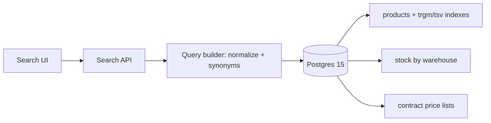

**Go with Postgres (Engineer A), with one correction to A's plan and a written exit criterion.** A's plan as stated doesn't fix typos, because `tsvector` does no fuzzy matching. Add `pg_trgm` and a normalized part-number column and you cover both of your concrete pain cases. B is right that Elasticsearch has better relevance tooling. But B's plan moves your two hardest correctness problems, stock and per-customer pricing, into an eventually consistent sync pipeline. With 3 devs and nobody on ops, that is the wrong trade.

## Why Postgres wins here

The deciding factor isn't search quality. It's where the correctness-critical data lives.

| | Postgres (tsvector + pg_trgm) | Elasticsearch |
|---|---|---|
| Typos ("bering") | pg_trgm similarity handles it | Fuzzy queries, built in |
| Part numbers (6204-2RS vs 62042RS) | Normalized column + trigram index | Custom analyzer, same idea |
| Relevance tuning, synonyms | Basic (weights, synonym table or dictionary) | Much richer |
| Facet counts | SQL `GROUP BY`. Fine at your size (see numbers) | Fast and native |
| Stock filter (40k changes/h) | Always correct, transactional | Sync lag + drift risk |
| Sort by customer net price (1,800 lists) | Join at query time | Hard. You must denormalize prices into the index or post-sort |
| Ops burden | Zero new systems | Cluster, CDC pipeline, reindexing, monitoring, version upgrades |

**Stock sync is solvable.** 40k updates/h is about 11/s, which is trivial throughput for ES. What you'd take on is a CDC pipeline (Debezium/Kafka or outbox + worker) whose lag and silent drift your team would have to own. You've already had two complaints about stale stock.

**Pricing is the real problem for ES.** For customers to filter and sort by their own net price, every document needs that customer's price in the index. Your options there are all bad:
- Nested prices per SKU (up to 1,800 per SKU, reindexed whenever a price list changes).
- A price field per price list (mapping explosion).
- Fetch prices from Postgres and re-sort afterwards. That breaks pagination and filtering by price range.

None of these is impossible, but each one is a project on its own.

## Rough numbers (estimates; benchmark them on your data)

- **Rows:** 2.1M SKUs is small for Postgres. A trigram GIN index on name plus part number probably lands in the low hundreds of MB, and the tsvector GIN index is smaller. The working set should fit in RAM on a modest instance.
- **Price rows:** unknown. If a contract list covers 10–50k SKUs, you have roughly 18–90M rows in `(price_list_id, sku_id)`. An index lookup per candidate is fine.
- **Facets:** a typical query matching 1k–50k SKUs, counted with `GROUP BY GROUPING SETS` over brand, category and dimensions, should take tens of ms. The risk is broad queries ("bearing" matching 300k+ rows), which could reach hundreds of ms. Mitigate by requiring a category or query before showing counts, capping counts ("10,000+"), or caching facet counts for the top N broad queries for 60s. Brand and category don't change with stock.

## What A's plan needs added

```sql
CREATE EXTENSION IF NOT EXISTS pg_trgm;

-- Part numbers: strip separators so 6204-2RS = 62042RS = 6204 2RS
ALTER TABLE products ADD COLUMN pn_norm text
  GENERATED ALWAYS AS (upper(regexp_replace(part_number, '[^A-Za-z0-9]', '', 'g'))) STORED;
CREATE INDEX products_pn_norm_trgm ON products USING gin (pn_norm gin_trgm_ops);

-- Names/descriptions: typo tolerance
CREATE INDEX products_name_trgm ON products USING gin (name gin_trgm_ops);

-- Full text with weights (name > brand > description)
ALTER TABLE products ADD COLUMN search_tsv tsvector GENERATED ALWAYS AS (
  setweight(to_tsvector('simple', coalesce(name,'')), 'A') ||
  setweight(to_tsvector('simple', coalesce(brand,'')), 'B') ||
  setweight(to_tsvector('english', coalesce(description,'')), 'C')
) STORED;
CREATE INDEX products_tsv ON products USING gin (search_tsv);
```

**Query strategy.** Normalize the user input the same way and run the branches as a `UNION`:
- exact or prefix match on `pn_norm`, ranked highest;
- a tsvector match (`websearch_to_tsquery`);
- a trigram fallback (`name % :q` or `:q <% name`).

Then rank with `ts_rank` plus `similarity()`. "bering" vs "bearing" share 5 of 10 distinct trigrams, a similarity of about 0.5, which clears pg_trgm's default 0.3 threshold (default recalled, not verified; check `pg_trgm.similarity_threshold`). This is a sketch. Tune the weights against real query logs.

**Synonyms.** Start with a plain `synonyms` table ("brg" → "bearing", "2RS" ↔ "RS2", "ZZ" ↔ "2Z") that expands the query in the app. It's easy for someone in the business to maintain, and there's no dictionary file to deploy.

**Stock and price** stay as ordinary joins in the same query, so they're always correct.



## Push back on one assumption

Most of the "showed in stock, wasn't" problem probably won't be fixed by search at all. Even with a perfectly live index, stock can change between the search and the order. The real fix is a **transactional availability check at add-to-cart and checkout**, e.g. a reservation or `SELECT ... FOR UPDATE` on the stock row. You need that whichever engine you pick. Postgres just makes the search results honest as well.

## Failure modes of the Postgres choice

- **Search load hurts OLTP.** Heavy facet queries compete with order writes. Mitigate with a read replica for search (seconds of lag is acceptable for listing, and the checkout check stays on the primary), `statement_timeout` on search queries, and a pool size limit.
- **Broad-query facet latency.** Use the caps and caching above. Alert on search p95 above roughly 300ms.
- **Relevance ceiling.** Trigram + tsvector won't match ES for phrase-level relevance, learning-to-rank or complex multilingual analysis. That's what you give up.

## Settle it with a timebox, not more debate

1. **Spike (1–2 weeks, Engineer A leads, B reviews).** Implement the above on a prod copy.
2. **Test set (Engineer B leads).** Take the top ~200 real queries from logs, plus 50 known-bad ones (typos, part-number variants). Hand-label the expected top-3 results. This gives B a real stake in the outcome.
3. **Pass criteria, agreed upfront:**
   - p95 under ~200ms for typical queries, including facets, stock filter and price sort;
   - at least ~90% of labelled queries have the right item in the top 3.
4. **Exit criteria for revisiting ES:**
   - Postgres misses those targets after tuning, or
   - the catalog grows around 10x, or
   - the business needs relevance features Postgres can't provide.

   If you do go to ES later, use it for text and static facets only. Keep stock and price in Postgres, and accept the pagination and sort compromises that come with that.

Put search behind a single `SearchService` interface so that swap stays a contained change and not a rewrite.

To sum up: A's architecture, B's test set and quality bar. You get fuzzy search and facets now, with no new infrastructure and no new consistency bugs.
