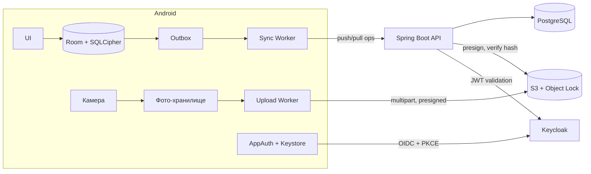
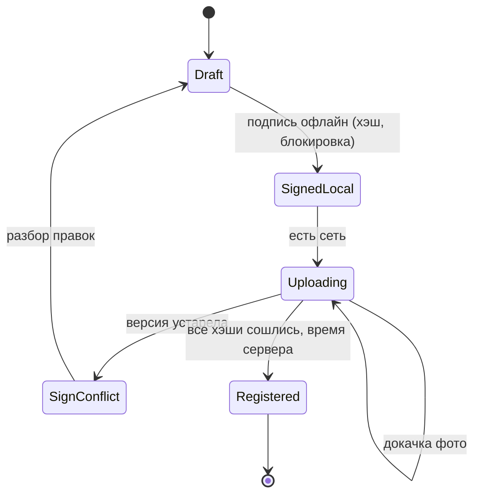

## Коротко

В текущем плане ломаются все три решения, и причина у них общая: они не учитывают, что устройство до трёх суток живёт отдельно от сервера.

- **Синхронизация раз в сутки одним пакетом.** Акт весит 100–600 МБ, а сеть на обратном пути рвётся. Такой запрос на слабом канале почти никогда не дойдёт до конца, и после каждого обрыва придётся начинать заново.
- **Last write wins по времени устройства.** Часы телефона вы сами признаёте недостоверными (юристы их не принимают), а LWW на весь акт молча удаляет работу второго инспектора.
- **«Протух токен, логинимся заново».** Refresh живёт 8 часов, объект длится 72 часа, значит токен протухнет гарантированно. Это нормально, если работа на объекте вообще не зависит от токена. Сейчас это нигде не зафиксировано.

Что предлагаю вместо этого:

1. **Local-first** клиент с зашифрованной локальной БД и outbox.
2. Синхронизация идёт **оппортунистически и по частям**: сначала лёгкие данные, потом фото, каждое отдельно и с докачкой.
3. Конфликты разбираются **по полям, с версиями, которые назначает сервер**. Коллекции (фото, нарушения) работают только на добавление.
4. Подпись привязана к **хэшу конкретной версии**, а достоверное время фиксирует **сервер** в момент приёма.

Всё это держится на одном общем элементе: **конечном автомате жизненного цикла акта**. Его одинаково понимают клиент, бэкенд, юристы и ИБ, и именно он стыкует части между собой.

---

## Оценка нагрузки

Количество актов в день вы не указали, поэтому беру допущение: 1–2 акта на инспектора в день, в среднем около 40 фото по 7,5 МБ.

| Величина | Расчёт | Итог |
|---|---|---|
| Размер акта | 20–60 × 5–10 МБ | 100–600 МБ, типично около 300 МБ |
| Накоплено за 3 дня на объекте | 3–6 актов × 300 МБ | около 1–2 ГБ на телефоне (для памяти это приемлемо) |
| Выгрузка одного акта при 1 Мбит/с | 300 МБ × 8 / 1 Мбит/с | около 40 минут чистого времени без обрывов |
| Выгрузка трёх дней работы | 1,8 ГБ при 1 Мбит/с | около 4 часов |
| Поток в хранилище | 400 × 1,5 акта × 300 МБ | около 180 ГБ в день, порядка 40 ТБ в год |
| Нагрузка на API | 400 пользователей | единицы RPS, ничтожно мало |

Выводы из этих цифр:

- **Узкое место здесь сеть и объём хранилища, а не вычисления.** Kafka, микросервисы и шардинг не нужны. Хватит одного Spring Boot-приложения с репликой PostgreSQL.
- **Загрузка фото должна переживать сотни обрывов** и идти в фоне на протяжении часов. Отсюда требования: каждое фото загружается отдельно, по частям, идемпотентно.
- **Сжатие фото на телефоне даёт больше всего остального вместе взятого.** Если пережимать до 1,5–2 МБ, объём падает в 3–5 раз и по трафику, и по хранилищу. Но это юридический вопрос (см. ниже).

---

## Архитектура

Каналов данных два, и они намеренно разделены.

- **Канал данных акта** (поля, чек-листы, нарушения, метаданные фото, подписи). Это килобайты. Они идут через API как лог операций, быстро и часто, при любой появившейся сети.
- **Канал бинарников** (фото). Фото грузятся напрямую в S3 по presigned URL через multipart upload. Бэкенд не пропускает гигабайты через себя, а только выдаёт ссылки и проверяет хэши.

---

## 1. Офлайн и авторизация

**Принцип: токен Keycloak нужен только для синхронизации и никогда не нужен для работы.**

- **Вход.** AppAuth (OIDC Authorization Code + PKCE) через системный браузер. Токены хранятся в зашифрованном хранилище с ключом в Android Keystore.
- **Локальная разблокировка.** Приложение и БД открываются PIN-кодом или биометрией, которые привязаны к последнему успешно вошедшему пользователю. Ключ SQLCipher лежит в Keystore и выдаётся только после такой проверки. Так инспектор трое суток работает без Keycloak.
- **Синхронизация.**
  - Перед каждой сессией токен обновляется заранее: если до истечения access-токена меньше примерно 5 минут, выполняется refresh.
  - Если refresh протух, sync переходит в состояние «нужен вход», показывается уведомление, очередь остаётся нетронутой. После входа (**того же** пользователя) синхронизация продолжается с того же места.
  - Повторный вход **никогда не очищает** локальные данные и outbox. Это нужно явно записать в требования: наивная реализация logout/login часто очищает хранилище.
- **Долгие загрузки не зависят от часового access-токена.** Presigned URL выдаются пачками, и у них собственный срок жизни. Когда он истёк, клиент просто запрашивает новые URL.
- **Другой пользователь на том же устройстве.** Неотправленные данные предыдущего пользователя нельзя ни удалять, ни отправлять от чужого имени. Нужна политика: либо блокировать вход, пока очередь не выгружена, либо держать отдельные зашифрованные профили.

**Что обсудить с ИБ.**
1. Не удлинять refresh — это их позиция, и архитектура её выдерживает. Но стоит спросить, какой **максимальный срок офлайн-работы** они допускают. Например, если устройство не выходило на связь больше 7 дней, локальные данные блокируются до входа. Это их инструмент контроля вместо длинного токена.
2. В Keycloak есть механизм offline-токенов (scope `offline_access`). По памяти, не проверял, сверьтесь с документацией вашей версии. Он решил бы задачу «без повторного логина», но по сути это долгоживущий токен, то есть ровно то, что ИБ запрещает. Рассматривать его только как их осознанное решение.
3. Потерянное устройство. Данные зашифрованы, но нужен MDM/remote wipe и отзыв сессий в Keycloak.

---

## 2. Синхронизация и конфликты

### Протокол

- Каждое изменение на устройстве записывается как **операция** в outbox в той же транзакции, что и само изменение: `op_id` (UUID, сгенерирован на клиенте), `act_id`, `field/item`, `new_value`, `base_revision`.
- `POST /sync/push` принимает пачку операций. Сервер **идемпотентен по `op_id`**: повторная отправка после обрыва ничего не дублирует.
- `GET /sync/pull?cursor=N` возвращает все изменения с серверной ревизии N. Курсор — монотонный номер, который назначает сервер (sequence в PostgreSQL), **а не время**.
- **Кто запускает синхронизацию.** WorkManager с условием «есть сеть» плюс ручная кнопка «Синхронизировать». Не раз в сутки, а при каждом появлении связи: данные акта весят килобайты и уходят за секунды даже через плохой канал.

### Конфликты при совместном черновике

| Вариант | Плюсы | Минусы | Когда подходит |
|---|---|---|---|
| LWW по времени устройства (текущий план) | Проще всего | Часы телефона врут. Правки второго инспектора пропадают молча | Никогда, если данные ценные |
| Блокировка черновика (check-out) | Конфликтов нет | Если держатель блокировки трое суток без связи, второй заблокирован | Когда совместной работы на деле почти нет |
| **Слияние по полям с версиями + коллекции только на добавление** | Нет тихих потерь. Предсказуемо. Реализуется на Postgres без экзотики | Нужен экран ручного разрешения конфликтов | **Рекомендую** |
| CRDT (Automerge и т. п.) | Автоматическое слияние | Сложно, тяжело объяснить юристам, для структурированной формы это перебор | Совместное редактирование свободного текста |

Как это работает в рекомендованном варианте:

- **Фото, нарушения, замечания** — это коллекции, в которые можно только добавлять. Объединение двух правок бесконфликтно. Удаление — это операция-«надгробие» (tombstone), а не физическое удаление.
- **Скалярные поля** (адрес, вывод, оценки). Если `base_revision` операции совпадает с текущей ревизией поля на сервере, изменение применяется. Если нет, и значение другое, поле помечается **конфликтом**, и на клиенте появляется выбор «моё / его / объединить». Ничего не теряется молча.
- **Организационная мера, которая снижает число конфликтов на порядок.** Разделы акта закрепляются за конкретным инспектором (например, «А — электробезопасность, Б — высота»). Тогда конфликт становится исключением.
- **Время устройства** хранится только как справочное значение для показа в UI и нигде не участвует в логике.

---

## 3. Фото

- **Съёмка только через встроенную камеру приложения**, без выбора из галереи. Это снижает риск подмены. EXIF-время — это тоже время устройства, поэтому для доказательств оно не годится.
- Сразу после съёмки (и, если согласуете, после сжатия) вычисляется **SHA-256**. Хэш становится идентификатором фото и ключом объекта в S3: `photos/{sha256}`. Повторная загрузка того же файла ничего не ломает.
- **Загрузка:**
  1. Клиент вызывает `POST /photos/uploads {sha256, size}`. Сервер создаёт S3 multipart upload и возвращает presigned URL для частей по 5–8 МБ.
  2. Клиент грузит части и запоминает, какие уже приняты (ETag). После обрыва он спрашивает у сервера список принятых частей и продолжает с первой недостающей.
  3. Клиент вызывает `POST /photos/uploads/{id}/complete`. Сервер собирает объект, **сверяет SHA-256** и только после этого помечает фото как принятое.
  4. Проверьте, что ваше S3-совместимое хранилище поддерживает multipart upload, ListParts и presigned URL. У большинства поддержка есть, но на конкретной реализации это нужно подтвердить.
- **Приоритеты очереди.** Сначала данные актов, потом фото подписанных актов, потом фото черновиков. Добавьте опцию «фото только по Wi-Fi» и дайте инспектору видеть прогресс: «Акт №…: 34/52 фото выгружено».
- **Сжатие.** Решение за юристами: достаточно ли пережатой копии как доказательства. Если да, пережимать до съёмки хэша: подписывается ровно тот файл, который будет храниться. Если нужен оригинал, закладывайте около 40 ТБ в год и 4 часа выгрузки на три дня работы.

---

## 4. Подпись, неизменность и достоверное время

Здесь главное противоречие: **подписать акт нужно на объекте, где нет связи, а достоверного времени без связи нет.** Никакая архитектура это не отменит. GPS-время тоже подделывается на рутованном устройстве, и юристы его, скорее всего, не примут. Поэтому решение состоит из двух частей.

**Предлагаемая схема:**
1. **На объекте.**
   - Инспектор нажимает «Подписать» и подтверждает PIN или биометрией.
   - Клиент строит каноническое представление акта: данные плюс список SHA-256 всех фото плюс номер версии. Для детерминированной сериализации есть JSON Canonicalization Scheme, RFC 8785 (по памяти, проверьте).
   - Клиент вычисляет хэш и **локально блокирует акт** от изменений.
   - Время устройства записывается как «заявленное время», только для информации.
2. **При синхронизации** сервер:
   - проверяет, что все фото приняты и их хэши совпадают;
   - проверяет, что подписанная версия равна **текущей серверной версии** черновика (нет непринятых правок второго инспектора);
   - пересчитывает хэш канонического представления и сверяет его с подписанным;
   - фиксирует **серверное время приёма** от NTP-синхронизированных часов, а при требовании юристов — квалифицированную метку времени от TSA (RFC 3161);
   - переводит акт в статус «Зарегистрирован». С этого момента акт неизменяем.
3. **Если второй инспектор внёс правки, которых подписант не видел**, сервер отклоняет привязку подписи, и акт переходит в статус «Конфликт при подписи». Подписант видит расхождения и подписывает заново. Подписывать можно только то, что человек видел, иначе подпись юридически бессмысленна.

**Что это означает юридически, и что должны решить юристы.** В схеме доказуемо «акт в этом виде существовал и подписан не позднее T_сервера». Доказать точный момент подписи на объекте нельзя. Юристам нужно выбрать одно из двух:
- (а) юридически значимое время — это время регистрации на сервере;
- (б) инспектор не подписывает офлайн, а подписание происходит только онлайн. Это надёжнее по времени, но акт тогда может неделю висеть неподписанным.

Второй вопрос к ним: **подтверждение PIN в приложении офлайн — это достаточный способ ПЭП?** Насколько я помню, условия признания ПЭП по 63-ФЗ задаются соглашением между участниками. Не проверял, пусть юристы подтвердят. Если да, это нужно прописать в соглашении с инспекторами.

**Неизменность на сервере:**
- PostgreSQL. Подписанные версии лежат в отдельной append-only таблице, UPDATE/DELETE по ним блокируются триггером и правами роли приложения. Исправления оформляются новым документом («акт-исправление»), который ссылается на исходный, а не правкой исходного.
- S3. Object Lock в режиме compliance для фото подписанных актов, если ваше хранилище его поддерживает (это обязательно проверить). Без Object Lock неизменность обеспечивает только хэш в подписи. Подмену он обнаружит, но не предотвратит.

---

## 5. Жизненный цикл акта — то, что связывает части

Этот автомат — общий контракт, по которому каждая команда может проверить свою часть:

- **Мобильная команда**: какие действия доступны в каком статусе и что показывать пользователю.
- **Бэкенд**: какие переходы разрешены и что проверяется на каждом.
- **Юристы**: в каком статусе акт становится юридически значимым (`Registered`) и какое время считается временем подписи.
- **ИБ**: где нужен токен (только стрелки с сетью) и где его нет (всё остальное).

Рекомендую зафиксировать его первым артефактом проекта, до того как кто-то начнёт писать код своей части.

---

## 6. Что сломается и как это пережить

| Сбой | Последствие | Что делать |
|---|---|---|
| Обрыв во время загрузки фото | Часть файла потеряна | Докачка с последней принятой части. Идемпотентность по SHA-256 |
| Обрыв после push, но до ответа | Клиент не знает, принят ли пакет | Повторная отправка. Сервер дедуплицирует по `op_id` |
| Refresh протух в дороге | Sync стоит | Статус «нужен вход». Данные и очередь остаются. После входа продолжение с того же места |
| Телефон разбит или потерян до выгрузки | **Акт потерян безвозвратно** | Это главный реальный риск схемы. Смягчение: выгружать данные актов при любой кратковременной связи, фото — при первой возможности. На время командировки можно дать резервный носитель, но это отдельный вопрос для ИБ |
| Заканчивается память телефона | Нельзя снимать | Предупреждать заранее по порогу. Удалять локальные фото только после статуса `Registered` |
| S3 недоступен | Фото не грузятся | Данные актов продолжают синхронизироваться, фото ждут в очереди. Акт остаётся в `Uploading` |
| Расхождение хэша фото | Повреждение или подмена | Акт не регистрируется, клиент перезагружает фото. Инцидент уходит в аудит |
| Часы телефона сбиты | Ничего | Время устройства ни на что не влияет — ради этого всё и затевалось |

Мониторинг:
- число актов в `Uploading` старше N дней;
- доля отклонённых хэшей;
- число `SignConflict`;
- размер очередей на устройствах (клиент отдаёт метрики при sync).

---

## Открытые вопросы, без которых архитектуру не закрыть

1. **Юристы.**
   - Что считается временем подписи: регистрация на сервере или онлайн-подписание?
   - Допустимо ли сжатие фото?
   - Достаточно ли PIN как ПЭП офлайн?
2. **ИБ.**
   - Максимальный срок офлайн-работы устройства.
   - Политика смены пользователя на устройстве.
   - MDM.
3. **Бизнес.**
   - Реальное число актов в день (от этого зависит бюджет на хранилище).
   - Насколько часто на деле двое правят один акт. Если редко, может хватить упрощённой блокировки разделов.
4. **Инфраструктура.** Поддерживает ли ваше S3-совместимое хранилище multipart upload, presigned URL и Object Lock.
