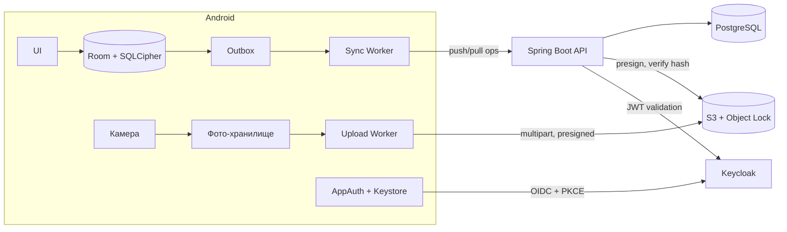
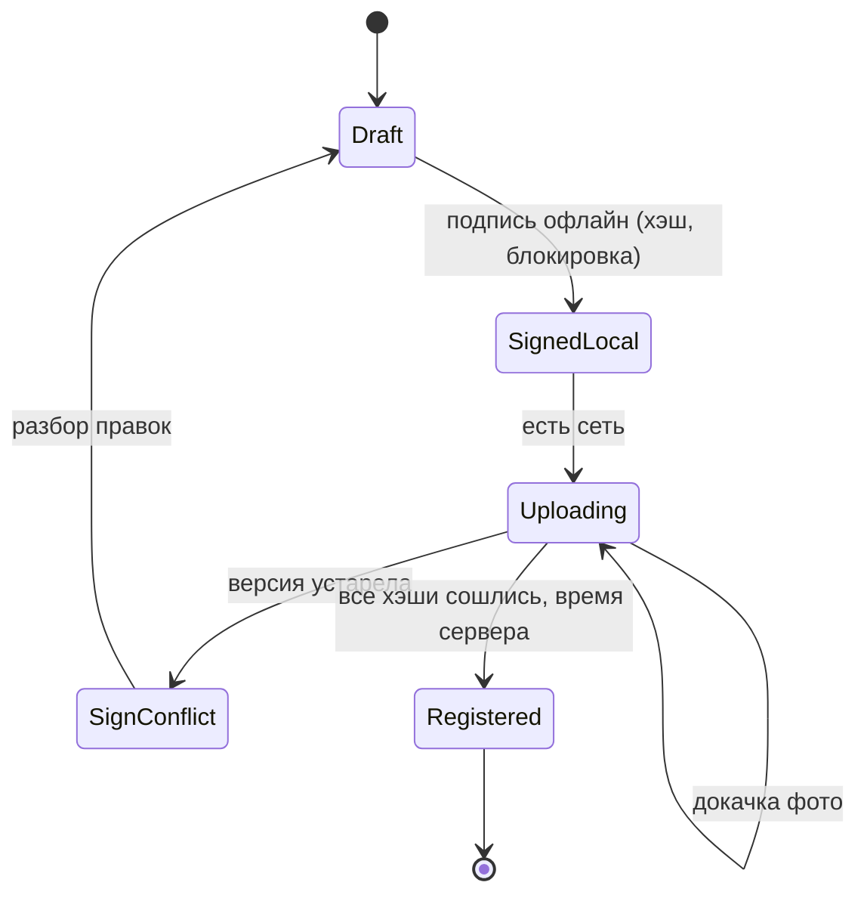
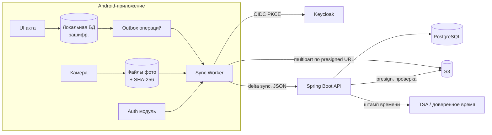

# Case offline-inspector-app-design-ru

## Conversation so far
(none)

## Latest user message
Проектируем мобильное приложение для инспекторов по охране труда (Android, около 400 пользователей). Нужна общая архитектура, но по частям у нас уже разные люди и у каждого своё мнение, а целиком никто не смотрел. Вводные:
- Инспекторы работают на объектах без связи до 3 суток подряд, всё должно работать офлайн.
- Авторизация через корпоративный Keycloak, access-токен живёт 1 час, refresh — 8 часов, ИБ удлинять не хочет.
- В акт проверки входит 20–60 фото по 5–10 МБ, мобильный интернет на обратном пути слабый, часто рвётся.
- Акт после подписи инспектором (простая ЭП) юридически нельзя менять, а юристы требуют достоверное время подписания — время на телефоне они не принимают.
- Черновик одного акта могут править двое инспекторов с разных телефонов.
- Бэкенд: Spring Boot + PostgreSQL + S3-совместимое хранилище.

Сейчас план такой: синхронизация раз в сутки целиком пакетом (акт + фото одним запросом), конфликты — last write wins по времени устройства, при протухшем токене — заново логин. Распишите, как это всё должно быть устроено, чтобы части стыковались между собой.

## Rubric (what a strong answer does)
1. Points out that with an 8-hour refresh token and up to 3 days offline the inspector cannot rely on the server session in the field, and proposes a coherent resolution (e.g. local work without server auth, a device-bound credential or offline grant agreed with security, re-authentication only at sync time) instead of just 'log in again'.
2. Resolves the interaction between conflict handling and signing: last-write-wins by device time is rejected or restricted because device clocks are untrusted, and signed acts are treated as immutable so they are never overwritten by merges (e.g. merge/versioning only for drafts, signing locks the record).
3. Handles legally reliable signing time by fixing it on the server side or via a trusted timestamp when the signed act reaches the backend, and states what the device-local time is still used for (if anything) consistently with the rest of the design.
4. Replaces the single all-in-one daily package with resumable or per-file photo upload (e.g. directly to S3 with multipart or presigned URLs) that is linked to the act, and keeps the overall design consistent across auth, sync, storage and signing rather than listing independent recommendations.

## Answer A
## Коротко

В текущем плане ломаются все три решения, и причина у них общая: они не учитывают, что устройство до трёх суток живёт отдельно от сервера.

- **Синхронизация раз в сутки одним пакетом.** Акт весит 100–600 МБ, а сеть на обратном пути рвётся. Такой запрос на слабом канале почти никогда не дойдёт до конца, и после каждого обрыва придётся начинать заново.
- **Last write wins по времени устройства.** Часы телефона вы сами признаёте недостоверными (юристы их не принимают), а LWW на весь акт молча удаляет работу второго инспектора.
- **«Протух токен, логинимся заново».** Refresh живёт 8 часов, объект длится 72 часа, значит токен протухнет гарантированно. Это нормально, если работа на объекте вообще не зависит от токена. Сейчас это нигде не зафиксировано.

Что предлагаю вместо этого:

1. **Local-first** клиент с зашифрованной локальной БД и outbox.
2. Синхронизация идёт **оппортунистически и по частям**: сначала лёгкие данные, потом фото, каждое отдельно и с докачкой.
3. Конфликты разбираются **по полям, с версиями, которые назначает сервер**. Коллекции (фото, нарушения) работают только на добавление.
4. Подпись привязана к **хэшу конкретной версии**, а достоверное время фиксирует **сервер** в момент приёма.

Всё это держится на одном общем элементе: **конечном автомате жизненного цикла акта**. Его одинаково понимают клиент, бэкенд, юристы и ИБ, и именно он стыкует части между собой.

---

## Оценка нагрузки

Количество актов в день вы не указали, поэтому беру допущение: 1–2 акта на инспектора в день, в среднем около 40 фото по 7,5 МБ.

| Величина | Расчёт | Итог |
|---|---|---|
| Размер акта | 20–60 × 5–10 МБ | 100–600 МБ, типично около 300 МБ |
| Накоплено за 3 дня на объекте | 3–6 актов × 300 МБ | около 1–2 ГБ на телефоне (для памяти это приемлемо) |
| Выгрузка одного акта при 1 Мбит/с | 300 МБ × 8 / 1 Мбит/с | около 40 минут чистого времени без обрывов |
| Выгрузка трёх дней работы | 1,8 ГБ при 1 Мбит/с | около 4 часов |
| Поток в хранилище | 400 × 1,5 акта × 300 МБ | около 180 ГБ в день, порядка 40 ТБ в год |
| Нагрузка на API | 400 пользователей | единицы RPS, ничтожно мало |

Выводы из этих цифр:

- **Узкое место здесь сеть и объём хранилища, а не вычисления.** Kafka, микросервисы и шардинг не нужны. Хватит одного Spring Boot-приложения с репликой PostgreSQL.
- **Загрузка фото должна переживать сотни обрывов** и идти в фоне на протяжении часов. Отсюда требования: каждое фото загружается отдельно, по частям, идемпотентно.
- **Сжатие фото на телефоне даёт больше всего остального вместе взятого.** Если пережимать до 1,5–2 МБ, объём падает в 3–5 раз и по трафику, и по хранилищу. Но это юридический вопрос (см. ниже).

---

## Архитектура

Каналов данных два, и они намеренно разделены.

- **Канал данных акта** (поля, чек-листы, нарушения, метаданные фото, подписи). Это килобайты. Они идут через API как лог операций, быстро и часто, при любой появившейся сети.
- **Канал бинарников** (фото). Фото грузятся напрямую в S3 по presigned URL через multipart upload. Бэкенд не пропускает гигабайты через себя, а только выдаёт ссылки и проверяет хэши.

---

## 1. Офлайн и авторизация

**Принцип: токен Keycloak нужен только для синхронизации и никогда не нужен для работы.**

- **Вход.** AppAuth (OIDC Authorization Code + PKCE) через системный браузер. Токены хранятся в зашифрованном хранилище с ключом в Android Keystore.
- **Локальная разблокировка.** Приложение и БД открываются PIN-кодом или биометрией, которые привязаны к последнему успешно вошедшему пользователю. Ключ SQLCipher лежит в Keystore и выдаётся только после такой проверки. Так инспектор трое суток работает без Keycloak.
- **Синхронизация.**
  - Перед каждой сессией токен обновляется заранее: если до истечения access-токена меньше примерно 5 минут, выполняется refresh.
  - Если refresh протух, sync переходит в состояние «нужен вход», показывается уведомление, очередь остаётся нетронутой. После входа (**того же** пользователя) синхронизация продолжается с того же места.
  - Повторный вход **никогда не очищает** локальные данные и outbox. Это нужно явно записать в требования: наивная реализация logout/login часто очищает хранилище.
- **Долгие загрузки не зависят от часового access-токена.** Presigned URL выдаются пачками, и у них собственный срок жизни. Когда он истёк, клиент просто запрашивает новые URL.
- **Другой пользователь на том же устройстве.** Неотправленные данные предыдущего пользователя нельзя ни удалять, ни отправлять от чужого имени. Нужна политика: либо блокировать вход, пока очередь не выгружена, либо держать отдельные зашифрованные профили.

**Что обсудить с ИБ.**
1. Не удлинять refresh — это их позиция, и архитектура её выдерживает. Но стоит спросить, какой **максимальный срок офлайн-работы** они допускают. Например, если устройство не выходило на связь больше 7 дней, локальные данные блокируются до входа. Это их инструмент контроля вместо длинного токена.
2. В Keycloak есть механизм offline-токенов (scope `offline_access`). По памяти, не проверял, сверьтесь с документацией вашей версии. Он решил бы задачу «без повторного логина», но по сути это долгоживущий токен, то есть ровно то, что ИБ запрещает. Рассматривать его только как их осознанное решение.
3. Потерянное устройство. Данные зашифрованы, но нужен MDM/remote wipe и отзыв сессий в Keycloak.

---

## 2. Синхронизация и конфликты

### Протокол

- Каждое изменение на устройстве записывается как **операция** в outbox в той же транзакции, что и само изменение: `op_id` (UUID, сгенерирован на клиенте), `act_id`, `field/item`, `new_value`, `base_revision`.
- `POST /sync/push` принимает пачку операций. Сервер **идемпотентен по `op_id`**: повторная отправка после обрыва ничего не дублирует.
- `GET /sync/pull?cursor=N` возвращает все изменения с серверной ревизии N. Курсор — монотонный номер, который назначает сервер (sequence в PostgreSQL), **а не время**.
- **Кто запускает синхронизацию.** WorkManager с условием «есть сеть» плюс ручная кнопка «Синхронизировать». Не раз в сутки, а при каждом появлении связи: данные акта весят килобайты и уходят за секунды даже через плохой канал.

### Конфликты при совместном черновике

| Вариант | Плюсы | Минусы | Когда подходит |
|---|---|---|---|
| LWW по времени устройства (текущий план) | Проще всего | Часы телефона врут. Правки второго инспектора пропадают молча | Никогда, если данные ценные |
| Блокировка черновика (check-out) | Конфликтов нет | Если держатель блокировки трое суток без связи, второй заблокирован | Когда совместной работы на деле почти нет |
| **Слияние по полям с версиями + коллекции только на добавление** | Нет тихих потерь. Предсказуемо. Реализуется на Postgres без экзотики | Нужен экран ручного разрешения конфликтов | **Рекомендую** |
| CRDT (Automerge и т. п.) | Автоматическое слияние | Сложно, тяжело объяснить юристам, для структурированной формы это перебор | Совместное редактирование свободного текста |

Как это работает в рекомендованном варианте:

- **Фото, нарушения, замечания** — это коллекции, в которые можно только добавлять. Объединение двух правок бесконфликтно. Удаление — это операция-«надгробие» (tombstone), а не физическое удаление.
- **Скалярные поля** (адрес, вывод, оценки). Если `base_revision` операции совпадает с текущей ревизией поля на сервере, изменение применяется. Если нет, и значение другое, поле помечается **конфликтом**, и на клиенте появляется выбор «моё / его / объединить». Ничего не теряется молча.
- **Организационная мера, которая снижает число конфликтов на порядок.** Разделы акта закрепляются за конкретным инспектором (например, «А — электробезопасность, Б — высота»). Тогда конфликт становится исключением.
- **Время устройства** хранится только как справочное значение для показа в UI и нигде не участвует в логике.

---

## 3. Фото

- **Съёмка только через встроенную камеру приложения**, без выбора из галереи. Это снижает риск подмены. EXIF-время — это тоже время устройства, поэтому для доказательств оно не годится.
- Сразу после съёмки (и, если согласуете, после сжатия) вычисляется **SHA-256**. Хэш становится идентификатором фото и ключом объекта в S3: `photos/{sha256}`. Повторная загрузка того же файла ничего не ломает.
- **Загрузка:**
  1. Клиент вызывает `POST /photos/uploads {sha256, size}`. Сервер создаёт S3 multipart upload и возвращает presigned URL для частей по 5–8 МБ.
  2. Клиент грузит части и запоминает, какие уже приняты (ETag). После обрыва он спрашивает у сервера список принятых частей и продолжает с первой недостающей.
  3. Клиент вызывает `POST /photos/uploads/{id}/complete`. Сервер собирает объект, **сверяет SHA-256** и только после этого помечает фото как принятое.
  4. Проверьте, что ваше S3-совместимое хранилище поддерживает multipart upload, ListParts и presigned URL. У большинства поддержка есть, но на конкретной реализации это нужно подтвердить.
- **Приоритеты очереди.** Сначала данные актов, потом фото подписанных актов, потом фото черновиков. Добавьте опцию «фото только по Wi-Fi» и дайте инспектору видеть прогресс: «Акт №…: 34/52 фото выгружено».
- **Сжатие.** Решение за юристами: достаточно ли пережатой копии как доказательства. Если да, пережимать до съёмки хэша: подписывается ровно тот файл, который будет храниться. Если нужен оригинал, закладывайте около 40 ТБ в год и 4 часа выгрузки на три дня работы.

---

## 4. Подпись, неизменность и достоверное время

Здесь главное противоречие: **подписать акт нужно на объекте, где нет связи, а достоверного времени без связи нет.** Никакая архитектура это не отменит. GPS-время тоже подделывается на рутованном устройстве, и юристы его, скорее всего, не примут. Поэтому решение состоит из двух частей.

**Предлагаемая схема:**
1. **На объекте.**
   - Инспектор нажимает «Подписать» и подтверждает PIN или биометрией.
   - Клиент строит каноническое представление акта: данные плюс список SHA-256 всех фото плюс номер версии. Для детерминированной сериализации есть JSON Canonicalization Scheme, RFC 8785 (по памяти, проверьте).
   - Клиент вычисляет хэш и **локально блокирует акт** от изменений.
   - Время устройства записывается как «заявленное время», только для информации.
2. **При синхронизации** сервер:
   - проверяет, что все фото приняты и их хэши совпадают;
   - проверяет, что подписанная версия равна **текущей серверной версии** черновика (нет непринятых правок второго инспектора);
   - пересчитывает хэш канонического представления и сверяет его с подписанным;
   - фиксирует **серверное время приёма** от NTP-синхронизированных часов, а при требовании юристов — квалифицированную метку времени от TSA (RFC 3161);
   - переводит акт в статус «Зарегистрирован». С этого момента акт неизменяем.
3. **Если второй инспектор внёс правки, которых подписант не видел**, сервер отклоняет привязку подписи, и акт переходит в статус «Конфликт при подписи». Подписант видит расхождения и подписывает заново. Подписывать можно только то, что человек видел, иначе подпись юридически бессмысленна.

**Что это означает юридически, и что должны решить юристы.** В схеме доказуемо «акт в этом виде существовал и подписан не позднее T_сервера». Доказать точный момент подписи на объекте нельзя. Юристам нужно выбрать одно из двух:
- (а) юридически значимое время — это время регистрации на сервере;
- (б) инспектор не подписывает офлайн, а подписание происходит только онлайн. Это надёжнее по времени, но акт тогда может неделю висеть неподписанным.

Второй вопрос к ним: **подтверждение PIN в приложении офлайн — это достаточный способ ПЭП?** Насколько я помню, условия признания ПЭП по 63-ФЗ задаются соглашением между участниками. Не проверял, пусть юристы подтвердят. Если да, это нужно прописать в соглашении с инспекторами.

**Неизменность на сервере:**
- PostgreSQL. Подписанные версии лежат в отдельной append-only таблице, UPDATE/DELETE по ним блокируются триггером и правами роли приложения. Исправления оформляются новым документом («акт-исправление»), который ссылается на исходный, а не правкой исходного.
- S3. Object Lock в режиме compliance для фото подписанных актов, если ваше хранилище его поддерживает (это обязательно проверить). Без Object Lock неизменность обеспечивает только хэш в подписи. Подмену он обнаружит, но не предотвратит.

---

## 5. Жизненный цикл акта — то, что связывает части

Этот автомат — общий контракт, по которому каждая команда может проверить свою часть:

- **Мобильная команда**: какие действия доступны в каком статусе и что показывать пользователю.
- **Бэкенд**: какие переходы разрешены и что проверяется на каждом.
- **Юристы**: в каком статусе акт становится юридически значимым (`Registered`) и какое время считается временем подписи.
- **ИБ**: где нужен токен (только стрелки с сетью) и где его нет (всё остальное).

Рекомендую зафиксировать его первым артефактом проекта, до того как кто-то начнёт писать код своей части.

---

## 6. Что сломается и как это пережить

| Сбой | Последствие | Что делать |
|---|---|---|
| Обрыв во время загрузки фото | Часть файла потеряна | Докачка с последней принятой части. Идемпотентность по SHA-256 |
| Обрыв после push, но до ответа | Клиент не знает, принят ли пакет | Повторная отправка. Сервер дедуплицирует по `op_id` |
| Refresh протух в дороге | Sync стоит | Статус «нужен вход». Данные и очередь остаются. После входа продолжение с того же места |
| Телефон разбит или потерян до выгрузки | **Акт потерян безвозвратно** | Это главный реальный риск схемы. Смягчение: выгружать данные актов при любой кратковременной связи, фото — при первой возможности. На время командировки можно дать резервный носитель, но это отдельный вопрос для ИБ |
| Заканчивается память телефона | Нельзя снимать | Предупреждать заранее по порогу. Удалять локальные фото только после статуса `Registered` |
| S3 недоступен | Фото не грузятся | Данные актов продолжают синхронизироваться, фото ждут в очереди. Акт остаётся в `Uploading` |
| Расхождение хэша фото | Повреждение или подмена | Акт не регистрируется, клиент перезагружает фото. Инцидент уходит в аудит |
| Часы телефона сбиты | Ничего | Время устройства ни на что не влияет — ради этого всё и затевалось |

Мониторинг:
- число актов в `Uploading` старше N дней;
- доля отклонённых хэшей;
- число `SignConflict`;
- размер очередей на устройствах (клиент отдаёт метрики при sync).

---

## Открытые вопросы, без которых архитектуру не закрыть

1. **Юристы.**
   - Что считается временем подписи: регистрация на сервере или онлайн-подписание?
   - Допустимо ли сжатие фото?
   - Достаточно ли PIN как ПЭП офлайн?
2. **ИБ.**
   - Максимальный срок офлайн-работы устройства.
   - Политика смены пользователя на устройстве.
   - MDM.
3. **Бизнес.**
   - Реальное число актов в день (от этого зависит бюджет на хранилище).
   - Насколько часто на деле двое правят один акт. Если редко, может хватить упрощённой блокировки разделов.
4. **Инфраструктура.** Поддерживает ли ваше S3-совместимое хранилище multipart upload, presigned URL и Object Lock.

## Answer B
## Коротко

Из трёх пунктов текущего плана два не выдержат ваших же вводных:

1. **Суточный пакет «акт + фото одним запросом»** на слабом, рвущемся канале почти не имеет шансов дойти: 100–600 МБ, и при любом обрыве всё начинается заново. Метаданные и фото нужно разделить. Фото передавать возобновляемыми чанками, синхронизацию запускать сразу при появлении сети, а не раз в сутки.
2. **LWW по времени устройства** опирается на то самое время телефона, которому не доверяют юристы. Хуже того, он молча теряет правки второго инспектора целиком. Нужны серверные ревизии и слияние по полям с явным разбором конфликтов.
3. **«При протухшем токене — заново логин»** как раз нормально, и с ограничениями ИБ по-другому не получится. Главное условие: повторный логин не должен трогать локальные данные и очередь отправки.

Есть и четвёртая проблема, которой нет в плане, но она важнее первых трёх. **Достоверное время подписания нельзя получить офлайн**, это ограничение физики, а не архитектуры. Подпись может быть поставлена на объекте, но юридически значимое время появится только при первом контакте с сервером. Это решение нужно согласовать с юристами до начала разработки (подробности в разделе 4).

Дальше описано, как части стыкуются между собой. Общий принцип: **local-first**. Телефон хранит источник правды для черновиков, сервер хранит источник правды для порядка ревизий, времени и подписанных актов.

---

## 1. Оценки (порядок величин)

Допущения, проверьте их: около 1 акта на инспектора в рабочий день, 250 рабочих дней, в среднем 40 фото по 7 МБ.

| Величина | Расчёт | Итог |
|---|---|---|
| Размер акта | 40 × 7 МБ | ≈ 300 МБ (диапазон 100–600 МБ) |
| Актов в год | 400 × 250 | ≈ 100 тыс. |
| Хранилище в год | 100 тыс. × 0,3 ГБ | **≈ 30 ТБ/год** |
| То же при сжатии фото до ~2 МБ | 100 тыс. × 40 × 2 МБ | ≈ 8 ТБ/год |
| Накопление на телефоне за 3 дня | 3–6 актов × 300–600 МБ | **1–4 ГБ** |
| Выгрузка одного акта по мобильной сети | 300 МБ × 8 / ~1 Мбит/с эффективно | **≈ 40 мин**, при 600 МБ больше часа, с обрывами |
| Нагрузка на API | 400 пользователей | единицы RPS, узкое место не здесь |

Выводы:
- Узкие места: **канал с телефона** и **объём хранилища**, а не бэкенд. Spring Boot + PostgreSQL выдержат такую нагрузку с большим запасом.
- Сжатие фото сильнее всего влияет и на трафик, и на стоимость хранения. Однако оно касается юридической части: подписывать нужно ровно те байты, которые потом хранятся (см. раздел 4).
- Перед выездом приложение должно проверять свободное место и предупреждать об этом.

---

## 2. Архитектура

**Ключевой стык: два независимых канала синхронизации.**

- **Канал данных**: мелкий, приоритетный, идёт первым. Операции над актами (JSON, килобайты) и подпись.
- **Канал файлов**: тяжёлый, фоновый, возобновляемый. Фото загружаются напрямую в S3 multipart-загрузкой по presigned URL, которые выдаёт бэкенд. Spring Boot не проксирует через себя сотни мегабайт.

Акт на сервере считается **полным**, когда метаданные пришли и все фото из его манифеста подтверждены в S3 (бэкенд сверяет хэши). До этого акт принят, но находится в статусе «ожидает файлы».

---

## 3. Модули и их контракты

### 3.1 Локальное хранение (телефон)

- Локальная БД (Room/SQLite) шифруется, ключ хранится в Android Keystore. Устройство неделями носит персональные данные, и при потере телефона они не должны утечь.
- **ID генерируются на клиенте**: UUID (удобен v7, он сортируется по времени). Акт, раздел, нарушение и фото получают ID офлайн, и серверу не нужно их переназначать.
- **Фото адресуются по содержимому**: SHA-256 считается сразу после съёмки и финальной обработки. Хэш служит одновременно ключом дедупликации, основой для проверки целостности и элементом подписываемого манифеста.
- **Outbox**: каждое изменение записывается как операция `{op_id, entity, field, new_value, base_revision}`. `op_id` служит ключом идемпотентности: повторная отправка после обрыва не создаёт дублей.

### 3.2 Синхронизация

- Запускается **при появлении сети** и периодически, в фоне через WorkManager с ограничением «есть сеть», с экспоненциальным backoff. Инспектор может нажать «синхронизировать сейчас», но не обязан.
- Порядок: авторизация → push операций (outbox) → pull изменений по курсору (`GET /sync?since=<server_cursor>`) → загрузка файлов в фоне.
- Фото загружаются частями примерно по 5–8 МБ (у S3 multipart минимальная часть 5 МБ, кроме последней; помню это по памяти, проверьте для вашего хранилища). После обрыва клиент запрашивает у бэкенда уже загруженные части и продолжает с места обрыва. Альтернатива: протокол tus через бэкенд. Он проще на клиенте, но весь трафик пойдёт через Spring.
- Если сеть есть только в гостинице по Wi-Fi, можно ставить тяжёлый канал в режим «только Wi-Fi / без ограничений». Это стоит сделать настройкой.

### 3.3 Авторизация

Офлайн-работе токены вообще не нужны: они требуются только в момент синхронизации. Поэтому схема такая.

- Вход через Keycloak по OIDC Authorization Code + PKCE, в системном браузере (на Android обычно используют библиотеку AppAuth).
- **Локальная разблокировка приложения** (PIN/биометрия через Keystore) не зависит от токенов. Инспектор три дня работает под «последним подтверждённым пользователем».
- После трёх суток refresh-токен гарантированно протух: 8 часов меньше 72. При первой синхронизации нужен интерактивный логин, это и есть ваш план. Условия:
  - логин **не очищает** БД и outbox;
  - после логина проверяется, что `sub` нового токена совпадает с автором неотправленных операций. Если на телефоне залогинился другой человек, отправка блокируется и нужен явный сценарий передачи устройства;
  - SSO-сессия Keycloak на момент возврата тоже, вероятно, истекла, так что инспектор введёт пароль. Это нормально.
- В Keycloak есть offline-токены (scope `offline_access`, по памяти; проверьте в документации вашей версии). Формально они решают проблему, но по сути это то самое удлинение, против которого ИБ. Закладываться на них не стоит, можно лишь упомянуть при обсуждении с ИБ.

### 3.4 Бэкенд (Spring Boot + PostgreSQL)

Минимальная модель:

- `acts`: id, статус (`draft` / `signed` / `complete`), `server_revision`.
- `act_ops` или `act_revisions`: append-only журнал принятых операций с `op_id` (уникальный индекс, он даёт идемпотентность), автором, `base_revision` и серверным временем приёма.
- `photos`: sha256, s3_key, размер, статус загрузки.
- `signatures`: act_id, `manifest_hash`, подписант, `device_time` (только для справки), `server_received_at`, `tsa_token`.

Серверная ревизия (монотонный счётчик на акт) служит единственным источником порядка. Время устройства хранится, но ни на что не влияет.

---

## 4. Подпись, неизменяемость и достоверное время

Это самый рискованный стык, потому что здесь сходятся офлайн-режим, юристы и хранение фото.

**Что происходит на телефоне при подписании:**
1. Акт переводится в статус `signed_local`, редактирование блокируется в UI.
2. Строится **манифест**: канонизированный JSON с содержимым акта, списком SHA-256 всех фото, ID подписанта и версией черновика, на которой ставилась подпись. От манифеста считается хэш.
3. Подпись (простая ЭП) привязывается к хэшу манифеста. Изменение любого байта фото или текста становится обнаруживаемым.

**Что происходит на сервере при первом контакте:**
1. Бэкенд пересчитывает хэш манифеста и сверяет хэши всех фото по мере их загрузки.
2. Фиксирует **серверное время приёма** и, если юристы потребуют, получает штамп времени на хэш манифеста от доверенной службы (TSA по RFC 3161). Этот момент становится юридически достоверным временем.
3. Файлы подписанного акта кладутся в S3 с защитой от изменения: Object Lock / WORM. Поддержку нужно проверить именно в вашем S3-совместимом хранилище, у разных реализаций она разная. В PostgreSQL подписанный акт становится read-only (триггер запрещает UPDATE), исправления оформляются только новым документом со ссылкой на исходный.

**Главный trade-off, который решают юристы, а не разработчики:**

| Вариант | Плюсы | Минусы | Когда подходит |
|---|---|---|---|
| A. Время подписания = время приёма сервером / штамп TSA | Честно, технически надёжно | Может отставать от реального подписания до 3+ суток | Если регламент допускает формулировку «подписан не позднее T» |
| B. Подписывать только онлайн | Точное время | Противоречит работе без связи, инспектор уезжает с неподписанным актом | Если связь хотя бы иногда есть на объекте |
| C. Оценка времени: последнее серверное время + монотонный таймер устройства | Близко к реальному моменту | Сбрасывается при перезагрузке, юридически это всё равно «время телефона» | Только как справочная информация рядом с A |

Моя рекомендация: **A + C как справка**. В акте хранится «время подписания по данным устройства (справочно)» и «время фиксации на сервере (достоверно)». Если юристам нужно достоверное время именно момента подписания на объекте, офлайн это технически не решается. Об этом стоит сказать прямо до разработки, а не после.

Два связанных решения:
- **Сжатие фото делается до подписания** (или не делается вовсе). Подписываются именно те байты, которые будут храниться, иначе хэши не сойдутся. Нужно ли юристам хранить оригинал без сжатия, решают они. От этого зависит разница между 30 и 8 ТБ в год.
- Отдельно стоит уточнить у юристов, как у вас оформлено соглашение о применении простой ЭП. Для ПЭП такое соглашение обычно требуется, но это вопрос к юристам, а не к архитектуре.

---

## 5. Конфликты при совместной правке черновика

Почему LWW по времени устройства не подходит: часы на телефонах расходятся и переводятся вручную. Правка, сделанная позже, может «проиграть», и целый акт второго инспектора исчезнет без следа.

| Вариант | Плюсы | Минусы | Когда подходит |
|---|---|---|---|
| LWW по документу | Просто | Молчаливая потеря данных, зависит от часов | Никогда в этом кейсе |
| Пессимистичная блокировка (check-out) | Конфликтов нет | Не работает офлайн: блокировку нельзя взять без сети | Если правят только онлайн |
| **Слияние по полям с базовой ревизией** | Предсказуемо, понятно пользователю, реализуется на Spring + PG | Нужно спроектировать структуру акта и UI конфликтов | **Ваш случай** |
| CRDT (например, Automerge) | Автоматическое слияние без центра | Сложнее, тяжелее отлаживать, для полей формы избыточно | Совместная правка длинного свободного текста |

**Рекомендуемая схема:**
- Акт разбит на **мелкие единицы**: поля шапки, пункты чек-листа, нарушения, фото. Каждая единица имеет свой ID.
- Коллекции (нарушения, фото) работают как **множества с добавлением**: оба инспектора добавили нарушения, и на сервере оказываются все. Удаление записывается как tombstone.
- Скалярные поля: операция несёт `base_revision`. Если после неё поле никто не менял, операция применяется. Если менял, возникает **конфликт**, который показывается инспектору («Иванов изменил поле X на …, ваше значение …») и не решается молча.
- **Правило подписания**: подпись фиксирует ту ревизию, которую видел подписант. Правки второго инспектора, пришедшие после подписи, сервер отклоняет со статусом «акт подписан». Клиент показывает их и предлагает оформить дополнение. Кто может подписывать совместный акт (один ответственный или оба), решает бизнес. Это нужно зафиксировать, потому что от ответа зависит логика.

---

## 6. Режимы отказа

| Что ломается | Последствие | Как обрабатываем |
|---|---|---|
| Обрыв во время загрузки фото | Частичная загрузка | Multipart продолжается с последней части, ничего не перезаливается |
| Повторная отправка операций | Дубли | Идемпотентность по `op_id` (уникальный индекс) |
| Протух refresh-токен | Нельзя синхронизировать | Интерактивный логин, данные сохранены, проверка `sub` |
| Кончилось место на телефоне | Нельзя снимать | Проверка перед выездом, предупреждение при остатке < N ГБ |
| **Потеря или поломка телефона до синхронизации** | **Потеря до 3 суток работы** | Архитектурно не решается без связи. Смягчение: синхронизация при любой доступной сети, приоритет метаданных над фото, организационный регламент |
| Метаданные пришли, фото нет | Неполный акт | Статус «ожидает файлы», мониторинг «зависших» актов старше N дней |
| Хэш фото не совпал с манифестом | Нарушение целостности | Акт не переходит в `complete`, алерт, повторная загрузка файла |
| Приложение обновилось, схема поменялась | Старые операции в outbox | Версия схемы в каждой операции, сервер поддерживает N−1 версию |

Наблюдаемость: на сервере стоит отслеживать долю актов в статусе «ожидает файлы», возраст самого старого неподтверждённого акта, долю отклонённых из-за конфликтов операций и ошибки сверки хэшей. На клиенте полезно показывать инспектору понятный статус («отправлено 34 из 52 фото»).

---

## 7. Что решить до разработки (и с кем)

1. **Юристы**: приемлем ли вариант «достоверное время = время фиксации на сервере / TSA»; можно ли сжимать фото до подписи; нужен ли TSA или хватит серверного времени; соглашение о ПЭП.
2. **ИБ**: подтвердить схему «офлайн-разблокировка по PIN/биометрии + повторный логин при возврате» и шифрование локальной БД. Заодно обсудить, нужен ли MDM с удалённой очисткой.
3. **Бизнес**: кто подписывает совместный акт; как оформляются исправления подписанного акта (дополнение или новый акт).
4. **Инфраструктура**: поддерживает ли ваше S3-хранилище multipart с presigned URL и Object Lock; бюджет хранения 8–30 ТБ в год.

Если закрыть эти четыре пункта, контракты между мобильной частью, синхронизацией, авторизацией и бэкендом из разделов 3–5 можно отдавать разным людям параллельно. Точками стыка остаются `op_id`/`base_revision`, SHA-256 фото и хэш манифеста.

