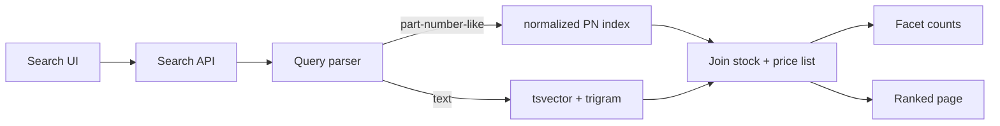
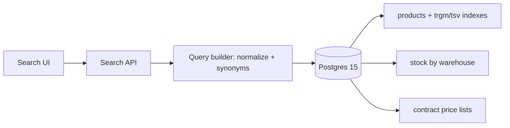

# Case product-search-two-proposals-en

## Conversation so far
(none)

## Latest user message
Need a tiebreaker on our product search redesign. Context: B2B parts catalog, ~2.1M SKUs, Postgres 15 is the source of truth, team is 3 backend devs, no dedicated ops person. Current search is ILIKE '%term%' and it's slow and useless for typos (people type 'bering' for 'bearing', part numbers like 6204-2RS vs 62042RS).

Engineer A wants to stay in Postgres: tsvector + GIN for text, keep everything in one DB, filters by warehouse stock (14 warehouses) and customer-specific price lists (~1,800 contract price lists, customers filter and sort by their own net price) stay transactional and always correct.

Engineer B wants Elasticsearch: fuzzy matching, better relevance, synonyms, faceted counts are fast. Faceted counts on brand/category/dimensions are a must-have for the new UI. But then stock and customer pricing have to be synced into the index, and stock changes ~40k times an hour. Sales has already complained twice about customers ordering items that showed 'in stock' in the old system.

They've been arguing for two weeks. Which one should we go with?

## Rubric (what a strong answer does)
1. Evaluates the proposals per sub-problem (at least text relevance/typo tolerance, part-number normalization, stock/price correctness, operational cost for a 3-person team) rather than only as two monolithic options.
2. Produces a combined design that takes strong parts from different options per sub-problem (e.g. fuzzy/trigram or search-engine matching and facets for text, while stock availability and customer-specific net prices come from Postgres at query or checkout time) and explains why it avoids denormalizing ~1,800 price lists and 40k stock changes/hour into a search index as the source of truth.
3. Addresses part-number variants like 6204-2RS vs 62042RS with a concrete technique (e.g. normalizing by stripping separators into a separate indexed field) and notes that plain tsvector full-text search alone does not give typo tolerance (pg_trgm or a fuzzy search engine is needed).
4. Ends with a clear recommendation the team can act on, including what to build first, rather than an undecided list of trade-offs.

## Answer A
**Go with Postgres.** Engineer A's plan as written won't fix your problems, though. `tsvector` does nothing for typos like "bering". You need `pg_trgm` for fuzzy matching and a normalized part-number column on top of it. Set this up as a time-boxed spike with pass/fail gates, and agree now on what result would bring Elasticsearch back into the discussion. Then the argument ends on data, not on who argues longer.

## Why Postgres wins for you

The deciding factor is customer-specific pricing, not stock.

- **Pricing is the hard problem for ES.** Customers filter and sort by their own net price across ~1,800 contract price lists. In ES you'd need either ~1,800 price fields per document (mapping explosion), nested price docs (slow, and awkward for sorting), or a two-step query where ES returns candidates and Postgres prices them. The two-step version breaks "sort by my net price" and makes price-range facets wrong whenever the candidate set is truncated. In Postgres it's a join on an index `(price_list_id, sku_id)`.
- **Stock sync is a smaller problem than it looks.** 40k updates/hour is about 11/s. Postgres doesn't notice that, and an ES cluster could absorb it too. The real cost is everything around it: a CDC pipeline (outbox or Debezium), monitoring sync lag, full reindexes, and debugging "why does ES disagree with the DB". With 3 devs and no ops person, that's a permanent tax.
- **The scale is small.** 2.1M SKUs at maybe 1–2 KB of searchable text each comes to roughly 2–4 GB with indexes. That fits in RAM on one modest Postgres box. ES's scale advantages don't come into play here.

## Pushback on the stock argument

The "showed in stock, wasn't in stock" complaints came from a system that *already* reads Postgres directly. So this isn't a search-engine problem, and neither option fixes it by itself. Stock can change between the search and the click whatever you use. The fix is to **re-validate stock (and reserve it, if you can) at add-to-cart and at order submission**, and to show "limited stock" when quantity is low. Do that whichever engine you pick. It also takes some weight off Engineer A's "always correct" argument: Postgres gives *fresher* search results, not guaranteed ones.

## Where Engineer B is right

- **Faceted counts are Postgres's weak spot.** Counting brand/category/dimension values over a broad match (say "bearing" hitting 150k SKUs), after filtering by warehouse stock and the customer's price list, means scanning all the matching rows. My rough guess is somewhere between tens and hundreds of milliseconds per facet group after tuning. That's an estimate, not a benchmark, and it's the main thing the spike has to measure.
- **Relevance tuning is better in ES.** Out of the box you get BM25, field boosting, synonyms and fuzziness. In Postgres you build ranking from `ts_rank` and trigram similarity yourself. For a parts catalog, where most queries are part numbers, brands and a few nouns, that's usually enough. For free-text descriptive search it would be the weaker option.

## The Postgres design that actually works



1. **Part numbers:** store `pn_norm = upper(regexp_replace(pn, '[^A-Za-z0-9]', '', 'g'))` and normalize the query the same way. `6204-2RS`, `62042RS` and `6204 2rs` then all match exactly (btree), and a trigram index on `pn_norm` catches near-misses.
2. **Typos in words:** a `pg_trgm` GIN index on name/description, using the `%` / `word_similarity` operators, handles "bering" → "bearing". Keep `tsvector` for stemming and multi-word ranking, and blend the two scores. Trigram operator names and threshold settings are from memory, so check them against the PG 15 `pg_trgm` docs.
3. **Synonyms:** use a small synonym table (e.g. "ball bearing" ↔ "deep groove", "SS" ↔ "stainless") and expand the query in the app. It's simpler to maintain than a Postgres thesaurus dictionary.
4. **Facets:** keep facet attributes (brand_id, category_id, key dimensions) in one flattened `search_items` table so counting doesn't need joins. For very broad queries, cap exact counting (e.g. count the top N matches, or show "1,000+") and precompute counts per category.
5. **Stock/price:** join live at query time. There's nothing to sync.

## Trade-off summary

| Option | Pros | Cons | Best when |
|---|---|---|---|
| **Postgres (pg_trgm + tsvector)** | One system, live stock/price, joins are easy, no sync pipeline, fits a 3-person team | Facet counts on broad queries may be slow; relevance is hand-built | Per-customer data drives filtering/sorting; small team; catalog of a few million rows |
| **Elasticsearch** | Fast facets, fuzzy matching/synonyms/relevance built in | CDC pipeline, sync lag, cluster ops, per-customer price modeling is painful | Mostly-static catalog, shared pricing, someone owns ops |
| **Hybrid (ES for text → IDs, PG for stock/price)** | Better relevance, live stock/price | Two systems, and facets/price sort are wrong unless ES returns the full candidate set | Only if the Postgres spike fails on relevance, not on facets |

## The tiebreaker process (about 2 weeks)

Build the Postgres version on a copy of production data and test it against:

- **Typo/PN recall:** take ~200 real failed or zero-result queries from your search logs. Target ≥ 90% with the right item in the top 10.
- **Latency:** p95 ≤ 300 ms for search plus facets on your 50 most common queries, including the broadest ones, under a realistic customer price list.
- **Stock freshness:** zero lag, by construction.

If it passes, you're done and have one system. If it **fails on facet latency or relevance after a real tuning effort**, that's the evidence for ES, and Engineer B's case becomes concrete. Even then, keep stock and pricing authoritative in Postgres and budget for the sync pipeline and a managed ES/OpenSearch service, not a self-run cluster. The 300 ms and 90% thresholds are my suggestions, so set them to whatever your UI actually needs before the spike starts, not after.


## Answer B
**Go with Postgres (Engineer A), with one correction to A's plan and a written exit criterion.** A's plan as stated doesn't fix typos, because `tsvector` does no fuzzy matching. Add `pg_trgm` and a normalized part-number column and you cover both of your concrete pain cases. B is right that Elasticsearch has better relevance tooling. But B's plan moves your two hardest correctness problems, stock and per-customer pricing, into an eventually consistent sync pipeline. With 3 devs and nobody on ops, that is the wrong trade.

## Why Postgres wins here

The deciding factor isn't search quality. It's where the correctness-critical data lives.

| | Postgres (tsvector + pg_trgm) | Elasticsearch |
|---|---|---|
| Typos ("bering") | pg_trgm similarity handles it | Fuzzy queries, built in |
| Part numbers (6204-2RS vs 62042RS) | Normalized column + trigram index | Custom analyzer, same idea |
| Relevance tuning, synonyms | Basic (weights, synonym table or dictionary) | Much richer |
| Facet counts | SQL `GROUP BY`. Fine at your size (see numbers) | Fast and native |
| Stock filter (40k changes/h) | Always correct, transactional | Sync lag + drift risk |
| Sort by customer net price (1,800 lists) | Join at query time | Hard. You must denormalize prices into the index or post-sort |
| Ops burden | Zero new systems | Cluster, CDC pipeline, reindexing, monitoring, version upgrades |

**Stock sync is solvable.** 40k updates/h is about 11/s, which is trivial throughput for ES. What you'd take on is a CDC pipeline (Debezium/Kafka or outbox + worker) whose lag and silent drift your team would have to own. You've already had two complaints about stale stock.

**Pricing is the real problem for ES.** For customers to filter and sort by their own net price, every document needs that customer's price in the index. Your options there are all bad:
- Nested prices per SKU (up to 1,800 per SKU, reindexed whenever a price list changes).
- A price field per price list (mapping explosion).
- Fetch prices from Postgres and re-sort afterwards. That breaks pagination and filtering by price range.

None of these is impossible, but each one is a project on its own.

## Rough numbers (estimates; benchmark them on your data)

- **Rows:** 2.1M SKUs is small for Postgres. A trigram GIN index on name plus part number probably lands in the low hundreds of MB, and the tsvector GIN index is smaller. The working set should fit in RAM on a modest instance.
- **Price rows:** unknown. If a contract list covers 10–50k SKUs, you have roughly 18–90M rows in `(price_list_id, sku_id)`. An index lookup per candidate is fine.
- **Facets:** a typical query matching 1k–50k SKUs, counted with `GROUP BY GROUPING SETS` over brand, category and dimensions, should take tens of ms. The risk is broad queries ("bearing" matching 300k+ rows), which could reach hundreds of ms. Mitigate by requiring a category or query before showing counts, capping counts ("10,000+"), or caching facet counts for the top N broad queries for 60s. Brand and category don't change with stock.

## What A's plan needs added

```sql
CREATE EXTENSION IF NOT EXISTS pg_trgm;

-- Part numbers: strip separators so 6204-2RS = 62042RS = 6204 2RS
ALTER TABLE products ADD COLUMN pn_norm text
  GENERATED ALWAYS AS (upper(regexp_replace(part_number, '[^A-Za-z0-9]', '', 'g'))) STORED;
CREATE INDEX products_pn_norm_trgm ON products USING gin (pn_norm gin_trgm_ops);

-- Names/descriptions: typo tolerance
CREATE INDEX products_name_trgm ON products USING gin (name gin_trgm_ops);

-- Full text with weights (name > brand > description)
ALTER TABLE products ADD COLUMN search_tsv tsvector GENERATED ALWAYS AS (
  setweight(to_tsvector('simple', coalesce(name,'')), 'A') ||
  setweight(to_tsvector('simple', coalesce(brand,'')), 'B') ||
  setweight(to_tsvector('english', coalesce(description,'')), 'C')
) STORED;
CREATE INDEX products_tsv ON products USING gin (search_tsv);
```

**Query strategy.** Normalize the user input the same way and run the branches as a `UNION`:
- exact or prefix match on `pn_norm`, ranked highest;
- a tsvector match (`websearch_to_tsquery`);
- a trigram fallback (`name % :q` or `:q <% name`).

Then rank with `ts_rank` plus `similarity()`. "bering" vs "bearing" share 5 of 10 distinct trigrams, a similarity of about 0.5, which clears pg_trgm's default 0.3 threshold (default recalled, not verified; check `pg_trgm.similarity_threshold`). This is a sketch. Tune the weights against real query logs.

**Synonyms.** Start with a plain `synonyms` table ("brg" → "bearing", "2RS" ↔ "RS2", "ZZ" ↔ "2Z") that expands the query in the app. It's easy for someone in the business to maintain, and there's no dictionary file to deploy.

**Stock and price** stay as ordinary joins in the same query, so they're always correct.



## Push back on one assumption

Most of the "showed in stock, wasn't" problem probably won't be fixed by search at all. Even with a perfectly live index, stock can change between the search and the order. The real fix is a **transactional availability check at add-to-cart and checkout**, e.g. a reservation or `SELECT ... FOR UPDATE` on the stock row. You need that whichever engine you pick. Postgres just makes the search results honest as well.

## Failure modes of the Postgres choice

- **Search load hurts OLTP.** Heavy facet queries compete with order writes. Mitigate with a read replica for search (seconds of lag is acceptable for listing, and the checkout check stays on the primary), `statement_timeout` on search queries, and a pool size limit.
- **Broad-query facet latency.** Use the caps and caching above. Alert on search p95 above roughly 300ms.
- **Relevance ceiling.** Trigram + tsvector won't match ES for phrase-level relevance, learning-to-rank or complex multilingual analysis. That's what you give up.

## Settle it with a timebox, not more debate

1. **Spike (1–2 weeks, Engineer A leads, B reviews).** Implement the above on a prod copy.
2. **Test set (Engineer B leads).** Take the top ~200 real queries from logs, plus 50 known-bad ones (typos, part-number variants). Hand-label the expected top-3 results. This gives B a real stake in the outcome.
3. **Pass criteria, agreed upfront:**
   - p95 under ~200ms for typical queries, including facets, stock filter and price sort;
   - at least ~90% of labelled queries have the right item in the top 3.
4. **Exit criteria for revisiting ES:**
   - Postgres misses those targets after tuning, or
   - the catalog grows around 10x, or
   - the business needs relevance features Postgres can't provide.

   If you do go to ES later, use it for text and static facets only. Keep stock and price in Postgres, and accept the pagination and sort compromises that come with that.

Put search behind a single `SearchService` interface so that swap stays a contained change and not a rewrite.

To sum up: A's architecture, B's test set and quality bar. You get fuzzy search and facets now, with no new infrastructure and no new consistency bugs.

