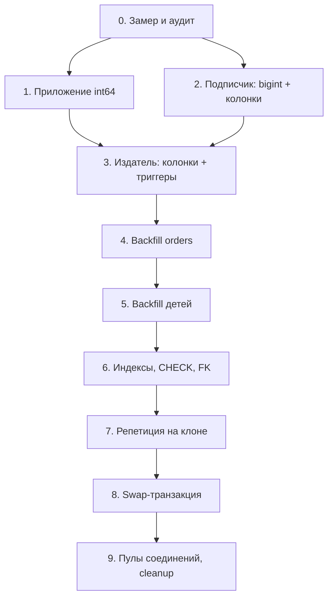
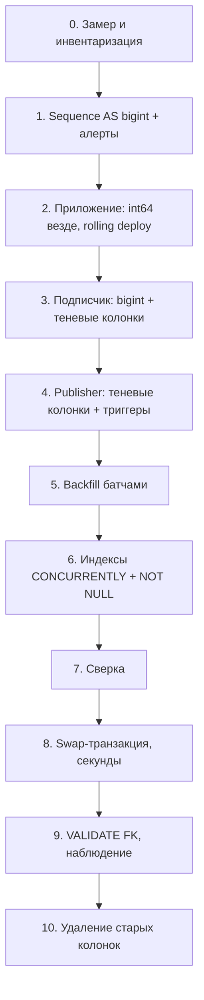

# Case pg-orders-int-to-bigint-logical-replica-ru

## Conversation so far
(none)

## Latest user message
PostgreSQL 15, таблица orders ~780 млн строк, id serial (int4), текущее значение последовательности уже 1 980 000 000, то есть до переполнения меньше 170 млн, а мы делаем ~1,2 млн заказов в день. На orders.id ссылаются внешние ключи из order_items.order_id, payments.order_id и shipments.order_id (все int4). Ещё orders и order_items публикуются через логическую репликацию (publication/subscription) в отдельный аналитический кластер, там таблицы созданы вручную с теми же типами. Бэкенд деплоится rolling-обновлением, простой больше пары минут недопустим, ALTER COLUMN TYPE в лоб на такой таблице не вариант. Распиши, пожалуйста, в каком порядке всё делать, чтобы перевести всё на bigint и ничего не сломать — включая репликацию и приложение. И посчитай, сколько у нас реально времени.

## Rubric (what a strong answer does)
1. Computes the runway correctly: 2 147 483 647 - 1 980 000 000 is about 167.5 million ids, which at ~1.2 million per day is roughly 140 days (about 4.5 months).
2. Presents an explicit ordered sequence of steps (e.g. new bigint columns plus sync trigger, batched backfill, concurrent unique index, swap in a short transaction) in which the order matters and each step's precondition is stated, rather than an unordered list of tips.
3. Covers the dependent pieces: the FK columns in order_items, payments and shipments must also become bigint, and the sequence itself must be altered to bigint (ALTER SEQUENCE ... AS bigint) because a serial sequence is created as integer.
4. States that logical replication does not replicate DDL, so every schema change (any new bigint column added on the publisher, and the type change itself) must be applied to the analytics-cluster subscriber tables first, before the publisher starts sending the new column or ids beyond the int4 range; and ends with a verification step or checklist tied back to the original goal.

## Answer A
## Коротко

- **Времени по номиналу около 140 дней, то есть примерно до середины февраля 2027.** Но эта цифра, скорее всего, оптимистичная: у вас 780 млн строк на 1,98 млрд выданных id. Сначала за сутки измерьте, сколько значений последовательности реально расходуется, а не сколько создаётся заказов.
- **Схема:** новая колонка `bigint`, триггер, фоновый backfill, индексы и FK строятся `CONCURRENTLY` / `NOT VALID`, потом всё переключается одной короткой транзакцией (секунды на метаданные). `ALTER COLUMN TYPE` на проде не выполняется.
- **Порядок важен:** сначала приложение, потом подписчик, потом издатель. Если нарушить его на любом шаге, упадёт либо приложение, либо apply worker логической репликации.
- **Цель:** закончить к началу ноября, до пика Black Friday и новогоднего сезона.

---

## 1. Сколько реально времени

```
INT4 max        = 2 147 483 647
текущее         = 1 980 000 000
осталось        =   167 483 647
```

| Сценарий расхода id в сутки | Дней до переполнения | Примерная дата (от 25.09.2026) |
|---|---|---|
| 1,2 млн (1 id на заказ, без роста) | ~140 | ~11–12 февраля 2027 |
| 1,5 млн (сезонный рост +25%, ноябрь–декабрь) | ~112 | ~середина января 2027 |
| 3,0 млн (~2,5 id на заказ, см. ниже) | ~56 | ~20 ноября 2026 |

Почему третий сценарий нельзя отбрасывать: 1,98 млрд выданных значений на 780 млн живых строк дают около 2,5 id на строку. Это может быть архивация или удаление старых заказов, и тогда всё в порядке. Но это могут быть и дыры от откатов транзакций, `INSERT ... ON CONFLICT` (он тоже вызывает `nextval`) и `CACHE` у последовательности. Тогда расход идёт быстрее, чем растёт число заказов. Проверить просто: снять значение дважды с интервалом 24 часа.

```sql
SELECT now(), last_value FROM pg_sequences WHERE sequencename = 'orders_id_seq';
```

Когда последовательность кончится, `nextval` начнёт падать с ошибкой (текст примерно `reached maximum value of sequence`, по памяти) и **все** вставки в `orders` встанут. Поставьте алерт прямо сейчас, например на `last_value > 2 100 000 000`: при номинальном темпе это около 39 дней запаса на план Б (раздел 8).

Ещё одна вещь, которую стоит проверить сегодня. Если у `order_items` собственный `id` тоже `serial` (int4), он может кончиться **раньше**, чем у `orders`, потому что на заказ приходится несколько позиций. Проверьте все последовательности сразу:

```sql
SELECT schemaname, sequencename, data_type, last_value, max_value,
       round(100.0 * last_value / max_value, 1) AS pct_used
FROM pg_sequences
ORDER BY pct_used DESC NULLS LAST;
```

---

## 2. Общий порядок



Примерный график: неделя 1 уходит на шаги 0–1 и начало шага 2, недели 2–4 на шаги 3–6, неделя 5 на репетицию и swap. Всё до шага 8 откатывается без последствий: достаточно удалить триггеры и колонки.

---

## 3. Шаг 0. Аудит: что ещё сломается

Объявленные FK составляют только часть зависимостей. Проверьте:

```sql
-- все FK на orders
SELECT conrelid::regclass, conname, pg_get_constraintdef(oid)
FROM pg_constraint WHERE confrelid = 'orders'::regclass AND contype = 'f';

-- view / matview, зависящие от orders (они помешают DROP COLUMN)
SELECT DISTINCT c.relname
FROM pg_depend d
JOIN pg_rewrite r ON r.oid = d.objid
JOIN pg_class c   ON c.oid = r.ev_class
WHERE d.refobjid = 'orders'::regclass AND c.oid <> 'orders'::regclass;

-- int4-колонки с order_id без FK (логи, возвраты, аудит и т.п.)
SELECT table_schema, table_name, column_name
FROM information_schema.columns
WHERE column_name ~ 'order_id' AND data_type = 'integer';
```

Также проверьте:
- PL/pgSQL-функции с параметрами `integer` для id заказа;
- **составные индексы и unique-ограничения**, куда входит `order_id` (их придётся продублировать на новой колонке);
- действия у существующих FK (`ON DELETE CASCADE` и т.д.): их нужно повторить на новых FK.

---

## 4. Шаг 1. Приложение (rolling, до любых изменений БД)

Сделайте весь код int64-safe при том, что колонка пока ещё `int4`. Типичные места:
- DTO и entity (`Integer` → `Long`, `int32` → `int64`);
- protobuf/gRPC: `int32` → `int64` совместимы по wire-формату (recalled, not verified — сверьтесь с документацией protobuf);
- Avro/JSON-схемы в очередях, кэши с ключами, парсинг id из URL;
- ORM-валидация схемы (например, строгий `validate` у Hibernate может ругаться на несовпадение `Long`/`integer`): на время перехода её надо ослабить;
- ETL и BI поверх аналитического кластера.

Критерий готовности: каждая версия, которая может оказаться в проде во время swap, корректно работает с id больше 2^31. Протестируйте на стенде, где последовательность выставлена на `3 000 000 000`.

---

## 5. Шаг 2. Аналитический кластер (подписчик), до издателя

Логическая репликация сопоставляет колонки **по имени** и отдаёт значения подписчику через текстовое представление. Поэтому подписчик с `bigint` спокойно принимает `int4` от издателя. Обратное направление (издатель уже с `bigint > 2^31`, подписчик ещё `int4`) остановит apply worker с ошибкой. Отсюда вывод: подписчик переводится первым.

Вторая ловушка: если на издателе появится колонка, которой нет у подписчика, apply тоже упадёт. Поэтому `id_new` и `order_id_new` сначала создаются у подписчика.

```sql
-- на подписчике
ALTER SUBSCRIPTION analytics_sub DISABLE;
ALTER TABLE orders      ALTER COLUMN id       TYPE bigint;
ALTER TABLE order_items ALTER COLUMN order_id TYPE bigint;
-- + order_items.id, если он тоже int4
ALTER TABLE orders      ADD COLUMN id_new       bigint;
ALTER TABLE order_items ADD COLUMN order_id_new bigint;
ALTER SUBSCRIPTION analytics_sub ENABLE;
```

Здесь `ALTER TYPE` перезаписывает таблицы, и на сотнях миллионов строк это займёт часы. Для аналитики это обычно допустимо (согласуйте с потребителями), но пока подписка стоит, **слот на издателе копит WAL**:
- проверьте свободное место под `pg_wal` на издателе;
- проверьте `max_slot_wal_keep_size`. Если лимит задан и его превысить, слот инвалидируется, и придётся делать полную пересинхронизацию.

```sql
-- на издателе, мониторинг лага слота
SELECT slot_name, active, wal_status,
       pg_size_pretty(pg_wal_lsn_diff(pg_current_wal_lsn(), confirmed_flush_lsn)) AS lag
FROM pg_replication_slots WHERE slot_type = 'logical';
```

Триггеры на подписчике при apply по умолчанию не срабатывают (`session_replication_role = replica`), и здесь это как раз нужно.

---

## 6. Шаги 3–6. Издатель: подготовка без блокировок

Все DDL выполняйте с `SET lock_timeout = '2s'` и повтором. Иначе `ADD COLUMN` встанет в очередь за долгим запросом и заблокирует всю запись в таблицу. Перед каждым DDL смотрите долгие транзакции в `pg_stat_activity`.

### 3. Колонки и триггеры

```sql
SET lock_timeout = '2s';
ALTER TABLE orders ADD COLUMN id_new bigint;   -- мгновенно, только метаданные

CREATE FUNCTION orders_sync_id_new() RETURNS trigger LANGUAGE plpgsql AS $$
BEGIN
  NEW.id_new := NEW.id;
  RETURN NEW;
END $$;

CREATE TRIGGER orders_sync_id_new
  BEFORE INSERT OR UPDATE OF id ON orders
  FOR EACH ROW EXECUTE FUNCTION orders_sync_id_new();
```

Для `order_items`, `payments` и `shipments` то же самое: колонка `order_id_new bigint` и триггер `NEW.order_id_new := NEW.order_id` на `INSERT OR UPDATE OF order_id`.

### 4–5. Backfill

Сначала `orders`, потом дети. Батчами по диапазону PK, с коммитом на каждый батч:

```sql
UPDATE orders SET id_new = id
WHERE id >= :lo AND id < :lo + 20000 AND id_new IS NULL;
```

Скрипт между батчами проверяет лаг логического слота и физических реплик и притормаживает, если лаг растёт. Каждый `UPDATE` реплицируется в аналитику, а apply worker в PG15 для обычных транзакций однопоточный, так что узким местом, скорее всего, окажется именно он.

Грубые оценки (проверьте на клоне):
- при 10–30 тыс. строк/с чистого времени на `orders` уходит 7–22 часа, с троттлингом реалистично 2–4 дня; `order_items` займёт кратно дольше;
- WAL: порядка сотен ГБ на `orders` (оценка). Нужно учесть архив WAL и диск реплик;
- bloat: каждая обновлённая строка даёт новую версию, а при `fillfactor = 100` апдейты в основном не HOT и добавляют записи во **все** индексы. Нужен запас по диску примерно в размер таблицы плюс индексы. Подкрутите autovacuum на этих таблицах; раздутые индексы потом переиндексируются через `REINDEX CONCURRENTLY`.

Индекс на `id_new` стройте **после** backfill: так он строится один раз, а не обновляется 780 млн раз.

### 6. Индексы, NOT NULL, FK

```sql
-- orders
CREATE UNIQUE INDEX CONCURRENTLY orders_id_new_key ON orders (id_new);
ALTER TABLE orders ADD CONSTRAINT orders_id_new_nn CHECK (id_new IS NOT NULL) NOT VALID;
ALTER TABLE orders VALIDATE CONSTRAINT orders_id_new_nn;   -- не блокирует запись

-- дети (для каждой из трёх таблиц)
CREATE INDEX CONCURRENTLY order_items_order_id_new_idx ON order_items (order_id_new);
-- + копии всех составных индексов / unique с order_id
ALTER TABLE order_items ADD CONSTRAINT order_items_order_id_new_nn
  CHECK (order_id_new IS NOT NULL) NOT VALID;               -- если order_id NOT NULL
ALTER TABLE order_items VALIDATE CONSTRAINT order_items_order_id_new_nn;

ALTER TABLE order_items ADD CONSTRAINT order_items_order_id_new_fkey
  FOREIGN KEY (order_id_new) REFERENCES orders (id_new)
  ON DELETE CASCADE          -- те же действия, что у старого FK
  NOT VALID;
ALTER TABLE order_items VALIDATE CONSTRAINT order_items_order_id_new_fkey;
```

Про FK две детали:
- **Новые FK создавайте только после полного backfill `orders`.** `NOT VALID` FK всё равно проверяет новые записи. Если раньше времени создать FK, то новый платёж по старому заказу, у которого `id_new` ещё `NULL`, упадёт на проверке.
- FK на колонку с обычным уникальным индексом (без constraint) PostgreSQL принимает (по памяти, проверьте на клоне). Если нет, сделайте `ADD CONSTRAINT ... UNIQUE USING INDEX orders_id_new_key`.

`CHECK ... NOT VALID` + `VALIDATE` нужны, чтобы потом `SET NOT NULL` прошёл без полного скана таблицы под `ACCESS EXCLUSIVE`. Эта оптимизация есть с PG12.

---

## 7. Шаг 7. Репетиция

Поднимите клон прода (из бэкапа или снапшота) с подпиской в тестовый аналитический кластер и прогоните на нём шаги 3–8 целиком. Нужны три результата: реальная скорость backfill, объём WAL и **время swap-транзакции**. Без этой репетиции я бы swap на проде не делал.

---

## 8. Шаг 8. Swap-транзакция

Запускайте в окно низкого трафика, с `lock_timeout` и повтором. Все операции здесь меняют только метаданные, поэтому транзакция идёт секунды. Запросы приложения это время ждут в очереди на блокировке, что укладывается в ваш лимит простоя.

```sql
BEGIN;
SET LOCAL lock_timeout = '3s';
LOCK TABLE orders, order_items, payments, shipments IN ACCESS EXCLUSIVE MODE;

-- 0) зависимые view: DROP VIEW ... (пересоздать в конце этой же транзакции)

-- 1) старые FK
ALTER TABLE order_items DROP CONSTRAINT order_items_order_id_fkey;
ALTER TABLE payments    DROP CONSTRAINT payments_order_id_fkey;
ALTER TABLE shipments   DROP CONSTRAINT shipments_order_id_fkey;

-- 2) orders
ALTER TABLE orders DROP CONSTRAINT orders_pkey;
ALTER TABLE orders ALTER COLUMN id DROP DEFAULT;
ALTER SEQUENCE orders_id_seq AS bigint MAXVALUE 9223372036854775807;
ALTER SEQUENCE orders_id_seq OWNED BY orders.id_new;  -- КРИТИЧНО, см. ниже
DROP TRIGGER orders_sync_id_new ON orders;
ALTER TABLE orders DROP COLUMN id;
ALTER TABLE orders RENAME COLUMN id_new TO id;
ALTER TABLE orders ALTER COLUMN id SET DEFAULT nextval('orders_id_seq');
ALTER TABLE orders ALTER COLUMN id SET NOT NULL;      -- без скана благодаря CHECK
ALTER TABLE orders ADD CONSTRAINT orders_pkey PRIMARY KEY USING INDEX orders_id_new_key;
ALTER TABLE orders DROP CONSTRAINT orders_id_new_nn;

-- 3) каждая дочерняя таблица
DROP TRIGGER order_items_sync_order_id_new ON order_items;
ALTER TABLE order_items DROP COLUMN order_id;          -- уносит старые индексы
ALTER TABLE order_items RENAME COLUMN order_id_new TO order_id;
ALTER TABLE order_items ALTER COLUMN order_id SET NOT NULL;
ALTER TABLE order_items DROP CONSTRAINT order_items_order_id_new_nn;
ALTER TABLE order_items RENAME CONSTRAINT order_items_order_id_new_fkey TO order_items_order_id_fkey;
ALTER INDEX order_items_order_id_new_idx RENAME TO order_items_order_id_idx;
-- то же для payments, shipments

-- 4) CREATE VIEW ... заново
COMMIT;
```

Места, где проще всего всё сломать:
- **`OWNED BY` до `DROP COLUMN`.** Последовательность от `serial` принадлежит колонке `orders.id`. Если удалить колонку, пока она владелец, **последовательность удалится вместе с ней**.
- **`ALTER SEQUENCE ... AS bigint`.** Последовательность от `serial` создаётся как `AS integer` с `MAXVALUE 2147483647`. Если не поменять тип, колонка станет `bigint`, а последовательность всё равно упрётся в тот же потолок. `MAXVALUE` я указываю явно, чтобы не полагаться на автоматическое расширение.
- **Старую колонку удаляем сразу, не оставляем «на всякий случай».** Если оставить `id_old`, издатель начнёт публиковать колонку, которой нет у подписчика, и apply упадёт. Удалённые колонки не публикуются. Цена такого решения: после swap откат возможен только вперёд. Это осознанный компромисс, поэтому перед swap нужен свежий бэкап/PITR и отрепетированный сценарий.
- **Replica identity.** `REPLICA IDENTITY DEFAULT` опирается на PK. Внутри транзакции PK пересоздаётся, а DML в этот момент нет из-за `LOCK`. Если у вас `REPLICA IDENTITY USING INDEX` на конкретный индекс, его нужно переназначить.

После коммита издатель шлёт колонку `id` уже как `bigint`. У подписчика `id` уже `bigint`, сопоставление идёт по имени, так что репликация продолжается без вмешательства. `id_new` на подписчике перестаёт заполняться, её удаляем на cleanup.

---

## 9. Шаг 9. После swap

1. **Пулы соединений.** Server-side prepared statements, закэшированные до swap, могут падать с `cached plan must not change result type` (текст по памяти), особенно на `SELECT *`. Сразу после swap переоткройте соединения: rolling restart или сброс пулов (PgBouncer тоже). Добавьте ретрай на эту ошибку.
2. Проверьте, что `nextval` отдаёт ожидаемые значения, apply на подписчике не стоит, а лаг слота падает.
3. Cleanup: `DROP COLUMN id_new` / `order_id_new` на подписчике, `DROP FUNCTION` триггерных функций, `VACUUM (ANALYZE)` и `REINDEX CONCURRENTLY` раздутых индексов.
4. Отдельно, но по той же схеме: собственные `id` у `order_items`, `payments` и `shipments`, если они int4.

---

## Компромиссы

| Вариант | Плюсы | Минусы | Когда подходит |
|---|---|---|---|
| **Новая колонка + триггер + swap** (рекомендую) | Простой в секундах; до swap всё обратимо; не нужны новые инструменты | Много ручных шагов; bloat и WAL от backfill; нагрузка на логическую репликацию | Ваш случай: жёсткий лимит простоя и готовая логическая репликация |
| `ALTER COLUMN TYPE` в лоб | Одна команда | Перезапись таблицы и всех индексов под `ACCESS EXCLUSIVE`: часы простоя | Только если можно остановиться на ночь |
| Новая таблица `orders_new` + копирование + переключение (pgcopydb, логическая репликация в копию) | Нет bloat в исходной таблице | Сложнее с FK и публикацией; переключение имени таблицы тоже ломает подписку | Когда заодно нужно партиционирование |
| **План Б:** отрицательные id | 10 минут работы, ещё ~2,1 млрд значений | Приложение может считать `id > 0` или сортировать по id; техдолг | **Только аварийно**, если сработал алерт, а swap не готов |

План Б в одну команду (сначала проверьте, что приложение и аналитика переживут отрицательные id):

```sql
ALTER SEQUENCE orders_id_seq MINVALUE -2147483648 RESTART WITH -2147483648;
```

## Что сломается первым

| Отказ | Симптом | Защита |
|---|---|---|
| Последовательность кончилась до swap | Все `INSERT` в `orders` падают | Алерт на 2,10 млрд, наготове план Б |
| Подписчик не готов к bigint или новой колонке | Apply worker в цикле ошибок, слот копит WAL | Шаг 2 строго до шага 3, мониторинг `wal_status` |
| Переполнение `pg_wal` от слота или backfill | Издатель останавливается | Троттлинг backfill по лагу, запас диска, `max_slot_wal_keep_size` |
| DDL встал в очередь за долгим запросом | Запись в таблицу блокируется | `lock_timeout` + retry |
| FK создан до backfill | Новые платежи по старым заказам падают | FK только после 100% backfill `orders` |
| `DROP COLUMN` при `OWNED BY` на старой колонке | Пропала последовательность, вставки падают | `OWNED BY orders.id_new` до `DROP COLUMN` |
| Кэш prepared statements в приложении | Всплеск ошибок сразу после swap | Пересоздание пулов, ретрай |

Главное прямо сейчас: сегодня замерить реальный суточный расход последовательности и поставить алерт. Если выйдет около 3 млн в сутки, запас не пять месяцев, а меньше двух, и тогда весь график придётся ужимать до начала ноября.


## Answer B
## Коротко

- **Сколько осталось.** По номиналу около **140 дней**, то есть примерно до 11–12 февраля 2027. Но скорее всего реальный запас меньше, и его надо измерить до начала работ (см. ниже). Закладывайтесь на то, что всё должно быть переключено **до ноябрьских пиков и code freeze**.
- **Как делать.** Теневые bigint-колонки, триггер синхронизации, батчевый backfill, индексы `CONCURRENTLY`, потом одна короткая транзакция swap на несколько секунд под `lock_timeout`. Приложение и подписчика готовят **до** изменений на publisher.
- **Порядок критичен.** Сначала приложение (int64 везде), затем аналитический подписчик, затем publisher. Если сделать наоборот, логическая репликация упадёт на первой же колонке, которой нет у подписчика.

---

## 1. Сколько у вас реально времени

**Номинал:**
- Предел int4: 2 147 483 647
- Осталось: 2 147 483 647 − 1 980 000 000 = **167 483 647**
- 167,5 млн / 1,2 млн в день ≈ **139,6 дня**, это примерно 11–12.02.2027

**Почему реально, скорее всего, меньше:**

| Сценарий | Расход id/день | Дней | Переполнение ≈ |
|---|---|---|---|
| Ровно 1,2 млн/день | 1,2 млн | ~140 | 11.02.2027 |
| Рост/сезонность +20% | 1,44 млн | ~116 | 19.01.2027 |
| Последовательность «жжёт» в 2,5 раза больше заказов | ~3 млн | ~56 | **~20.11.2026** |

Третья строка не выдуманная. Последовательность дошла почти до 2 млрд, а строк 780 млн. Если заказы не удаляются и не архивируются, значит около 60% значений ушло впустую: откаты транзакций, `INSERT ... ON CONFLICT`, кэш последовательности, ретраи. Тогда реальный расход id в 2–2,5 раза больше числа заказов, и у вас не 4,5 месяца, а меньше двух. Плюс Black Friday приходится ровно на этот период.

**Проверьте прямо сегодня:**

```sql
-- фактический темп расхода id за неделю (включая «дыры»)
SELECT (max(id) - min(id)) / 7.0 AS ids_per_day
FROM orders WHERE created_at >= now() - interval '7 days';

-- все int4-последовательности и степень их заполнения
SELECT schemaname, sequencename, data_type, last_value,
       round(100.0 * last_value / max_value, 1) AS pct_used
FROM pg_sequences ORDER BY pct_used DESC NULLS LAST;
```

Обязательно посмотрите на `order_items.id`, `payments.id` и `shipments.id`. Если это тоже `serial`, то `order_items` (строк там обычно в разы больше, чем в `orders`) может переполниться **раньше**, чем `orders`. Тогда мигрировать нужно и собственные PK дочерних таблиц, по той же схеме.

**Рабочий дедлайн.** Сама миграция займёт 3–5 недель календарного времени: аудит приложения, backfill сотен миллионов строк с троттлингом, построение индексов, наблюдение после swap. Цель: swap до середины ноября. Плюс сразу подготовленный Plan B (раздел 6).

---

## 2. Общий порядок



Шаги 2 и 3 можно вести параллельно, но оба должны закончиться до шага 4.

---

## 3. Пошагово

### Шаг 0. Инвентаризация (1–3 дня)

- **Зависимые объекты.** Views и materialized views ссылаются на колонку по номеру атрибута (attnum), а не по имени. После переименования `id → id_old` они продолжат смотреть на **старую** колонку. Найдите их через `pg_depend`/`pg_rewrite` и заложите пересоздание. Тела plpgsql-функций разрешают имена при выполнении, так что это менее опасно, но проверьте их тоже.
- **Подписка.** Проверьте `SELECT subname, subbinary FROM pg_subscription;` на аналитическом кластере. При `binary = true` типы на обеих сторонах должны совпадать (по памяти, не проверено: сверьтесь с документацией вашей версии), и int4 на publisher против int8 на подписчике может сломать apply. На время миграции переключите: `ALTER SUBSCRIPTION ... SET (binary = false)`.
- **Тип публикации.** Это `FOR ALL TABLES` или явный список таблиц? От этого зависит вариант в шаге 3.
- **Место на диске.** Backfill через UPDATE временно почти удваивает heap `orders` (без HOT: fillfactor обычно 100) и генерирует WAL порядка объёма таблицы или больше. Этот WAL удерживается слотом логической репликации, пока аналитика его не применит. Нужен запас примерно в размер таблицы плюс WAL, плюс место под архив WAL/PITR.

### Шаг 1. Сразу, это дёшево

```sql
ALTER SEQUENCE orders_id_seq AS bigint;
```

Для `serial` в PG10+ последовательность создаётся `AS integer` с `MAXVALUE 2147483647`. Без этой команды последовательность упрётся в предел сама, даже когда колонка уже станет bigint. При смене типа `MAXVALUE` по умолчанию, насколько я помню, поднимается до предела bigint, но проверьте `pg_sequences.max_value` после команды. Сделайте то же для остальных int4-последовательностей.

Поставьте алерт на `pct_used > 95%` по всем последовательностям.

### Шаг 2. Приложение (до любых изменений схемы)

После миграции значения ещё какое-то время останутся меньше 2³¹, поэтому баги с int32 проявятся не при swap, а в день перехода через 2 147 483 647. Искать их нужно заранее:
- типы ID в коде: Java `int`/`Integer`, Go `int32`, C# `int`, поля в DTO, protobuf `int32`, **GraphQL `Int` (32-битный по спецификации)**, JSON-схемы, OpenAPI `format: int32`;
- JavaScript: `number` безопасен до 2⁵³, но проверьте драйвер. Некоторые драйверы отдают int8 **строкой**, и сравнения `===` начнут ломаться;
- ORM со строгим маппингом `SELECT *`: появление колонки `id_new` может сломать сканирование в struct (например, в Go sqlx есть ошибка missing destination). Лучше явные списки колонок;
- позиционные `INSERT INTO orders VALUES (...)`;
- потребители аналитики: ETL, BI, выгрузки.

Выкатите это обычным rolling deploy. Код с int64 одинаково работает и до swap, и после, поэтому **в момент swap деплой не нужен**. Это ключевое свойство плана.

Отдельный риск: server-side prepared statements (pgjdbc, пулы). После swap закэшированные планы `SELECT *` могут падать с `cached plan must not change result type`. Нужен ретрай на уровне запроса или пересоздание пула сразу после swap.

### Шаг 3. Аналитический подписчик (до publisher)

Логическая репликация сопоставляет колонки по **именам**. Если publisher шлёт колонку, которой нет у подписчика, apply падает. Если у подписчика есть лишние колонки, это нормально. Отсюда самый простой и устойчивый вариант, который работает и с `FOR ALL TABLES`:

```sql
-- на подписчике, для orders
ALTER TABLE orders ALTER COLUMN id TYPE bigint;   -- переписывание таблицы, для аналитики допустимо
ALTER TABLE orders ADD COLUMN id_new bigint, ADD COLUMN id_old bigint;

-- для order_items
ALTER TABLE order_items ALTER COLUMN order_id TYPE bigint;
ALTER TABLE order_items ADD COLUMN order_id_new bigint, ADD COLUMN order_id_old bigint;
```

Такой подписчик примет изменения в любой фазе:
- до swap publisher шлёт `id, id_new`, и обе колонки есть;
- после swap publisher шлёт `id` (bigint) и `id_old`, и они тоже есть;
- PK подписчика (`id`) в обеих фазах получает одно и то же число.

Пока идёт `ALTER TYPE`, apply worker ждёт блокировку, а слот на publisher копит WAL. Для часов это нормально, но смотрите на `max_slot_wal_keep_size`: если лимит превышен, слот инвалидируется и понадобится полная пересинхронизация.

*Альтернатива:* column lists в публикации (появились в PG15), чтобы спрятать `id_new` от подписчика. Тогда в swap-транзакции придётся менять и публикацию, а `ALTER PUBLICATION ... SET TABLE` заменяет **весь** список таблиц. Это больше движущихся частей ради того, чтобы не держать мусорные колонки. Не рекомендую.

### Шаг 4. Publisher: теневые колонки и триггеры

```sql
SET lock_timeout = '2s';  -- с ретраями в скрипте
ALTER TABLE orders      ADD COLUMN id_new bigint;        -- без DEFAULT: только метаданные (PG11+)
ALTER TABLE order_items ADD COLUMN order_id_new bigint;
ALTER TABLE payments    ADD COLUMN order_id_new bigint;
ALTER TABLE shipments   ADD COLUMN order_id_new bigint;

CREATE FUNCTION orders_sync_id() RETURNS trigger LANGUAGE plpgsql AS $$
BEGIN NEW.id_new := NEW.id; RETURN NEW; END $$;
CREATE TRIGGER orders_sync_id BEFORE INSERT OR UPDATE ON orders
  FOR EACH ROW EXECUTE FUNCTION orders_sync_id();

-- аналогично для детей: NEW.order_id_new := NEW.order_id
```

DEFAULT подставляется до BEFORE-триггера, поэтому `NEW.id` в триггере уже заполнен. На подписчике триггеры при apply по умолчанию не срабатывают, туда значения придут от publisher.

### Шаг 5. Backfill

```sql
UPDATE orders SET id_new = id
WHERE id >= :lo AND id < :lo + 20000 AND id_new IS NULL;
-- COMMIT после каждого батча
```

- Идите по диапазонам PK, 10–50 тыс. строк на батч, с паузами.
- **Троттлинг по метрикам:** лаг логического слота (`pg_current_wal_lsn() - confirmed_flush_lsn`), лаг физических реплик, IO.
- Периодически запускайте `VACUUM orders`, иначе раздуется.
- Каждый UPDATE уйдёт в аналитику как обычный UPDATE. Это 780 млн+ изменений через репликацию, и именно это, скорее всего, будет узким местом, а не сам UPDATE.
- Грубая прикидка: при 20–50 тыс. строк/с чистого времени 4–11 часов на `orders`. С троттлингом реалистично несколько дней. `order_items` вероятно в разы больше.

### Шаг 6. Индексы и NOT NULL (всё неблокирующее)

Индексы стройте **после** backfill и VACUUM: `CREATE INDEX CONCURRENTLY` удерживает xmin и мешает вакууму.

```sql
CREATE UNIQUE INDEX CONCURRENTLY orders_id_new_uidx ON orders (id_new);
CREATE INDEX CONCURRENTLY order_items_order_id_new_idx ON order_items (order_id_new);
-- то же для payments, shipments
-- ВАЖНО: каждый существующий составной индекс с order_id продублируйте с order_id_new

ALTER TABLE orders ADD CONSTRAINT orders_id_new_nn CHECK (id_new IS NOT NULL) NOT VALID;
ALTER TABLE orders VALIDATE CONSTRAINT orders_id_new_nn;  -- SHARE UPDATE EXCLUSIVE, не блокирует DML
ALTER TABLE orders ALTER COLUMN id_new SET NOT NULL;      -- PG12+: скан пропускается благодаря валидному CHECK
ALTER TABLE orders DROP CONSTRAINT orders_id_new_nn;
-- то же для order_id_new в дочерних таблицах
```

Если `CREATE INDEX CONCURRENTLY` упал, остаётся INVALID-индекс. Удалите его и повторите.

### Шаг 7. Сверка

```sql
SELECT count(*) FROM orders WHERE id_new IS DISTINCT FROM id;                -- должно быть 0
SELECT count(*) FROM order_items WHERE order_id_new IS DISTINCT FROM order_id;
```

Можно по диапазонам, чтобы не делать один гигантский скан.

### Шаг 8. Swap: одна короткая транзакция в тихий час

```sql
BEGIN;
SET LOCAL lock_timeout = '3s';
LOCK TABLE orders, order_items, payments, shipments IN ACCESS EXCLUSIVE MODE;

-- старые FK
ALTER TABLE order_items DROP CONSTRAINT order_items_order_id_fkey;
ALTER TABLE payments    DROP CONSTRAINT payments_order_id_fkey;
ALTER TABLE shipments   DROP CONSTRAINT shipments_order_id_fkey;

-- PK
ALTER TABLE orders DROP CONSTRAINT orders_pkey;
ALTER TABLE orders ADD CONSTRAINT orders_pkey PRIMARY KEY USING INDEX orders_id_new_uidx;

-- default и владение последовательностью
ALTER TABLE orders ALTER COLUMN id DROP DEFAULT;
ALTER TABLE orders ALTER COLUMN id_new SET DEFAULT nextval('orders_id_seq');
ALTER SEQUENCE orders_id_seq OWNED BY orders.id_new;  -- иначе DROP COLUMN id_old удалит последовательность!

-- переименование
ALTER TABLE orders RENAME COLUMN id TO id_old;
ALTER TABLE orders RENAME COLUMN id_new TO id;
ALTER TABLE orders ALTER COLUMN id_old DROP NOT NULL;
-- то же для order_id в трёх дочерних таблицах

-- триггеры: убрать прямую синхронизацию (опционально поставить обратную, см. ниже)
DROP TRIGGER orders_sync_id ON orders;  -- и на детях

-- новые FK: NOT VALID, то есть без скана; новые строки проверяются сразу
ALTER TABLE order_items ADD CONSTRAINT order_items_order_id_fkey
  FOREIGN KEY (order_id) REFERENCES orders (id) NOT VALID;
-- то же для payments, shipments

-- пересоздать views, найденные на шаге 0
COMMIT;
```

- Если `lock_timeout` сработал, откатываемся и повторяем. Ничего не сломано.
- Под блокировкой транзакция держится секунды, так что ограничение «простой не больше пары минут» соблюдается с запасом.
- Сразу после COMMIT пересоздайте пулы соединений или убедитесь, что ретраи отработали (про prepared statements см. шаг 2).
- **Откат.** Если хотите возможность вернуться назад, вместо DROP поставьте обратный триггер `NEW.id_old := NEW.id` на 1–2 недели. Тогда обратный swap симметричен. Его **обязательно** нужно снять задолго до того, как id дойдёт до 2³¹, иначе упадут вставки.

### Шаг 9. После swap

```sql
ALTER TABLE order_items VALIDATE CONSTRAINT order_items_order_id_fkey;  -- не блокирует запись
-- payments, shipments
```

Следите за ошибками приложения, лагом репликации и тем, что в аналитике новые строки приходят с заполненным `id`.

### Шаг 10. Уборка (через 1–2 недели)

```sql
DROP INDEX CONCURRENTLY <старые индексы по order_id_old>;
ALTER TABLE orders DROP COLUMN id_old;   -- только метаданные, место вернётся при следующих перезаписях
ALTER TABLE order_items DROP COLUMN order_id_old;  -- и т.д.
```

Затем на подписчике: `DROP COLUMN id_new, id_old` (publisher их уже не шлёт). Если меняли `binary`, верните его.

---

## 4. Почему этот вариант

| Вариант | Плюсы | Минусы | Когда уместен |
|---|---|---|---|
| `ALTER COLUMN TYPE` в лоб | Одна команда | Переписывание 780 млн строк и детей под ACCESS EXCLUSIVE, часы простоя | Маленькие таблицы |
| **Теневая колонка + swap** (рекомендую) | Простой в секундах, откатываемо на каждом шаге до swap, приложение не деплоится в момент swap | Много шагов, bloat и WAL от backfill, нагрузка на аналитику | Ваш случай |
| Новая таблица / новый кластер через логическую репликацию, затем switchover | Чистые таблицы без bloat, можно заодно сменить что-то ещё | Сильно сложнее с FK и публикацией, switchover всего приложения | Если и так планировался переезд или апгрейд |
| Отрицательный диапазон последовательности | Минуты работы, даёт ещё ~2,1 млрд | Не решает проблему, ломает логику `id > 0` и сортировку по id | Только аварийный Plan B |

---

## 5. Что сломается первым и как ловить

- **Слот логической репликации копит WAL во время backfill.** Это главный риск для диска publisher. Троттлинг по лагу слота и алерт на `pg_replication_slots`.
- **Bloat `orders`.** VACUUM между батчами. После уборки при необходимости `pg_repack`.
- **Swap не может взять блокировку** из-за долгих транзакций. Перед swap проверьте `pg_stat_activity` на старые `xact_start`, у вас короткий `lock_timeout` и ретраи.
- **int32 в коде или API** всплывёт только при id > 2³¹. Проверить заранее можно на staging: `setval` последовательности на 2 147 483 000 и прогон end-to-end тестов, включая аналитический ETL.
- **Последовательность удалена вместе с `id_old`**, если забыть `OWNED BY`. Это есть в скрипте swap, не пропускайте.

## 6. Plan B, если не успеваете

Держите готовый runbook. Когда последовательность близка к пределу, а swap ещё не сделан:

```sql
ALTER SEQUENCE orders_id_seq MINVALUE -2147483648 RESTART WITH -2147483648;
```

Это даёт ещё ~2,1 млрд значений в int4 без изменения схемы. Цена: отрицательные id. Всё, что предполагает `id > 0`, «новее = больше id» или использует id в URL и валидациях, нужно проверить заранее. Это страховка, а не решение.

---

**Итог по времени.** Если замер покажет расход около 1,2 млн/день, у вас около 140 дней, и спокойно укладываетесь за 4–6 недель. Если расход последовательности примерно в 2,5 раза выше из-за «дыр», то у вас около 8 недель, и начинать нужно на этой неделе, начиная с шагов 0–2.

