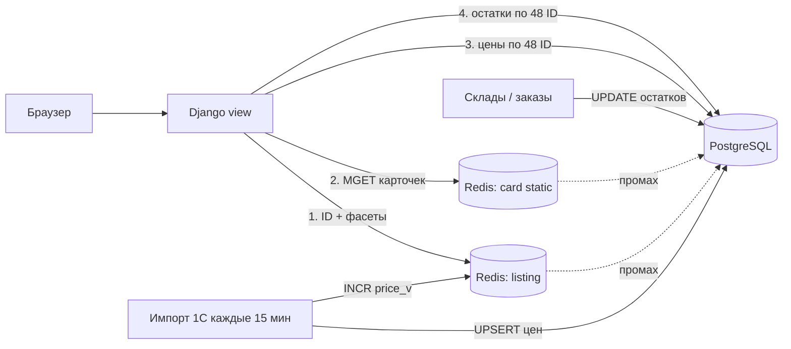

**Коротко:** не берите ни одно из двух предложений. У разных частей страницы разная скорость изменения, поэтому и кеш нужен разный. Описания и характеристики кешируем надолго и сбрасываем явно. Список ID товаров под фильтр кешируем с версией, которая меняется после каждого пакета цен. Цены и остатки для 48 карточек на каждый запрос читаем из PostgreSQL по первичному ключу: это единицы миллисекунд, и кешировать их незачем. Для «в наличии» кеша нет совсем. Kafka не нужна, хватит Redis и счётчиков версий.

## Почему оба предложения не подходят

| Вариант | Плюсы | Минусы | Когда подходит |
|---|---|---|---|
| Вся страница в Redis на 5 мин (тимлид) | Проще всего, почти 100% попаданий | До 5 минут показывает «в наличии» для проданного товара, то есть ровно ту проблему, из-за которой жалобы и возвраты. После пакета из 1С цены до 5 минут старые. Комбинаций фильтров очень много, поэтому на «длинном хвосте» кеш почти не попадает | Контент, который меняется редко |
| Отдельные товары с TTL 15 мин (бэкендер) | Переиспользуется между категориями | Остатки устаревают на срок до 15 минут, это ещё хуже. Цены до 15 минут старые после пакета. **Не ускоряет подбор товаров под фильтр**, а 800 мс почти наверняка уходят именно туда | Только для статичной части карточки |

Главная ошибка обоих вариантов в том, что остатки и цены попадают под один TTL со статикой. Для остатков любое устаревание заметно покупателю.

## Сначала замерьте, куда уходят 800 мс

Всё, что ниже, я предполагаю, а не знаю. Прежде чем что-то строить, снимите профиль: `pg_stat_statements`, `EXPLAIN (ANALYZE, BUFFERS)` на запросе листинга и фасетов, и посчитайте запросы ORM на одну страницу. Для такой страницы обычно подозреваю три вещи, примерно в таком порядке:
1. **Подсчёт фасетов** (`COUNT … GROUP BY` по атрибутам категории), скорее всего главный потребитель времени.
2. **N+1 в ORM**: картинки, атрибуты, цены и остатки подгружаются отдельно для каждой карточки.
3. **Рендеринг шаблона Django** для 48 карточек: вполне реально 30–100 мс.

Если выяснится, что основная часть времени уходит на N+1, лечить надо `select_related` / `prefetch_related`, а не кешем.

## Оценка на салфетке

Исходные данные в основном ваши. Строки с пометкой «оценка» — мои порядки, проверьте на своём железе.

- **Строки остатков:** 2 млн SKU × 40 складов = до 80 млн строк (в реальности, скорее всего, меньше, потому что не на каждом складе есть каждый товар).
- **Цены:** 50 тыс. изменений раз в 15 минут ≈ 55 в секунду в среднем. Приходят пачкой, поэтому одного batch UPSERT хватит.
- **Остатки для одной страницы:** если читать напрямую, это 48 × 40 = 1 920 строк; если денормализовать, 48 строк. Выборка по PK/индексу займёт порядка 1–5 мс (оценка).
- **Бюджет на 150 мс (оценка):**

| Шаг | При попадании в кеш | Источник |
|---|---|---|
| ID товаров и фасеты | 1–2 мс | Redis |
| Статика 48 карточек (`MGET`) | 1–2 мс | Redis |
| Цены для 48 ID | 1–3 мс | PostgreSQL, PK |
| Остатки для 48 ID | 1–5 мс | PostgreSQL, PK |
| Рендер карточек + Django overhead | 20–60 мс | CPU |
| **Итого** | **~30–75 мс** | запас до 150 мс остаётся |

При промахе по листингу (первый запрос после смены версии) время ≈ стоимость SQL для фасетов. Поэтому ниже предусмотрена защита от одновременного пересчёта (stampede).

## Архитектура: четыре слоя по скорости изменения

**Слой 1. Список ID и фасеты: Redis, ключ с версией**
- Ключ: `listing:{category_id}:{cat_v}:{price_v}:{hash(filters, sort, page)}` → JSON со списком ID товаров (с запасом, об этом ниже) и значениями фасетов.
- `price_v` — глобальный счётчик. Импорт из 1С увеличивает его после commit транзакции (`transaction.on_commit`). Так фильтр по цене и сортировка по цене становятся актуальными сразу после пакета, и ничего не нужно удалять по маске: старые ключи сами вытесняются через TTL (например, 1 час) и `maxmemory-policy allkeys-lru`.
- `cat_v` меняется, когда меняется ассортимент категории или её атрибуты. Это редкие события, их можно менять вручную из админки или сигналом.

**Слой 2. Статика карточки: Redis, долгий TTL плюс явная инвалидация**
- `card:{sku_id}:{content_v}` → название, картинка, ключевые характеристики, URL. TTL — сутки или больше.
- Если рендер окажется узким местом, можно кешировать **готовый HTML-фрагмент** карточки без цены и бейджа наличия, а цену и наличие подставлять отдельно.
- Подвох: сигналы Django `post_save` не срабатывают на `bulk_update`, `QuerySet.update()` и raw SQL. Поэтому инвалидацию лучше вызывать явно в коде, который меняет контент, а не полагаться на сигналы.

**Слой 3. Цены: без кеша, из PostgreSQL**
- `SELECT sku_id, price FROM price WHERE sku_id = ANY(%s)` для 48 ID. Это чтение по PK, кеш сэкономит миллисекунду, а добавит лишний источник рассинхрона.
- Альтернатива, если захочется: после импорта одним pipeline записывать 50 тыс. `HSET` в Redis. Но это вторая копия данных, у которой бывают частичные сбои. Сейчас я бы так не делал.

**Слой 4. Остатки: без кеша, всегда живые**
- Заведите денормализованную таблицу `sku_availability(sku_id PK, available_qty, updated_at)`. Её нужно обновлять **в той же транзакции**, что и строку остатка по складу (в коде или триггером). Тогда на страницу нужны 48 строк по PK, а не 1 920 строк с агрегацией.
- Если бейдж зависит от склада или региона пользователя, берите 48 × N строк по составному индексу `(sku_id, warehouse_id)`. Это тоже быстро.

## Ключевые компромиссы

**Фильтр «только в наличии» при закешированном списке.** Список ID в кеше может немного устареть по остаткам.

| Вариант | Плюсы | Минусы |
|---|---|---|
| Кешировать с запасом (например, 96 ID), затем фильтровать по живым остаткам и брать первые 48 | Бейдж всегда верный, кеш работает | Иногда на странице будет меньше 48 товаров, а пагинация слегка «плывёт» |
| Не кешировать запросы с фильтром «в наличии» | Точность | Для этих запросов кеш не помогает, нужен быстрый SQL (частичный индекс `WHERE available_qty > 0`) |
| Счётчики фасетов с учётом наличия из кеша | Быстро | Счётчик может отличаться на единицы |

**Рекомендую** первый вариант плюс приблизительные счётчики фасетов. Фраза «Кирпич (1 243)» против реальных 1 241 проблем не создаёт. Жалобы вызывает бейдж на конкретной карточке, а он будет живым.

**Важно про гарантию наличия.** Даже при живом чтении между показом страницы и кликом «купить» проходят секунды или минуты. Страница не может *гарантировать* наличие, это может только проверка или резервирование при добавлении в корзину и оформлении заказа. Если такой проверки сейчас нет, скорее всего, возвраты идут именно отсюда, а не только из-за кеша.

## Отказы и узкие места

- **Stampede каждые 15 минут.** После `INCR price_v` все ключи листингов разом становятся промахами, и популярные категории одновременно запускают тяжёлый SQL для фасетов. Меры:
  - блокировка на пересчёт (`SET lock:… NX PX 5000`): один запрос пересчитывает, остальные в это время отдают **предыдущую версию** (stale-while-revalidate). Это безопасно, потому что цены и остатки всё равно накладываются вживую, а устаревает только порядок сортировки на несколько секунд;
  - после импорта прогреть топ-N категорий фоновой задачей (cron или management command; Celery, если он уже есть).
- **Redis недоступен.** Короткий таймаут на клиенте (≈50 мс) и fallback на PostgreSQL. Страница замедлится, но будет работать. Цены и остатки от Redis не зависят вовсе.
- **PostgreSQL тормозит на остатках.** Работаем по принципу fail closed: если не удалось прочитать остаток за отведённое время, показываем «уточните наличие», а не «в наличии».
- **Импорт 1С упал на середине.** Весь пакет — одна транзакция, `price_v` увеличиваем только после commit. Никакого «половина цен новые, листинг старый».
- **Чтения остатков нагружают primary.** При 48 строках по PK это вряд ли проблема. Если станет проблемой, вынесите их на реплику только при нулевом отставании, иначе снова получите устаревшие остатки.

## Порядок работ для команды из трёх человек

1. Профилирование и устранение N+1 (часто это уже убирает половину времени).
2. `sku_availability` + живое чтение цен и остатков по 48 ID.
3. Кеш статики карточек (`card:*`).
4. Кеш листинга и фасетов с `price_v` / `cat_v` и защитой от stampede.
5. Метрики: p95 по страницам категорий, hit rate листинга, длительность импорта, число «в наличии → нет при оформлении» (главная бизнес-метрика этой задачи).

Первые три шага, по моей оценке, займут одну–две недели. После каждого замеряйте p95: вполне возможно, что до 150 мс вы дойдёте уже на шаге 3, и тогда кеш листинга с версиями не понадобится.
