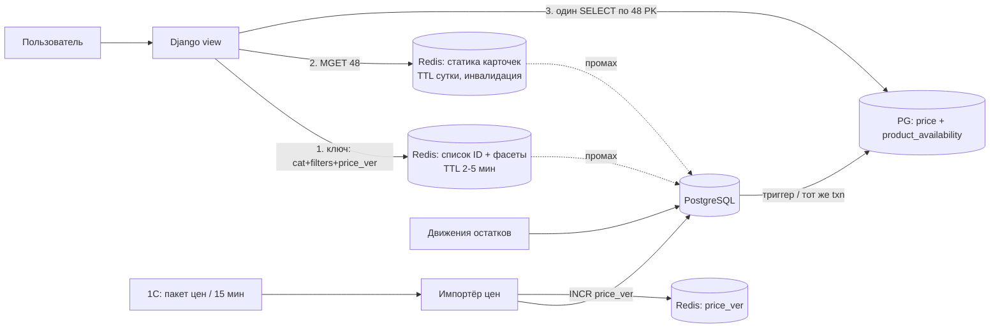

## Коротко

Не подходит ни одно из двух предложений: оба кешируют остатки, а именно их кешировать нельзя. Кешировать нужно **по слоям, в зависимости от того, как часто меняются данные**:

1. **Статика карточки** (название, фото, характеристики): Redis, долгий TTL, инвалидация по событию изменения.
2. **Список товаров и фасеты категории** (какие ID попали в выдачу и счётчики фильтров): Redis, короткий TTL плюс версия прайса в ключе.
3. **Цена и наличие для 48 карточек**: вообще не кешировать. Читать из PostgreSQL одним запросом по 48 первичным ключам из заранее агрегированной таблицы наличия.

Всё это делается на Postgres, Redis и Django, без новой инфраструктуры. Прежде чем что-то внедрять, снимите профиль текущих 800 мс. Почти наверняка основное время уходит на фасеты и фильтрацию, а не на карточки, и от этого зависит, куда тратить силы.

---

## Почему не подходят оба предложения

| Вариант | Что сломается |
|---|---|
| **Кешировать страницу целиком на 5 мин** (тимлид) | Наличие может отставать до 5 минут, а это ровно тот сценарий, из-за которого были жалобы и возвраты. После пакета из 1С цены до 5 минут остаются старыми. Кроме того, у каждой комбинации фильтров, сортировки и страницы свой ключ, поэтому при богатых фильтрах доля попаданий в кеш будет низкой: закешированы будут только «голые» категории, а медленными останутся как раз сложные запросы. |
| **Кешировать товары с TTL 15 мин** (бэкендер) | Наличие может отставать до 15 минут, так что проблема с возвратами останется. Цена после пакета тоже может отставать до 15 минут. Если с ценой в корзине это расходится, будут новые жалобы. Главное, что этот вариант не трогает самое медленное место, то есть выборку по фильтрам и фасеты. |

Общая ошибка обоих вариантов в том, что для данных с тремя разными профилями изменений выбран один TTL. Любой TTL здесь будет либо слишком длинным для остатков, либо бессмысленно коротким для описаний.

---

## Оценка (порядки, не бенчмарк)

- Карточки: 48 товаров × ~2 КБ статики = ~100 КБ. `MGET` 48 ключей из Redis обычно укладывается в единицы миллисекунд.
- Наличие: 48 товаров × 40 складов = ~1 900 строк, если считать «на лету». Если читать из агрегата `product_availability(product_id, region_id)`, получается 48 строк по индексу, это единицы миллисекунд.
- Пакет цен: 30–50 тыс. строк раз в 15 минут, то есть ~50 строк/с в среднем. Для Postgres это пустяк, если писать пачками (`COPY` во временную таблицу, затем `UPDATE ... FROM`).
- Redis под статику: 2 млн × ~2 КБ = ~4 ГБ, если греть всё. Реально хватит горячей части с LRU, порядка сотен мегабайт.

Бюджет на 150 мс (моя грубая раскладка, проверьте профилированием):

| Шаг | Цель |
|---|---|
| Список ID + фасеты (кеш-попадание) | 2–5 мс |
| Список ID + фасеты (промах, запрос в PG) | ≤ 60–80 мс, **это главный риск** |
| Статика 48 карточек (`MGET`) | 2–5 мс |
| Цена + наличие 48 шт. (PG, PK lookup) | 3–10 мс |
| Рендер шаблона Django | 20–40 мс (это тоже надо мерить: 48 карточек с тяжёлыми template tags легко съедают сотню мс) |

---

## Схема

### Слой 1. Статика карточки
- Ключ `card:v{schema}:{sku}`, TTL около суток (TTL здесь страховка, а не механизм свежести).
- При изменении товара в админке или импортёре делайте `DELETE` ключа в `transaction.on_commit(...)`, чтобы не закешировать данные из откатившейся транзакции.
- Цену и наличие в эту запись **не кладите**. Именно поэтому её можно держать долго.

### Слой 2. Список товаров и фасеты
- Ключ: `listing:{category}:{hash(normalized_filters, sort, page)}:{price_ver}`.
- `price_ver` — счётчик в Redis, импортёр делает ему `INCR` после коммита пакета цен. Старые ключи никто не удаляет, они сами истекают по TTL. Поэтому инвалидировать 50 тыс. изменений не нужно: достаточно одного инкремента.
- TTL 2–5 минут. Лёгкое отставание фасетов допустимо («Бренд X (124)», хотя на самом деле 123), а наличие на карточке всё равно показывается честно из слоя 3.
- Нормализуйте фильтры (сортировка параметров, выкидывание пустых). Без этого доля попаданий упадёт в разы.
- Защитите кеш от stampede: когда ключ истекает на популярной категории, его должен пересчитывать один процесс (короткий lock через `SET NX EX`), а остальные ждут или отдают старое значение.
- Если по профилю окажется, что промах всё ещё медленный, то лечить надо запрос, а не кеш. Подойдёт денормализованная таблица `catalog_listing` (категория, цена, агрегированный флаг наличия по региону, ключевые атрибуты в колонках или JSONB с GIN) плюс составные индексы под популярные фильтры. Скорее всего, основная победа будет именно здесь.

### Слой 3. Цена и наличие: всегда живые
- Таблица `product_availability(product_id, region_id, qty_available, updated_at)` с PK `(product_id, region_id)`. Её обновляет триггер на таблице остатков по складам, либо тот же код, который пишет остатки, в той же транзакции. Так строка «в наличии» согласована с источником на уровне транзакции, и 40 складов не надо суммировать при каждом просмотре.
- Один запрос на страницу: `SELECT p.id, p.price, a.qty_available FROM ... WHERE p.id = ANY(%s) AND a.region_id = %s`.
- Показывайте «в наличии» с порогом, например `qty_available > safety_stock`, а не `> 0`. Это закрывает гонку «последний штук купили две секунды назад».
- Финальная проверка наличия на шаге корзины и оформления обязательна в любом случае. Ни одна схема отображения её не заменяет.

Про фильтр «только в наличии» в слое 2: список ID может отставать на TTL, поэтому в выдаче иногда окажется товар, который только что закончился. Карточка покажет «нет в наличии», так что покупателя это не обманет. Если и это неприемлемо, после слоя 3 отфильтруйте такие позиции из 48 и догрузите страницу. Это усложнение, я бы начал без него.

---

## Ключевые решения

| Решение | Альтернатива | Что теряем | Почему так |
|---|---|---|---|
| Наличие не кешируем, читаем агрегат из PG | Кеш наличия с инвалидацией по событию | Несколько мс и нагрузка на PG на каждый просмотр | Инвалидация при «постоянных» изменениях по 40 складам — это то место, где ошибаются и получают возвраты. 48 PK lookup'ов PG выдержит, при нагрузке их можно вынести на реплику (но смотрите лаг реплики) |
| Версия прайса в ключе листинга | Точечная инвалидация 50 тыс. ключей | Весь кеш листингов сбрасывается раз в 15 мин | Один `INCR` вместо сложной логики «какие листинги затронуты». Холодный старт раз в 15 мин терпим, если промах укладывается в бюджет |
| Цену читаем из PG вместе с наличием | Цены в Redis-хеше, обновляемом импортёром | Ещё немного нагрузки на PG | Запрос к PG и так идёт за наличием, цена в нём ничего не стоит. Второй источник правды для цены — лишний риск рассинхрона |
| Кеш на уровне данных, не HTML | Кеш готового HTML-фрагмента карточки | Время рендера | Если рендер окажется дорогим, можно кешировать HTML статической части карточки и вставлять в неё цену и наличие. Делать это только по результатам профилирования |

---

## Что ломается и что тогда делать

- **Redis недоступен.** Всё идёт в PG, латентность вырастет, но данные останутся корректными, потому что кеш не хранит ничего критичного для правды. Нужны короткие таймауты на клиенте Redis (десятки мс), чтобы его падение не превратилось в падение страницы.
- **Импорт цен упал посередине.** Грузите пакет в staging-таблицу и применяйте одной транзакцией. `INCR price_ver` делайте только после коммита. Тогда в кеше не появятся «полуобновлённые» листинги.
- **Триггер агрегата тормозит запись остатков** на горячих товарах. С 40 складами это маловероятно, но за блокировками по `product_availability` стоит следить. Запасной путь — пересчёт агрегата отдельным воркером раз в несколько секунд. Это уже eventual consistency, и тогда нужен более консервативный порог `safety_stock`.
- **Сами остатки приходят с задержкой**, например тоже из 1С пакетом. Тогда никакая схема кеширования не спасёт от ложного «в наличии». Проверьте, откуда и с каким лагом реально приходят движения. Я бы проверил это первым, раз проблема с возвратами уже была.

---

## Порядок внедрения

1. Профиль текущей страницы (`django-debug-toolbar` / `EXPLAIN (ANALYZE, BUFFERS)` на запросах фасетов, время рендера). Понять, из чего складываются 800 мс.
2. Таблица `product_availability` и живой запрос цена+наличие. Это сразу закрывает проблему с возвратами.
3. Кеш статики карточек с инвалидацией через `on_commit`.
4. Кеш листинга и фасетов с `price_ver` и защитой от stampede.
5. Если промах листинга всё ещё выше ~80 мс, то денормализованная таблица и индексы под фильтры.

Метрики: p95 страницы категории, доля попаданий в кеш листинга (цель: выше 70–80%, это ориентир, а не норма), p95 запроса при промахе, число случаев «в наличии на странице, но нет на checkout» (это главный бизнес-индикатор, что схема работает).
