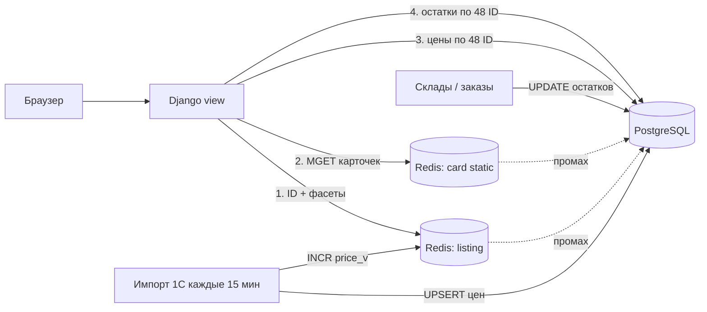
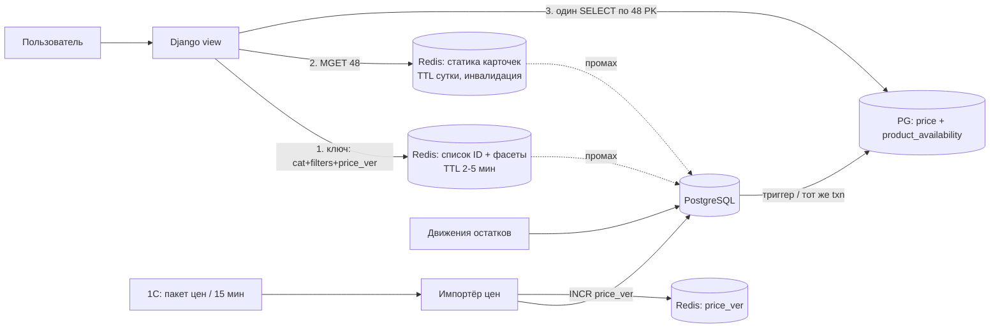

# Case shcot-catalog-caching-ru

## Conversation so far
(none)

## Latest user message
Интернет-магазин стройматериалов, ~2 млн SKU, PostgreSQL 15 + Django, Redis 7 уже есть. Страница категории (фильтры + 48 карточек) сейчас p95 ≈ 800 мс, нужно уложиться в 150 мс. Проблема в том, что данные меняются по-разному: описания и характеристики почти не меняются, цены приходят из 1С пакетом раз в 15 минут (обычно 30–50 тыс. изменений за раз), а остатки по 40 складам меняются постоянно, и показывать «в наличии», когда товара нет, нельзя — были жалобы и возвраты. Тимлид предлагает просто закешировать страницу категории целиком в Redis на 5 минут, бэкендер — кешировать отдельные товары с TTL 15 минут. Нас трое разработчиков, Kafka и прочую тяжёлую инфраструктуру заводить не хотим. Какую схему кеширования делать?

## Rubric (what a strong answer does)
1. Explicitly evaluates both proposed options (full-page cache for 5 minutes, per-product cache with 15-minute TTL) and names a concrete weakness of each against the stated constraints (stale stock availability, price staleness or mismatch with the 1C batch).
2. Proposes a combined scheme that handles the three data types differently: long-lived cache for descriptions/attributes, invalidation or refresh of prices tied to the 1C batch import rather than a blind TTL, and stock availability that is either not cached or cached very briefly / overlaid fresh on top of cached content.
3. Addresses the rule that out-of-stock items must not appear as available, e.g. by rechecking stock at add-to-cart or checkout and/or fetching availability separately from the cached card data.
4. Keeps the design within the stated constraints (three developers, existing Redis and PostgreSQL, no Kafka or similar new heavy infrastructure) and gives actionable next steps for reaching the 150 ms target.

## Answer A
**Коротко:** не берите ни одно из двух предложений. У разных частей страницы разная скорость изменения, поэтому и кеш нужен разный. Описания и характеристики кешируем надолго и сбрасываем явно. Список ID товаров под фильтр кешируем с версией, которая меняется после каждого пакета цен. Цены и остатки для 48 карточек на каждый запрос читаем из PostgreSQL по первичному ключу: это единицы миллисекунд, и кешировать их незачем. Для «в наличии» кеша нет совсем. Kafka не нужна, хватит Redis и счётчиков версий.

## Почему оба предложения не подходят

| Вариант | Плюсы | Минусы | Когда подходит |
|---|---|---|---|
| Вся страница в Redis на 5 мин (тимлид) | Проще всего, почти 100% попаданий | До 5 минут показывает «в наличии» для проданного товара, то есть ровно ту проблему, из-за которой жалобы и возвраты. После пакета из 1С цены до 5 минут старые. Комбинаций фильтров очень много, поэтому на «длинном хвосте» кеш почти не попадает | Контент, который меняется редко |
| Отдельные товары с TTL 15 мин (бэкендер) | Переиспользуется между категориями | Остатки устаревают на срок до 15 минут, это ещё хуже. Цены до 15 минут старые после пакета. **Не ускоряет подбор товаров под фильтр**, а 800 мс почти наверняка уходят именно туда | Только для статичной части карточки |

Главная ошибка обоих вариантов в том, что остатки и цены попадают под один TTL со статикой. Для остатков любое устаревание заметно покупателю.

## Сначала замерьте, куда уходят 800 мс

Всё, что ниже, я предполагаю, а не знаю. Прежде чем что-то строить, снимите профиль: `pg_stat_statements`, `EXPLAIN (ANALYZE, BUFFERS)` на запросе листинга и фасетов, и посчитайте запросы ORM на одну страницу. Для такой страницы обычно подозреваю три вещи, примерно в таком порядке:
1. **Подсчёт фасетов** (`COUNT … GROUP BY` по атрибутам категории), скорее всего главный потребитель времени.
2. **N+1 в ORM**: картинки, атрибуты, цены и остатки подгружаются отдельно для каждой карточки.
3. **Рендеринг шаблона Django** для 48 карточек: вполне реально 30–100 мс.

Если выяснится, что основная часть времени уходит на N+1, лечить надо `select_related` / `prefetch_related`, а не кешем.

## Оценка на салфетке

Исходные данные в основном ваши. Строки с пометкой «оценка» — мои порядки, проверьте на своём железе.

- **Строки остатков:** 2 млн SKU × 40 складов = до 80 млн строк (в реальности, скорее всего, меньше, потому что не на каждом складе есть каждый товар).
- **Цены:** 50 тыс. изменений раз в 15 минут ≈ 55 в секунду в среднем. Приходят пачкой, поэтому одного batch UPSERT хватит.
- **Остатки для одной страницы:** если читать напрямую, это 48 × 40 = 1 920 строк; если денормализовать, 48 строк. Выборка по PK/индексу займёт порядка 1–5 мс (оценка).
- **Бюджет на 150 мс (оценка):**

| Шаг | При попадании в кеш | Источник |
|---|---|---|
| ID товаров и фасеты | 1–2 мс | Redis |
| Статика 48 карточек (`MGET`) | 1–2 мс | Redis |
| Цены для 48 ID | 1–3 мс | PostgreSQL, PK |
| Остатки для 48 ID | 1–5 мс | PostgreSQL, PK |
| Рендер карточек + Django overhead | 20–60 мс | CPU |
| **Итого** | **~30–75 мс** | запас до 150 мс остаётся |

При промахе по листингу (первый запрос после смены версии) время ≈ стоимость SQL для фасетов. Поэтому ниже предусмотрена защита от одновременного пересчёта (stampede).

## Архитектура: четыре слоя по скорости изменения

**Слой 1. Список ID и фасеты: Redis, ключ с версией**
- Ключ: `listing:{category_id}:{cat_v}:{price_v}:{hash(filters, sort, page)}` → JSON со списком ID товаров (с запасом, об этом ниже) и значениями фасетов.
- `price_v` — глобальный счётчик. Импорт из 1С увеличивает его после commit транзакции (`transaction.on_commit`). Так фильтр по цене и сортировка по цене становятся актуальными сразу после пакета, и ничего не нужно удалять по маске: старые ключи сами вытесняются через TTL (например, 1 час) и `maxmemory-policy allkeys-lru`.
- `cat_v` меняется, когда меняется ассортимент категории или её атрибуты. Это редкие события, их можно менять вручную из админки или сигналом.

**Слой 2. Статика карточки: Redis, долгий TTL плюс явная инвалидация**
- `card:{sku_id}:{content_v}` → название, картинка, ключевые характеристики, URL. TTL — сутки или больше.
- Если рендер окажется узким местом, можно кешировать **готовый HTML-фрагмент** карточки без цены и бейджа наличия, а цену и наличие подставлять отдельно.
- Подвох: сигналы Django `post_save` не срабатывают на `bulk_update`, `QuerySet.update()` и raw SQL. Поэтому инвалидацию лучше вызывать явно в коде, который меняет контент, а не полагаться на сигналы.

**Слой 3. Цены: без кеша, из PostgreSQL**
- `SELECT sku_id, price FROM price WHERE sku_id = ANY(%s)` для 48 ID. Это чтение по PK, кеш сэкономит миллисекунду, а добавит лишний источник рассинхрона.
- Альтернатива, если захочется: после импорта одним pipeline записывать 50 тыс. `HSET` в Redis. Но это вторая копия данных, у которой бывают частичные сбои. Сейчас я бы так не делал.

**Слой 4. Остатки: без кеша, всегда живые**
- Заведите денормализованную таблицу `sku_availability(sku_id PK, available_qty, updated_at)`. Её нужно обновлять **в той же транзакции**, что и строку остатка по складу (в коде или триггером). Тогда на страницу нужны 48 строк по PK, а не 1 920 строк с агрегацией.
- Если бейдж зависит от склада или региона пользователя, берите 48 × N строк по составному индексу `(sku_id, warehouse_id)`. Это тоже быстро.

## Ключевые компромиссы

**Фильтр «только в наличии» при закешированном списке.** Список ID в кеше может немного устареть по остаткам.

| Вариант | Плюсы | Минусы |
|---|---|---|
| Кешировать с запасом (например, 96 ID), затем фильтровать по живым остаткам и брать первые 48 | Бейдж всегда верный, кеш работает | Иногда на странице будет меньше 48 товаров, а пагинация слегка «плывёт» |
| Не кешировать запросы с фильтром «в наличии» | Точность | Для этих запросов кеш не помогает, нужен быстрый SQL (частичный индекс `WHERE available_qty > 0`) |
| Счётчики фасетов с учётом наличия из кеша | Быстро | Счётчик может отличаться на единицы |

**Рекомендую** первый вариант плюс приблизительные счётчики фасетов. Фраза «Кирпич (1 243)» против реальных 1 241 проблем не создаёт. Жалобы вызывает бейдж на конкретной карточке, а он будет живым.

**Важно про гарантию наличия.** Даже при живом чтении между показом страницы и кликом «купить» проходят секунды или минуты. Страница не может *гарантировать* наличие, это может только проверка или резервирование при добавлении в корзину и оформлении заказа. Если такой проверки сейчас нет, скорее всего, возвраты идут именно отсюда, а не только из-за кеша.

## Отказы и узкие места

- **Stampede каждые 15 минут.** После `INCR price_v` все ключи листингов разом становятся промахами, и популярные категории одновременно запускают тяжёлый SQL для фасетов. Меры:
  - блокировка на пересчёт (`SET lock:… NX PX 5000`): один запрос пересчитывает, остальные в это время отдают **предыдущую версию** (stale-while-revalidate). Это безопасно, потому что цены и остатки всё равно накладываются вживую, а устаревает только порядок сортировки на несколько секунд;
  - после импорта прогреть топ-N категорий фоновой задачей (cron или management command; Celery, если он уже есть).
- **Redis недоступен.** Короткий таймаут на клиенте (≈50 мс) и fallback на PostgreSQL. Страница замедлится, но будет работать. Цены и остатки от Redis не зависят вовсе.
- **PostgreSQL тормозит на остатках.** Работаем по принципу fail closed: если не удалось прочитать остаток за отведённое время, показываем «уточните наличие», а не «в наличии».
- **Импорт 1С упал на середине.** Весь пакет — одна транзакция, `price_v` увеличиваем только после commit. Никакого «половина цен новые, листинг старый».
- **Чтения остатков нагружают primary.** При 48 строках по PK это вряд ли проблема. Если станет проблемой, вынесите их на реплику только при нулевом отставании, иначе снова получите устаревшие остатки.

## Порядок работ для команды из трёх человек

1. Профилирование и устранение N+1 (часто это уже убирает половину времени).
2. `sku_availability` + живое чтение цен и остатков по 48 ID.
3. Кеш статики карточек (`card:*`).
4. Кеш листинга и фасетов с `price_v` / `cat_v` и защитой от stampede.
5. Метрики: p95 по страницам категорий, hit rate листинга, длительность импорта, число «в наличии → нет при оформлении» (главная бизнес-метрика этой задачи).

Первые три шага, по моей оценке, займут одну–две недели. После каждого замеряйте p95: вполне возможно, что до 150 мс вы дойдёте уже на шаге 3, и тогда кеш листинга с версиями не понадобится.

## Answer B
## Коротко

Не подходит ни одно из двух предложений: оба кешируют остатки, а именно их кешировать нельзя. Кешировать нужно **по слоям, в зависимости от того, как часто меняются данные**:

1. **Статика карточки** (название, фото, характеристики): Redis, долгий TTL, инвалидация по событию изменения.
2. **Список товаров и фасеты категории** (какие ID попали в выдачу и счётчики фильтров): Redis, короткий TTL плюс версия прайса в ключе.
3. **Цена и наличие для 48 карточек**: вообще не кешировать. Читать из PostgreSQL одним запросом по 48 первичным ключам из заранее агрегированной таблицы наличия.

Всё это делается на Postgres, Redis и Django, без новой инфраструктуры. Прежде чем что-то внедрять, снимите профиль текущих 800 мс. Почти наверняка основное время уходит на фасеты и фильтрацию, а не на карточки, и от этого зависит, куда тратить силы.

---

## Почему не подходят оба предложения

| Вариант | Что сломается |
|---|---|
| **Кешировать страницу целиком на 5 мин** (тимлид) | Наличие может отставать до 5 минут, а это ровно тот сценарий, из-за которого были жалобы и возвраты. После пакета из 1С цены до 5 минут остаются старыми. Кроме того, у каждой комбинации фильтров, сортировки и страницы свой ключ, поэтому при богатых фильтрах доля попаданий в кеш будет низкой: закешированы будут только «голые» категории, а медленными останутся как раз сложные запросы. |
| **Кешировать товары с TTL 15 мин** (бэкендер) | Наличие может отставать до 15 минут, так что проблема с возвратами останется. Цена после пакета тоже может отставать до 15 минут. Если с ценой в корзине это расходится, будут новые жалобы. Главное, что этот вариант не трогает самое медленное место, то есть выборку по фильтрам и фасеты. |

Общая ошибка обоих вариантов в том, что для данных с тремя разными профилями изменений выбран один TTL. Любой TTL здесь будет либо слишком длинным для остатков, либо бессмысленно коротким для описаний.

---

## Оценка (порядки, не бенчмарк)

- Карточки: 48 товаров × ~2 КБ статики = ~100 КБ. `MGET` 48 ключей из Redis обычно укладывается в единицы миллисекунд.
- Наличие: 48 товаров × 40 складов = ~1 900 строк, если считать «на лету». Если читать из агрегата `product_availability(product_id, region_id)`, получается 48 строк по индексу, это единицы миллисекунд.
- Пакет цен: 30–50 тыс. строк раз в 15 минут, то есть ~50 строк/с в среднем. Для Postgres это пустяк, если писать пачками (`COPY` во временную таблицу, затем `UPDATE ... FROM`).
- Redis под статику: 2 млн × ~2 КБ = ~4 ГБ, если греть всё. Реально хватит горячей части с LRU, порядка сотен мегабайт.

Бюджет на 150 мс (моя грубая раскладка, проверьте профилированием):

| Шаг | Цель |
|---|---|
| Список ID + фасеты (кеш-попадание) | 2–5 мс |
| Список ID + фасеты (промах, запрос в PG) | ≤ 60–80 мс, **это главный риск** |
| Статика 48 карточек (`MGET`) | 2–5 мс |
| Цена + наличие 48 шт. (PG, PK lookup) | 3–10 мс |
| Рендер шаблона Django | 20–40 мс (это тоже надо мерить: 48 карточек с тяжёлыми template tags легко съедают сотню мс) |

---

## Схема

### Слой 1. Статика карточки
- Ключ `card:v{schema}:{sku}`, TTL около суток (TTL здесь страховка, а не механизм свежести).
- При изменении товара в админке или импортёре делайте `DELETE` ключа в `transaction.on_commit(...)`, чтобы не закешировать данные из откатившейся транзакции.
- Цену и наличие в эту запись **не кладите**. Именно поэтому её можно держать долго.

### Слой 2. Список товаров и фасеты
- Ключ: `listing:{category}:{hash(normalized_filters, sort, page)}:{price_ver}`.
- `price_ver` — счётчик в Redis, импортёр делает ему `INCR` после коммита пакета цен. Старые ключи никто не удаляет, они сами истекают по TTL. Поэтому инвалидировать 50 тыс. изменений не нужно: достаточно одного инкремента.
- TTL 2–5 минут. Лёгкое отставание фасетов допустимо («Бренд X (124)», хотя на самом деле 123), а наличие на карточке всё равно показывается честно из слоя 3.
- Нормализуйте фильтры (сортировка параметров, выкидывание пустых). Без этого доля попаданий упадёт в разы.
- Защитите кеш от stampede: когда ключ истекает на популярной категории, его должен пересчитывать один процесс (короткий lock через `SET NX EX`), а остальные ждут или отдают старое значение.
- Если по профилю окажется, что промах всё ещё медленный, то лечить надо запрос, а не кеш. Подойдёт денормализованная таблица `catalog_listing` (категория, цена, агрегированный флаг наличия по региону, ключевые атрибуты в колонках или JSONB с GIN) плюс составные индексы под популярные фильтры. Скорее всего, основная победа будет именно здесь.

### Слой 3. Цена и наличие: всегда живые
- Таблица `product_availability(product_id, region_id, qty_available, updated_at)` с PK `(product_id, region_id)`. Её обновляет триггер на таблице остатков по складам, либо тот же код, который пишет остатки, в той же транзакции. Так строка «в наличии» согласована с источником на уровне транзакции, и 40 складов не надо суммировать при каждом просмотре.
- Один запрос на страницу: `SELECT p.id, p.price, a.qty_available FROM ... WHERE p.id = ANY(%s) AND a.region_id = %s`.
- Показывайте «в наличии» с порогом, например `qty_available > safety_stock`, а не `> 0`. Это закрывает гонку «последний штук купили две секунды назад».
- Финальная проверка наличия на шаге корзины и оформления обязательна в любом случае. Ни одна схема отображения её не заменяет.

Про фильтр «только в наличии» в слое 2: список ID может отставать на TTL, поэтому в выдаче иногда окажется товар, который только что закончился. Карточка покажет «нет в наличии», так что покупателя это не обманет. Если и это неприемлемо, после слоя 3 отфильтруйте такие позиции из 48 и догрузите страницу. Это усложнение, я бы начал без него.

---

## Ключевые решения

| Решение | Альтернатива | Что теряем | Почему так |
|---|---|---|---|
| Наличие не кешируем, читаем агрегат из PG | Кеш наличия с инвалидацией по событию | Несколько мс и нагрузка на PG на каждый просмотр | Инвалидация при «постоянных» изменениях по 40 складам — это то место, где ошибаются и получают возвраты. 48 PK lookup'ов PG выдержит, при нагрузке их можно вынести на реплику (но смотрите лаг реплики) |
| Версия прайса в ключе листинга | Точечная инвалидация 50 тыс. ключей | Весь кеш листингов сбрасывается раз в 15 мин | Один `INCR` вместо сложной логики «какие листинги затронуты». Холодный старт раз в 15 мин терпим, если промах укладывается в бюджет |
| Цену читаем из PG вместе с наличием | Цены в Redis-хеше, обновляемом импортёром | Ещё немного нагрузки на PG | Запрос к PG и так идёт за наличием, цена в нём ничего не стоит. Второй источник правды для цены — лишний риск рассинхрона |
| Кеш на уровне данных, не HTML | Кеш готового HTML-фрагмента карточки | Время рендера | Если рендер окажется дорогим, можно кешировать HTML статической части карточки и вставлять в неё цену и наличие. Делать это только по результатам профилирования |

---

## Что ломается и что тогда делать

- **Redis недоступен.** Всё идёт в PG, латентность вырастет, но данные останутся корректными, потому что кеш не хранит ничего критичного для правды. Нужны короткие таймауты на клиенте Redis (десятки мс), чтобы его падение не превратилось в падение страницы.
- **Импорт цен упал посередине.** Грузите пакет в staging-таблицу и применяйте одной транзакцией. `INCR price_ver` делайте только после коммита. Тогда в кеше не появятся «полуобновлённые» листинги.
- **Триггер агрегата тормозит запись остатков** на горячих товарах. С 40 складами это маловероятно, но за блокировками по `product_availability` стоит следить. Запасной путь — пересчёт агрегата отдельным воркером раз в несколько секунд. Это уже eventual consistency, и тогда нужен более консервативный порог `safety_stock`.
- **Сами остатки приходят с задержкой**, например тоже из 1С пакетом. Тогда никакая схема кеширования не спасёт от ложного «в наличии». Проверьте, откуда и с каким лагом реально приходят движения. Я бы проверил это первым, раз проблема с возвратами уже была.

---

## Порядок внедрения

1. Профиль текущей страницы (`django-debug-toolbar` / `EXPLAIN (ANALYZE, BUFFERS)` на запросах фасетов, время рендера). Понять, из чего складываются 800 мс.
2. Таблица `product_availability` и живой запрос цена+наличие. Это сразу закрывает проблему с возвратами.
3. Кеш статики карточек с инвалидацией через `on_commit`.
4. Кеш листинга и фасетов с `price_ver` и защитой от stampede.
5. Если промах листинга всё ещё выше ~80 мс, то денормализованная таблица и индексы под фильтры.

Метрики: p95 страницы категории, доля попаданий в кеш листинга (цель: выше 70–80%, это ориентир, а не норма), p95 запроса при промахе, число случаев «в наличии на странице, но нет на checkout» (это главный бизнес-индикатор, что схема работает).

