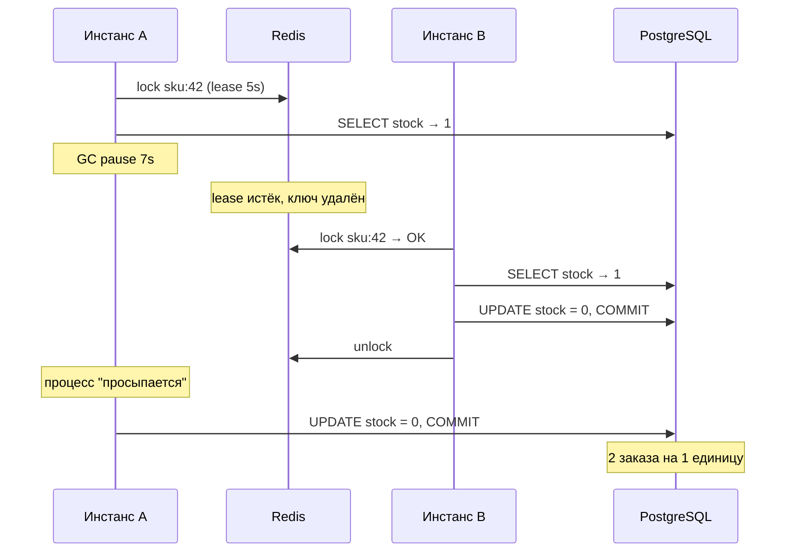

**Коротко: нет, не решит.** `leaseTime = 30s` только снизит вероятность сбоя, а Redlock на 5 нодах к вашей проблеме вообще не относится. Корень в том, что корректность держится на распределённом локе с таймаутом, а такой лок в принципе не гарантирует взаимного исключения при паузах процесса. Правильное решение: сделать списание атомарным в самом PostgreSQL и убрать Redis-лок из пути корректности.

## Что на самом деле происходит

Схема «lock → read stock → check → `UPDATE ... SET stock = ?` (абсолютное значение) → commit» ломается так:



A не знает, что потерял лок: после паузы код просто продолжает выполняться со следующей строки. Проверки «я ещё держу лок?» здесь не помогут, потому что пауза может случиться между проверкой и записью. А раз вы пишете абсолютное значение (`SET stock = ?`), запись A молча затирает результат B. Это классический lost update.

## Почему предложения коллег не работают

| Предложение | Что даёт | Почему не решает |
|---|---|---|
| `leaseTime` 30s | Ваши текущие паузы по 6–8 с перестанут пробивать лок | Длина паузы ничем не ограничена: Full GC, swap, stop-the-world на safepoint, долгий сетевой ретрай. Сбоев станет меньше, но гарантии нет. Бонус: если инстанс упал с локом, SKU будет заблокирован до 30 с посреди распродажи. |
| Redlock, 5 нод | Лок переживает падение/failover одного Redis-узла | Решает другую проблему, отказ Redis. У вас Redis работает нормально, это клиент «спит» дольше lease. Redlock так же зависит от таймингов, и пауза клиента ломает его точно так же (подробно разобрано в критике Мартина Клеппмана «How to do distributed locking»). Плюс 5 нод в эксплуатации и более высокая латентность захвата. Насколько помню, в Redisson `RedissonRedLock` помечен deprecated (по памяти, не проверял, сверьтесь с документацией вашей версии). |

Общий принцип: лок с таймаутом годится для **эффективности** (не делать работу дважды), но не для **корректности**. Для корректности нужен fencing, то есть чтобы хранилище само отклоняло устаревшую запись. У вас хранилище и так PostgreSQL, он умеет это из коробки.

## Отдельно проверьте ещё одну вероятную причину

Если лок берётся внутри метода с `@Transactional`, то `unlock()` выполняется **до** коммита транзакции (коммит делает прокси уже после выхода из метода). Тогда следующий инстанс читает ещё не закоммиченный, старый остаток, и оверселл возможен вообще без GC-пауз. Это частая ошибка. Проверьте порядок: лок должен оборачивать транзакцию, а не наоборот. После исправления ниже это станет неважно, но объяснит, если лишние заказы бывают и без пауз.

## Что делать

### 1. Атомарное условное списание в Postgres (основное решение)

```sql
UPDATE products
SET stock = stock - :qty
WHERE id = :id AND stock >= :qty;
```

- Проверяете количество затронутых строк: `1` значит списано, `0` значит товара нет, отказ.
- Выполняется в той же транзакции, что и `INSERT` заказа. Откат заказа откатывает и списание.
- Postgres берёт row-level lock на строку, конкурентные апдейты сериализуются, а условие `stock >= :qty` перепроверяется на свежей версии строки (в READ COMMITTED перечитывается обновлённая строка). Lost update невозможен, и никакие GC-паузы на это не влияют: пауза держит транзакцию открытой, но не отменяет блокировку строки.
- Redisson-лок после этого можно убрать совсем.

Страховочная сетка на уровне схемы:

```sql
ALTER TABLE products ADD CONSTRAINT stock_non_negative CHECK (stock >= 0);
```

Альтернативы, если логика сложнее одного `UPDATE` (например, проверка нескольких SKU, лимиты на покупателя):

| Вариант | Плюсы | Минусы | Когда |
|---|---|---|---|
| Условный `UPDATE ... WHERE stock >= qty` | Одна операция, без гонок, проще всего | Логика ограничена одним выражением | Ваш случай по умолчанию |
| `SELECT ... FOR UPDATE` + проверка в Java + `UPDATE` | Произвольная логика между чтением и записью | Держит row lock дольше, а при GC-паузе держит его всю паузу | Сложные правила списания |
| Оптимистичный lock (`version`, `@Version` в JPA) | Нет блокировок на чтении | На горячем SKU в распродажу много конфликтов и ретраев | Низкая конкуренция |

Моя рекомендация: первый вариант, плюс `CHECK`.

### 2. Прикиньте нагрузку на горячую строку

Условный `UPDATE` сериализует всех покупателей одного SKU на одной строке. Грубая оценка: одна транзакция «списать + вставить заказ» держит row lock примерно 1–5 мс (зависит от сети до БД и `synchronous_commit`), то есть порядка 200–1000 успешных списаний в секунду на один SKU. Это оценка, а не бенчмарк, так что проверьте нагрузочным тестом на своём железе. Для лота на 50 штук этого с огромным запасом хватит: после 50 списаний все остальные апдейты мгновенно возвращают 0 строк.

Проблема может возникнуть не со списаниями, а с толпой, которая ломится в пустой SKU. Если на распродаже будут тысячи RPS на один товар:

- **Redis как быстрый фильтр, Postgres как истина.** Атомарный `DECRBY` в Lua-скрипте на `stock:sku:{id}` отсекает запросы, когда остаток ≤ 0, и до БД доходят примерно N успешных. Оверселла здесь не будет даже при расхождении Redis и БД, потому что финальное слово за условным `UPDATE`. Худший случай: недопродажа, если Redis «списал», а транзакция в БД упала. Это лечится компенсирующим `INCRBY` и периодической сверкой.
- **Флаг sold-out в локальном кэше инстанса** (TTL в пару секунд): после первого `0 rows` инстанс сразу отвечает «нет в наличии».
- Шардирование остатка по нескольким строкам (bucket'ы) имеет смысл только при реально экстремальной конкуренции. Пока не нужно, YAGNI.

### 3. Сопутствующее

- **Идемпотентность создания заказа.** Idempotency-key от клиента плюс уникальный индекс, иначе ретраи балансировщика или двойной клик дадут дубль заказа, который тоже выглядит как оверселл.
- **Резерв вместо немедленного списания**, если оплата асинхронная: `reserved_until` плюс фоновое освобождение неоплаченных. Та же атомарная схема, только на таблице резервов.
- **GC-паузы по 6–8 секунд — самостоятельная проблема**, хоть и не источник корректности. Это почти наверняка Full GC: посмотрите GC-логи (`-Xlog:gc*`), размер heap относительно лимита контейнера, humongous-аллокации в G1. На Java 17 можно попробовать ZGC, где паузы обычно в пределах миллисекунд. Пока инстанс стоит 8 секунд, его пользователи тоже висят, и балансировщик может начать ретраить.

## Мониторинг

- Инвариант: `SUM(order_items.qty)` по SKU ≤ начальный остаток. Сверочный job после каждой распродажи, алерт при расхождении.
- Доля `0 rows affected` на списании, p99 времени транзакции списания, ожидания блокировок (`pg_stat_activity`, `wait_event_type = 'Lock'`).
- Длительность GC-пауз: алерт на p99 выше 500 мс.

**Итог:** не усиливайте лок, а перестаньте от него зависеть. Условный `UPDATE ... WHERE stock >= qty` с проверкой affected rows в одной транзакции с заказом плюс `CHECK (stock >= 0)` закрывают оверселл при любых паузах, а Redis и Redlock станут не нужны для корректности.
