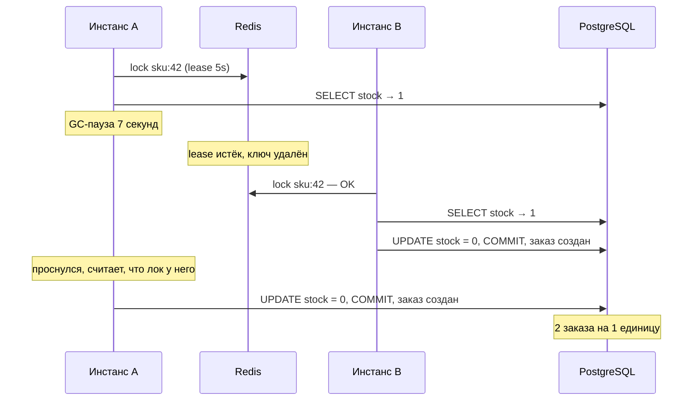

## Коротко

**Нет, не решит.** Оба предложения уменьшают вероятность сбоя, но не устраняют его причину. Причина в том, что корректность остатка держится на распределённом локе, а лок с истекающим lease в принципе не может защитить от процесса, который «уснул» (GC, swap, пауза VM) и проснулся уже после того, как лок перешёл к другому. Правильное решение — перенести инвариант `stock >= 0` в PostgreSQL, где он проверяется атомарно, а лок убрать или оставить только как оптимизацию.

## Что происходит сейчас

У вас read-modify-write с абсолютной записью (`SET stock = ?`), и корректность держится только на эксклюзивности лока. GC-пауза её ломает:



Инстанс A не может узнать, что потерял лок: проверка «лок ещё мой?» перед UPDATE не спасает, потому что пауза может случиться ровно между проверкой и записью. Это классический аргумент Мартина Клеппмана против Redlock («How to do distributed locking», 2016).

## Почему предложения коллег не помогут

| Предложение | Что меняет | Почему не решает |
|---|---|---|
| leaseTime 30 с | Пауза 6–8 с больше не превышает lease | Вы лишь сдвигаете порог: пауза 31 с (Full GC на большом хипе, swap, заморозка VM) — и всё повторяется. Зато если инстанс упадёт с локом, SKU будет заблокирован на 30 с в разгар распродажи, это прямые потери выручки. |
| Redlock, 5 нод | Лок переживает падение отдельной Redis-ноды | Redlock защищает от отказа **Redis**, а у вас проблема в паузе **клиента**. Против неё Redlock бессилен точно так же, как один Redis. Плюс 5 нод в эксплуатации, плюс зависимость от корректности часов. |

Отдельная деталь, насколько я помню Redisson (проверьте в документации вашей версии): если явно передать `leaseTime`, watchdog, продлевающий лок, **отключается**. Если же вызвать `lock()` без leaseTime, watchdog продлевает лок каждые ~10 с при дефолтном `lockWatchdogTimeout` 30 с. Но и watchdog не помогает: во время stop-the-world-паузы его поток тоже стоит.

## Что делать

### 1. Атомарное условное списание в PostgreSQL (основное исправление)

Вместо «прочитать → проверить в Java → записать абсолютное значение»:

```sql
UPDATE products
SET stock = stock - :qty
WHERE id = :id AND stock >= :qty;
```

```java
@Transactional
public void reserve(long skuId, int qty, Order order) {
    int updated = jdbc.update(
        "UPDATE products SET stock = stock - ? WHERE id = ? AND stock >= ?",
        qty, skuId, qty);
    if (updated == 0) {
        throw new OutOfStockException(skuId);
    }
    orderRepository.save(order); // в той же транзакции
}
```

Почему это корректно: в PostgreSQL при READ COMMITTED UPDATE берёт row-level lock, и если строку параллельно изменила другая транзакция, условие `WHERE` перепроверяется на новой версии строки. Две транзакции не смогут обе увидеть `stock = 1` и обе списать. GC-пауза на клиенте теперь безопасна: пока A спит, его транзакция либо ещё не начала UPDATE, либо держит row lock (тогда B просто ждёт), либо соединение отвалится по таймауту и транзакция откатится.

Важно: **списание остатка и создание заказа должны быть в одной транзакции.** Иначе остаток списан, а заказ не создан (или наоборот) — это уже другой класс рассинхрона.

### 2. Страховка на уровне схемы

```sql
ALTER TABLE products ADD CONSTRAINT stock_non_negative CHECK (stock >= 0);
```

Даже если кто-то в будущем напишет код по старому шаблону, БД не даст уйти в минус.

### 3. Redisson-лок — убрать

После пункта 1 лок не нужен для корректности. Он добавляет сетевой round-trip и точку отказа (Redis недоступен → продажи стоят). Если хочется его оставить как «очередь перед дверью», чтобы не перегружать горячую строку, — можно, но код должен оставаться корректным и без него.

### 4. Идемпотентность создания заказа

Проверьте заодно, откуда часть «лишних» заказов: ретраи с клиента или балансировщика при таймауте тоже дают дубли. Уникальный idempotency key на заказ (`UNIQUE (idempotency_key)`) закрывает этот вектор.

### 5. Разобраться с GC-паузами

Паузы 6–8 с на сервисе магазина — отдельная проблема: всё это время запросы висят, балансировщик копит ретраи, пулы соединений истощаются. В Java 17 ZGC уже production-ready (с JDK 15) и даёт паузы порядка миллисекунд; G1 с адекватным `-XX:MaxGCPauseMillis` и правильно подобранным хипом тоже обычно не даёт многосекундных пауз. Начните с GC-логов (`-Xlog:gc*`): это Full GC, humongous allocations или нехватка хипа? Но это про latency, а не про корректность: даже с идеальным GC решать оверселл надо через БД.

## Выдержит ли горячая строка нагрузку

Грубая оценка: одна короткая транзакция с UPDATE одной строки плюс INSERT заказа — порядка 1–5 мс под row lock. Значит, на один SKU получается ориентировочно 200–1000 списаний в секунду, все сериализованы. Это оценка, а не бенчмарк, — замерьте на своём железе. При 50 единицах товара на распродаже горячая строка распродастся за доли секунды, а остальные запросы быстро получат `updated == 0`. Скорее всего, этого с запасом хватит.

Если когда-нибудь окажется, что не хватает (десятки тысяч запросов в секунду на один SKU), следующие шаги по возрастанию сложности:

| Вариант | Плюсы | Минусы | Когда |
|---|---|---|---|
| Условный UPDATE в PG | Просто, строго корректно, одна транзакция с заказом | Сериализация на горячей строке | По умолчанию, ваш случай |
| Gate в Redis (Lua `DECR` с проверкой) + условный UPDATE в PG | Отсекает 99% «опоздавших» до БД | Две системы, нужна сверка при расхождении; Redis — фильтр, а не источник истины | Очень высокий RPS на один SKU |
| Шардирование остатка (N строк-бакетов на SKU) | Параллелизм по строкам | Сложнее списать «последние» единицы, нужна логика перебора бакетов | Экстремальные флеш-сейлы |

## Итог

Проблема не в том, что лок «слишком короткий» или Redis «недостаточно надёжный», а в том, что распределённый лок с таймаутом используется для гарантии корректности, а он её дать не может. Перенесите проверку в условный `UPDATE ... WHERE stock >= :qty` плюс `CHECK (stock >= 0)` в одной транзакции с заказом — и оверселл исчезнет независимо от GC-пауз, leaseTime и числа Redis-нод.
