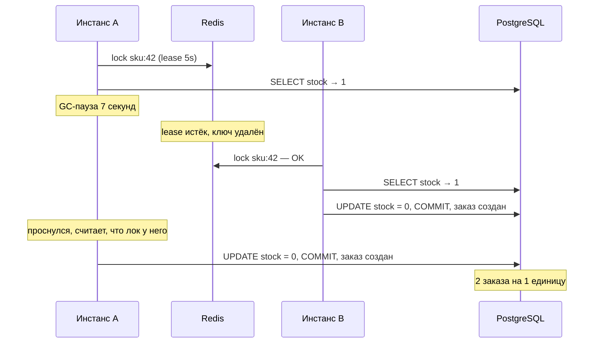
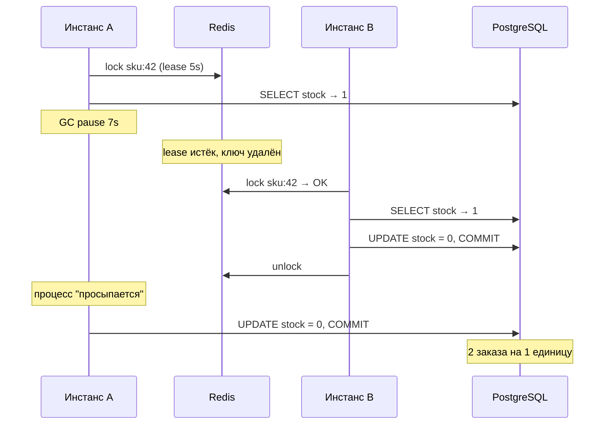

# Case redis-lock-oversell-ru

## Conversation so far
(none)

## Latest user message
Интернет-магазин, Java 17 + Spring Boot, 6 инстансов за балансировщиком, PostgreSQL 15, Redis 7. На распродажах бывает оверселл: товара 50 штук, а заказов проходит 52-53. Чтобы это починить, мы месяц назад обернули списание остатка в распределённый лок через Redisson: lock на ключ sku:{id}, leaseTime 5 секунд, внутри читаем stock из Postgres, проверяем stock > 0, делаем UPDATE products SET stock = ? и коммитим. Стало лучше, но на последней распродаже всё равно 2 лишних заказа. В логах видно, что в эти моменты были GC-паузы по 6-8 секунд на одном из инстансов. Коллеги предлагают поднять leaseTime до 30 секунд и перейти с одного Redis на Redlock с пятью нодами. Это решит проблему? Если нет, что делать?

## Rubric (what a strong answer does)
1. States that neither raising leaseTime nor switching to Redlock guarantees correctness, because a process paused longer than the lease (GC, network delay) can still write after its lock expired and another holder took it.
2. Names the underlying principle before the fix: mutual exclusion via a time-based lock is advisory, and the invariant (stock never below zero) has to be enforced where the data lives.
3. Proposes a concrete database-level fix that holds even if the lock expires, such as an atomic conditional update (UPDATE ... SET stock = stock - 1 WHERE id = ? AND stock > 0, checking the affected row count), optimistic locking with a version column, SELECT ... FOR UPDATE inside the same transaction, or a fencing token checked by the database.
4. Explains that the current read-then-write pattern (read stock, then UPDATE stock = ? with an absolute value) is what makes an expired lock turn into lost updates, and the answer stays specific to the user's stack.

## Answer A
## Коротко

**Нет, не решит.** Оба предложения уменьшают вероятность сбоя, но не устраняют его причину. Причина в том, что корректность остатка держится на распределённом локе, а лок с истекающим lease в принципе не может защитить от процесса, который «уснул» (GC, swap, пауза VM) и проснулся уже после того, как лок перешёл к другому. Правильное решение — перенести инвариант `stock >= 0` в PostgreSQL, где он проверяется атомарно, а лок убрать или оставить только как оптимизацию.

## Что происходит сейчас

У вас read-modify-write с абсолютной записью (`SET stock = ?`), и корректность держится только на эксклюзивности лока. GC-пауза её ломает:



Инстанс A не может узнать, что потерял лок: проверка «лок ещё мой?» перед UPDATE не спасает, потому что пауза может случиться ровно между проверкой и записью. Это классический аргумент Мартина Клеппмана против Redlock («How to do distributed locking», 2016).

## Почему предложения коллег не помогут

| Предложение | Что меняет | Почему не решает |
|---|---|---|
| leaseTime 30 с | Пауза 6–8 с больше не превышает lease | Вы лишь сдвигаете порог: пауза 31 с (Full GC на большом хипе, swap, заморозка VM) — и всё повторяется. Зато если инстанс упадёт с локом, SKU будет заблокирован на 30 с в разгар распродажи, это прямые потери выручки. |
| Redlock, 5 нод | Лок переживает падение отдельной Redis-ноды | Redlock защищает от отказа **Redis**, а у вас проблема в паузе **клиента**. Против неё Redlock бессилен точно так же, как один Redis. Плюс 5 нод в эксплуатации, плюс зависимость от корректности часов. |

Отдельная деталь, насколько я помню Redisson (проверьте в документации вашей версии): если явно передать `leaseTime`, watchdog, продлевающий лок, **отключается**. Если же вызвать `lock()` без leaseTime, watchdog продлевает лок каждые ~10 с при дефолтном `lockWatchdogTimeout` 30 с. Но и watchdog не помогает: во время stop-the-world-паузы его поток тоже стоит.

## Что делать

### 1. Атомарное условное списание в PostgreSQL (основное исправление)

Вместо «прочитать → проверить в Java → записать абсолютное значение»:

```sql
UPDATE products
SET stock = stock - :qty
WHERE id = :id AND stock >= :qty;
```

```java
@Transactional
public void reserve(long skuId, int qty, Order order) {
    int updated = jdbc.update(
        "UPDATE products SET stock = stock - ? WHERE id = ? AND stock >= ?",
        qty, skuId, qty);
    if (updated == 0) {
        throw new OutOfStockException(skuId);
    }
    orderRepository.save(order); // в той же транзакции
}
```

Почему это корректно: в PostgreSQL при READ COMMITTED UPDATE берёт row-level lock, и если строку параллельно изменила другая транзакция, условие `WHERE` перепроверяется на новой версии строки. Две транзакции не смогут обе увидеть `stock = 1` и обе списать. GC-пауза на клиенте теперь безопасна: пока A спит, его транзакция либо ещё не начала UPDATE, либо держит row lock (тогда B просто ждёт), либо соединение отвалится по таймауту и транзакция откатится.

Важно: **списание остатка и создание заказа должны быть в одной транзакции.** Иначе остаток списан, а заказ не создан (или наоборот) — это уже другой класс рассинхрона.

### 2. Страховка на уровне схемы

```sql
ALTER TABLE products ADD CONSTRAINT stock_non_negative CHECK (stock >= 0);
```

Даже если кто-то в будущем напишет код по старому шаблону, БД не даст уйти в минус.

### 3. Redisson-лок — убрать

После пункта 1 лок не нужен для корректности. Он добавляет сетевой round-trip и точку отказа (Redis недоступен → продажи стоят). Если хочется его оставить как «очередь перед дверью», чтобы не перегружать горячую строку, — можно, но код должен оставаться корректным и без него.

### 4. Идемпотентность создания заказа

Проверьте заодно, откуда часть «лишних» заказов: ретраи с клиента или балансировщика при таймауте тоже дают дубли. Уникальный idempotency key на заказ (`UNIQUE (idempotency_key)`) закрывает этот вектор.

### 5. Разобраться с GC-паузами

Паузы 6–8 с на сервисе магазина — отдельная проблема: всё это время запросы висят, балансировщик копит ретраи, пулы соединений истощаются. В Java 17 ZGC уже production-ready (с JDK 15) и даёт паузы порядка миллисекунд; G1 с адекватным `-XX:MaxGCPauseMillis` и правильно подобранным хипом тоже обычно не даёт многосекундных пауз. Начните с GC-логов (`-Xlog:gc*`): это Full GC, humongous allocations или нехватка хипа? Но это про latency, а не про корректность: даже с идеальным GC решать оверселл надо через БД.

## Выдержит ли горячая строка нагрузку

Грубая оценка: одна короткая транзакция с UPDATE одной строки плюс INSERT заказа — порядка 1–5 мс под row lock. Значит, на один SKU получается ориентировочно 200–1000 списаний в секунду, все сериализованы. Это оценка, а не бенчмарк, — замерьте на своём железе. При 50 единицах товара на распродаже горячая строка распродастся за доли секунды, а остальные запросы быстро получат `updated == 0`. Скорее всего, этого с запасом хватит.

Если когда-нибудь окажется, что не хватает (десятки тысяч запросов в секунду на один SKU), следующие шаги по возрастанию сложности:

| Вариант | Плюсы | Минусы | Когда |
|---|---|---|---|
| Условный UPDATE в PG | Просто, строго корректно, одна транзакция с заказом | Сериализация на горячей строке | По умолчанию, ваш случай |
| Gate в Redis (Lua `DECR` с проверкой) + условный UPDATE в PG | Отсекает 99% «опоздавших» до БД | Две системы, нужна сверка при расхождении; Redis — фильтр, а не источник истины | Очень высокий RPS на один SKU |
| Шардирование остатка (N строк-бакетов на SKU) | Параллелизм по строкам | Сложнее списать «последние» единицы, нужна логика перебора бакетов | Экстремальные флеш-сейлы |

## Итог

Проблема не в том, что лок «слишком короткий» или Redis «недостаточно надёжный», а в том, что распределённый лок с таймаутом используется для гарантии корректности, а он её дать не может. Перенесите проверку в условный `UPDATE ... WHERE stock >= :qty` плюс `CHECK (stock >= 0)` в одной транзакции с заказом — и оверселл исчезнет независимо от GC-пауз, leaseTime и числа Redis-нод.


## Answer B
**Коротко: нет, не решит.** `leaseTime = 30s` только снизит вероятность сбоя, а Redlock на 5 нодах к вашей проблеме вообще не относится. Корень в том, что корректность держится на распределённом локе с таймаутом, а такой лок в принципе не гарантирует взаимного исключения при паузах процесса. Правильное решение: сделать списание атомарным в самом PostgreSQL и убрать Redis-лок из пути корректности.

## Что на самом деле происходит

Схема «lock → read stock → check → `UPDATE ... SET stock = ?` (абсолютное значение) → commit» ломается так:



A не знает, что потерял лок: после паузы код просто продолжает выполняться со следующей строки. Проверки «я ещё держу лок?» здесь не помогут, потому что пауза может случиться между проверкой и записью. А раз вы пишете абсолютное значение (`SET stock = ?`), запись A молча затирает результат B. Это классический lost update.

## Почему предложения коллег не работают

| Предложение | Что даёт | Почему не решает |
|---|---|---|
| `leaseTime` 30s | Ваши текущие паузы по 6–8 с перестанут пробивать лок | Длина паузы ничем не ограничена: Full GC, swap, stop-the-world на safepoint, долгий сетевой ретрай. Сбоев станет меньше, но гарантии нет. Бонус: если инстанс упал с локом, SKU будет заблокирован до 30 с посреди распродажи. |
| Redlock, 5 нод | Лок переживает падение/failover одного Redis-узла | Решает другую проблему, отказ Redis. У вас Redis работает нормально, это клиент «спит» дольше lease. Redlock так же зависит от таймингов, и пауза клиента ломает его точно так же (подробно разобрано в критике Мартина Клеппмана «How to do distributed locking»). Плюс 5 нод в эксплуатации и более высокая латентность захвата. Насколько помню, в Redisson `RedissonRedLock` помечен deprecated (по памяти, не проверял, сверьтесь с документацией вашей версии). |

Общий принцип: лок с таймаутом годится для **эффективности** (не делать работу дважды), но не для **корректности**. Для корректности нужен fencing, то есть чтобы хранилище само отклоняло устаревшую запись. У вас хранилище и так PostgreSQL, он умеет это из коробки.

## Отдельно проверьте ещё одну вероятную причину

Если лок берётся внутри метода с `@Transactional`, то `unlock()` выполняется **до** коммита транзакции (коммит делает прокси уже после выхода из метода). Тогда следующий инстанс читает ещё не закоммиченный, старый остаток, и оверселл возможен вообще без GC-пауз. Это частая ошибка. Проверьте порядок: лок должен оборачивать транзакцию, а не наоборот. После исправления ниже это станет неважно, но объяснит, если лишние заказы бывают и без пауз.

## Что делать

### 1. Атомарное условное списание в Postgres (основное решение)

```sql
UPDATE products
SET stock = stock - :qty
WHERE id = :id AND stock >= :qty;
```

- Проверяете количество затронутых строк: `1` значит списано, `0` значит товара нет, отказ.
- Выполняется в той же транзакции, что и `INSERT` заказа. Откат заказа откатывает и списание.
- Postgres берёт row-level lock на строку, конкурентные апдейты сериализуются, а условие `stock >= :qty` перепроверяется на свежей версии строки (в READ COMMITTED перечитывается обновлённая строка). Lost update невозможен, и никакие GC-паузы на это не влияют: пауза держит транзакцию открытой, но не отменяет блокировку строки.
- Redisson-лок после этого можно убрать совсем.

Страховочная сетка на уровне схемы:

```sql
ALTER TABLE products ADD CONSTRAINT stock_non_negative CHECK (stock >= 0);
```

Альтернативы, если логика сложнее одного `UPDATE` (например, проверка нескольких SKU, лимиты на покупателя):

| Вариант | Плюсы | Минусы | Когда |
|---|---|---|---|
| Условный `UPDATE ... WHERE stock >= qty` | Одна операция, без гонок, проще всего | Логика ограничена одним выражением | Ваш случай по умолчанию |
| `SELECT ... FOR UPDATE` + проверка в Java + `UPDATE` | Произвольная логика между чтением и записью | Держит row lock дольше, а при GC-паузе держит его всю паузу | Сложные правила списания |
| Оптимистичный lock (`version`, `@Version` в JPA) | Нет блокировок на чтении | На горячем SKU в распродажу много конфликтов и ретраев | Низкая конкуренция |

Моя рекомендация: первый вариант, плюс `CHECK`.

### 2. Прикиньте нагрузку на горячую строку

Условный `UPDATE` сериализует всех покупателей одного SKU на одной строке. Грубая оценка: одна транзакция «списать + вставить заказ» держит row lock примерно 1–5 мс (зависит от сети до БД и `synchronous_commit`), то есть порядка 200–1000 успешных списаний в секунду на один SKU. Это оценка, а не бенчмарк, так что проверьте нагрузочным тестом на своём железе. Для лота на 50 штук этого с огромным запасом хватит: после 50 списаний все остальные апдейты мгновенно возвращают 0 строк.

Проблема может возникнуть не со списаниями, а с толпой, которая ломится в пустой SKU. Если на распродаже будут тысячи RPS на один товар:

- **Redis как быстрый фильтр, Postgres как истина.** Атомарный `DECRBY` в Lua-скрипте на `stock:sku:{id}` отсекает запросы, когда остаток ≤ 0, и до БД доходят примерно N успешных. Оверселла здесь не будет даже при расхождении Redis и БД, потому что финальное слово за условным `UPDATE`. Худший случай: недопродажа, если Redis «списал», а транзакция в БД упала. Это лечится компенсирующим `INCRBY` и периодической сверкой.
- **Флаг sold-out в локальном кэше инстанса** (TTL в пару секунд): после первого `0 rows` инстанс сразу отвечает «нет в наличии».
- Шардирование остатка по нескольким строкам (bucket'ы) имеет смысл только при реально экстремальной конкуренции. Пока не нужно, YAGNI.

### 3. Сопутствующее

- **Идемпотентность создания заказа.** Idempotency-key от клиента плюс уникальный индекс, иначе ретраи балансировщика или двойной клик дадут дубль заказа, который тоже выглядит как оверселл.
- **Резерв вместо немедленного списания**, если оплата асинхронная: `reserved_until` плюс фоновое освобождение неоплаченных. Та же атомарная схема, только на таблице резервов.
- **GC-паузы по 6–8 секунд — самостоятельная проблема**, хоть и не источник корректности. Это почти наверняка Full GC: посмотрите GC-логи (`-Xlog:gc*`), размер heap относительно лимита контейнера, humongous-аллокации в G1. На Java 17 можно попробовать ZGC, где паузы обычно в пределах миллисекунд. Пока инстанс стоит 8 секунд, его пользователи тоже висят, и балансировщик может начать ретраить.

## Мониторинг

- Инвариант: `SUM(order_items.qty)` по SKU ≤ начальный остаток. Сверочный job после каждой распродажи, алерт при расхождении.
- Доля `0 rows affected` на списании, p99 времени транзакции списания, ожидания блокировок (`pg_stat_activity`, `wait_event_type = 'Lock'`).
- Длительность GC-пауз: алерт на p99 выше 500 мс.

**Итог:** не усиливайте лок, а перестаньте от него зависеть. Условный `UPDATE ... WHERE stock >= qty` с проверкой affected rows в одной транзакции с заказом плюс `CHECK (stock >= 0)` закрывают оверселл при любых паузах, а Redis и Redlock станут не нужны для корректности.

