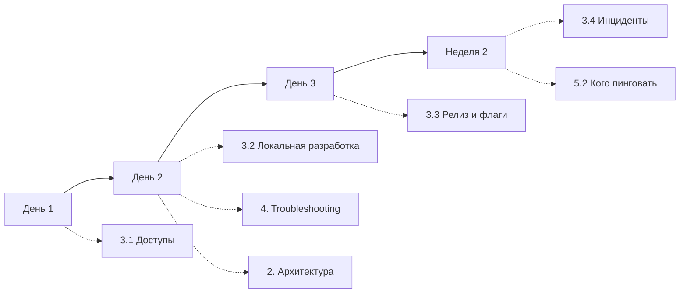

**Коротко:** все три черновика нужны, но они отвечают на разные вопросы, поэтому склеивать их подряд не стоит. План Ани станет основой документа («что делать»). Схема Олега пойдёт в раздел с объяснениями («как устроено»). Вопросы Светы надо разобрать по одному: часть превратится в шаги плана Ани, часть в короткие инструкции, часть в troubleshooting, а часть лучше исправить в коде, а не описывать.

По сути это деление Diátaxis: tutorial, explanation, how-to и reference. Путаница возникает, когда в одном разделе смешивают обучение и справку.

## Итоговая структура

```text
0. Как читать этот гайд                      (1 экран)
1. Первые две недели                         ← Аня, основа документа
   1.1 День 1 — доступы и ноутбук
   1.2 День 2 — локально поднимаем 3 основных сервиса
   1.3 День 3 — первый PR
   1.4 Неделя 2 — дежурство в тени
   1.5 Чеклист «я готов работать сам»
2. Как устроена система                      ← Олег
   2.1 Карта сервисов (крупными блоками)
   2.2 Путь запроса: gateway → auth → сервисы
   2.3 Данные: Postgres, Kafka, Redis
   2.4 Деплой и мониторинг
3. Как сделать…                              ← Света, переписанные вопросы
   3.1 Доступы (Vault, k8s, базы)
   3.2 Локальная разработка
   3.3 Разработка и релиз (фиче-флаги, миграции…)
   3.4 Инциденты и дежурства
4. Если что-то сломалось                     ← Света, вопросы «почему не работает»
5. Справочник
   5.1 Каталог сервисов (владелец, репо, дашборд, канал)
   5.2 Кого пинговать
   5.3 Глоссарий                             ← Олег, п. 5
```

## Что брать из каждого черновика и в каком виде

| Источник | Раздел | Форма | Что изменить |
|---|---|---|---|
| Аня | 1 | Пошаговые чеклисты с ожидаемым результатом в конце каждого дня («должен открываться `localhost:8080/health`») | Не объяснять внутри шагов, а давать ссылки в разделы 2 и 3 |
| Олег, п. 1–4 | 2 | Проза плюс 2–3 диаграммы | Не описывать все 30 сервисов, только группы и 5–7 ключевых. Остальное вынести в каталог (5.1) |
| Олег, п. 5 | 5.3 | Алфавитная таблица «термин — определение — где встречается» | Всё |
| Света, «как сделать X» | 3 | Одна короткая инструкция на задачу: цель → шаги → как проверить | Переписать заголовки вопросов в задачи: «Где взять доступ к Vault?» → «Получить доступ к Vault» |
| Света, «почему не работает» | 4 | Симптом → причина → решение | Текст ошибки дословно, чтобы находился через Ctrl+F |
| Света, «кого пинговать» | 5.2 | Таблица «зона — канал — дежурный/ротация» | Не имена людей, а роли и ссылки на ротацию: имена быстро устаревают |

## Как разобрать 25 вопросов Светы

Не переносите FAQ целиком. Для каждого вопроса выберите одно из пяти мест:

1. **Шаг в плане Ани.** Если с этим сталкиваются все и в предсказуемый момент, это шаг, а не вопрос. Пример: «Доступ к Vault» → шаг Дня 1.
2. **Инструкция в разделе 3.** Задача нужна не в первый день, но регулярно. Пример: «Как завести фиче-флаг» → 3.3, со ссылкой на неё из Дня 3.
3. **Troubleshooting в разделе 4.** Пример: «Почему локально не стартует billing».
4. **Справочник.** Пример: «Кого пинговать по инцидентам» → 5.2, со ссылкой из Недели 2.
5. **Удалить.** Вопрос устарел, отвечен в другом месте или это баг. Если billing у всех не стартует локально, стоит завести задачу на исправление, а в гайде оставить временное решение со ссылкой на тикет. Иначе гайд будет годами документировать баг.

Скорее всего, после такого разбора 25 вопросов сократятся примерно до 15 записей. Слияние дублей тоже полезно.

## Как связать разделы

Пусть план Ани будет основным маршрутом, а остальные разделы подключаются к нему через ссылки:



Например, в Дне 2 можно поставить блок «перед тем как поднимать сервисы, прочитай 2.2, 15 минут». Тогда архитектуру новичок прочитает в тот момент, когда она ему понадобится, а не в первый день, когда он ещё без доступов.

## Чтобы гайд не устарел

- **Владелец у каждого раздела.** Естественное распределение: Аня отвечает за раздел 1, Олег за 2, Света за 3–4.
- **Каталог сервисов (5.1)** лучше генерировать из того, что уже есть: service catalog, CODEOWNERS или лейблы в k8s. Таблица на 30 сервисов, которую ведут вручную, устареет за месяц.
- **Каждый новичок правит гайд.** Сделайте это последним пунктом чеклиста 1.5: PR с исправлениями всего, на чём он споткнулся. Это заодно проверяет, что шаги из раздела 1 действительно работают.
- **Slack-вопросы дальше.** Когда новый вопрос повторяется второй раз, его разбирают по тем же пяти вариантам.
