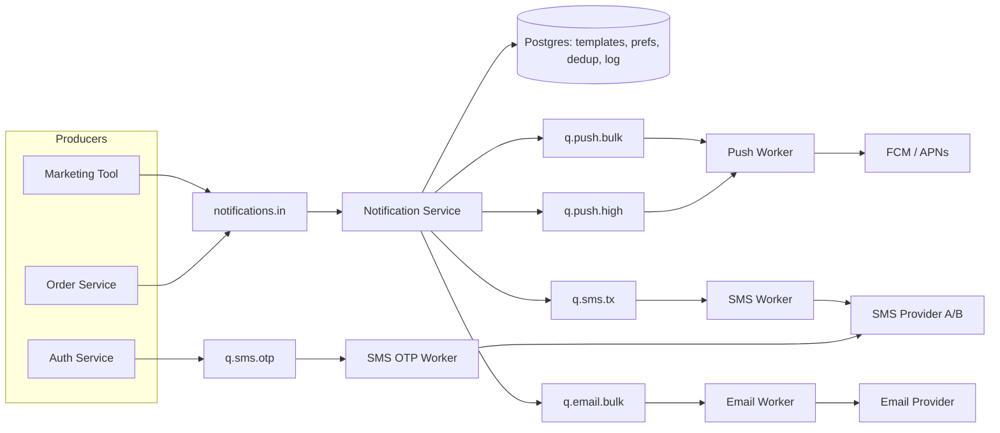

## Коротко

Ни один вариант не подходит как есть. Правы оба, но каждый прав в своей половине:

- **Катя права насчёт проблемы.** Медленный SMS-провайдер не должен задерживать push, а OTP не должен стоять в одной очереди с маркетингом. Для этого нужна изоляция доставки по каналам и приоритетам.
- **Дима прав насчёт логики.** Дедупликация, «тихие часы», выбор канала, шаблоны и бюджет SMS должны жить в одном месте, иначе через полгода у вас будет три разные реализации.

Спор идёт о том, где провести границу. Правильная граница такая: **«мозг» один, «доставщики» раздельные.** Один notification-service принимает решения (кому, что, каким каналом, можно ли сейчас) и раскладывает готовые сообщения по отдельным очередям «канал × приоритет». Тонкие воркеры по каналам только отправляют.

Для команды из 4 человек это даже проще, чем вариант Кати: один репозиторий и одна кодовая база, а воркеры каналов запускаются как отдельные процессы или deployment из того же артефакта.

---

## Цифры (порядок величин)

Допущения мои, поправьте, если реальность другая:

| Поток | Расчёт | Пик |
|---|---|---|
| Транзакционные (статусы заказа) | 400 заказов/мин ≈ 7/с × ~5 уведомлений на заказ | **~35 сообщений/с**, в основном push |
| OTP | вход и подтверждение телефона, скорее всего единицы в секунду | **~1–5/с** |
| Маркетинг | рассылка на ~150k пользователей, отправленная разом | **150k сообщений за минуты**, если не ограничить скорость |

Выводы:

1. **Объём маленький.** 35–50 msg/s выдержит любой брокер, хоть Kafka, хоть RabbitMQ, хоть очередь на Postgres. Выбор брокера тут вообще не главный вопрос.
2. **Настоящая проблема в латентности SMS-провайдера, а не в пропускной способности.** По закону Литтла число одновременных запросов = интенсивность × латентность. Если провайдер в пике отвечает 3 с, а SMS идёт 5/с, нужно ~15 запросов в полёте. Консьюмер, который обрабатывает сообщения последовательно, с такой нагрузкой не справится, и всё, что стоит за SMS в той же партиции или очереди, начнёт отставать.
3. **Пики создаёт маркетинг, а не заказы.** Одна рассылка на всю базу без rate limit забьёт общую очередь сильнее, чем обеденный пик.

Отсюда видно, почему push опаздывают в варианте Димы: это **head-of-line blocking**. В Kafka консьюмер обрабатывает партицию по порядку, поэтому одна медленная SMS держит всё, что стоит за ней в этой партиции. Ретраи тут не помогут, помогут только раздельные очереди.

---

## Предлагаемая архитектура

### Notification Service («мозг», один)
- **Выбор канала и fallback.** Сначала push; SMS только если нет push-токена или push не доставлен за N минут и сообщение критичное. SMS стоит денег, поэтому канал выбирается здесь и нигде больше.
- **Дедупликация** по idempotency key (`event_id + user_id + type`) с уникальным индексом в Postgres.
- **Тихие часы и предпочтения пользователя.** Маркетинг ночью не отправляется, а переносится (`scheduled_at` = утро по часовому поясу пользователя).
- **Рендеринг шаблонов.** Шаблоны централизованы в Postgres, в очередь уходит готовый текст. Воркеры шаблонов вообще не знают, поэтому «разъехаться» им негде.
- **Бюджет SMS**: дневной лимит и rate limit на маркетинговые SMS, алерт при приближении к лимиту.

### Воркеры каналов («доставщики», раздельные)
- Каждый читает свои очереди, держит свой пул соединений, свой circuit breaker и свои ретраи.
- Бизнес-логики нет, только «отправить, записать результат».
- Масштабируются независимо: SMS-воркер можно держать с высокой конкурентностью (async I/O), не трогая push.

### OTP: отдельная быстрая полоса
OTP идёт **мимо** общего notification-service прямо в `q.sms.otp`, у которого свой воркер. Дедуп, тихие часы и шаблонная логика OTP не нужны, а каждый лишний шаг добавляет латентность и точку отказа. Дополнительно:
- **TTL ~60 с.** Протухший OTP не отправляется, а не отправляется поздно. Иначе ретрай через 5 минут доставит пользователю бесполезный код и стоит денег.
- **Второй SMS-провайдер как fallback только для OTP.** Для остальных SMS это, скорее всего, не окупается.
- Ретраи короткие: 2–3 попытки за секунды, без длинного backoff.

---

## Разбор решений

### Главное решение: где граница

| Вариант | Плюсы | Минусы | Когда подходит |
|---|---|---|---|
| Дима: одна очередь, один сервис | Всё в одном месте, проще всего запустить | HOL blocking: SMS тормозит push, маркетинг тормозит OTP | Один канал или все провайдеры одинаково быстрые |
| Катя: сервис на канал | Изоляция отказов и латентности | Логика ×3, шаблоны расходятся, для 4 человек это 3+ сервиса на поддержку | Каналы ведут разные команды |
| **Гибрид: один мозг, раздельная доставка** | Изоляция там, где она нужна (I/O к провайдерам); логика в одном месте | Мозг становится общей точкой: если он упал, встают все каналы, кроме OTP | **Ваш случай** |

Чем платим в гибриде: notification-service остаётся общей зависимостью. Это приемлемо, потому что он не ходит во внешние медленные API (только Postgres и брокер) и масштабируется горизонтально, а OTP от него вообще не зависит.

### Брокер: Kafka или RabbitMQ

| | Kafka | RabbitMQ |
|---|---|---|
| Приоритеты | Через отдельные топики | Отдельные очереди (есть и приоритетные очереди) |
| Отложенные ретраи | Нет из коробки, нужна своя retry-topic-схема | Через DLX + TTL или плагин delayed message exchange (помню его как `rabbitmq_delayed_message_exchange`, название не проверял, сверьтесь с документацией) |
| Конкурентность на медленном I/O | Ограничена числом партиций, если не делать параллельную обработку внутри консьюмера | Естественная: prefetch + много консьюмеров на очередь |
| Replay и аудит | Сильная сторона | Слабее |

Моя рекомендация: **берите тот брокер, который вы уже эксплуатируете.** При 50 msg/s разница между ними не решает, а второй брокер для команды из 4 человек означает лишнее дежурство. Если не эксплуатируете ни один, для этой задачи (очереди задач, ретраи с задержкой, приоритеты) RabbitMQ, скорее всего, удобнее. Kafka здесь оправдана, если она уже есть и события заказов и так в ней.

---

## Что сломается и что с этим делать

| Отказ | Последствие | Защита |
|---|---|---|
| SMS-провайдер тормозит или лежит | Растёт `q.sms.tx` | Изолированная очередь, так что push не страдает; circuit breaker; алерт по возрасту самого старого сообщения |
| SMS-провайдер ответил таймаутом, но SMS отправил | Ретрай даст дубль, а это двойные деньги и путаница с OTP | Передавать провайдеру свой message id, если API это поддерживает; фиксировать попытку в логе до вызова |
| Маркетинговая рассылка на всю базу | Маркетинг забивает очередь | Отдельная bulk-очередь с rate limit; транзакционные сообщения в своей high-очереди |
| Маркетинг застрял в ретраях и вышел из них ночью | Нарушение тихих часов | **Проверять тихие часы ещё раз прямо перед отправкой в воркере**, а не только при постановке в очередь. Это самая частая ошибка в таких системах |
| Упал notification-service | Транзакционные уведомления копятся во входной очереди | Несколько реплик; OTP идёт в обход; после восстановления очередь разгребается, объёмы маленькие |
| Postgres недоступен | Нет дедупа и шаблонов | Кэш шаблонов в памяти сервиса; для дедупа лучше отказать (подождать), чем задублировать SMS |

### Метрики, которые стоит завести сразу
- Возраст самого старого сообщения в каждой очереди (главная метрика; алерт для `q.sms.otp` при > 5 с).
- p99 от события до вызова провайдера по каналам.
- Количество SMS в день и расход против бюджета.
- Доля fallback push→SMS. Если она растёт, скорее всего, отвалились push-токены, и вы начинаете платить за SMS.

---

## Как это продать обоим

- **Диме:** «Твоя логика остаётся в одном сервисе, как ты и хотел. Мы только выносим отправку в отдельные очереди, потому что медленный провайдер нельзя держать в общей партиции».
- **Кате:** «Изоляция каналов остаётся, но на уровне воркеров, где она реально нужна. Тихие часы и шаблоны не дублируем».

Порядок внедрения, который я бы предложил:
1. Сначала вынести OTP в отдельную полосу. Это закрывает самое жёсткое требование.
2. Затем разделить очереди по каналам.
3. Потом уже переделывать шаблоны.

Каждый шаг даёт результат сам по себе, и его можно откатить.
