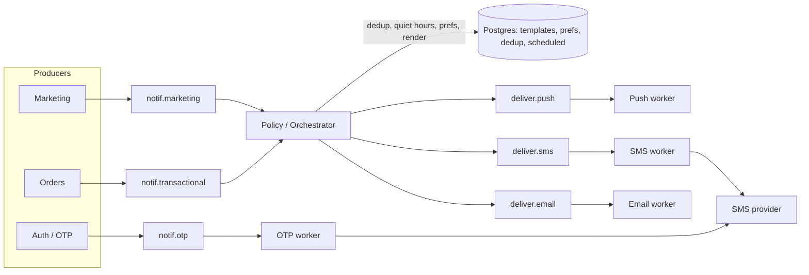

## Короткий ответ

Ни один вариант не подходит целиком. Каждый правильно видит слабое место в дизайне другого:

- **Катя права насчёт проблемы.** Если медленный SMS-провайдер делит воркеры с push и OTP, получается head-of-line blocking. Это дефект дизайна Димы, а не эксплуатационная мелочь.
- **Дима прав насчёт цены решения.** Дедупликация, тихие часы, пользовательские настройки, шаблоны и контроль бюджета на SMS — это **политика**. Её нужно держать в одном месте. Если реализовать её трижды командой из 4 человек, реализации гарантированно разъедутся.

Предлагаю разделить **политику** (что, кому, когда и по какому каналу отправлять) и **доставку** (как дойти до провайдера). Политика централизована, как у Димы. Доставка изолирована по каналам и приоритетам, как у Кати. Брокер один. Код лежит в одном репозитории, но деплоится отдельными deployment'ами.

## Прикидка нагрузки

Цифры ниже — мои допущения, подставьте реальные.

- **Транзакционные уведомления.** 400 заказов/мин ≈ 7 заказов/с. На заказ приходится примерно 5 событий (принят, готовится, курьер назначен, подъезжает, доставлен), итого **~35 уведомлений/с в пике**. Почти все это push, SMS — малая доля.
- **OTP.** Допустим, в пике логинится 5–10% DAU в час. Это 7,5–15k в час, то есть **единицы в секунду**. Объём маленький, но p99 должен укладываться в несколько секунд.
- **Маркетинг.** Кампания на 150k пользователей за 10 минут даёт **~250 сообщений/с**. Это самый большой поток, и именно он может задавить транзакционные сообщения, если лежит в той же очереди.
- **Почему у Димы тормозит.** Kafka-консьюмер обрабатывает партицию последовательно. Допустим, SMS-провайдер в пике отвечает 2–3 с, а партиций 12. Тогда потолок около 12 / 2,5 ≈ **5 сообщений/с на весь топик**, и push в тех же партициях ждут своей очереди. Дело не в Kafka, а в том, что медленный и быстрые каналы делят одну очередь и одних воркеров.

Вывод: по объёму нагрузка скромная, хватит одного брокера и небольшого числа инстансов. Главная задача здесь не масштаб, а **изоляция по латентности** и **контроль расходов**.

## Архитектура

Как это работает:

1. **Входные топики разделены по приоритету: `otp`, `transactional`, `marketing`.** Маркетинговая рассылка на 150k физически не может встать в очередь перед «курьер подъехал».
2. **Orchestrator** — единственное место с политикой:
   - дедупликация по `idempotency_key = event_id + channel` (unique-индекс в Postgres или `SET NX` с TTL в Redis);
   - тихие часы в таймзоне пользователя, только для маркетинга. Отложенное сообщение пишется в таблицу `scheduled` в Postgres, а не держится в Kafka. Отдельный планировщик раз в минуту достаёт то, что пора отправить;
   - выбор канала и **каскад для экономии бюджета**: сначала push; SMS отправляется, только если нет push-токена или push не доставлен за N секунд, и только для критичных типов;
   - рендер шаблона из общей таблицы в Postgres с кэшем в памяти. Воркеры получают уже готовый текст, поэтому расхождения шаблонов исключены по построению.
3. **Delivery-воркеры** работают по одному на канал, у каждого свой топик и свой consumer group. Логики в них нет: отправить, повторить, записать статус. Если SMS тормозит, растёт лаг только в `deliver.sms`.
4. **OTP идёт отдельным путём и минует orchestrator.** Тихие часы и маркетинговые правила к OTP не применяются, лишний хоп не нужен. У OTP свой пул воркеров и, по возможности, отдельный sender или аккаунт у SMS-провайдера. Так общий rate limit не разделяется с сервисными SMS.

**Про Kafka и RabbitMQ.** Если Kafka у вас уже работает, RabbitMQ ради этого проекта не добавляйте: второй брокер для 4 бэкендеров — это второй набор мониторинга, алертов и дежурств. Приоритеты через отдельные топики и consumer group'ы получаются не хуже, чем через очереди RabbitMQ. Есть одна оговорка. В Kafka нет нативных задержанных сообщений, поэтому retry-с-задержкой у Димы, скорее всего, работает через pause/sleep консьюмера до нужного timestamp. Это рабочий приём, но держите для retry по одному топику на каждую задержку (например, `sms.retry.10s`, `sms.retry.60s`) плюс DLQ. Если же Kafka у вас нет и RabbitMQ уже в проде, та же схема ложится на RabbitMQ. Выбор брокера здесь вторичен.

## Сравнение вариантов

| Вариант | Плюсы | Минусы | Когда уместен |
|---|---|---|---|
| Дима: один топик, один сервис | Простота, политика в одном месте | Head-of-line blocking: SMS и маркетинг тормозят OTP и push | Малый объём, один быстрый канал |
| Катя: сервис и очередь на каждый канал | Изоляция каналов | Политика в трёх копиях, шаблоны расходятся, три деплоя, второй брокер | Отдельные команды на каждый канал |
| **Гибрид: центральная политика + изолированная доставка** | Изоляция там, где она нужна (латентность), централизация там, где нужна она (правила и деньги) | Лишний хоп через orchestrator (единицы–десятки мс), orchestrator становится критичным компонентом | **Ваш случай** |

Реализация: **один репозиторий и один сервис с режимами запуска** (`--role=orchestrator|push|sms|email|otp`), каждый режим — отдельный Deployment со своим автоскейлингом. Изоляция получается как у Кати, а код и шаблоны остаются в одном месте, как у Димы. Для команды из 4 человек это, на мой взгляд, главный аргумент.

## Что сломается и как с этим жить

- **SMS-провайдер тормозит или лежит.** Растёт лаг только в `deliver.sms`. Нужен circuit breaker на провайдера. Для транзакционных SMS при открытом breaker'е — откат на push. Для OTP нужен второй провайдер: это единственное место, где я бы за него заплатил, потому что без OTP пользователь не может войти. Если бюджет не позволяет, запасным путём могут быть звонок-сброс или push в уже залогиненное устройство.
- **Orchestrator упал.** Транзакционные и маркетинговые сообщения копятся в Kafka и не теряются. OTP это не затрагивает, потому что у него отдельный путь. Держите минимум 2 инстанса.
- **Повторная отправка SMS после ретрая.** Это прямые деньги. Idempotency key нужно проверять и в orchestrator, и в SMS-воркере перед вызовом провайдера. Если провайдер принимает client-side message id, передавайте его.
- **Расход бюджета.** Нужен глобальный счётчик SMS в сутки и на пользователя в час с жёстким потолком и алертом на 80%. Это ещё один довод за централизацию: у Кати такой счётчик пришлось бы синхронизировать между сервисами.
- **Маркетинг ночью.** Проверку тихих часов нужно делать **дважды**: при планировании и повторно прямо перед отправкой. Кампания, запущенная в 21:55, может дойти до воркера в 22:10.

**Метрики для алертов:** consumer lag по каждому топику (для `otp` — порог в секундах, не в сообщениях), p99 от события до ответа провайдера по каналам, доля ошибок провайдера, расход SMS за сутки.

## Как закончить спор

Предложите обоим посмотреть на это как на объединение их идей, а не на выбор победителя. Дима получает централизованную политику и шаблоны в Postgres. Катя получает изоляцию каналов и приоритетов. Порядок миграции:

1. Выделить OTP в отдельный путь. Это самый рискованный путь и самый быстрый выигрыш.
2. Разнести доставку по топикам на каждый канал.
3. Добавить тихие часы и каскад push → SMS в orchestrator.

Каждый шаг можно выкатывать отдельно, начиная с существующего сервиса Димы.
