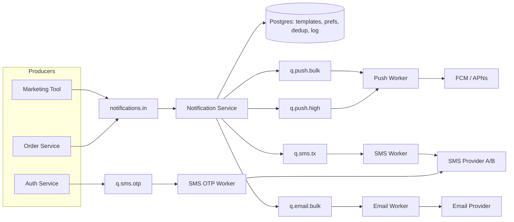
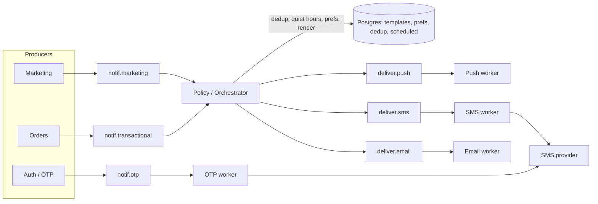

# Case two-architects-notifications-merge-ru

## Conversation so far
(none)

## Latest user message
У нас сервис доставки еды, ~150k DAU, пики в обед и вечером до 400 заказов/мин. Нужно переделать уведомления (push, SMS, email). Два сеньора принесли два разных дизайна и спорят уже неделю:

Вариант Димы: один общий Kafka-топик notifications, один notification-service, который сам решает канал, ретраи через отдельный retry-топик с задержкой, шаблоны в Postgres. Плюс: всё в одном месте. Минус (по мнению Кати): SMS-провайдер тормозит и в пике забивает весь консьюмер, push опаздывают.

Вариант Кати: отдельный сервис на каждый канал со своей очередью (RabbitMQ), приоритеты через разные очереди, шаблоны в каждом сервисе свои. Плюс: изоляция каналов. Минус (по мнению Димы): дедупликация и "тихие часы" пользователя придётся реализовывать трижды, шаблоны разъедутся.

Ограничения: SMS стоят денег, бюджет жёсткий; OTP-коды должны уходить за секунды даже в пике; маркетинговые рассылки не должны приходить ночью. Команда 4 бэкендера. Чей вариант брать?

## Rubric (what a strong answer does)
1. Does not simply pick Dima's or Katya's design; proposes a combined design that takes specific parts from both (e.g. centralized preference/dedup/quiet-hours/template logic plus per-channel isolated delivery queues or workers)
2. Evaluates the proposals per concern (e.g. channel isolation, dedup, quiet hours, templates, retries) rather than only as whole packages
3. Addresses the stated constraints concretely: OTP isolated or prioritized so a slow SMS provider cannot delay it, quiet hours applied to marketing but not to OTP/transactional messages, SMS cost control
4. Points out at least one point where the merged parts could conflict (e.g. where dedup/idempotency lives when retries happen in per-channel workers) and says how to resolve it, keeping scope realistic for 4 backend engineers

## Answer A
## Коротко

Ни один вариант не подходит как есть. Правы оба, но каждый прав в своей половине:

- **Катя права насчёт проблемы.** Медленный SMS-провайдер не должен задерживать push, а OTP не должен стоять в одной очереди с маркетингом. Для этого нужна изоляция доставки по каналам и приоритетам.
- **Дима прав насчёт логики.** Дедупликация, «тихие часы», выбор канала, шаблоны и бюджет SMS должны жить в одном месте, иначе через полгода у вас будет три разные реализации.

Спор идёт о том, где провести границу. Правильная граница такая: **«мозг» один, «доставщики» раздельные.** Один notification-service принимает решения (кому, что, каким каналом, можно ли сейчас) и раскладывает готовые сообщения по отдельным очередям «канал × приоритет». Тонкие воркеры по каналам только отправляют.

Для команды из 4 человек это даже проще, чем вариант Кати: один репозиторий и одна кодовая база, а воркеры каналов запускаются как отдельные процессы или deployment из того же артефакта.

---

## Цифры (порядок величин)

Допущения мои, поправьте, если реальность другая:

| Поток | Расчёт | Пик |
|---|---|---|
| Транзакционные (статусы заказа) | 400 заказов/мин ≈ 7/с × ~5 уведомлений на заказ | **~35 сообщений/с**, в основном push |
| OTP | вход и подтверждение телефона, скорее всего единицы в секунду | **~1–5/с** |
| Маркетинг | рассылка на ~150k пользователей, отправленная разом | **150k сообщений за минуты**, если не ограничить скорость |

Выводы:

1. **Объём маленький.** 35–50 msg/s выдержит любой брокер, хоть Kafka, хоть RabbitMQ, хоть очередь на Postgres. Выбор брокера тут вообще не главный вопрос.
2. **Настоящая проблема в латентности SMS-провайдера, а не в пропускной способности.** По закону Литтла число одновременных запросов = интенсивность × латентность. Если провайдер в пике отвечает 3 с, а SMS идёт 5/с, нужно ~15 запросов в полёте. Консьюмер, который обрабатывает сообщения последовательно, с такой нагрузкой не справится, и всё, что стоит за SMS в той же партиции или очереди, начнёт отставать.
3. **Пики создаёт маркетинг, а не заказы.** Одна рассылка на всю базу без rate limit забьёт общую очередь сильнее, чем обеденный пик.

Отсюда видно, почему push опаздывают в варианте Димы: это **head-of-line blocking**. В Kafka консьюмер обрабатывает партицию по порядку, поэтому одна медленная SMS держит всё, что стоит за ней в этой партиции. Ретраи тут не помогут, помогут только раздельные очереди.

---

## Предлагаемая архитектура

### Notification Service («мозг», один)
- **Выбор канала и fallback.** Сначала push; SMS только если нет push-токена или push не доставлен за N минут и сообщение критичное. SMS стоит денег, поэтому канал выбирается здесь и нигде больше.
- **Дедупликация** по idempotency key (`event_id + user_id + type`) с уникальным индексом в Postgres.
- **Тихие часы и предпочтения пользователя.** Маркетинг ночью не отправляется, а переносится (`scheduled_at` = утро по часовому поясу пользователя).
- **Рендеринг шаблонов.** Шаблоны централизованы в Postgres, в очередь уходит готовый текст. Воркеры шаблонов вообще не знают, поэтому «разъехаться» им негде.
- **Бюджет SMS**: дневной лимит и rate limit на маркетинговые SMS, алерт при приближении к лимиту.

### Воркеры каналов («доставщики», раздельные)
- Каждый читает свои очереди, держит свой пул соединений, свой circuit breaker и свои ретраи.
- Бизнес-логики нет, только «отправить, записать результат».
- Масштабируются независимо: SMS-воркер можно держать с высокой конкурентностью (async I/O), не трогая push.

### OTP: отдельная быстрая полоса
OTP идёт **мимо** общего notification-service прямо в `q.sms.otp`, у которого свой воркер. Дедуп, тихие часы и шаблонная логика OTP не нужны, а каждый лишний шаг добавляет латентность и точку отказа. Дополнительно:
- **TTL ~60 с.** Протухший OTP не отправляется, а не отправляется поздно. Иначе ретрай через 5 минут доставит пользователю бесполезный код и стоит денег.
- **Второй SMS-провайдер как fallback только для OTP.** Для остальных SMS это, скорее всего, не окупается.
- Ретраи короткие: 2–3 попытки за секунды, без длинного backoff.

---

## Разбор решений

### Главное решение: где граница

| Вариант | Плюсы | Минусы | Когда подходит |
|---|---|---|---|
| Дима: одна очередь, один сервис | Всё в одном месте, проще всего запустить | HOL blocking: SMS тормозит push, маркетинг тормозит OTP | Один канал или все провайдеры одинаково быстрые |
| Катя: сервис на канал | Изоляция отказов и латентности | Логика ×3, шаблоны расходятся, для 4 человек это 3+ сервиса на поддержку | Каналы ведут разные команды |
| **Гибрид: один мозг, раздельная доставка** | Изоляция там, где она нужна (I/O к провайдерам); логика в одном месте | Мозг становится общей точкой: если он упал, встают все каналы, кроме OTP | **Ваш случай** |

Чем платим в гибриде: notification-service остаётся общей зависимостью. Это приемлемо, потому что он не ходит во внешние медленные API (только Postgres и брокер) и масштабируется горизонтально, а OTP от него вообще не зависит.

### Брокер: Kafka или RabbitMQ

| | Kafka | RabbitMQ |
|---|---|---|
| Приоритеты | Через отдельные топики | Отдельные очереди (есть и приоритетные очереди) |
| Отложенные ретраи | Нет из коробки, нужна своя retry-topic-схема | Через DLX + TTL или плагин delayed message exchange (помню его как `rabbitmq_delayed_message_exchange`, название не проверял, сверьтесь с документацией) |
| Конкурентность на медленном I/O | Ограничена числом партиций, если не делать параллельную обработку внутри консьюмера | Естественная: prefetch + много консьюмеров на очередь |
| Replay и аудит | Сильная сторона | Слабее |

Моя рекомендация: **берите тот брокер, который вы уже эксплуатируете.** При 50 msg/s разница между ними не решает, а второй брокер для команды из 4 человек означает лишнее дежурство. Если не эксплуатируете ни один, для этой задачи (очереди задач, ретраи с задержкой, приоритеты) RabbitMQ, скорее всего, удобнее. Kafka здесь оправдана, если она уже есть и события заказов и так в ней.

---

## Что сломается и что с этим делать

| Отказ | Последствие | Защита |
|---|---|---|
| SMS-провайдер тормозит или лежит | Растёт `q.sms.tx` | Изолированная очередь, так что push не страдает; circuit breaker; алерт по возрасту самого старого сообщения |
| SMS-провайдер ответил таймаутом, но SMS отправил | Ретрай даст дубль, а это двойные деньги и путаница с OTP | Передавать провайдеру свой message id, если API это поддерживает; фиксировать попытку в логе до вызова |
| Маркетинговая рассылка на всю базу | Маркетинг забивает очередь | Отдельная bulk-очередь с rate limit; транзакционные сообщения в своей high-очереди |
| Маркетинг застрял в ретраях и вышел из них ночью | Нарушение тихих часов | **Проверять тихие часы ещё раз прямо перед отправкой в воркере**, а не только при постановке в очередь. Это самая частая ошибка в таких системах |
| Упал notification-service | Транзакционные уведомления копятся во входной очереди | Несколько реплик; OTP идёт в обход; после восстановления очередь разгребается, объёмы маленькие |
| Postgres недоступен | Нет дедупа и шаблонов | Кэш шаблонов в памяти сервиса; для дедупа лучше отказать (подождать), чем задублировать SMS |

### Метрики, которые стоит завести сразу
- Возраст самого старого сообщения в каждой очереди (главная метрика; алерт для `q.sms.otp` при > 5 с).
- p99 от события до вызова провайдера по каналам.
- Количество SMS в день и расход против бюджета.
- Доля fallback push→SMS. Если она растёт, скорее всего, отвалились push-токены, и вы начинаете платить за SMS.

---

## Как это продать обоим

- **Диме:** «Твоя логика остаётся в одном сервисе, как ты и хотел. Мы только выносим отправку в отдельные очереди, потому что медленный провайдер нельзя держать в общей партиции».
- **Кате:** «Изоляция каналов остаётся, но на уровне воркеров, где она реально нужна. Тихие часы и шаблоны не дублируем».

Порядок внедрения, который я бы предложил:
1. Сначала вынести OTP в отдельную полосу. Это закрывает самое жёсткое требование.
2. Затем разделить очереди по каналам.
3. Потом уже переделывать шаблоны.

Каждый шаг даёт результат сам по себе, и его можно откатить.

## Answer B
## Короткий ответ

Ни один вариант не подходит целиком. Каждый правильно видит слабое место в дизайне другого:

- **Катя права насчёт проблемы.** Если медленный SMS-провайдер делит воркеры с push и OTP, получается head-of-line blocking. Это дефект дизайна Димы, а не эксплуатационная мелочь.
- **Дима прав насчёт цены решения.** Дедупликация, тихие часы, пользовательские настройки, шаблоны и контроль бюджета на SMS — это **политика**. Её нужно держать в одном месте. Если реализовать её трижды командой из 4 человек, реализации гарантированно разъедутся.

Предлагаю разделить **политику** (что, кому, когда и по какому каналу отправлять) и **доставку** (как дойти до провайдера). Политика централизована, как у Димы. Доставка изолирована по каналам и приоритетам, как у Кати. Брокер один. Код лежит в одном репозитории, но деплоится отдельными deployment'ами.

## Прикидка нагрузки

Цифры ниже — мои допущения, подставьте реальные.

- **Транзакционные уведомления.** 400 заказов/мин ≈ 7 заказов/с. На заказ приходится примерно 5 событий (принят, готовится, курьер назначен, подъезжает, доставлен), итого **~35 уведомлений/с в пике**. Почти все это push, SMS — малая доля.
- **OTP.** Допустим, в пике логинится 5–10% DAU в час. Это 7,5–15k в час, то есть **единицы в секунду**. Объём маленький, но p99 должен укладываться в несколько секунд.
- **Маркетинг.** Кампания на 150k пользователей за 10 минут даёт **~250 сообщений/с**. Это самый большой поток, и именно он может задавить транзакционные сообщения, если лежит в той же очереди.
- **Почему у Димы тормозит.** Kafka-консьюмер обрабатывает партицию последовательно. Допустим, SMS-провайдер в пике отвечает 2–3 с, а партиций 12. Тогда потолок около 12 / 2,5 ≈ **5 сообщений/с на весь топик**, и push в тех же партициях ждут своей очереди. Дело не в Kafka, а в том, что медленный и быстрые каналы делят одну очередь и одних воркеров.

Вывод: по объёму нагрузка скромная, хватит одного брокера и небольшого числа инстансов. Главная задача здесь не масштаб, а **изоляция по латентности** и **контроль расходов**.

## Архитектура

Как это работает:

1. **Входные топики разделены по приоритету: `otp`, `transactional`, `marketing`.** Маркетинговая рассылка на 150k физически не может встать в очередь перед «курьер подъехал».
2. **Orchestrator** — единственное место с политикой:
   - дедупликация по `idempotency_key = event_id + channel` (unique-индекс в Postgres или `SET NX` с TTL в Redis);
   - тихие часы в таймзоне пользователя, только для маркетинга. Отложенное сообщение пишется в таблицу `scheduled` в Postgres, а не держится в Kafka. Отдельный планировщик раз в минуту достаёт то, что пора отправить;
   - выбор канала и **каскад для экономии бюджета**: сначала push; SMS отправляется, только если нет push-токена или push не доставлен за N секунд, и только для критичных типов;
   - рендер шаблона из общей таблицы в Postgres с кэшем в памяти. Воркеры получают уже готовый текст, поэтому расхождения шаблонов исключены по построению.
3. **Delivery-воркеры** работают по одному на канал, у каждого свой топик и свой consumer group. Логики в них нет: отправить, повторить, записать статус. Если SMS тормозит, растёт лаг только в `deliver.sms`.
4. **OTP идёт отдельным путём и минует orchestrator.** Тихие часы и маркетинговые правила к OTP не применяются, лишний хоп не нужен. У OTP свой пул воркеров и, по возможности, отдельный sender или аккаунт у SMS-провайдера. Так общий rate limit не разделяется с сервисными SMS.

**Про Kafka и RabbitMQ.** Если Kafka у вас уже работает, RabbitMQ ради этого проекта не добавляйте: второй брокер для 4 бэкендеров — это второй набор мониторинга, алертов и дежурств. Приоритеты через отдельные топики и consumer group'ы получаются не хуже, чем через очереди RabbitMQ. Есть одна оговорка. В Kafka нет нативных задержанных сообщений, поэтому retry-с-задержкой у Димы, скорее всего, работает через pause/sleep консьюмера до нужного timestamp. Это рабочий приём, но держите для retry по одному топику на каждую задержку (например, `sms.retry.10s`, `sms.retry.60s`) плюс DLQ. Если же Kafka у вас нет и RabbitMQ уже в проде, та же схема ложится на RabbitMQ. Выбор брокера здесь вторичен.

## Сравнение вариантов

| Вариант | Плюсы | Минусы | Когда уместен |
|---|---|---|---|
| Дима: один топик, один сервис | Простота, политика в одном месте | Head-of-line blocking: SMS и маркетинг тормозят OTP и push | Малый объём, один быстрый канал |
| Катя: сервис и очередь на каждый канал | Изоляция каналов | Политика в трёх копиях, шаблоны расходятся, три деплоя, второй брокер | Отдельные команды на каждый канал |
| **Гибрид: центральная политика + изолированная доставка** | Изоляция там, где она нужна (латентность), централизация там, где нужна она (правила и деньги) | Лишний хоп через orchestrator (единицы–десятки мс), orchestrator становится критичным компонентом | **Ваш случай** |

Реализация: **один репозиторий и один сервис с режимами запуска** (`--role=orchestrator|push|sms|email|otp`), каждый режим — отдельный Deployment со своим автоскейлингом. Изоляция получается как у Кати, а код и шаблоны остаются в одном месте, как у Димы. Для команды из 4 человек это, на мой взгляд, главный аргумент.

## Что сломается и как с этим жить

- **SMS-провайдер тормозит или лежит.** Растёт лаг только в `deliver.sms`. Нужен circuit breaker на провайдера. Для транзакционных SMS при открытом breaker'е — откат на push. Для OTP нужен второй провайдер: это единственное место, где я бы за него заплатил, потому что без OTP пользователь не может войти. Если бюджет не позволяет, запасным путём могут быть звонок-сброс или push в уже залогиненное устройство.
- **Orchestrator упал.** Транзакционные и маркетинговые сообщения копятся в Kafka и не теряются. OTP это не затрагивает, потому что у него отдельный путь. Держите минимум 2 инстанса.
- **Повторная отправка SMS после ретрая.** Это прямые деньги. Idempotency key нужно проверять и в orchestrator, и в SMS-воркере перед вызовом провайдера. Если провайдер принимает client-side message id, передавайте его.
- **Расход бюджета.** Нужен глобальный счётчик SMS в сутки и на пользователя в час с жёстким потолком и алертом на 80%. Это ещё один довод за централизацию: у Кати такой счётчик пришлось бы синхронизировать между сервисами.
- **Маркетинг ночью.** Проверку тихих часов нужно делать **дважды**: при планировании и повторно прямо перед отправкой. Кампания, запущенная в 21:55, может дойти до воркера в 22:10.

**Метрики для алертов:** consumer lag по каждому топику (для `otp` — порог в секундах, не в сообщениях), p99 от события до ответа провайдера по каналам, доля ошибок провайдера, расход SMS за сутки.

## Как закончить спор

Предложите обоим посмотреть на это как на объединение их идей, а не на выбор победителя. Дима получает централизованную политику и шаблоны в Postgres. Катя получает изоляцию каналов и приоритетов. Порядок миграции:

1. Выделить OTP в отдельный путь. Это самый рискованный путь и самый быстрый выигрыш.
2. Разнести доставку по топикам на каждый канал.
3. Добавить тихие часы и каскад push → SMS в orchestrator.

Каждый шаг можно выкатывать отдельно, начиная с существующего сервиса Димы.

