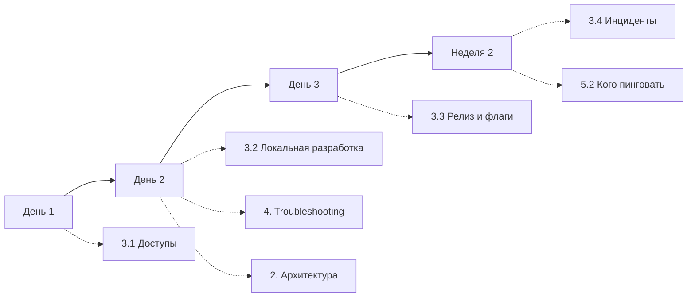

# Case onboarding-doc-three-drafts-ru

## Conversation so far
(none)

## Latest user message
Пишу onboarding-гайд для новых бэкендеров (Go, k8s, у нас ~30 микросервисов). Трое коллег набросали черновики оглавления, и все разные:

Аня (по дням): День 1 — доступы и ноутбук; День 2 — поднять локально 3 основных сервиса; День 3 — первый PR с good-first-issue; Неделя 2 — дежурство в тени.

Олег (по архитектуре): 1. Общая схема сервисов; 2. Как ходят запросы (gateway → auth → сервисы); 3. Данные: Postgres, Kafka, Redis; 4. Деплой и мониторинг; 5. Глоссарий.

Света (FAQ): "Где взять доступ к Vault?", "Почему локально не стартует billing?", "Кого пинговать по инцидентам?", "Как завести фиче-флаг?" — 25 таких вопросов из Slack.

Хочу один документ, а не три. Предложи итоговую структуру — что откуда брать и в каком виде.

## Rubric (what a strong answer does)
1. Proposes a single concrete structure (section list) that uses material from all three drafts, stating which parts come from which draft
2. Integrates rather than concatenates: e.g. places relevant architecture or FAQ items inside the day-by-day steps where the newcomer needs them, instead of three separate blocks glued together
3. Notes a conflict or overlap between drafts (e.g. FAQ items duplicating architecture or setup content, or FAQ answers that go stale) and says how to handle it
4. Keeps the result practical for the stated audience (new Go backend engineers, ~30 services); no unrelated generic advice dominating the answer

## Answer A
**Коротко:** все три черновика нужны, но они отвечают на разные вопросы, поэтому склеивать их подряд не стоит. План Ани станет основой документа («что делать»). Схема Олега пойдёт в раздел с объяснениями («как устроено»). Вопросы Светы надо разобрать по одному: часть превратится в шаги плана Ани, часть в короткие инструкции, часть в troubleshooting, а часть лучше исправить в коде, а не описывать.

По сути это деление Diátaxis: tutorial, explanation, how-to и reference. Путаница возникает, когда в одном разделе смешивают обучение и справку.

## Итоговая структура

```text
0. Как читать этот гайд                      (1 экран)
1. Первые две недели                         ← Аня, основа документа
   1.1 День 1 — доступы и ноутбук
   1.2 День 2 — локально поднимаем 3 основных сервиса
   1.3 День 3 — первый PR
   1.4 Неделя 2 — дежурство в тени
   1.5 Чеклист «я готов работать сам»
2. Как устроена система                      ← Олег
   2.1 Карта сервисов (крупными блоками)
   2.2 Путь запроса: gateway → auth → сервисы
   2.3 Данные: Postgres, Kafka, Redis
   2.4 Деплой и мониторинг
3. Как сделать…                              ← Света, переписанные вопросы
   3.1 Доступы (Vault, k8s, базы)
   3.2 Локальная разработка
   3.3 Разработка и релиз (фиче-флаги, миграции…)
   3.4 Инциденты и дежурства
4. Если что-то сломалось                     ← Света, вопросы «почему не работает»
5. Справочник
   5.1 Каталог сервисов (владелец, репо, дашборд, канал)
   5.2 Кого пинговать
   5.3 Глоссарий                             ← Олег, п. 5
```

## Что брать из каждого черновика и в каком виде

| Источник | Раздел | Форма | Что изменить |
|---|---|---|---|
| Аня | 1 | Пошаговые чеклисты с ожидаемым результатом в конце каждого дня («должен открываться `localhost:8080/health`») | Не объяснять внутри шагов, а давать ссылки в разделы 2 и 3 |
| Олег, п. 1–4 | 2 | Проза плюс 2–3 диаграммы | Не описывать все 30 сервисов, только группы и 5–7 ключевых. Остальное вынести в каталог (5.1) |
| Олег, п. 5 | 5.3 | Алфавитная таблица «термин — определение — где встречается» | Всё |
| Света, «как сделать X» | 3 | Одна короткая инструкция на задачу: цель → шаги → как проверить | Переписать заголовки вопросов в задачи: «Где взять доступ к Vault?» → «Получить доступ к Vault» |
| Света, «почему не работает» | 4 | Симптом → причина → решение | Текст ошибки дословно, чтобы находился через Ctrl+F |
| Света, «кого пинговать» | 5.2 | Таблица «зона — канал — дежурный/ротация» | Не имена людей, а роли и ссылки на ротацию: имена быстро устаревают |

## Как разобрать 25 вопросов Светы

Не переносите FAQ целиком. Для каждого вопроса выберите одно из пяти мест:

1. **Шаг в плане Ани.** Если с этим сталкиваются все и в предсказуемый момент, это шаг, а не вопрос. Пример: «Доступ к Vault» → шаг Дня 1.
2. **Инструкция в разделе 3.** Задача нужна не в первый день, но регулярно. Пример: «Как завести фиче-флаг» → 3.3, со ссылкой на неё из Дня 3.
3. **Troubleshooting в разделе 4.** Пример: «Почему локально не стартует billing».
4. **Справочник.** Пример: «Кого пинговать по инцидентам» → 5.2, со ссылкой из Недели 2.
5. **Удалить.** Вопрос устарел, отвечен в другом месте или это баг. Если billing у всех не стартует локально, стоит завести задачу на исправление, а в гайде оставить временное решение со ссылкой на тикет. Иначе гайд будет годами документировать баг.

Скорее всего, после такого разбора 25 вопросов сократятся примерно до 15 записей. Слияние дублей тоже полезно.

## Как связать разделы

Пусть план Ани будет основным маршрутом, а остальные разделы подключаются к нему через ссылки:



Например, в Дне 2 можно поставить блок «перед тем как поднимать сервисы, прочитай 2.2, 15 минут». Тогда архитектуру новичок прочитает в тот момент, когда она ему понадобится, а не в первый день, когда он ещё без доступов.

## Чтобы гайд не устарел

- **Владелец у каждого раздела.** Естественное распределение: Аня отвечает за раздел 1, Олег за 2, Света за 3–4.
- **Каталог сервисов (5.1)** лучше генерировать из того, что уже есть: service catalog, CODEOWNERS или лейблы в k8s. Таблица на 30 сервисов, которую ведут вручную, устареет за месяц.
- **Каждый новичок правит гайд.** Сделайте это последним пунктом чеклиста 1.5: PR с исправлениями всего, на чём он споткнулся. Это заодно проверяет, что шаги из раздела 1 действительно работают.
- **Slack-вопросы дальше.** Когда новый вопрос повторяется второй раз, его разбирают по тем же пяти вариантам.


## Answer B
**Коротко:** не надо выбирать между тремя черновиками и не надо склеивать их подряд. Три черновика описывают три разных вида документации: у Ани маршрут обучения, у Олега объяснение системы, у Светы ответы на конкретные проблемы. Каркасом документа лучше сделать план Ани: новичок идёт по нему линейно. Архитектура Олега станет справочной частью, на которую ссылается план. Вопросы Светы стоит не держать отдельным списком FAQ, а разнести по местам, где они реально возникают.

## Итоговая структура

```text
0. Как читать этот гайд
1. Первые две недели          ← Аня (основа)
   1.1 День 1: доступы и ноутбук
   1.2 День 2: локально поднимаем 3 основных сервиса
   1.3 День 3: первый PR
   1.4 Неделя 2: дежурство в тени
2. Как устроена система       ← Олег
   2.1 Карта сервисов
   2.2 Путь запроса: gateway → auth → сервисы
   2.3 Данные: Postgres, Kafka, Redis
   2.4 Деплой и мониторинг
3. Как сделать…               ← Света (how-to)
4. Если что-то сломалось      ← Света (troubleshooting + инциденты)
Приложения
   A. Глоссарий                ← Олег
   B. Кто за что отвечает (сервисы, команды, каналы)
```

## Что откуда брать и в каком виде

| Раздел | Источник | Форма | Что важно |
|---|---|---|---|
| 0. Как читать | новый | 1 абзац | Для кого гайд, в каком порядке читать, куда писать, если что-то устарело |
| 1. Первые две недели | Аня | Чеклисты по дням с критерием «готово» | Каждый шаг заканчивается проверяемым результатом («`make up` поднял auth, gateway, billing, healthcheck зелёный»). В начале дня одна строка со ссылкой на нужный кусок раздела 2 |
| 1.1 День 1 | Аня + вопросы Светы про доступы | Чеклист: доступ, у кого запросить, срок | Сюда встаёт «Где взять доступ к Vault?»: это шаг, а не FAQ |
| 1.2 День 2 | Аня + вопросы Светы про локальный запуск | Нумерованные шаги с командами + блок «Не стартует?» | «Почему локально не стартует billing?»: короткий ответ здесь, подробности в разделе 4 |
| 1.3 День 3 | Аня | Шаги: взять issue → ветка → CI → ревью → merge | Хорошая first issue для новичка: поправить сам гайд, в котором он только что споткнулся |
| 1.4 Неделя 2 | Аня | Что делать и чего ждать на дежурстве в тени | Ссылка на раздел 4 (инциденты) |
| 2.1 Карта сервисов | Олег | Mermaid-схема по доменам (не все 30 блоков) + таблица-каталог: сервис, домен, команда, репо, дашборд | 30 сервисов на одной схеме нечитаемы: группируйте по доменам, детали держите в таблице |
| 2.2 Путь запроса | Олег | `sequenceDiagram` + 1–2 абзаца | Разберите один реальный запрос сквозь систему от начала до конца |
| 2.3 Данные | Олег | Для каждого хранилища: что храним, кто владелец, как подключиться локально | Последний пункт связывает раздел со Днём 2 |
| 2.4 Деплой и мониторинг | Олег | Схема merge → CI → k8s + где смотреть логи, метрики, трейсы | Дайте ссылки на конкретные дашборды, а не общее «смотрите в Grafana» |
| 3. Как сделать… | Света | Заголовки-действия («Завести фиче-флаг»), внутри шаги | Переформулируйте вопросы в глаголы: так их легче найти по оглавлению |
| 4. Если что-то сломалось | Света | «Симптом → причина → решение» + отдельный подраздел «Инцидент: кого пинговать» | «Кого пинговать по инцидентам?» нужен и тут, и в Неделе 2 (ссылкой, а не копией) |
| A. Глоссарий | Олег | Алфавитная таблица «термин — определение — ссылка» | Включите внутренний жаргон и названия сервисов, которые непонятны по имени |
| B. Кто за что отвечает | новый, из черновиков всех трёх | Таблица | Дублирует каталог из 2.1 только если каталога там нет, иначе ссылка |

## Как разобрать 25 вопросов Светы

Сам список я не видел, поэтому распределение примерное. Прогоните каждый вопрос через четыре корзины:

1. **Это шаг онбординга** (доступы, установка, первый запуск) → встроить в раздел 1.
2. **Это задача «как сделать X»** (фиче-флаг, миграция, новый топик в Kafka) → раздел 3.
3. **Это «почему не работает»** → раздел 4, в формате «симптом → решение».
4. **Это баг процесса или инфраструктуры** (например, billing не стартует локально из-за известной проблемы) → завести тикет. В гайде останется временный обходной путь со ссылкой на тикет, а не вечная инструкция.

Скорее всего, часть вопросов дублирует друг друга или устарела. Slack-история такое накапливает, так что итоговых пунктов, вероятно, будет меньше 25.

## Почему не три части подряд

- **Порядок чтения.** Новичку в первый день не нужна вся архитектура до того, как у него заработает ноутбук. План с точечными ссылками на раздел 2 даёт контекст ровно тогда, когда он нужен.
- **Отдельный FAQ хуже найти.** Список из 25 вопросов читают один раз и забывают. Вопрос, встроенный в шаг, где он возникает, срабатывает сам.
- **Обучение и справочник не смешиваются.** Раздел 1 читают один раз и по порядку. Разделы 2–4 и приложения потом используют как справочник. Если их перемешать, будет неудобно и то, и другое.

## Чтобы гайд не протух

- У каждого раздела должен быть владелец, а сверху дата «проверено: …». Логично поделить так: Аня отвечает за раздел 1, Олег за 2 и глоссарий, Света за 3–4.
- Каталог сервисов по возможности генерируйте из существующего источника (service catalog, манифесты k8s, CODEOWNERS), а не ведите руками. 30 сервисов в ручной таблице почти наверняка разойдутся с реальностью за пару месяцев.
- Каждый новичок в конце второй недели вносит правки по тому, где застрял. Это самый дешёвый способ держать гайд актуальным.

