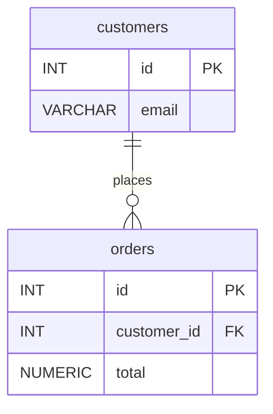

You won't get this to 100% by rewording the system prompt. An 8B model treats "no explanations" as a strong hint, and 1 in 5 failures is normal for it. What works is limiting what it's able to generate. Since you're calling the raw completion endpoint, you have three tools that chat APIs mostly don't expose:

1. **Prefill.** You write `erDiagram` yourself, so the output can't open with "Sure!" and can't switch to `classDiagram`.
2. **One few-shot example.** An example shows the exact `type name PK/FK` syntax far more reliably than an instruction describing it.
3. **A GBNF grammar.** llama.cpp masks every token that doesn't fit the grammar, so `id: int` can't be produced at all. This is the step that makes the output clean every time rather than just most of the time.

Add `temperature: 0` and a token cap on top of those.

## The request

```json
{
  "prompt": "Convert SQL DDL to a Mermaid erDiagram.\nRules: attributes are `TYPE name` with optional PK/FK; drop type lengths like (255); one relationship line per foreign key.\n\nDDL:\nCREATE TABLE authors (id INT PRIMARY KEY, name VARCHAR(100));\nCREATE TABLE books (id INT PRIMARY KEY, author_id INT REFERENCES authors(id), title TEXT);\n\nerDiagram\n    authors {\n        INT id PK\n        VARCHAR name\n    }\n    books {\n        INT id PK\n        INT author_id FK\n        TEXT title\n    }\n    authors ||--o{ books : \"writes\"\n\nDDL:\nCREATE TABLE customers (id INT PRIMARY KEY, email VARCHAR(255));\nCREATE TABLE orders (id INT PRIMARY KEY, customer_id INT REFERENCES customers(id), total NUMERIC);\n\nerDiagram\n",
  "grammar": "<GBNF below, as a JSON string>",
  "temperature": 0,
  "n_predict": 512,
  "stop": ["\n\n", "DDL:"]
}
```

Here is the same prompt as readable text. It ends with the prefilled `erDiagram` line, and the model continues from there:

```text
Convert SQL DDL to a Mermaid erDiagram.
Rules: attributes are `TYPE name` with optional PK/FK; drop type lengths like (255); one relationship line per foreign key.

DDL:
CREATE TABLE authors (id INT PRIMARY KEY, name VARCHAR(100));
CREATE TABLE books (id INT PRIMARY KEY, author_id INT REFERENCES authors(id), title TEXT);

erDiagram
    authors {
        INT id PK
        VARCHAR name
    }
    books {
        INT id PK
        INT author_id FK
        TEXT title
    }
    authors ||--o{ books : "writes"

DDL:
CREATE TABLE customers (id INT PRIMARY KEY, email VARCHAR(255));
CREATE TABLE orders (id INT PRIMARY KEY, customer_id INT REFERENCES customers(id), total NUMERIC);

erDiagram
```

Notes on the prompt:
- The example uses a **different** schema from yours. If you use your real tables as the example, the model tends to copy the example instead of converting the input.
- If you're running an instruct model through its chat template, put the instructions, example and DDL in the user turn. Then place `erDiagram\n` directly **after** the assistant header, and that becomes the prefill. The plain-text version above also works well on the completion endpoint, because the model only has to continue a pattern.

## The grammar (GBNF)

It only covers the generated part, which comes after the prefilled `erDiagram\n`:

```text
root   ::= entity+ rel*
entity ::= "    " ident " {\n" attr+ "    }\n"
attr   ::= "        " type " " ident key? "\n"
key    ::= " PK" | " FK" | " PK, FK"
rel    ::= "    " ident " " left "--" right " " ident " : \"" [a-z ]+ "\"\n"
left   ::= "||" | "|o" | "}o" | "}|"
right  ::= "||" | "o|" | "o{" | "|{"
ident  ::= [A-Za-z_] [A-Za-z0-9_]*
type   ::= [A-Za-z] [A-Za-z0-9_]*
```

With this grammar in place, `classDiagram`, `id: int`, markdown fences and chatty preambles are impossible. `type` rejects parentheses on purpose. As I recall, Mermaid's ER parser doesn't accept `VARCHAR(255)` in every version, so it's safer to drop the length. The grammar has no blank lines, so the `"\n\n"` stop string fires cleanly once the diagram is done.

The request fields `grammar`, `n_predict` and `stop` are from memory and not checked against your build. Confirm them in the README of your llama.cpp `server` version. Newer builds also accept `json_schema`, but that doesn't help here.

## Expected output



## Two caveats

- **The grammar enforces syntax, not correctness.** The model can still drop a column or choose the wrong cardinality. Add a cheap check after generation: every table and every `REFERENCES` in the DDL should appear in the output. If one is missing, retry once.
- **You may not need an LLM for this.** Converting DDL to an erDiagram is deterministic. A SQL parser such as `sqlglot` can extract the tables, columns, PKs and FKs, and about 30 lines of templating turns them into the diagram, with correct output every time. The model only adds value for fuzzy parts, like relationship labels ("places", "writes") or messy, non-standard DDL. A good split is parser for structure and the 8B model only for labels.
