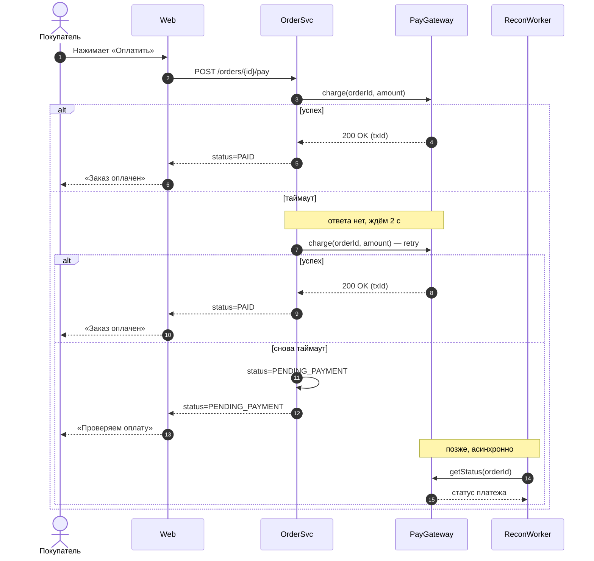

Несколько замечаний:

- В исходнике не было закрывающего `end` у `alt`, без него Mermaid не отрендерит диаграмму. Я его добавил.
- Воркера пришлось завести отдельным участником (`RW as ReconWorker`), остальные обозначения не менял. Если у вас в доке он называется иначе, просто переименуйте.
- `getStatus(orderId)` — это условное имя метода. Подставьте реальный метод шлюза.
- Что делает воркер после ответа шлюза (переводит заказ в PAID/FAILED, уведомляет пользователя), вы не описали, поэтому я закончил ветку на ответе шлюза. Могу дорисовать.
- По сути, а не по диаграмме: таймаут не означает, что списания не было. Первый `charge` мог пройти. Повторять его безопасно только с тем же ключом идемпотентности, например `orderId`, иначе возможно двойное списание. Если шлюз это поддерживает, стоит подписать это прямо в стрелке retry.
