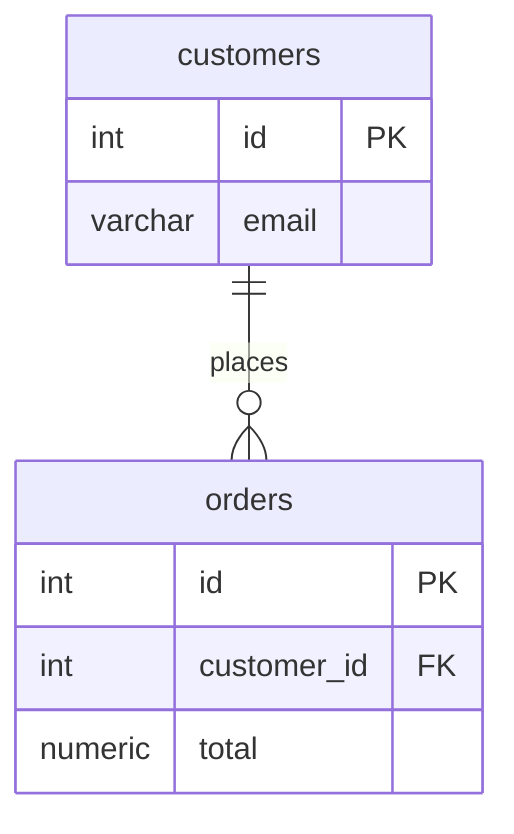

An 8B model will not follow "output only X" reliably, whatever wording you use. Better instructions won't fix this. Since you control the raw completion endpoint, make the wrong outputs impossible or unlikely at decode time. Use these in order of impact:

1. **Grammar-constrained decoding (GBNF).** This is the real fix. llama.cpp can restrict sampling to a grammar, so `Sure!`, `classDiagram` and `id: int` become tokens the model is not allowed to emit.
2. **A few-shot example in the exact target format.** This fixes attribute order, type names and relationship style, which a grammar allows but does not choose for you.
3. **Deterministic sampling.** Use `temperature: 0` and a hard `n_predict` cap.
4. **Validate and retry** as a safety net. For example, run the output through `mmdc` (mermaid-cli) and retry once if it fails.

If you can't use a grammar, **prefill** the response. End the prompt with `erDiagram\n` so the model is already inside the diagram and never gets a chance to write a preamble. This alone usually removes the "Sure!" and `classDiagram` failures. It helps less with attribute order, which is what the few-shot example is for.

## The grammar

```gbnf
root   ::= "erDiagram\n" rel* entity+
rel    ::= "    " name " " lcard "--" rcard " : " name "\n"
lcard  ::= "||" | "|o" | "}o" | "}|"
rcard  ::= "||" | "o|" | "o{" | "|{"
entity ::= "    " name " {\n" attr+ "    }\n"
attr   ::= "        " type " " name key? "\n"
key    ::= " PK" | " FK" | " PK, FK"
type   ::= [a-z] [a-z0-9_]*
name   ::= [a-zA-Z_] [a-zA-Z0-9_]*
```

The grammar forces type-first attributes (`int id`) and lowercase types with no parentheses. Mermaid's attribute-type parsing is picky and `varchar(255)` has broken on some versions, so dropping lengths is the safe choice.

## The prompt

The `/completion` endpoint does **not** apply a chat template, so you have to write it into the prompt yourself. The example below uses the Llama 3.x format. If you run a different 8B model (Qwen, Mistral, etc.), swap the special tokens for that model's template, because a wrong template alone degrades instruction-following a lot. Note that I wrote these token names from memory and didn't check them against the model's tokenizer config.

```text
<|start_header_id|>system<|end_header_id|>

You convert SQL DDL into a Mermaid erDiagram.
Rules:
- Tables become entities; keep table names as-is.
- Attributes are written as: type name [PK|FK]. Type first, lowercase, no length/precision.
- Every REFERENCES creates a relationship line: parent ||--o{ child : label
- Relationship lines come first, then entity blocks.<|eot_id|><|start_header_id|>user<|end_header_id|>

CREATE TABLE authors (id INT PRIMARY KEY, name VARCHAR(100));
CREATE TABLE books (id INT PRIMARY KEY, author_id INT REFERENCES authors(id), title TEXT, price DECIMAL(8,2));<|eot_id|><|start_header_id|>assistant<|end_header_id|>

erDiagram
    authors ||--o{ books : writes
    authors {
        int id PK
        varchar name
    }
    books {
        int id PK
        int author_id FK
        text title
        decimal price
    }
<|eot_id|><|start_header_id|>user<|end_header_id|>

CREATE TABLE customers (id INT PRIMARY KEY, email VARCHAR(255));
CREATE TABLE orders (id INT PRIMARY KEY, customer_id INT REFERENCES customers(id), total NUMERIC);<|eot_id|><|start_header_id|>assistant<|end_header_id|>

```

The prompt ends right after the assistant header. The grammar then forces `erDiagram\n` as the first tokens. If you're using prefill *instead of* a grammar, append `erDiagram\n` to the end of the prompt, then add that header back in front of the output yourself.

I left out `<|begin_of_text|>` because llama.cpp server usually adds BOS on its own, and a doubled BOS quietly hurts output quality. Check for "double BOS" warnings in the server log.

## The request

```json
{
  "prompt": "<the prompt above>",
  "grammar": "<the GBNF above, as a string>",
  "temperature": 0,
  "n_predict": 400,
  "stop": ["<|eot_id|>", "```"],
  "cache_prompt": true
}
```

Field names are as I remember llama.cpp server's `/completion` API. Check them against your build's server README, because the API has changed over time. `cache_prompt` means the system prompt and few-shot prefix are only processed once across repeated calls.

## Expected output



One accuracy note: `customer_id` has no `NOT NULL`, so strictly speaking an order can exist without a customer. The precise cardinality is `customers |o--o{ orders`. If that distinction matters to you, add a rule to the prompt, such as "nullable FK → `|o` on the parent side", and give it a second few-shot example. The grammar already allows `|o`.
