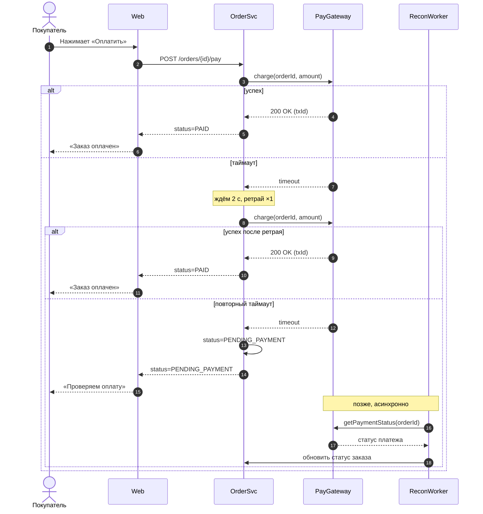

Что я поменял:
- В твоём исходнике `alt` не был закрыт `end`, поэтому Mermaid не отрендерил бы диаграмму. Я добавил оба `end`.
- Добавил участника `RW as ReconWorker` в том же стиле, что и остальные. Если в доке он называется иначе, просто переименуй.
- `getPaymentStatus(orderId)` и шаг «обновить статус заказа» — мои заглушки. Ты не написал, как называется метод шлюза и как воркер отдаёт результат в OrderSvc, так что подставь реальные названия.
- Добавил ветку «успех после ретрая». Без неё непонятно, что происходит, если вторая попытка прошла.

Одно замечание по логике: таймаут не означает, что списания не было. Если ретрай пойдёт без того же idempotency key, шлюз может списать деньги дважды. Я бы подписал второй вызов как `charge(orderId, amount, idemKey)` или добавил это в Note.
