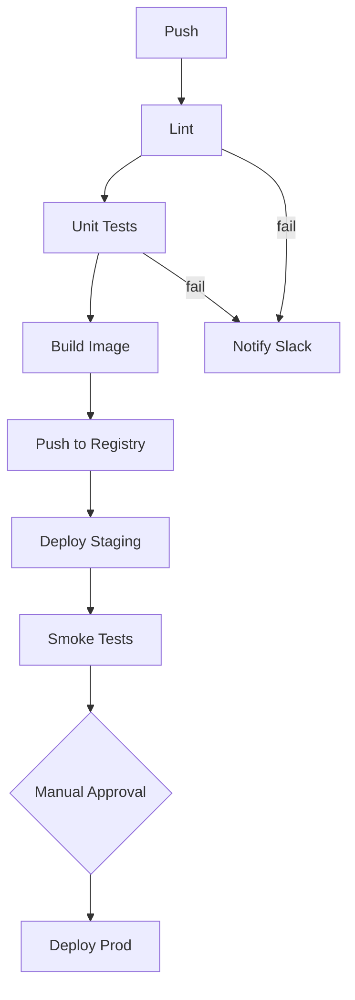

# Case flowchart-raw-output-parser-en

## Conversation so far
### User
Diagram our CI pipeline: push -> lint -> unit tests -> build image -> push to registry -> deploy to staging -> smoke tests -> manual approval -> deploy to prod. If lint or tests fail, notify Slack and stop.

### Assistant
Here is the diagram:

Let me know if you'd like any changes!

## Latest user message
Our docs bot pipes your reply straight into mmdc, and the wrapper checks that the text starts with `flowchart LR` on the very first line — it rejected that because of the intro sentence, the fence and graph TD. Also smoke test failure should roll back staging. Redo it so the reply is literally the diagram source and nothing else, first line `flowchart LR`.

## Rubric (what a strong answer does)
1. The reply's first line is exactly `flowchart LR`, with no preceding text and no code fence
2. The reply contains nothing but Mermaid source: no trailing prose, no closing fence, no offers of further changes
3. The diagram includes all pipeline stages in order, failure paths from lint and unit tests to a Slack notification, and a new failure path from smoke tests to a staging rollback
4. The Mermaid syntax is valid for flowchart (e.g. decision nodes with {}, labelled edges like -- fail --> or -->|fail|)

## Answer A
flowchart LR
    A[Push] --> B[Lint] -->|pass| C[Unit Tests] -->|pass| D[Build Image] --> E[Push to Registry] --> F[Deploy Staging] --> G[Smoke Tests] -->|pass| H{Manual Approval} -->|approved| I[Deploy Prod]
    B -->|fail| X[Notify Slack] --> S([Stop])
    C -->|fail| X
    G -->|fail| R[Rollback Staging]

## Answer B
flowchart LR
    A[Push] --> B[Lint]
    B -->|pass| C[Unit Tests]
    C -->|pass| D[Build Image]
    D --> E[Push to Registry]
    E --> F[Deploy Staging]
    F --> G[Smoke Tests]
    G -->|pass| H{Manual Approval}
    H -->|approved| I[Deploy Prod]
    B -->|fail| X[Notify Slack]
    C -->|fail| X
    X --> S((Stop))
    G -->|fail| R[Rollback Staging]
    R --> S
    H -->|rejected| S

