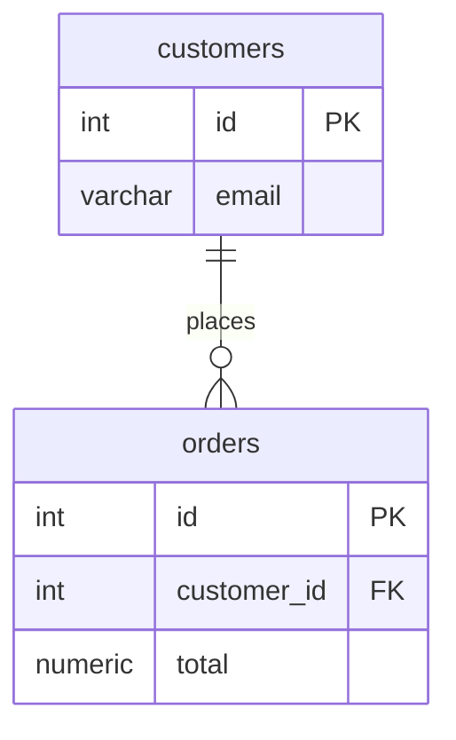
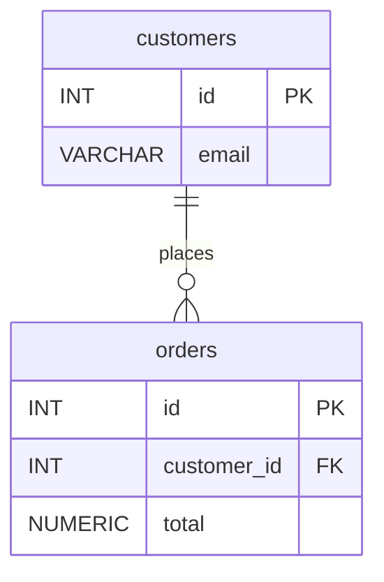

# Case small-model-erdiagram-consistency-en

## Conversation so far
(none)

## Latest user message
We generate ER diagrams from DDL with a local 8B model (llama.cpp server, completion endpoint). System prompt says 'Output only a Mermaid erDiagram, no explanations', but maybe 1 in 5 outputs starts with 'Sure! Here's the diagram', or uses `classDiagram`, or writes attributes as `id: int` instead of `int id`. Upgrading the model isn't an option. How do I make it spit out a clean erDiagram every time? Show me the actual prompt I should send for this DDL:

CREATE TABLE customers (id INT PRIMARY KEY, email VARCHAR(255));
CREATE TABLE orders (id INT PRIMARY KEY, customer_id INT REFERENCES customers(id), total NUMERIC);

## Rubric (what a strong answer does)
1. Recommends ending the completion prompt with the beginning of the desired output (at least the `erDiagram` line, ideally the first entity opening in `type name` attribute form) so the model continues it
2. Provides a concrete prompt for the given DDL that actually ends with that primed fragment
3. Any sample erDiagram shown uses correct Mermaid syntax: attributes written as `type name` with PK/FK markers, and a one-to-many relationship between customers and orders (e.g. customers ||--o{ orders : places)
4. Notes that the application must prepend the primed prefix back onto the model's continuation (or equivalently reassemble the full diagram), and may add a stop sequence or validation as a secondary measure

## Answer A
An 8B model will not follow "output only X" reliably, whatever wording you use. Better instructions won't fix this. Since you control the raw completion endpoint, make the wrong outputs impossible or unlikely at decode time. Use these in order of impact:

1. **Grammar-constrained decoding (GBNF).** This is the real fix. llama.cpp can restrict sampling to a grammar, so `Sure!`, `classDiagram` and `id: int` become tokens the model is not allowed to emit.
2. **A few-shot example in the exact target format.** This fixes attribute order, type names and relationship style, which a grammar allows but does not choose for you.
3. **Deterministic sampling.** Use `temperature: 0` and a hard `n_predict` cap.
4. **Validate and retry** as a safety net. For example, run the output through `mmdc` (mermaid-cli) and retry once if it fails.

If you can't use a grammar, **prefill** the response. End the prompt with `erDiagram\n` so the model is already inside the diagram and never gets a chance to write a preamble. This alone usually removes the "Sure!" and `classDiagram` failures. It helps less with attribute order, which is what the few-shot example is for.

## The grammar

```gbnf
root   ::= "erDiagram\n" rel* entity+
rel    ::= "    " name " " lcard "--" rcard " : " name "\n"
lcard  ::= "||" | "|o" | "}o" | "}|"
rcard  ::= "||" | "o|" | "o{" | "|{"
entity ::= "    " name " {\n" attr+ "    }\n"
attr   ::= "        " type " " name key? "\n"
key    ::= " PK" | " FK" | " PK, FK"
type   ::= [a-z] [a-z0-9_]*
name   ::= [a-zA-Z_] [a-zA-Z0-9_]*
```

The grammar forces type-first attributes (`int id`) and lowercase types with no parentheses. Mermaid's attribute-type parsing is picky and `varchar(255)` has broken on some versions, so dropping lengths is the safe choice.

## The prompt

The `/completion` endpoint does **not** apply a chat template, so you have to write it into the prompt yourself. The example below uses the Llama 3.x format. If you run a different 8B model (Qwen, Mistral, etc.), swap the special tokens for that model's template, because a wrong template alone degrades instruction-following a lot. Note that I wrote these token names from memory and didn't check them against the model's tokenizer config.

```text
<|start_header_id|>system<|end_header_id|>

You convert SQL DDL into a Mermaid erDiagram.
Rules:
- Tables become entities; keep table names as-is.
- Attributes are written as: type name [PK|FK]. Type first, lowercase, no length/precision.
- Every REFERENCES creates a relationship line: parent ||--o{ child : label
- Relationship lines come first, then entity blocks.<|eot_id|><|start_header_id|>user<|end_header_id|>

CREATE TABLE authors (id INT PRIMARY KEY, name VARCHAR(100));
CREATE TABLE books (id INT PRIMARY KEY, author_id INT REFERENCES authors(id), title TEXT, price DECIMAL(8,2));<|eot_id|><|start_header_id|>assistant<|end_header_id|>

erDiagram
    authors ||--o{ books : writes
    authors {
        int id PK
        varchar name
    }
    books {
        int id PK
        int author_id FK
        text title
        decimal price
    }
<|eot_id|><|start_header_id|>user<|end_header_id|>

CREATE TABLE customers (id INT PRIMARY KEY, email VARCHAR(255));
CREATE TABLE orders (id INT PRIMARY KEY, customer_id INT REFERENCES customers(id), total NUMERIC);<|eot_id|><|start_header_id|>assistant<|end_header_id|>

```

The prompt ends right after the assistant header. The grammar then forces `erDiagram\n` as the first tokens. If you're using prefill *instead of* a grammar, append `erDiagram\n` to the end of the prompt, then add that header back in front of the output yourself.

I left out `<|begin_of_text|>` because llama.cpp server usually adds BOS on its own, and a doubled BOS quietly hurts output quality. Check for "double BOS" warnings in the server log.

## The request

```json
{
  "prompt": "<the prompt above>",
  "grammar": "<the GBNF above, as a string>",
  "temperature": 0,
  "n_predict": 400,
  "stop": ["<|eot_id|>", "```"],
  "cache_prompt": true
}
```

Field names are as I remember llama.cpp server's `/completion` API. Check them against your build's server README, because the API has changed over time. `cache_prompt` means the system prompt and few-shot prefix are only processed once across repeated calls.

## Expected output



One accuracy note: `customer_id` has no `NOT NULL`, so strictly speaking an order can exist without a customer. The precise cardinality is `customers |o--o{ orders`. If that distinction matters to you, add a rule to the prompt, such as "nullable FK → `|o` on the parent side", and give it a second few-shot example. The grammar already allows `|o`.


## Answer B
You won't get this to 100% by rewording the system prompt. An 8B model treats "no explanations" as a strong hint, and 1 in 5 failures is normal for it. What works is limiting what it's able to generate. Since you're calling the raw completion endpoint, you have three tools that chat APIs mostly don't expose:

1. **Prefill.** You write `erDiagram` yourself, so the output can't open with "Sure!" and can't switch to `classDiagram`.
2. **One few-shot example.** An example shows the exact `type name PK/FK` syntax far more reliably than an instruction describing it.
3. **A GBNF grammar.** llama.cpp masks every token that doesn't fit the grammar, so `id: int` can't be produced at all. This is the step that makes the output clean every time rather than just most of the time.

Add `temperature: 0` and a token cap on top of those.

## The request

```json
{
  "prompt": "Convert SQL DDL to a Mermaid erDiagram.\nRules: attributes are `TYPE name` with optional PK/FK; drop type lengths like (255); one relationship line per foreign key.\n\nDDL:\nCREATE TABLE authors (id INT PRIMARY KEY, name VARCHAR(100));\nCREATE TABLE books (id INT PRIMARY KEY, author_id INT REFERENCES authors(id), title TEXT);\n\nerDiagram\n    authors {\n        INT id PK\n        VARCHAR name\n    }\n    books {\n        INT id PK\n        INT author_id FK\n        TEXT title\n    }\n    authors ||--o{ books : \"writes\"\n\nDDL:\nCREATE TABLE customers (id INT PRIMARY KEY, email VARCHAR(255));\nCREATE TABLE orders (id INT PRIMARY KEY, customer_id INT REFERENCES customers(id), total NUMERIC);\n\nerDiagram\n",
  "grammar": "<GBNF below, as a JSON string>",
  "temperature": 0,
  "n_predict": 512,
  "stop": ["\n\n", "DDL:"]
}
```

Here is the same prompt as readable text. It ends with the prefilled `erDiagram` line, and the model continues from there:

```text
Convert SQL DDL to a Mermaid erDiagram.
Rules: attributes are `TYPE name` with optional PK/FK; drop type lengths like (255); one relationship line per foreign key.

DDL:
CREATE TABLE authors (id INT PRIMARY KEY, name VARCHAR(100));
CREATE TABLE books (id INT PRIMARY KEY, author_id INT REFERENCES authors(id), title TEXT);

erDiagram
    authors {
        INT id PK
        VARCHAR name
    }
    books {
        INT id PK
        INT author_id FK
        TEXT title
    }
    authors ||--o{ books : "writes"

DDL:
CREATE TABLE customers (id INT PRIMARY KEY, email VARCHAR(255));
CREATE TABLE orders (id INT PRIMARY KEY, customer_id INT REFERENCES customers(id), total NUMERIC);

erDiagram
```

Notes on the prompt:
- The example uses a **different** schema from yours. If you use your real tables as the example, the model tends to copy the example instead of converting the input.
- If you're running an instruct model through its chat template, put the instructions, example and DDL in the user turn. Then place `erDiagram\n` directly **after** the assistant header, and that becomes the prefill. The plain-text version above also works well on the completion endpoint, because the model only has to continue a pattern.

## The grammar (GBNF)

It only covers the generated part, which comes after the prefilled `erDiagram\n`:

```text
root   ::= entity+ rel*
entity ::= "    " ident " {\n" attr+ "    }\n"
attr   ::= "        " type " " ident key? "\n"
key    ::= " PK" | " FK" | " PK, FK"
rel    ::= "    " ident " " left "--" right " " ident " : \"" [a-z ]+ "\"\n"
left   ::= "||" | "|o" | "}o" | "}|"
right  ::= "||" | "o|" | "o{" | "|{"
ident  ::= [A-Za-z_] [A-Za-z0-9_]*
type   ::= [A-Za-z] [A-Za-z0-9_]*
```

With this grammar in place, `classDiagram`, `id: int`, markdown fences and chatty preambles are impossible. `type` rejects parentheses on purpose. As I recall, Mermaid's ER parser doesn't accept `VARCHAR(255)` in every version, so it's safer to drop the length. The grammar has no blank lines, so the `"\n\n"` stop string fires cleanly once the diagram is done.

The request fields `grammar`, `n_predict` and `stop` are from memory and not checked against your build. Confirm them in the README of your llama.cpp `server` version. Newer builds also accept `json_schema`, but that doesn't help here.

## Expected output



## Two caveats

- **The grammar enforces syntax, not correctness.** The model can still drop a column or choose the wrong cardinality. Add a cheap check after generation: every table and every `REFERENCES` in the DDL should appear in the output. If one is missing, retry once.
- **You may not need an LLM for this.** Converting DDL to an erDiagram is deterministic. A SQL parser such as `sqlglot` can extract the tables, columns, PKs and FKs, and about 30 lines of templating turns them into the diagram, with correct output every time. The model only adds value for fuzzy parts, like relationship labels ("places", "writes") or messy, non-standard DDL. A good split is parser for structure and the 8B model only for labels.

