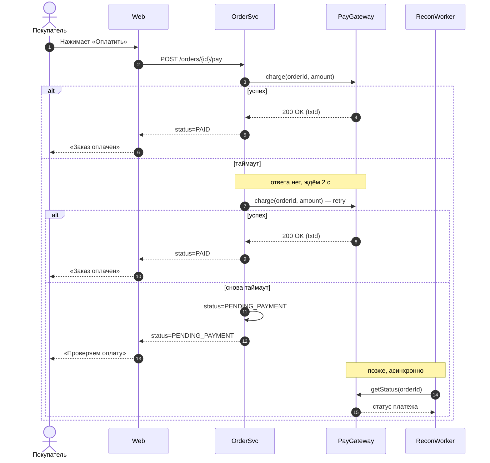
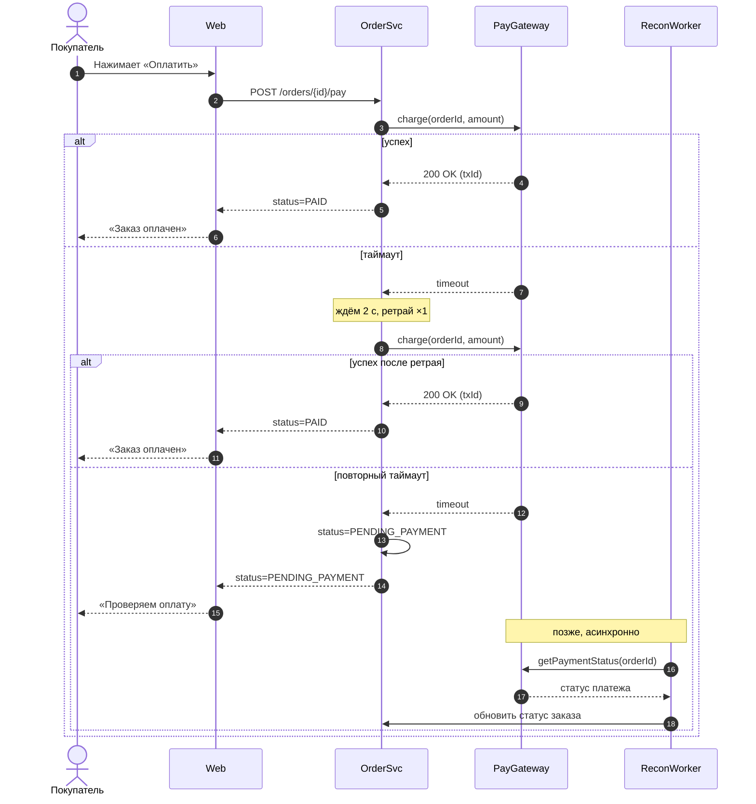

# Case sequence-diagram-continue-branch-ru

## Conversation so far
(none)

## Latest user message
Начал рисовать sequence для оформления заказа, успешный путь готов. Допиши ветку, когда платёжный шлюз отвечает таймаутом: мы ретраим один раз через 2 секунды, если снова таймаут — заказ переводится в статус PENDING_PAYMENT, пользователю показываем «Проверяем оплату», а воркер reconciliation потом дергает шлюз по orderId. Стиль и обозначения не меняй, у нас так во всей доке.

```mermaid
sequenceDiagram
    autonumber
    actor U as Покупатель
    participant FE as Web
    participant OS as OrderSvc
    participant PG as PayGateway
    U->>FE: Нажимает «Оплатить»
    FE->>OS: POST /orders/{id}/pay
    OS->>PG: charge(orderId, amount)
    alt успех
        PG-->>OS: 200 OK (txId)
        OS-->>FE: status=PAID
        FE-->>U: «Заказ оплачен»
```

## Rubric (what a strong answer does)
1. Keeps the existing header and all existing lines unchanged: autonumber, aliases U/FE/OS/PG, Russian message labels and the arrow styles already used (->> for requests, -->> for responses)
2. Adds the timeout branch as an else inside the already-open alt, closes it with end, and the resulting Mermaid is syntactically valid
3. Models the described logic: a single retry after 2 s (e.g. via a loop/opt or a Note), then PENDING_PAYMENT status, the «Проверяем оплату» message to the user, and a reconciliation worker participant querying the gateway by orderId
4. A new participant for the reconciliation worker follows the same 'participant XX as Name' convention; no unrelated restructuring of the success path

## Answer A


Несколько замечаний:

- В исходнике не было закрывающего `end` у `alt`, без него Mermaid не отрендерит диаграмму. Я его добавил.
- Воркера пришлось завести отдельным участником (`RW as ReconWorker`), остальные обозначения не менял. Если у вас в доке он называется иначе, просто переименуйте.
- `getStatus(orderId)` — это условное имя метода. Подставьте реальный метод шлюза.
- Что делает воркер после ответа шлюза (переводит заказ в PAID/FAILED, уведомляет пользователя), вы не описали, поэтому я закончил ветку на ответе шлюза. Могу дорисовать.
- По сути, а не по диаграмме: таймаут не означает, что списания не было. Первый `charge` мог пройти. Повторять его безопасно только с тем же ключом идемпотентности, например `orderId`, иначе возможно двойное списание. Если шлюз это поддерживает, стоит подписать это прямо в стрелке retry.


## Answer B


Что я поменял:
- В твоём исходнике `alt` не был закрыт `end`, поэтому Mermaid не отрендерил бы диаграмму. Я добавил оба `end`.
- Добавил участника `RW as ReconWorker` в том же стиле, что и остальные. Если в доке он называется иначе, просто переименуй.
- `getPaymentStatus(orderId)` и шаг «обновить статус заказа» — мои заглушки. Ты не написал, как называется метод шлюза и как воркер отдаёт результат в OrderSvc, так что подставь реальные названия.
- Добавил ветку «успех после ретрая». Без неё непонятно, что происходит, если вторая попытка прошла.

Одно замечание по логике: таймаут не означает, что списания не было. Если ретрай пойдёт без того же idempotency key, шлюз может списать деньги дважды. Я бы подписал второй вызов как `charge(orderId, amount, idemKey)` или добавил это в Note.

